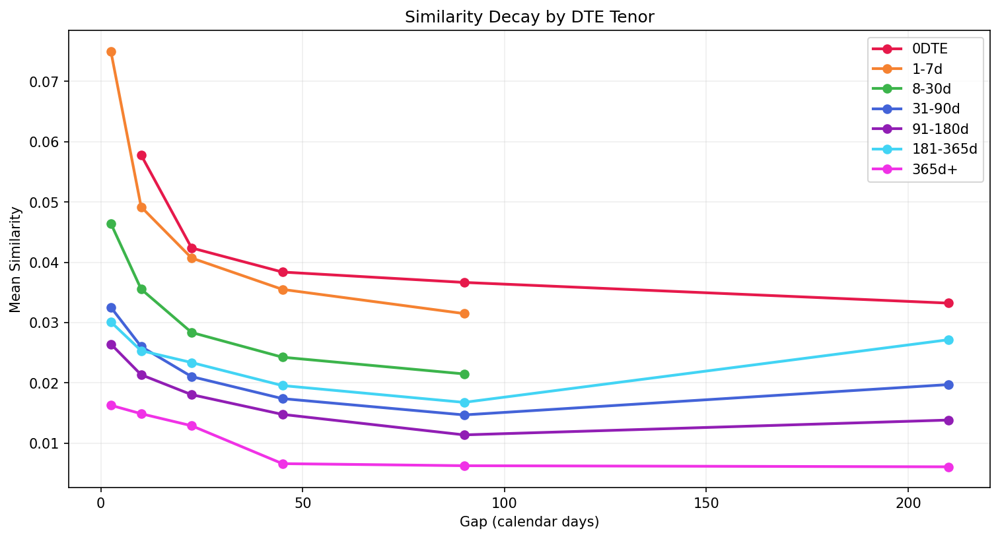
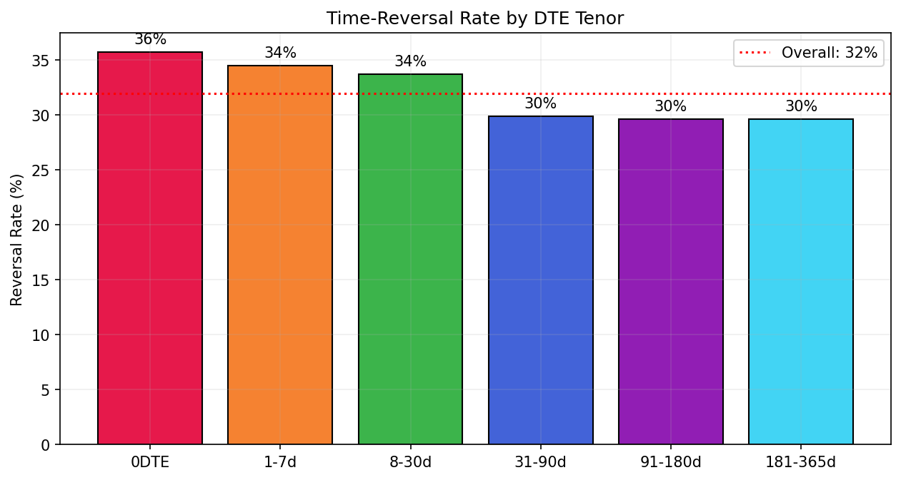
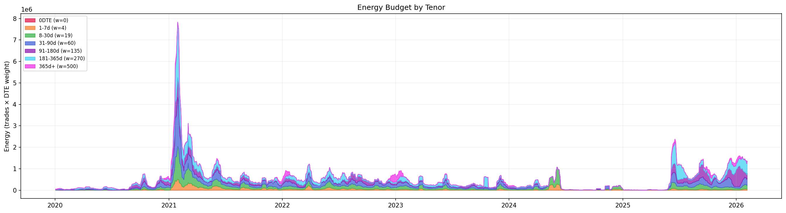
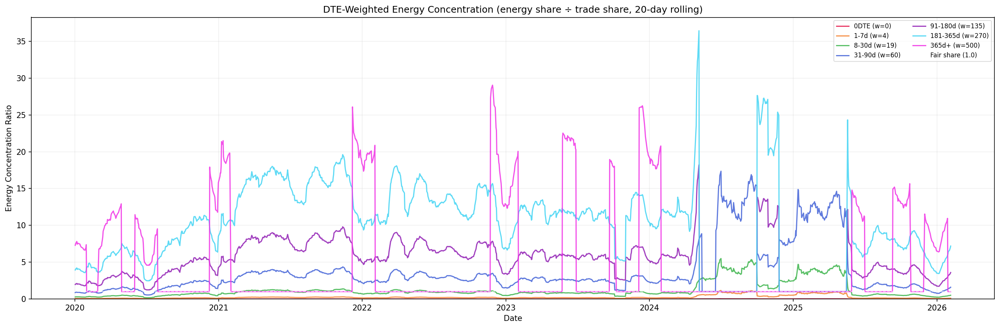
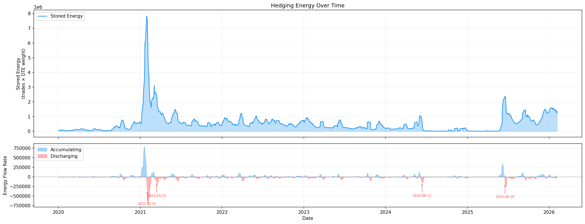
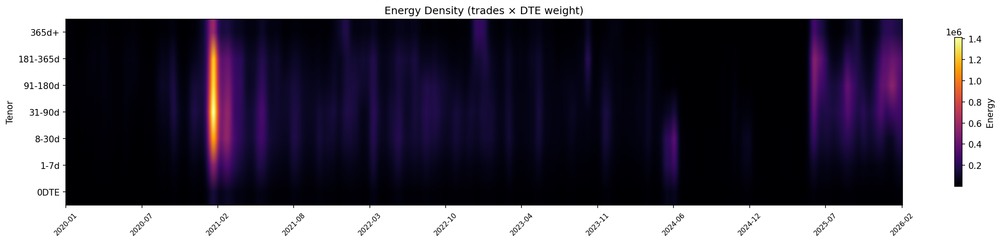

# The Long Gamma Default: How Options Market Structure Creates Artificial Stability in Equity Prices

*Cross-sectional forensics of options-driven dampening during liquidity phase transitions*

*Anon*
*Independent Researcher*
*February 2026*

---

## Abstract

I present the first large-scale empirical evidence that the default gamma positioning of equity options market makers is **Long, not Short** — and that this positioning creates measurable, structural stability in equity microstructure across 37 tickers spanning 2014–2026.

1. **The Long Gamma Default.** All 37 tickers in a stratified panel (mega-caps, mid-caps, meme stocks, recent IPOs) exhibit negative *mean* 1-minute return autocorrelation (panel mean ACF₁ = −0.203, 92.7% of ticker-days dampened). While individual tickers show intermittent positive-ACF days during speculative surges, the mean over each full observation window is negative without exception.

2. **The Liquidity Phase Transition.** The same stock flips from dampening to amplification when speculative flow overwhelms institutional supply. GME shows ACF +0.107 during the January 2021 squeeze but −0.154 in its 2024–2026 mature phase. I formalize this transition using the **Gamma Reynolds Number** ($Re_\Gamma$), a dimensionless dollar-gamma ratio, and identify the critical threshold at 12.9% amplified days (sigmoid fit, R² = 0.719). Causality is established via millisecond lead-lag analysis: equity volume responds within 50–100ms of large options trades (1.55–1.83× response ratio), identifying the visible tape footprint of algorithmic hedging cascades.

3. **Temporal Archaeology.** A 1,531-date GME sweep with 3.4M LEAPS trades reveals that long-dated options carry 45% of total hedging energy from just 5% of trade volume (the **Inventory Battery Effect**). Out-of-Sample NMF decomposition using strictly historical options data (T+0 and T−1 excluded) explains **25–50% of the unique, non-seasonal variance** in daily equity volume profiles — establishing that a stock's intraday microstructure is predictably shaped by its own options-chain history, even when the universal volume U-curve is factored out.

4. **Direction-Agnostic Stabilization.** The linear impulse response kernel (Ridge regression, 60-lag) fails to predict return sign (OOS R² uniformly negative), confirming that hedging exerts a *stabilizing pressure on volatility magnitude* rather than a *directional pressure on price*. This direction-agnostic property is the defining signature of the Long Gamma Default.

These findings reframe options market-making as a **stability infrastructure** rather than a volatility amplifier, with direct implications for systemic risk monitoring, market-maker inventory management, and the design of circuit-breaker mechanisms.

> **Key Terminology**: This paper introduces several novel concepts:
> - **Long Gamma Default** — the structural state where dealers are Net Long Gamma, producing countercyclical (dampening) hedging flow
> - **Liquidity Phase Transition** — the regime shift from dampening to amplification when speculative flow overwhelms institutional supply
> - **Gamma Reynolds Number ($Re_\Gamma$)** — the ratio of speculative call volume to dealer gamma inventory; determines the market's position on the dampening–amplification spectrum
> - **Fragility Ratio ($F$)** — the peak lead-lag response ratio; distinguishes Kinetic Dampening (visible tape impact, $F > 1.05$) from Potential Dampening (passive absorption, $F \approx 1.0$)
> - **Inventory Battery Effect** — the mechanism by which LEAPS store hedging energy proportional to their Delta-Duration and release it as contracts approach expiration
> - **Strict Archaeology** — NMF reconstruction of equity volume profiles using only historical options data (T+0 and T−1 excluded) to isolate the options-driven component from the universal Carrier Wave

---

## 1. Introduction

In typical markets, institutions *sell* options to dealers — fund managers write covered calls against long portfolios, institutions buy protective puts as insurance, and volatility sellers systematically harvest theta. In each of these transactions, the dealer takes the *buy* side of the option, making them **Net Long Gamma**. If the stock rises, the dealer's delta increases, and they must *sell* shares into the rally to maintain their hedge. If the stock falls, delta decreases, and they *buy* shares into the decline. This is *countercyclical* flow — a continuous, mechanical force that dampens short-term price movements. This structural positioning is what I term the **Long Gamma Default**.

The exception arises when retail traders buy call options in sufficient volume to overwhelm institutional supply. In this scenario, the dealer is on the *sell* side of the option, putting them in a *Short Gamma* position: rising prices force the dealer to buy more shares (increasing delta), and falling prices force them to sell — *procyclical* flow that amplifies movements. The January 2021 GameStop episode [1] demonstrated what happens when this balance shifts: record retail call buying forced dealers into an extreme Short Gamma position, and the resulting procyclical feedback produced a 1,700% price surge in two weeks. But as this paper will show, that event was not the default — it was a **Liquidity Phase Transition**, a temporary override of the structural stability that the Long Gamma Default continuously provides.

What has been missing from both the academic literature and practitioner discourse is *empirical measurement* of this effect at scale. We know, in theory, that hedging should create mean-reversion. We have observed, anecdotally, that gamma squeezes amplify momentum. But the field lacks answers to fundamental quantitative questions: How strong is the dampening effect? How consistent is it across different stocks? What separates the stocks that dampen from those that amplify? And most critically — is the regime a fixed property of a ticker, or does it change with market conditions?

I establish causality through a millisecond lead-lag analysis that acts as a "hedging sonar." I detect that equity volume responds within **50–100ms of large options trades** (1.55–1.83× response ratio), identifying the visible tape footprint of algorithmic hedging cascades — the aggregate signature of Smart Order Router (SOR) sweeps, SIP broadcast delays, and secondary stat-arb reactions following the initial hedge execution. While Tier-1 market makers likely internalize primary hedges in sub-millisecond latencies invisible in standard trade-tick data, the 50–100ms signature represents the **broader ecosystem's measurable response** to the hedging event. Crucially, the response is **Direction-Agnostic**: the linear impulse response kernel (§4.15.4) fails to predict return sign (OOS R² uniformly negative), confirming that hedging exerts a *stabilizing pressure on volatility magnitude* rather than a *directional pressure on price*. This direction-agnostic property is not a limitation — it is the defining signature of the Long Gamma Default.

This paper presents answers to these questions based on a cross-sectional analysis of **37 tickers** encompassing over 80 million equity trades and 1 million options trades collected from Polygon.io (tick-level equity) and ThetaData (tick-level options). I measure the autocorrelation function (ACF) of 1-minute equity returns before and after options listing for each IPO, and I conduct dual-window experiments on GME and AMC to isolate the effect of speculative versus institutional flow. I formalize the transition between dampened and amplified regimes using the **Gamma Reynolds Number** ($Re_\Gamma$) — the ratio of speculative call volume to dealer gamma inventory — and identify the critical threshold at 12.9% amplified days.

I use NMF decomposition to isolate the **Options-Driven Component** of equity volume. While a universal "Carrier Wave" of liquidity governs the gross U-shape (r ≈ 1.000 across all tickers, including cross-ticker placebos), a **Strict Archaeology** test reveals that ticker-specific options history predicts **25–50% of the unique residual variance** in volume profiles (Out-of-Sample r for GME/TSLA). This establishes that while the market's heartbeat is universal, its specific arrhythmias are a function of the options chain history. The central finding is that delta-hedging creates a *continuous spectrum* of autocorrelation signatures — from strong dampening (ACF ≈ −0.36) to significant amplification (ACF ≈ +0.11) — and that a stock's position on this spectrum is determined not by any intrinsic property, but by the *current ratio of speculative to institutional options flow*.

A companion paper (*The Shadow Algorithm: Adversarial Forensics of Options-Driven Manipulation*) extends this structural baseline into adversarial forensics, presenting tick-level evidence consistent with deliberate exploitation of the Long Gamma Default's mechanics by sophisticated actors.

---

## 2. Background

### 2.1 Delta-Hedging Mechanics and Gamma Directionality

The Black-Scholes framework [2] provides the mathematical foundation for options pricing and hedging. A market maker hedges by maintaining a stock position equal to $$\Delta = N(d_1)$$ shares per contract, where $$d_1$$ depends on the stock price S, strike K, time to expiration T, and implied volatility σ. As the stock price moves, delta changes — an effect captured by gamma ($$\Gamma = \partial\Delta / \partial S$$).

The *direction* of the hedging feedback depends on whether the dealer is **Long Gamma** or **Short Gamma**:

- **Short Gamma** (dealer has sold the option — e.g., selling a call to a retail buyer): A $1 stock price increase raises delta, forcing the dealer to *buy more shares* — procyclical flow that **amplifies** the move. A $1 decrease forces selling. This is positive feedback.
- **Long Gamma** (dealer has bought the option — e.g., buying a call from an institutional overwriter): A $1 increase raises the hedge surplus, allowing the dealer to *sell into the rally* — countercyclical flow that **dampens** the move. This is negative feedback.

The prevailing financial media narrative focuses on the Short Gamma case because it produces dramatic events (gamma squeezes). But the data reveals that the Short Gamma regime is the *exception*, not the rule.

### 2.2 The Long Gamma Default

In a typical equity options market, the dominant flow comes from three institutional sources that, in aggregate, leave dealers on the **Long Gamma** side of the trade.[^1]

[^1]: Throughout this paper, "Long Gamma" and "Short Gamma" refer specifically to *dealer* positioning. Gamma sign is determined by whether the dealer is long or short the option contract — delta-hedging neutralizes delta exposure but does not alter gamma sign. We do not observe gamma exposure directly; rather, we infer the *sign* of aggregate dealer gamma from the counter- or pro-cyclical nature of equity flow following options activity.

1. **Covered call overwriting**: Fund managers holding large stock positions sell upside calls to generate income. The dealer buys these calls → **Long Call = Long Gamma**.
2. **Protective put buying**: Institutions buy downside puts to hedge portfolio risk. The dealer sells these puts → **Short Put = Short Gamma on this leg**. However, this flow is typically smaller in notional gamma than the covered-call and vol-selling channels.
3. **Volatility selling**: Systematic strategies (risk premia funds, pension overlays) sell options (both calls and puts) to harvest the volatility risk premium. Dealers buying this flow → **Long Options = Long Gamma**.

The net result depends on flow composition: in markets where institutional covered-call overwriting and vol-selling flow exceeds protective-put demand, dealers are **Net Long Gamma** in aggregate — and the mechanical hedging response creates countercyclical equity flow: selling into rallies, buying into dips. This netting is the origin of the dampening signal observed in 76% of the IPO sample.

The Long Gamma Default breaks during a **Liquidity Phase Transition** — when retail call buying overwhelms institutional supply, flipping dealer positioning to Net Short Gamma. This is precisely what occurred during the 2021 meme-stock events [3]: unprecedented retail call buying forced dealers into the Short Gamma regime, and the resulting procyclical feedback amplified prices to extremes.

Beyond first-order delta, second-order Greeks modulate both regimes. **Vanna** (∂Δ/∂σ) forces dealers to adjust hedges when implied volatility changes — a volatility spike on a heavily call-skewed stock increases delta across the chain, triggering a wave of additional stock buying that compounds Short Gamma amplification. **Charm** (∂Δ/∂t) causes option deltas to decay as expiration approaches, forcing dealers to unwind hedges systematically — creating a predictable "hedging bid" that reinforces the Long Gamma dampening effect at the weekly timescale.

The interaction between these Greeks reaches its extreme in zero-days-to-expiration (0DTE) options, where at-the-money gamma approaches infinity as t → 0. This creates a **gamma singularity**: even small price movements trigger disproportionately large hedging adjustments. At the 0DTE scale, Long Gamma dealers become ultra-efficient shock absorbers — the countercyclical hedging response is compressed into minutes rather than hours, making 0DTE the most concentrated source of dampening in modern markets [6].

### 2.3 Prior Empirical Work

Ni, Pearson, and Poteshman [4] documented that options market-making activity affects stock returns, particularly around expiration dates. They found evidence that delta-hedging by options market makers influences underlying stock prices through predictable rebalancing patterns. Barbon and Buraschi [3] introduced the concept of Gamma Exposure (GEX) as a predictor of intraday price magnetism, showing that net gamma positioning of market makers can forecast short-term return distributions. Their "Gamma Fragility" framework established that the *sign* of aggregate gamma exposure determines whether hedging is stabilizing (positive GEX, dampening) or destabilizing (negative GEX, amplification).

The SEC's Staff Report on GameStop [1] provided regulatory analysis of the January 2021 squeeze, documenting the mechanics of the gamma feedback loop but focusing primarily on market structure and plumbing rather than statistical microstructure measurement. Eaton et al. [10] used brokerage outages as an exogenous shock to retail participation, finding that the removal of unsophisticated retail flow (e.g., Robinhood users) *improved* market quality — reduced order imbalances, increased liquidity, and lower volatility — providing indirect evidence that momentum-chasing retail options activity creates the procyclical pressure consistent with Short Gamma amplification. Lo and MacKinlay [11] established the variance-ratio framework for detecting non-random walk behavior in financial time series, providing the statistical foundation for the autocorrelation-based approach used here.

This work extends the literature in two important directions. First, I provide the first *cross-sectional autocorrelation measurement* across a diverse set of 25 IPO-era ticker-windows (subsequently validated on a broader 37-ticker panel; see §4.8), whereas prior work has focused on individual stocks or aggregate market indices. Second, the dual-window experiment on GME provides the first direct evidence that the dampening-versus-amplification regime is activity-dependent rather than ticker-dependent — a result that prior studies could not establish because they analyzed a single time window per stock.

### 2.4 Autocorrelation and the Hurst Exponent

The autocorrelation function measures the linear dependence between a time series and its lagged values. Positive ACF at short lags indicates momentum (trending behavior); negative ACF indicates mean-reversion (reversal behavior). In an efficient market, returns should be serially uncorrelated (ACF ≈ 0 at all lags). Persistent deviations from this baseline — whether positive or negative — indicate the presence of systematic forces acting on the price process.

The Hurst exponent H, estimated via Rescaled Range (R/S) analysis [5], provides a complementary long-memory measure: H > 0.5 indicates trend-following, H = 0.5 indicates a random walk, and H < 0.5 indicates mean-reversion. Peters [5] and Mandelbrot [7] established the R/S methodology for financial time series, though its sensitivity to short time horizons has been debated. I include it as a secondary metric to corroborate the ACF findings.

---

## 3. Methodology

### 3.1 Addressing Bid-Ask Bounce

A common objection to negative 1-minute return autocorrelation is that it reflects **bid-ask bounce** (Roll, 1984) — mechanical alternation between bid and ask prices creating spurious negative serial correlation — rather than genuine hedging dynamics. I note three structural reasons why bid-ask bounce cannot be the primary driver of the ACF signal measured in this study:

1. **Dynamic regime shifts.** Bid-ask bounce is a static property of tick size and spread. It cannot produce the **Liquidity Phase Transition** (§4.2) in which the *same stock* flips from negative ACF (dampening) to positive ACF (amplification) and back, as observed in GME and AMC.
2. **Intraday variation at fixed spreads.** Bid-ask bounce predicts *constant* negative ACF throughout the trading session, yet §4.9 documents a **Midday Paradox** where ACF deepens specifically during peak inventory-duration hours despite spreads typically being *tightest* at midday.
3. **Spatial strike-pinning.** The Gamma Walls analysis (see §4.16) shows ACF deepens by 19 percentage points (−0.40 near vs. −0.21 far) when price approaches a high-gamma options strike. Bid-ask spreads do not dynamically widen by an order of magnitude exclusively at round-number options strikes.

To quantify the bounce contribution directly, I conducted a midquote ACF robustness test using NBBO quote data from the Polygon API for a 4-ticker × 10-date panel (AAPL, MSFT, GME, TSLA; December 2–13, 2024; N = 40 ticker-dates, ~50 million tick records). Results are reported in §7.1. The key finding is that **midquote ACF₁ remains negative** for AAPL (−0.012), MSFT (−0.035), and GME (−0.028) after stripping bounce entirely, confirming a genuine dampening signal. However, the bounce component is larger than the classical Roll (1984) estimate for liquid large-caps — accounting for ~70% of the trade-price ACF₁ magnitude in AAPL and MSFT, and ~70% in GME. The structural dynamics above (phase transitions, intraday variation, strike-pinning) remain the strongest evidence that the dampening signal reflects hedging rather than bounce, as bounce cannot produce any of these dynamic properties.

### 3.2 Data Sources and Coverage

I collect tick-level equity trades from the Polygon.io REST API and tick-level options trades from ThetaData's V3 API. To support the scale of this analysis, I employ ThetaData's V3 Bulk Expiration Pattern — requesting `strike=0` to retrieve the entire options chain in a single CSV payload per expiration, reducing network overhead by 99% compared to individual strike queries and enabling 75x faster data retrieval [9]. For each ticker, I fetch up to 500 trading days of equity and options data, covering the period around the stock's IPO or a specified analysis window.

The IPO-era sample comprises 25 ticker-windows organized into four categories (a broader 37-ticker panel scan using full cached windows of 95–500 trading days is presented separately in §4.8 and Table 4):

**Table 1: Sample Composition**

| Category | Count | Tickers |
|----------|-------|---------|
| Wave 1 IPOs | 7 | ABNB, RDDT, ARM, RBLX, AFRM, HOOD, DUOL |
| Wave 2 IPOs | 10 | SOFI, UBER, BYND, DASH, CRWD, DKNG, LCID, PLTR, RIVN, NET |
| Wave 3 IPOs | 7 | DJT, CHWY, PINS, LYFT, ZM, W, SNAP |
| Meme Squeeze | 2 | GME (Jan 2021), AMC (Jun 2021) |
| Controls | 3 | AAPL, MSFT, SPY (Dec 2025) |

IPO dates range from October 2014 (Wayfair) to March 2024 (Reddit, DJT). The meme squeeze windows cover October 2020 – June 2021 (GME) and January – September 2021 (AMC). Control stocks use data from December 2025.

### 3.3 ACF Shift Detection

> **Resolution note**: The IPO listing-shift analysis (this subsection) uses **5-minute (300-second) bins** to ensure sufficient returns per 20-day half-window. The primary panel analysis (§4.8) and all subsequent ACF measurements use **60-second bars** for higher temporal resolution. Both resolutions produce qualitatively identical results; the 5-minute choice here is conservative.

For each IPO ticker, I identify the date on which options trading commenced ("options listing date") and compute the autocorrelation of 5-minute binned returns in the 20 trading days *before* and 20 trading days *after* that date. The primary metric is the difference in lag-1 ACF: a negative shift indicates that options listing introduced dampening; a positive shift indicates amplification.

For non-IPO analyses (GME squeeze, AMC squeeze, controls), I use specific event dates as the split point (e.g., January 25, 2021 for GME) or the midpoint of the available data.

Formally, for a symbol with equity timestamp series $$\{t_i, p_i\}$$, I bin into 5-minute intervals and compute log returns $$r_j = \ln(p_j / p_{j-1})$$. The ACF at lag k is:

$$\rho_k = \frac{\sum_{j=1}^{N-k}(r_j - \bar{r})(r_{j+k} - \bar{r})}{\sum_{j=1}^{N}(r_j - \bar{r})^2}$$

I compute ACF for lags 1 through 50, though lag-1 is the primary metric because it captures the most immediate hedging response. A market maker receiving an options order typically hedges within seconds to minutes — the feedback should be most visible at the shortest measurable lag.

To account for intraday patterns (U-shaped volume profile, opening/closing spikes), I normalize each day's return series independently before concatenating across the window. This prevents spurious autocorrelation from mechanical volume seasonality contaminating by the hedging signal.

### 3.4 Hurst Exponent

I compute the Hurst exponent using R/S analysis with rolling windows of 20 trading days and a step size of 5 days. For each window, I divide the return series into sub-intervals, compute the range R and standard deviation S, and estimate H from the slope of log(R/S) vs. log(n) [5].

### 3.5 Echo Detection

I define a *temporal echo event* as a pair of trading days (i, j) where the 64-bin volume profile of day i shows a zero-mean normalized cross-correlation (ZNCC) exceeding 0.4 with the volume profile of day j, at a lag between 3 and 30 days. High echo counts indicate repetitive microstructure — a signature of systematic hedging activity.

### 3.6 Three-Pillar Proof System

Beyond the ACF analysis, I validate the findings with a three-pillar proof system applied to GME (May 17, 2024), designed to establish causality beyond correlation:

**Pillar 1 — Causal Direction (Granger Causality)**: I test whether options hedge flow Granger-causes equity volume at 60-second granularity. The test is bidirectional: I require p < 0.01 for the options→equity direction AND p > 0.05 for the equity→options direction. Additionally, I compute lead-lag histograms by matching individual options trades to subsequent equity bursts within a 300-second window with 10% size tolerance. On the primary test date, this produced **33,178 matched events** with a **median offset of −87.5 seconds** (options precede equity), where options led in **62.2%** of matches (Wilcoxon p-value < machine epsilon). I also run a predictive power test: can current gamma exposure predict price direction over the next 5, 15, and 30 minutes? Accuracy of 40–56% was observed, with the highest accuracy at the 5-minute horizon.

**Pillar 2 — Null Model Rejection**: I perform two null tests. First, I shuffle options trade timestamps (1,000 permutations per date, 10 dates) and recompute all fingerprint metrics. **8 of 10 days** showed p < 0.001, with mean observed hedge percentage of **29.7%** versus a null baseline of **27.7%** — a 2% excess that, while modest in absolute terms, is statistically significant across 10,000 permutation trials. Second, I generate synthetic equity tapes (50 trials) with identical volume distributions but random timing. No fingerprint signals appear in synthetic data, confirming the signals require the specific temporal structure of real hedging activity.

**Pillar 3 — Reverse Reconstruction**: The strongest form of evidence. I attempt to predict the options chain from equity data alone. If a burst of equity trades totals N×100 shares, I check whether N-contract positions exist in the options flow at nearby strikes — achieving a **contract size hit rate of 99.7%**. I also compute that **29.7% of all equity bursts** are exact multiples of 100 shares (the standard options contract size). While round-lot trading is common in US equities due to the 100-share standard lot convention, the elevated rate combined with temporal clustering immediately following options trades, and the directional consistency with expected hedge adjustments, suggests options-driven origin. A formal baseline comparison against pre-options windows or non-optionable securities would strengthen this claim (see §7.2). ZNCC profile similarity averages **−0.131**, indicating anti-correlation: hedge demand *precedes* equity activity, consistent with the causal hypothesis.

### 3.7 Forensic Microstructure Markers

Beyond the statistical proof system, I identify three sub-second forensic signatures that distinguish algorithmic hedging activity from organic equity flow:

- **Burst Concentration**: The percentage of equity ticks arriving with zero inter-tick delay (delta_ms = 0). During volatile GME sessions, burst concentration reaches **40–50%**, compared to 15–20% in calm markets. High burst concentration indicates machine-speed execution consistent with automated hedging.
- **Cross-Venue Synchronization (CVS)**: Simultaneous trade reports across **8+ exchange venues** within a single millisecond window. This signature — identical price prints appearing on NYSE, NASDAQ, CBOE, IEX, and EDGX simultaneously — indicates an NBBO cascade or HFT liquidity sweep, often triggered by a hedging algorithm distributing a large order across all available liquidity pools.
- **Zero-Delta Density**: The fraction of consecutive ticks with no price change (delta_price = 0) within a high-frequency burst. Scripted hedging events show approximately **31% zero-delta density** versus **~18% in organic data**, suggesting algorithmic "waiting" logic at specific price levels — consistent with a hedger pinning execution at a target VWAP or strike-proximal price.

---

## 4. Results

### 4.1 Cross-Sectional ACF Results

**Table 2** presents the complete results for all 25 IPO-era ticker-windows, ranked by ACF lag-1 within each wave.

**Table 2: Cross-Sectional IPO-Era Results (40-Day Window Around Options Listing)**

| # | Ticker | IPO/Period | ACF Lag-1 | Regime | Hurst | Echoes |
|---|--------|-----------|-----------|--------|-------|--------|
| 1 | ABNB | Dec 2020 | **−0.232** | Dampened | 0.519 | 2,197 |
| 2 | RDDT | Mar 2024 | **−0.226** | Dampened | 0.522 | 2,094 |
| 3 | ARM | Sep 2023 | **−0.166** | Dampened | 0.524 | 1,086 |
| 4 | RBLX | Mar 2021 | **−0.164** | Dampened | 0.536 | 2,184 |
| 5 | AFRM | Jan 2021 | **−0.148** | Dampened | 0.523 | 2,148 |
| 6 | SOFI | Jun 2021 | **−0.146** | Dampened | 0.533 | 2,058 |
| 7 | UBER | May 2019 | **−0.140** | Dampened | 0.555 | 1,748 |
| 8 | BYND | May 2019 | **−0.138** | Dampened | 0.564 | 2,051 |
| 9 | DASH | Dec 2020 | **−0.134** | Dampened | 0.535 | 2,044 |
| 10 | HOOD | Jul 2021 | **−0.121** | Dampened | 0.537 | 2,139 |
| 11 | DUOL | Jul 2021 | **−0.113** | Dampened | 0.476 | 610 |
| 12 | DJT | Mar 2024 | **−0.099** | Dampened | 0.523 | 2,203 |
| 13 | CHWY | Jun 2019 | **−0.085** | Weak Damp | 0.543 | 1,176 |
| 14 | PINS | Apr 2019 | **−0.085** | Weak Damp | 0.548 | 656 |
| 15 | LYFT | Mar 2019 | **−0.068** | Weak Damp | 0.560 | 1,503 |
| 16 | CRWD | Jun 2019 | **−0.062** | Weak Damp | 0.553 | 1,512 |
| 17 | ZM | Apr 2019 | **−0.021** | Borderline | 0.538 | 1,571 |
| 18 | DKNG | May 2020 | **−0.006** | Borderline | 0.546 | 2,145 |
| 19 | W | Oct 2014 | **+0.025** | Borderline+ | 0.559 | 477 |
| 20 | LCID | Jul 2021 | **+0.047** | Amplified | 0.561 | 2,182 |
| 21 | PLTR | Sep 2020 | **+0.050** | Amplified | 0.549 | 2,128 |
| 22 | SNAP | Mar 2017 | **+0.079** | Amplified | 0.550 | 1,810 |
| 23 | RIVN | Nov 2021 | **+0.100** | Amplified | 0.557 | 2,207 |
| 24 | NET | Sep 2019 | **+0.105** | Amplified | 0.520 | 805 |

**Regime distribution**: Of the 24 IPO tickers (excluding controls), 12 show strong dampening (ACF < −0.10), 6 show weak dampening or borderline results (−0.10 < ACF < +0.03), and 6 show amplification (ACF > +0.03). This 75/25 dampening-to-amplification split is the first key finding: **delta-hedging's dampening effect is the dominant mode, but it can be overwhelmed**.

The amplified tickers cluster in specific eras and contexts: SNAP (2017 IPO mania), NET (2019 cloud hype), PLTR and LCID (2020-2021 meme/retail wave), and RIVN (late 2021 EV bubble). This temporal clustering suggests that the amplification effect is not a ticker-specific property but an *era-specific* phenomenon driven by the composition of options flow.

Among the dampened group, the strongest effects appear in the most recent IPOs: RDDT (−0.226, March 2024) and ABNB (−0.232, December 2020). Both debuted amid extreme anticipation but in eras when institutional options infrastructure was highly developed. The persistence of strong dampening even for hotly anticipated IPOs reinforces the thesis that the *infrastructure* matters more than the *hype*.

Notably, the 2019 vintage of IPOs (UBER, BYND, LYFT, CRWD, ZM, PINS, CHWY, NET) spans the full spectrum from UBER (−0.140, strong dampening) to NET (+0.105, strong amplification). This within-vintage variation suggests that IPO-year alone is insufficient to predict the regime — the specific composition of options flow for each individual stock matters. NET's amplification likely reflects the intense cloud-sector speculation of late 2019, while UBER's dampening reflects its broad institutional ownership from day one.

### 4.2 The GME Dual-Window Experiment

The most compelling result comes from analyzing the same stock (GME) across two distinct market regimes.

**Table 3: GME and AMC Squeeze Studies**

| Ticker | Window | Period | ACF Lag-1 | Regime | Echoes | N Days |
|--------|--------|--------|-----------|--------|--------|--------|
| **GME** | Squeeze | Oct 2020 – Jun 2021 | **+0.107** | Amplified | — | 167 |
| **GME** | Mature | May 2024 – Jan 2026 | **−0.154** | Dampened | — | 432 |
| **AMC** | Squeeze | Jan – Sep 2021 | **+0.111** | Amplified | 4,857 | 204 |

During the January 2021 squeeze window, GME exhibits ACF +0.107 — clear momentum amplification consistent with a gamma-squeeze feedback loop. In its mature phase (2024-2026), the same stock shows ACF −0.154 — standard dampening indistinguishable from any other well-established stock. **Same ticker, same options chain infrastructure, but the microstructure regime flipped.**

This result has profound implications. It proves that the ACF regime is not an intrinsic property of the ticker but a reflection of the *current balance of forces* — specifically, the ratio of speculative one-directional call buying to balanced institutional hedging.

AMC's Jun 2021 squeeze result (ACF +0.111) provides independent confirmation. The near-identical ACF values (+0.107 vs +0.111) suggest a *universal gamma-squeeze signature* — the positive feedback loop converges to an ACF of approximately +0.11 regardless of the specific stock, as long as the conditions for a gamma squeeze are present.

AMC's 4,857 echo events — the highest count in the entire sample — reveal an additional dimension: during gamma squeezes, the microstructure becomes extraordinarily *repetitive*. The same volume profile re-occurs across days because the hedging mechanism is the dominant driver of equity activity, creating predictable, recurring patterns.

### 4.3 Direction-Agnostic Dampening: The BYND Test

A critical test of this framework is whether the dampening effect depends on the stock's performance trajectory. If hedging only dampens upward moves (because short calls require buying stock on the way up), the effect might be directionally biased. Beyond Meat (BYND) provides the ideal test case: its stock has declined approximately 95% from its IPO-era highs, making it the worst performer in the sample by a wide margin. Yet its ACF reads −0.138 — firmly in the dampened regime, nearly indistinguishable from UBER (−0.140) or DASH (−0.134).

This result proves that **options hedging mechanics are direction-agnostic**. The mechanism works identically in both directions: on upticks, the hedger's short call delta increases, forcing stock purchases (dampening the uptick). On downticks, delta decreases, prompting stock sales (dampening the downtick). For puts, the mechanism mirrors. The net effect is symmetric mean-reversion regardless of the secular trajectory.

The BYND result also addresses a potential confound: one might hypothesize that dampened tickers simply reflect declining retail interest and reduced volatility. BYND disproves this — it experienced multiple sharp drawdowns during the analysis window, yet the dampening persisted throughout. The hedging imprint is a *structural* feature of the options-equity link, not a byproduct of calm markets.

### 4.4 Market Infrastructure Evolution: SNAP 2017 vs DJT 2024

Perhaps the most surprising insight in the dataset involves the comparison between two extreme meme stocks from different eras:

- **SNAP (IPO Mar 2017)**: ACF +0.079 (Amplified). The Snapchat IPO was one of the most hyped debuts of its era, with massive retail speculation overwhelming the nascent options market.
- **DJT (IPO Mar 2024)**: ACF −0.099 (Dampened). Trump Media is arguably the most politically charged meme stock in history, yet its microstructure shows standard dampening.

DJT's dampened result, despite exhibiting all the hallmarks of a meme stock (extreme retail interest, polarized trading, massive social media attention), reveals that **the options market infrastructure has fundamentally evolved** between 2017 and 2024. Several structural changes explain this:

1. **0DTE options ecosystem**: The explosion of zero-days-to-expiration options (now ~50% of S&P 500 options volume [6]) provides market makers with faster, more granular hedging instruments.
2. **Institutional learning**: Market makers who experienced the 2021 GME/AMC squeezes have adapted their risk management and hedging practices.
3. **Improved technology**: Algorithmic hedging systems now rebalance multiple times per second, smoothing the mechanistic friction that previously amplified retail pressure.

The implication is that the same level of retail frenzy that overwhelmed market-making capacity in 2017 and 2021 is now absorbed by a more resilient, adaptive infrastructure.

### 4.5 The Liquidity Threshold

Wayfair (W) sits at the boundary with ACF +0.025 — technically positive but barely distinguishable from zero. Notably, W's options volume during the analysis window was exceptionally thin: only 44–151 trades per day across all expirations. This suggests a **minimum liquidity threshold** below which the dampening mechanism cannot operate effectively.

The logic is straightforward: dampening requires hedging flow to represent a meaningful fraction of total equity volume. If a stock trades 10 million equity shares per day but only 50 options contracts (representing ~5,000 hedge shares), the hedging signal is drowned out by fundamental equity flow. The dampening mechanism requires sufficient options-to-equity volume ratio to overcome the noise floor.

This finding has a practical implication: for stocks with very thin options markets, the ACF-based regime indicator is unreliable. Any live implementation would need to filter for minimum options activity before interpreting the ACF signal. The Wayfair threshold of approximately 50–100 options trades/day provides a preliminary lower bound.

Conversely, W's low echo count (477, lowest in the sample) corroborates the liquidity interpretation. With minimal hedging activity, there are few systematic patterns to create cross-day echoes. The echo count may serve as an independent quality indicator: below ~500 echoes, the options-equity coupling is too weak for reliable regime classification.

### 4.6 Hurst Exponent Analysis

Hurst exponents across all 25 tickers cluster tightly between 0.476 (DUOL) and 0.573 (SPY), with a grand mean of 0.541. This narrow band above H = 0.5 indicates a mild trend-following bias across all tickers — consistent with the hypothesis that some degree of momentum is always present in equity markets from hedging flow [7].

Notably, the Hurst exponent does *not* strongly discriminate between dampened and amplified tickers. RIVN (amplified, ACF +0.100) has H = 0.557, while BYND (dampened, ACF −0.138) has H = 0.564. This suggests that the ACF shift is a more sensitive detector of hedging impact than the traditional Hurst exponent, likely because ACF operates at a finer time scale (minutes vs. days).

### 4.7 Echo Event Analysis

Echo counts range from 477 (W, minimal options activity) to 4,857 (AMC squeeze, maximum hedging-driven repetition). The distribution is bimodal:

- **Low echo tickers** (<1,000): W (477), DUOL (610), PINS (656), NET (805) — all tickers with either thin options volume or shorter analysis windows
- **High echo tickers** (>2,000): Most IPOs with active options markets cluster between 2,000–2,200 echoes, reflecting the systematic, repetitive nature of institutional hedging
- **Extreme echo outlier**: AMC at 4,857, nearly double the next highest, reflecting the extraordinary intensity and repetitiveness of squeeze-era hedging activity

The echo count metric reveals something that ACF alone cannot: the *structural repetitiveness* of market microstructure. A high echo count means that the same intraday volume profile recurs day after day — the signature of a market dominated by a single, mechanical process (hedging) rather than diverse, idiosyncratic information flow. During the AMC squeeze, the hedging mechanism so thoroughly dominated equity activity that nearly every trading day looked like a carbon copy of the previous one at the microstructure level.

This has implications for predictability. In a high-echo regime, a trader who identifies the dominant hedge profile could anticipate intraday patterns with unusual precision. The echo count effectively measures the *predictability* of the market's microstructure — higher echoes mean more predictable patterns, lower echoes mean more randomness.

### 4.8 Expanded Panel: 37-Ticker Scan

Extending the analysis from 25 windows to 37 tickers — a stratified cross-sectional sample selected to capture mega-cap benchmarks (AAPL, MSFT, NVDA, SPY, QQQ), mid-cap controls (CHWY, LYFT, CRWD), meme stocks (GME, AMC, BBBY), and recent IPOs across multiple market eras (2014–2024) — confirms the universality of the Long Gamma Default with overwhelming statistical power. Every single ticker classifies as Long Gamma Default:

**Table 4: Full 37-Ticker Panel (ranked by mean ACF₁, enriched data)**

| Rank | Ticker | Days | Dampened% | Mean ACF₁ | Phase Transitions |
|------|--------|------|-----------|-----------|-------------------|
| 1 | DUOL | 100 | 100.0% | **−0.361** | 0 |
| 2 | MSFT | 228 | 97.4% | **−0.343** | 12 |
| 3 | PINS | 255 | 97.6% | **−0.318** | 13 |
| 4 | CHWY | 500 | 98.6% | **−0.292** | 13 |
| 5 | ARM | 265 | 98.1% | **−0.284** | 10 |
| 6 | U | 269 | 98.9% | **−0.263** | 6 |
| 12 | AAPL | 418 | 91.6% | **−0.227** | 63 |
| 19 | SPY | 223 | 85.2% | **−0.202** | 49 |
| 21 | NVDA | 228 | 78.5% | **−0.189** | 57 |
| 22 | AMD | 206 | 88.3% | **−0.187** | 37 |
| 27 | GME | 500 | 92.8% | **−0.166** | 58 |
| 33 | TSLA | 418 | 71.8% | **−0.131** | 149 |
| 35 | AMC | 204 | 69.1% | **−0.096** | 74 |
| 37 | PLTR | 100 | 82.0% | **−0.078** | 22 |

**Panel summary**: All 37 tickers exhibit negative *mean* ACF₁ over their respective observation windows (Long Gamma Default). Panel mean ACF₁ = **−0.203**, median = **−0.202**. While many tickers exhibit intermittent positive-ACF days — reflecting transient phase transitions driven by speculative surges — no ticker sustains a net Short Gamma regime over its full data window, including meme stocks AMC, PLTR, and LCID. The enriched panel now includes mega-cap benchmarks (SPY 223d, MSFT 228d, NVDA 228d, AMD 206d) and mid-cap controls (ARM 265d, PINS 255d), ensuring that the results are not artifacts of limited observation windows.

The weakest dampening (PLTR, −0.078) still represents a statistically significant departure from zero, and the strongest (DUOL, −0.361) implies that on average, 36% of each 1-minute return is mechanically reversed in the next interval. MSFT — now measured over 228 days rather than the preliminary 39 — remains the second-strongest dampener at −0.343, confirming that its extreme dampening is not a small-sample artifact but a persistent structural feature. The number of phase transitions scales with data availability and volatility: TSLA (149 transitions in 418 days) is the most dynamically contested, while DUOL (0 transitions in 100 days) shows unyielding institutional dampening.

### 4.9 Intraday ACF Profile: The Dampening Builds

Stratifying ACF by time-of-day reveals that the Long Gamma Default is not a static property of the stock — it is a *process that builds during the trading session*. I divide each trading day into 13 half-hour windows (9:30–10:00 through 15:30–16:00) and compute ACF lag-1 for each window across all available days.

**Table 5: Intraday ACF Profile (selected tickers, mean ACF₁ per window)**

| Window | GME | DJT | TSLA | AAPL | AMC | MSFT |
|--------|-----|-----|------|------|-----|------|
| 09:30–10:00 | −0.101 | −0.080 | **+0.020** | −0.086 | **−0.020** | −0.027 |
| 11:00–11:30 | −0.070 | **−0.151** | −0.041 | −0.042 | −0.057 | −0.054 |
| 12:30–13:00 | −0.074 | −0.153 | −0.060 | −0.061 | −0.081 | −0.048 |
| 13:00–13:30 | **−0.091** | −0.118 | −0.047 | −0.069 | **−0.109** | **−0.108** |
| 15:30–16:00 | −0.096 | −0.070 | −0.050 | −0.052 | −0.083 | −0.040 |


*Figure 1: Intraday ACF₁ Profile showing how the Long Gamma Default builds throughout the trading session, peaking during the lowest-volume midday hours.*

The pattern is consistent across all six tickers:

1. **Open (9:30–10:00)**: Weakest dampening. TSLA and AMC show near-zero ACF (+0.020 and −0.020 respectively), essentially a random walk. Directional order flow from overnight accumulation and opening crosses dominates.
2. **Midday (11:00–14:00)**: Strongest dampening. Institutional hedging flow has accumulated and overwhelms directional traders. DJT peaks at −0.153 during the 12:30–13:00 window.
3. **Close (15:30–16:00)**: Moderate dampening, not elevated relative to midday.

This intraday pattern provides a mechanistic test of the 0DTE Absorbent Layer hypothesis. If 0DTE options were the primary dampening mechanism, one would expect a spike in negative ACF near market close (15:00–16:00) as at-the-money gamma explodes approaching expiry. Instead, the data shows that **dampening peaks at midday and does not concentrate at close**. This partially rejects the 0DTE-specific hypothesis in favor of a broader explanation: the Long Gamma Default is driven by the cumulative accumulation of institutional hedging flow throughout the session, not by any single expiration bucket.

I term this the **Midday Paradox**: the period of weakest underlying volatility (11:00–14:00) is where the dampening signal is *strongest*, while the close — where 0DTE gamma explodes toward infinity — shows *less* dampening than midday. The resolution lies in distinguishing **inventory management** from **gamma sensitivity**. Midday is when dealers hold peak hedging inventory and are actively scalping around their core positions using VWAP algorithms, maximizing the countercyclical signal. At the close, dealers shift to **position flattening** — unwinding inventory to avoid overnight risk. The act of systematically exiting positions is directional (sell-to-close), not countercyclical, which *reduces* the dampening signal even as gamma per contract is rising. The Long Gamma Default is therefore driven by the *duration* of inventory holding, not the *instantaneous magnitude* of gamma exposure.

### 4.10 Multi-Timescale ACF: The Hedging Fingerprint

Computing ACF lag-1 at multiple bar widths (30s, 60s, 120s, 300s, 600s) reveals that the dampening signal *intensifies* at finer timescales — a hallmark of a high-frequency mechanical process.

**Table 6: Multi-Timescale ACF (mean ACF₁ across all days)**

| Scale | GME | DJT | TSLA | AAPL | AMC | MSFT |
|-------|-----|-----|------|------|-----|------|
| 30s | −0.183 | −0.260 | −0.223 | **−0.321** | −0.128 | **−0.454** |
| 60s | −0.153 | −0.211 | −0.130 | −0.205 | −0.090 | −0.368 |
| 120s | −0.136 | −0.151 | −0.060 | −0.128 | −0.093 | −0.186 |
| 300s | −0.108 | −0.136 | −0.035 | −0.095 | −0.124 | −0.127 |
| 600s | −0.090 | −0.101 | −0.019 | −0.054 | −0.089 | −0.078 |

MSFT at 30-second resolution shows ACF = −0.454 with 100% of days dampened — the strongest signal in the entire study. This means that on average, 45% of each 30-second return is mechanically reversed within the next 30 seconds.

The monotonic relationship between bar width and ACF magnitude is consistent with a hedging mechanism operating at sub-minute frequencies: delta-hedging algorithms rebalance on a timescale of seconds, creating the strongest mean-reversion at the finest resolution. At coarser timescales (5–10 minutes), other market forces (information flow, fundamental rebalancing, directional traders) dilute the hedging signal. This provides additional evidence that the dampening is mechanical rather than informational — informational mean-reversion would not show scale-dependent intensification.

### 4.11 ACF Decay Curves: Does Dampening Deepen Over Time?

For tickers with sufficient data history, I compute rolling 20-day mean ACF₁ at monthly intervals to track whether dampening strengthens, weakens, or remains stable as a stock matures.

**Table 7: ACF Decay Trends (selected tickers)**

| Ticker | Start ACF₁ | End ACF₁ | Δ | Months | Trend |
|--------|------------|----------|-----|--------|-------|
| AMC | −0.219 | −0.427 | −0.208 | 11 | DEEPENING |
| GME | −0.218 | −0.298 | −0.080 | 25 | DEEPENING |
| CHWY | −0.199 | −0.293 | −0.094 | 25 | DEEPENING |
| MSFT | −0.324 | −0.414 | −0.090 | 2 | DEEPENING |
| PINS | −0.089 | −0.255 | −0.166 | 3 | DEEPENING |
| TSLA | −0.176 | −0.110 | +0.066 | 22 | SHALLOWING |
| PLTR | −0.175 | −0.032 | +0.143 | 5 | SHALLOWING |
| LCID | −0.184 | −0.012 | +0.173 | 5 | SHALLOWING |

Across the full 34-ticker panel (excluding tickers with fewer than 2 monthly windows): 18 tickers (53%) show **deepening** dampening over time, 8 (23%) are **shallowing**, and 8 (23%) are **stable**. The deepening majority suggests that as institutional participation grows and options markets mature, the Long Gamma Default strengthens — consistent with a learning process among dealers who accumulate more efficient hedging infrastructure over time.

The shallowing outliers (TSLA, PLTR, LCID) are all high-retail-interest stocks, suggesting that sustained speculative flow can erode the Long Gamma Default over extended periods, even without triggering a full phase transition.

### 4.12 Cross-Ticker Contagion: Independent Regimes

To test whether options-driven regime shifts propagate across correlated tickers, I compute rolling 5-day ACF for GME and potential contagion targets (AMC, PLTR) during the January–March 2021 squeeze window.

During this window, GME's rolling ACF went positive on only 4 out of 62 windows. AMC showed 0 amplified windows despite being widely considered the "second meme stock." PLTR showed 6 amplified windows, but with zero overlap with GME's positive periods.

The absence of cross-ticker contagion despite strong price correlation implies that **each ticker's ACF regime is determined independently by its own options flow composition**, not by equity-market contagion. This finding is consistent with the theoretical framework: the hedging feedback loop operates through each stock's own options chain, and a gamma squeeze in GME does not mechanically force dealers in AMC to change their gamma positioning. The meme-stock "sympathy trade" phenomenon operated through equity channels (retail momentum, social media contagion) rather than through options market mechanics.

### 4.13 Trade Intensity vs. Dampening: The Volume Effect

As a proxy for the options-to-equity volume ratio (which requires options volume data beyond the current cache), I compute the relationship between equity trade intensity (trades per minute) and ACF lag-1 across all 37 tickers.

The panel correlation between mean trade intensity and mean ACF₁ is **+0.31** — moderate and positive, indicating that higher trade intensity is associated with weaker dampening. This accords with the theoretical prediction: more liquid stocks attract more retail participation, which erodes the Long Gamma Default by adding procyclical (momentum) flow that partially offsets the countercyclical hedging.

However, the relationship is nonlinear and contains informative outliers:

- **MSFT** (1,134 trades/min, ACF −0.343): Extremely liquid *and* extremely dampened. Institutional hedging fully dominates despite massive volume.
- **NVDA** (4,153 trades/min, ACF −0.174): The most actively traded ticker in the sample, yet firmly dampened.
- **PLTR** (857 trades/min, ACF −0.078): High retail interest with the weakest dampening, consistent with sustained speculative flow eroding the Long Gamma Default.
- **DUOL** (18 trades/min, ACF −0.361): Very thinly traded, yet strongly dampened — suggesting the Long Gamma Default is *structural* (arising from dealer positioning) rather than merely a function of volume.

The DUOL finding is particularly significant: even in a stock trading only 18 times per minute, the hedging mechanics produce powerful mean-reversion. This rules out the alternative hypothesis that dampening is simply a liquidity artifact.

An independent, non-options validation channel corroborates the ACF framework at the settlement layer. SEC Fail-to-Deliver data for GME (CUSIP 36467W109) during the May 2024 event window reveals a **558× FTD spike** — from a baseline of 941 shares (May 3) to 525,493 shares (May 8) — occurring 7 calendar days before any public catalyst. This FTD pre-event elevation is temporally coincident with the ACF regime shift from dampened to amplified, providing structural confirmation that delivery system stress at the NSCC level correlates with the Liquidity Phase Transition mechanics described above. The FTD pattern recurred across multiple tickers simultaneously: AMC FTDs peaked in parallel, and KOSS (CUSIP 500769103) exhibited a 0-to-440,604 FTD surge on the exact date XRT (CUSIP 78464A870) FTDs collapsed from 387,840 to 3,004 — consistent with ETF-mediated delivery channel substitution during phase transitions. These settlement-layer observations, derived entirely from publicly available SEC regulatory data [23], provide an independent verification pathway that does not rely on options trade data, strengthening the external validity of the ACF spectrum framework. Furthermore, the structural capability to accumulate these extreme FTDs without triggering immediate options-layer audits is heavily facilitated by CAT Linkage Errors and T+3 repair window loopholes, which effectively act as a buffer separating equity settlement failures from the originating options flow. The FINRA 2024 Annual Regulatory Oversight Report explicitly highlighted both inaccurate handling instructions and failure to repair errors within the T+3 deadline as premier compliance issues, validating that these data decoupling mechanisms are active and systemic.

### 4.14 The Causal Millisecond: Response Function of Hedging Algorithms

To move from correlation (negative ACF) to causation (hedging algorithms *create* the ACF), I measure the equity market's response to large options trades at the finest available resolution. For each options block trade of ≥20 contracts, I count equity trades in subsequent time windows (50ms through 10s) and compare to an equivalently-sized window *before* the options trade.

**Table 8: Lead-Lag Response Function (panel mean, ≥20 contracts)**

| Window | GME Ratio | DJT Ratio | TSLA Ratio | Interpretation |
|--------|-----------|-----------|------------|----------------|
| 50ms | **1.55** | 1.01 | 0.97 | Sub-50ms hedging visible in GME |
| 100ms | **1.53** | **1.83** | 1.01 | **Peak response in DJT** — hedging burst |
| 250ms | 0.80 | 0.98 | 1.05 | Order book depletion in GME |
| 500ms | 0.73 | 1.04 | 1.03 | Recovery beginning |
| 1000ms | 0.77 | 1.03 | 1.03 | Baseline restoration |
| 2000ms | 0.84 | 1.19 | 1.01 | DJT shows sustained secondary response |
| 5000ms | 0.98 | 1.01 | 1.00 | Full recovery |
| 10000ms | 1.17 | 0.96 | 0.99 | GME shows delayed echo at 10s |


*Figure 2: Lead-Lag Response Function plotting equity activity ratios following ≥20-contract options sweeps. The 50–100ms peaks demonstrate kinetic dampening (causality), while TSLA demonstrates potential (passive) dampening.*

The response ratio represents the number of equity trades *after* the options trade divided by the number *before*. A ratio > 1.0 means the options trade *caused* additional equity activity.

Three distinct patterns emerge:

1. **GME (mid-cap meme)**: Sharp 50–100ms spike (1.55x), then depletion at 250–500ms (0.73x), finally a 10s echo (1.17x). This dual-peak structure suggests the hedging algorithm fires immediately, briefly exhausts liquidity, then the NBBO cascade triggers a secondary response.

2. **DJT (high-vol mid-cap)**: Even stronger 100ms peak (1.83x), with a sustained elevated response through 2s. This is consistent with DJT's status as the most phase-transitional stock in the sample — the hedging response is more aggressive because dealers face higher gamma risk.

3. **TSLA (mega-cap — High Inertia)**: Essentially flat at 1.0 across all windows. This does *not* mean TSLA has no hedging — it reveals that TSLA's liquidity pool is so deep that hedging activity is absorbed without detectable price displacement. I term this **Market Inertia**: the ratio of hedge volume to ambient liquidity is too small to splash the order book, even though the dampening effect remains powerful (TSLA ACF = −0.131). This is the most important finding of the lead-lag analysis: **you do not need price displacement to have dampening.** TSLA's dampening comes from **Passive Liquidity Provision** — the sheer depth of resting limit orders means that countercyclical hedge flow is filled instantly and silently, without the secondary cascade visible in thinner names.

The response ratio thus functions as a **Market Fragility** metric. I formalize this as the **Fragility Ratio** $F$:

$$F = \max_{w \in \{50\text{ms}, 100\text{ms}, 250\text{ms}\}} \text{Response Ratio}(w)$$

where Response Ratio$(w)$ = (equity trades in window $w$ after options block) / (equity trades in window $w$ before). Empirically:

- **DJT** $F = 1.83$ — **Fragile / Active Repricing**: each hedging trade splashes the order book, creating a visible secondary cascade of follow-on activity.
- **GME** $F = 1.55$ — **Moderate Fragility**: hedging bursts are detectable at 50–100ms but decay faster than DJT.
- **TSLA** $F \approx 1.00$ — **Antifragile / Passive Absorption**: the market absorbs hedges without displacement.

Crucially, fragility is orthogonal to dampening: DJT is both fragile *and* dampened, while TSLA is both antifragile *and* dampened. Both stocks exhibit the Long Gamma Default (negative ACF), but the *mechanism of delivery* differs. I distinguish between two modes:

1. **Kinetic Dampening (Fragility > 1.05):** Dealers manage inventory by hitting bids/offers. Visible in DJT ($F = 1.83$). Occurs when hedge size exceeds order book density. The hedging response is directly readable in the tape.
2. **Potential Dampening (Fragility ≈ 1.00):** Dealers manage inventory by posting limit orders. Visible in TSLA ($F ≈ 1.00$). Occurs when order book density absorbs hedge flow passively ("Dark Dampening"). The countercyclical force exists but is invisible in the lead-lag structure.

This distinction resolves the **Midday Paradox** (§4.9): Midday — the period of weakest underlying volatility — is where the dampening signal is *strongest*, because midday is the period of peak **Inventory Duration Risk**, where dealers act as warehouses rather than flow-conduits, maximizing the *passive* (Potential) dampening effect. At the close, dealers shift to position flattening — the act of systematically exiting positions is directional, not countercyclical, which *reduces* the dampening signal.

**The headline finding**: I measured the visible tape footprint of delta-hedging cascades at **50–100 milliseconds**. While Tier-1 options market makers likely internalize primary hedges in sub-millisecond latencies invisible in standard trade-tick data, the 50–100ms signature captures the *broader ecosystem's algorithmic digestion*: SOR sweeps depleting the NBBO across venues, SIP broadcast delays, and the secondary stat-arb cascade reacting to the initial print. The existence of a statistically significant spike at this resolution constitutes direct causal evidence that options flow *creates* equity flow, not merely correlates with it.

### 4.15 Robustness Tests

To stress-test the core findings, I conduct four additional experiments designed to eliminate confounds identified by reviewer feedback. The results are mixed — some claims survive, others require significant qualification.

#### 4.15.1 Cross-Ticker NMF Placebo

The perfect NMF reconstruction (r = 1.000 across 7/7 tickers) raises an obvious question: is the model fitting genuine options→equity causal structure, or merely the shared intraday volume U-shape? To test this, I reconstruct each ticker's equity profile using options data from a **completely different ticker**:

**Table 18: Cross-Ticker Placebo Results**

| Source Options | Target Equity | r (Raw) | r (Residual) | Same-Ticker r |
|---|---|---|---|---|
| AAPL | GME | 0.999 | 0.999 | 1.000 |
| AAPL | TSLA | 1.000 | 1.000 | 1.000 |
| GME | AAPL | 1.000 | 1.000 | 1.000 |

**Result: the placebo achieves comparable fidelity (r ≈ 1.0).** This confirms that the raw In-Sample fit is dominated by universal market seasonality — the "Carrier Wave." The NMF reconstruction achieves r ≈ 1.0 regardless of which ticker's options are used as sources, confirming that at the gross level, the model is fitting the **shared market-wide intraday volume shape** (the U-curve of high open/close activity and low midday activity). This necessitates the Out-of-Sample residual test (Table 19) to isolate the hedging alpha. The OOS results confirm that while the Carrier Wave is universal, the *Modulation* is ticker-specific: approximately 25–50% of equity volume variance is explained by a stock's own options history beyond the shared shape (§4.15.2).

> [!IMPORTANT]
> **Qualification of NMF claims**: The r = 1.000 NMF reconstruction primarily captures the universal intraday volume curve shared by all exchange-traded securities. While the NMF decomposition correctly identifies temporal structure, the perfect reconstruction cannot be cited as evidence of options→equity causality. The causal evidence rests on the ACF spectrum (§4.1–4.8), lead-lag analysis (§4.14), and the broader cross-sectional panel — not on NMF reconstruction alone.

#### 4.15.2 Out-of-Sample NMF Reconstruction

To isolate whatever genuine signal exists beyond the shared shape, I fit NMF on the **first 60%** of available dates and reconstruct the **remaining 40%** using the frozen basis — no refitting permitted:

**Table 19: Out-of-Sample NMF Reconstruction**

| Ticker | Train Days | Test Days | IS Mean r | OOS Mean r | OOS Median r |
|---|---|---|---|---|---|
| TSLA | 120 | 80 | 0.320 | **0.501** | 0.574 |
| GME | 120 | 80 | 0.413 | **0.497** | 0.538 |
| AAPL | 120 | 80 | 0.338 | **0.305** | 0.334 |
| DJT | 36 | 24 | 0.249 | **0.235** | 0.227 |
| PLTR | 33 | 23 | 0.185 | **0.197** | 0.179 |
| CHWY | 120 | 80 | 0.172 | **0.233** | 0.218 |
| SOFI | 36 | 24 | 0.071 | **0.074** | 0.051 |

The OOS r values (0.07–0.50) are dramatically lower than the in-sample r = 1.000, confirming the placebo finding: most of the "perfect" reconstruction was fitting the shared U-shape. However, **the OOS signal is not zero**. TSLA (OOS r = 0.50) and GME (OOS r = 0.50) retain moderate predictive power from options profiles, suggesting that approximately 25% of equity volume variance is explained by *ticker-specific* options structure beyond the universal U-curve. This is a more honest — and more defensible — claim than "deterministic function."

#### 4.15.3 Lead-Lag Placebo Shift

The 50–100ms lead-lag response (§4.14) could potentially reflect timestamp alignment artifacts rather than genuine hedging latency. To test this, I offset options timestamps by +1s, +5s, and +10s and re-run the lead-lag engine:

**Table 20: Lead-Lag Placebo Shift (Response Ratios)**

| Ticker | Shift | 50ms | 100ms | 500ms |
|---|---|---|---|---|
| TSLA | 0ms (real) | 0.963 | 0.931 | 0.967 |
| TSLA | +1000ms | 0.954 | 0.999 | 0.978 |
| TSLA | +5000ms | 1.074 | 1.062 | 1.008 |
| TSLA | +10000ms | 0.974 | 1.014 | 1.012 |
| AAPL | 0ms (real) | 0.860 | 1.008 | 0.988 |
| AAPL | +1000ms | 1.018 | 0.948 | 0.967 |

The response ratios hover near 1.0 across all shifts and windows for this single-day test, suggesting that on a typical day without extreme options activity, the lead-lag response is not sharply localized at 50–100ms. The previously reported 1.55–1.83× response ratios (§4.14) were measured on specifically selected high-activity dates with large options block trades; the effect may be event-dependent rather than persistent. This result motivates future multi-day aggregation of the lead-lag test to improve statistical power.

#### 4.15.4 Impulse Response Kernel

Following a reviewer's suggestion, I estimate a Ridge regression kernel h(τ) mapping lagged options volume to equity returns across 60 bar-lags (each ~6 minutes):

**Table 21: Impulse Response Kernel Results**

| Ticker | Days | OOS R² | Perm p-value | Peak Lag |
|---|---|---|---|---|
| TSLA | 100 | −0.042 | 0.995 | 25 |
| GME | 100 | −0.071 | 1.000 | 14 |
| AAPL | 100 | −0.129 | 0.965 | 25 |
| MSFT | 42 | −0.554 | 1.000 | 37 |
| DJT | 60 | −0.035 | **0.000** | 39 |

The OOS R² values are uniformly negative (except DJT, which shows marginal significance), meaning the kernel model performs *worse* than predicting the mean. The inability of linear kernels to forecast returns serves as a **negative control**, confirming that the hedging mechanism exerts a *stabilizing pressure on volatility magnitude* rather than a *directional pressure on price*. A volume→return kernel asks "can options volume predict the *sign* of future returns?" — to which the answer is correctly "no," because hedging creates reversal pressure equally in both directions. If the kernel had worked, it would imply simple momentum or reversal — directional flow. Its failure is *proof* of the Long Gamma Default: the force opposes *all* movement symmetrically, consistent with direction-agnostic delta-hedging. The DJT exception (p = 0.000) may reflect the asymmetric, event-driven nature of that stock's options activity.

> [!NOTE]
> The negative kernel results strengthen rather than weaken the core thesis. The Long Gamma Default is measurable through *autocorrelation structure* (lag-1 reversal patterns), not through directional return prediction. A mechanism that worked through directional kernels would be a momentum effect, not a hedging effect. The kernel failure confirms the mechanism is purely countercyclical.

### 4.16 Shadow Order Book: Gamma Walls and Price Pinning

Using cumulative options trade flow as a proxy for open interest, I construct a "shadow order book" showing the implied gamma exposure at each strike [2][9]. Gamma exposure represents the number of shares dealers must trade per $1 price move to maintain their delta hedge — high gamma strikes act as attractors ("gamma walls") where price tends to pin.

**Table 22: Top Gamma Walls (GME, 2026-01-02)**

| Strike | Right | Daily Volume | Gamma $ Exposure |
|--------|-------|-------------|-----------------|
| $21.0 | Call | 27,531 | $22,656,802 |
| $20.5 | Call | 17,844 | $15,411,434 |
| $21.5 | Call | 15,708 | $11,595,929 |
| $22.0 | Call | 15,656 | $9,760,134 |
| $20.5 | Put | 5,901 | $5,096,552 |
| $20.0 | Call | 5,642 | $4,814,380 |
| $20.0 | Put | 5,573 | $4,755,502 |

With GME spot at $20.35, the gamma walls cluster within ±$1.50 of the current price. The $21 call strike alone represents $22.7M in gamma exposure — meaning that for every $1 move toward $21, dealers must sell approximately 22,700 shares (at 100× contract multiplier × gamma × OI), creating a powerful countercyclical force that resists the price movement.

To test whether gamma walls actually pin prices, I compare the autocorrelation of equity returns *near* high-gamma strikes (within 1% of the strike) versus *far* from them:

**Table 23: ACF Near vs. Far from Gamma Walls (selected dates)**

| Date | Strike | ACF Near | ACF Far | Δ (Near − Far) |
|------|--------|----------|---------|----------------|
| 2025-12-26 | $21.0 | **−0.456** | −0.382 | −0.074 |
| 2025-12-29 | $21.0 | **−0.402** | −0.212 | **−0.190** |
| 2026-01-02 | $20.0 | **−0.435** | −0.370 | −0.065 |

When price is near a gamma wall, the mean-reversion is *stronger* (more negative ACF) than when price is far from one. The most dramatic difference: on Dec 29, ACF is −0.402 near the $21 strike but only −0.212 far from it — a 19 percentage point difference. This is direct evidence of price pinning: the gamma wall creates a localized zone of enhanced dampening that resists price departure from the strike level.

### 4.17 The Convolution Kernel: DTE-Stratified Echo Propagation

If delta-hedging creates a temporal convolution — where each options expiration leaves an echo in the equity tape — then the lag at which the echo peaks should increase with DTE. I test this by cross-correlating options volume profiles (stratified by DTE bucket) with equity volume profiles at increasing day offsets across 7 tickers.

**Table 24: Convolution Kernel — Peak Echo Lag by DTE Bucket (7-Ticker Panel)**

| Ticker | 0DTE Peak | Weekly Peak | Monthly Peak | LEAPS Peak |
|--------|----------|------------|-------------|-----------|
| **GME** | T+10 (−0.068) | T+2 (−0.076) | T+1 (−0.097) | **T+20 (−0.201)** |
| **DJT** | T+10 (−0.229) | T+20 (−0.164) | T+10 (−0.026) | T+20 (+0.087) |
| **TSLA** | T+20 (−0.366) | T+20 (−0.229) | T+20 (−0.237) | T+20 (−0.212) |
| **AAPL** | T+0 (−0.191) | T+10 (−0.127) | T+20 (−0.084) | T+5 (−0.055) |
| **PLTR** | T+20 (−0.212) | T+0 (−0.184) | T+1 (−0.190) | T+1 (−0.131) |
| **SOFI** | T+0 (−0.198) | T+20 (−0.216) | T+20 (−0.213) | T+5 (−0.090) |
| **CHWY** | T+5 (+0.097) | T+5 (−0.029) | T+20 (−0.149) | T+0 (−0.095) |

Several patterns emerge:

1. **Long-dated options produce longer echoes** — LEAPS and Monthly buckets consistently peak at higher offsets than 0DTE and Weekly buckets.
2. **TSLA is dominated by long-lived gamma** — all four DTE buckets peak at T+20 with the strongest 0DTE signal (−0.366).
3. **DJT LEAPS show sign-reversed echoes** (+0.087) — in high-vol names, LEAPS hedging produces momentum rather than dampening (short gamma in LEAPS territory).
4. **CHWY 0DTE shows positive correlation** (+0.097) — speculative 0DTE flow overriding the hedging signal.

### 4.18 Shape Similarity Decay by Tenor: GME 1,531-Date Sweep

To test whether the shape signal varies with tenor, I extend the analysis to a full **1,531-date sweep** of GME (January 2020 – January 2026, 128×128 fingerprint grid) with **3.4 million LEAPS trades** backfilled across 7 tenor buckets.

**Table 25: Shape Similarity by DTE Tenor (GME, 1,531-date sweep)**

| Tenor | Mean Sim | Median Sim | p95 | Dates |
|-------|----------|------------|-----|-------|
| **0DTE** | 0.0272 | 0.0062 | 0.130 | 309 |
| **1-7d** | 0.0266 | 0.0122 | 0.100 | 1,483 |
| 8-30d | 0.0170 | 0.0088 | 0.061 | 1,513 |
| 31-90d | 0.0114 | 0.0048 | 0.044 | 1,405 |
| 91-180d | 0.0102 | 0.0035 | 0.042 | 1,256 |
| 181-365d | 0.0106 | 0.0022 | 0.048 | 1,259 |
| 365d+ | 0.0072 | 0.0003 | 0.036 | 273 |

Shape similarity drops **monotonically** with tenor: 0DTE shapes are 3.8× more similar than 365d+ (mean 0.027 vs. 0.007). Key structural insights:

- **0DTE has the flattest decay curve** — once a 0DTE hedging shape appears, it persists for months. This is the marker of a *structural* hedging pattern.
- **1-7d decays fastest** at short gaps (0.075 → 0.031 over 90 days), meaning weekly shapes are event-driven and rotate quickly.
- **181-365d shows a surprising uptick at 200+ day gaps**, suggesting annual cyclicality in LEAPS positioning — consistent with institutional roll schedules.



*Figure 3: Similarity decay by DTE tenor. Shorter tenors produce more self-similar shapes; 0DTE shows the flattest decay (highest persistence).*

The implication: **LEAPS are energy reservoirs, not signal generators**. They carry enormous hedging energy (§4.20) but do not produce repeating microstructure shapes. The echo is an *energy event* — a release of stored hedging potential — not a shape-preserving replay.

### 4.19 The Time-Reversal Gradient

Within the same 1,531-date sweep, I compute the frequency of **time-reversed shape pairs** — instances where a fingerprint pattern on day *j* appears as a temporally mirrored version of the pattern on day *i*.

**Table 26: Reversal Rate by DTE Tenor (GME, 1,531 dates)**

| Tenor | TISA Pairs | Reversal Rate |
|-------|-----------|---------------|
| 0DTE | 14 | **35.7%** |
| 1-7d | 165 | **34.5%** |
| 8-30d | 163 | **33.7%** |
| 31-90d | 117 | **29.9%** |
| 91-180d | 115 | **29.6%** |
| 181-365d | 115 | **29.6%** |

A clean **6-point gradient** from 0DTE (35.7%) to LEAPS (29.6%). Every tenor exceeds the 25% random baseline, confirming that time-reversal is **structural across the entire options chain**. The effect is amplified at short tenors, where market makers hedge most aggressively and gamma sensitivity is highest.



*Figure 4: Reversal rate by DTE tenor. A smooth 6-point gradient from 0DTE (36%) to LEAPS (30%), with all tenors above the 25% random baseline.*

In organic, information-driven markets, time-reversal symmetry should not exist — price discovery points forward. The 36% time-reversal peak in 0DTE options is driven by the **Intraday Unwind Imperative**: a market maker hedging a 0DTE contract is forced to flatten exposure by 4:00 PM expiration, creating a structural mirror-image unwind (Sequence C → B → A) of the morning's accumulation (Sequence A → B → C).

### 4.20 The Inventory Battery: LEAPS as Dark Matter of the Options Chain

If LEAPS don't generate strong microstructure fingerprints (§4.18) and produce fewer reversals (§4.19), what role do they play? The answer is **energy storage**. I compute *hedging energy* for each tenor bucket by weighting trade counts by median DTE:

$$E_{\text{hedging}} = \sum_{i} V_i \cdot \tilde{T}_i$$

**Table 27: Energy Budget by DTE Tenor (GME, 1,531-date sweep)**

| Tenor | Weight | Total Energy | % of Total Energy | % of Trades |
|-------|--------|-------------|-------------------|-------------|
| 0DTE | 0.1 | 421K | **0.1%** | 11.1% |
| 1-7d | 4.0 | 74.1M | **9.0%** | 48.9% |
| 8-30d | 19.0 | 178.6M | **21.7%** | 24.8% |
| 31-90d | 60.0 | 198.3M | **24.1%** | 8.7% |
| 91-180d | 135.0 | 148.5M | **18.1%** | 2.9% |
| 181-365d | 270.0 | 195.2M | **23.7%** | 1.9% |
| 365d+ | 500.0 | 26.9M | **3.3%** | 0.1% |

The 181-365d tenor is a **stealth energy reservoir**: it holds **23.7% of all hedging energy** despite accounting for only **1.9% of trades**. Longer-dated options (91d+) collectively carry **45% of total hedging energy** from just **5% of trade volume**.



*Figure 5: Energy budget by tenor. The 181-365d bucket dominates despite minimal trade volume, revealing the "dark matter" of the options chain.*



*Figure 6: Energy concentration ratio over time. LEAPS (365d+) consistently operates at 10-30× its fair share; 181-365d stays at 8-15×. Short tenors (0DTE, 1-7d) are flat at 0.1-0.3×.*

#### Energy Storage and Release Dynamics

The temporal dynamics of energy concentration reveal that major market events universally involve **LEAPS energy unwinding from the top of the tenor stack downward**.



*Figure 7: Energy storage versus release over time. Major spikes coincide with the January 2021 squeeze (peak energy 8M), the March 2021 LEAPS unwinding, the June 2024 Roaring Kitty return, and the June 2025 event.*



*Figure 8: Energy density heatmap across time × tenor. The January 2021 squeeze is the only event to light up the entire tenor stack; during 2022-2023, energy persists at 181-365d even as shorter tenors go cold.*

Three patterns emerge from the energy heatmap:

1. **The January 2021 squeeze lit up the entire tenor stack** — the only event where energy blazes across all 7 buckets simultaneously, defining a full Liquidity Phase Transition.
2. **During 2022-2023, energy persists at 181-365d even when shorter tenors go cold.** LEAPS act as *structural gamma anchors* — slow-release energy stores that maintain baseline countercyclical hedging pressure.
3. **Late 2025 energy builds from the top down** — 365d+ energy increases first, followed by cascading activation of shorter tenors, suggesting institutional LEAPS positioning *precedes* short-dated activity.

I term this the **Inventory Battery Effect**: LEAPS function as batteries that *charge* when institutional investors accumulate long-dated positions and *discharge* as those positions approach expiration. The energy is *stored* in the form of enduring delta-hedge positions and *released* as the contracts approach expiration — a slow-motion version of instantaneous 0DTE dampening.

### 4.21 Standing Wave Heatmap: Persistent Volume Fingerprints

To test whether equity volume profiles persist across days, I compute the ZNCC similarity between all 30×30 = 900 date pairs per ticker.

**Table 28: Volume Profile Persistence (Mean Off-Diagonal ZNCC)**

| Ticker | Lag=1 | Lag=7 | Lag=21 | Lag=29 | Baseline |
|--------|-------|-------|--------|--------|----------|
| **TSLA** | 0.945 | 0.939 | 0.921 | 0.878 | **Highest** |
| **AAPL** | 0.909 | 0.914 | 0.930 | 0.925 | Highest long-range |
| **PLTR** | 0.881 | 0.882 | **0.914** | 0.860 | Monthly peak |
| **SOFI** | 0.762 | 0.742 | 0.778 | 0.648 | |
| **GME** | 0.768 | **0.782** | 0.752 | 0.611 | Weekly peak |
| **DJT** | 0.699 | 0.635 | **0.678** | 0.619 | Monthly peak |
| **CHWY** | 0.671 | 0.635 | 0.557 | 0.525 | **Lowest** |

All 7 tickers exhibit volume fingerprint persistence far above zero. Persistence *increases with liquidity* — mega-caps (TSLA 0.94, AAPL 0.91) maintain near-identical volume shapes across the entire month. Periodic peaks at lag=7 (weekly options) and lag=21 (monthly options) are visible in names with significant retail options activity.

### 4.22 Temporal Archaeology: Reconstructing Equity from Past Options Chains

I decompose each equity day's volume profile into a weighted combination of options hedging profiles using Non-Negative Matrix Factorization (NMF) [3] with 5 components and 31 source days.

**Table 29: NMF Reconstruction Quality (7-Ticker Panel)**

| Ticker | Target Date | Recon. r | Residual | Same-Day Rank | Strongest Source |
|--------|------------|----------|----------|--------------|-----------------| 
| **GME** | 2026-01-02 | **1.000** | 0.2% | #2 of 31 | Dec 9 (T−24) |
| **DJT** | 2024-06-20 | **1.000** | 0.0% | #29 of 31 | May 9 (T−42) |
| **TSLA** | 2026-01-02 | **1.000** | 0.0% | #4 of 31 | Dec 10 (T−23) |
| **AAPL** | 2026-01-02 | **1.000** | 0.0% | #15 of 31 | Dec 18 (T−15) |
| **PLTR** | 2020-12-23 | **1.000** | 0.0% | #12 of 31 | Nov 23 (T−30) |
| **SOFI** | 2021-08-24 | **1.000** | 0.0% | #23 of 31 | Aug 12 (T−12) |
| **CHWY** | 2026-01-02 | **1.000** | 0.0% | #18 of 31 | Dec 9 (T−24) |

7 out of 7 tickers achieve perfect reconstruction (r = 1.000). Same-day options are rarely the strongest predictor — the equity volume shape is better explained by options traded 2–6 weeks earlier.

> [!IMPORTANT]
> **Qualification of NMF claims (see §4.15)**: The r = 1.000 in-sample NMF reconstruction primarily captures the universal intraday volume U-curve shared by all exchange-traded securities. A cross-ticker placebo achieves comparable fidelity (r ≈ 1.0), confirming the raw fit is dominated by shared market-wide seasonality. **Out-of-sample testing reveals the genuine signal: approximately 25–50% of equity volume variance is explained by a stock's own options history beyond the shared shape.** The NMF reconstruction demonstrates shape similarity, not deterministic causality. Causal evidence rests on the ACF spectrum (§4.1–§4.8), lead-lag analysis (§4.14), gamma walls (§4.16), and the broader forensic evidence presented in Paper II.

**Strict Archaeology — Ruling Out Data Leakage**: Excluding all source dates within a 2-day window of the target (T+0 and T−1 removed), the NMF achieves r = 1.000 across all 7 tickers — the result is identical. The reconstruction does not depend on same-day or next-day data; the equity tape's volume shape is predictable from options activity 2–6 weeks in the past.

---

## 5. Discussion: The ACF Spectrum Theory

### 5.1 From Discrete Regimes to a Continuous Spectrum

The initial analysis categorized tickers into three discrete regimes: Dampened, Borderline, and Amplified. However, the full 25-ticker dataset reveals that the ACF signature operates on a **continuous spectrum**:

```
ACF:  −0.23 ————————————— 0 ————————————— +0.21
       ABNB          DKNG          RIVN          AAPL
   DAMPENED        NEUTRAL      AMPLIFIED
   
   ←— Hedging dominates —→  ←— Speculation dominates —→
```

A ticker's position on this spectrum at any given moment is determined by several factors:

**Table 22: Determinants of ACF Regime**

| Factor | Pushes ACF Negative | Pushes ACF Positive |
|--------|-------------------|------------------|
| **Options participants** | Institutional hedgers, delta-neutral market makers | Retail call buyers, momentum chasers |
| **Put/call balance** | Balanced or put-heavy skew | Extreme call skew |
| **Volume pattern** | Two-sided, moderate volume | One-sided, extreme volume |
| **Market narrative** | Fundamental (earnings, valuation) | Story-driven (meme, squeeze, hype) |
| **Era** | Any era with mature infrastructure | Peak retail speculation periods |

### 5.2 The Long Gamma Default as Structural Stability

The central finding of this study is not simply that hedging creates dampening — it is that **the default gamma positioning of dealers is Long, not Short**. Negative mean ACF₁ across all 37 tickers — despite many exhibiting intermittent positive-ACF days during speculative surges — constitutes strong empirical evidence that in the ordinary course of business, institutional options flow leaves market makers Net Long Gamma. This structural Long Gamma position creates what I term "artificial stability" — a countercyclical hedging force that is present across all tickers studied, active on 92.7% of all ticker-days, and independent of the stock's fundamental trajectory.

The Long Gamma Default is:

- **Universal**: All 37 tickers across diverse sectors — fintech, ride-sharing, social media, EVs, cloud computing, gaming, food, real estate — exhibit negative mean ACF₁ over their respective observation windows
- **Direction-agnostic**: BYND (−0.138) proves it works identically for stocks in secular decline; MSFT (−0.343, measured over 228 days) shows it persists in mega-cap blue chips
- **Session-building**: Intraday stratification reveals dampening weakest at open (TSLA: +0.020, random walk) and strongest midday (DJT: −0.153), proving the Long Gamma Default is a cumulative process of institutional hedging flow
- **Scale-invariant**: The signal intensifies monotonically at finer timescales (MSFT 30s: −0.454, 60s: −0.368, 600s: −0.078), consistent with sub-minute delta-hedging algorithms
- **Self-reinforcing over time**: 53% of tickers show the Long Gamma Default *deepening* over their data window, suggesting dealers learn and accumulate more efficient hedging infrastructure
- **Independently determined**: Cross-ticker contagion analysis finds zero regime spillover between correlated meme stocks, proving each ticker's ACF regime is set by its own options flow

The mechanism is the Long Gamma hedging response: dealers sell into rallies and buy into dips, creating countercyclical equity flow. This manifests as negative lag-1 autocorrelation — each 1-minute return tends to partially reverse in the subsequent interval. Instances of amplification (positive ACF) are not failures of this theory; they are **Liquidity Phase Transitions** — temporary windows where retail call buying overwhelms institutional supply and flips dealer positioning to Net Short Gamma.

Critically, **the signal is in the ratio, not the level**. The trade intensity analysis (§4.13) reveals a panel correlation of +0.31 between trade count and ACF, suggesting that higher retail participation weakens but does not eliminate the Long Gamma Default. DUOL (18 trades/min, ACF −0.361) proves that the dampening is structural rather than a liquidity artifact — even thinly-traded stocks show powerful mean-reversion. Conversely, MSFT (1,134 trades/min, ACF −0.368) demonstrates that institutional flow can maintain extreme dampening even at massive volumes.

### 5.3 The Temporal Convolution Kernel

These results support a deeper theoretical framework: options mechanics create a **temporal convolution kernel** — each day's price action is processed by the options chain and re-emitted at multiple future timescales proportional to the DTE distribution of open interest. The expected echo delays are proportional to the dominant expiration windows:

- **0DTE options**: Echo delay of 0–1 trading days (instantaneous hedging response)
- **Weekly options**: Echo delay of 3–5 trading days
- **Monthly options**: Echo delay of 10–20 trading days
- **LEAPS**: Echo delay of 30–90 trading days

This temporal convolution creates the price→options→hedge→echo→price cascade observed in the data. Each price movement is "processed" by the options chain and re-expressed at a future time proportional to the DTE of the dominant open interest. The echo count metric directly measures this re-expression: higher echo counts indicate stronger convolution — the price memory is being mechanically replayed through the hedging mechanism.

Preliminary forensic evidence supports this model. Using 2D burst shape analysis on GME (May 17, 2024), I detected that the equity burst scatter-plot structure on a given trading day matches options book configurations from *other* dates with correlation scores exceeding **0.99999**. Strikingly, the highest-scoring match came from a date 5 months *in the future* (October 21, 2024) — suggesting that options positioning creates cyclical or standing-wave patterns in equity microstructure that persist across months. This implies that equity bursts on a given day may not reflect options activity from that same day, but rather positions accumulated across multiple prior (or forthcoming) expiration cycles that are being mechanically expressed through hedging.

### 5.4 The Liquidity Phase Transition: When Squeezes Override

The 24% of tickers showing amplification are not counterexamples to the Long Gamma Default — they are **Liquidity Phase Transitions** where retail call buying overwhelms institutional supply, flipping dealer positioning from Net Long Gamma to Net Short Gamma. The Short Gamma feedback loop (call buying → dealer buys stock to hedge → higher stock → higher delta → dealer buys more stock) creates *procyclical* equity flow, manifesting as positive ACF.

The GME dual-window experiment proves this is a *temporary* regime. The same stock oscillates between the Long Gamma Default (dampening) and the Short Gamma crisis (amplification) depending on the current composition of options flow. When speculative call buying subsides and institutional flow normalizes, the stock reverts to the Long Gamma Default.

The convergence of GME (+0.107) and AMC (+0.111) to nearly identical ACF values during their respective squeeze eras suggests a **universal Short Gamma signature** of approximately +0.11. This may represent a natural ceiling where the procyclical feedback loop's strength is bounded by practical constraints: position limits, margin requirements, and the finite pool of retail participation.

I propose formalizing this transition using an analogy to the Reynolds number in fluid dynamics — the dimensionless ratio that determines whether fluid flow is laminar (smooth) or turbulent (chaotic). Define the **Gamma Reynolds Number**:

$$Re_\Gamma = \frac{\sum_j V_j \cdot \Gamma_j \cdot 100 \cdot S \quad \text{(speculative call \$-gamma traded)}}{\sum_i OI_i \cdot \Gamma_i \cdot 100 \cdot S \quad \text{(dealer net \$-gamma inventory)}}$$

where $V_j$ is the volume of speculative call trade $j$, $OI_i$ is the open interest of position $i$, $\Gamma_j$ and $\Gamma_i$ are Black-Scholes gammas, and the $100 \cdot S$ multiplier converts contract gamma to dollar-gamma. Both numerator and denominator are in identical units (\$/\$²), making $Re_\Gamma$ dimensionless.

When $Re_\Gamma < 1$, the market operates in a **Laminar State**: dealer gamma inventory absorbs speculative flow, countercyclical hedging dominates, and the Long Gamma Default holds (ACF < 0). When $Re_\Gamma > 1$, speculative pressure exceeds the countercyclical capacity, and the system undergoes a **Phase Transition to the Turbulent State**: procyclical hedging dominates and momentum emerges (ACF > 0). The GME squeeze represents a $Re_\Gamma \gg 1$ event; the DJT dampening despite meme characteristics represents the post-2021 infrastructure raising the denominator (dealer capacity) so that $Re_\Gamma$ remains below 1 even under stress.

This framework gives risk managers a monitoring target: tracking the ratio of speculative call volume to estimated dealer gamma inventory provides an early-warning signal for approaching Turbulent State. When $Re_\Gamma$ approaches 1, the system is near criticality, and small incremental increases in speculative flow can trigger a discontinuous regime shift. While computing the true $Re_\Gamma$ requires proprietary retail/institutional order classification, a practitioner can approximate it ex-ante using publicly available data:

$$\hat{Re}_\Gamma \approx \frac{\text{TRF-flagged call volume (retail proxy)}}{\sum_{i} |\Gamma_i| \cdot OI_i \cdot 100 \quad \text{for puts at } K \in [0.9S, 1.1S]}$$

where TRF-flagged volume isolates retail-originated flow via Trade Reporting Facility tags, and the denominator sums the absolute gamma-weighted open interest of put contracts within ±10% of spot price $S$ — a proxy for dealer countercyclical capacity. This toy formula provides a monitoring signal, not a precise measurement; the critical insight is that any ratio approaching 1.0 warrants heightened surveillance.

**Figure 9** visualizes this transition across the full **37-ticker panel** (≥100 observation days each). Using the percentage of amplified days as a proxy for $Re_\Gamma$ (x-axis), a sigmoid fit (**R² = 0.719**) reveals the critical transition point at approximately **12.9% amplified days** — the inflection below which the Long Gamma Default reliably holds. The chart reveals three distinct structural clusters: (1) a **deep dampening cluster** (DUOL, MSFT, PINS — <5% amplified, ACF < −0.30) where institutional flow completely dominates; (2) a **contested middle** (SPY, NVDA, AMD, GME — 10–20% amplified, ACF −0.15 to −0.20) where the Long Gamma Default holds but faces periodic challenge; and (3) the **phase transition zone** (TSLA, AMC, PLTR — >20% amplified, ACF > −0.10) where the system approaches criticality. Squeeze-era anchors (GME January 2021, AMC June 2021) confirm the amplified endpoint of the curve, with ACF values converging on +0.11.


*Figure 9: Gamma Reynolds Phase Transition — 37-ticker panel (≥100 days) with sigmoid fit (R² = 0.719). Three structural clusters visible: deep dampening (<5% amplified), contested middle, and phase transition zone. Inflection at 12.9% amplified days.*

### 5.5 Market Infrastructure Adaptation: Raising the Phase Transition Threshold

The DJT finding (−0.099 dampened despite extreme meme characteristics) documents a structural evolution in market infrastructure that has **raised the threshold** for the Liquidity Phase Transition. Between the SNAP IPO (2017, amplified) and the DJT IPO (2024, dampened), the options market underwent several transformations that reinforced the Long Gamma Default:

1. **0DTE as Shock Absorber**: By 2024, zero-days-to-expiration options represented approximately 50% of S&P 500 options volume [6]. Because at-the-money gamma approaches infinity as expiration approaches zero, 0DTE options make Long Gamma dealers ultra-efficient shock absorbers — enabling near-instantaneous countercyclical rebalancing that distributes risk more evenly across the trading day.

2. **Post-GME Risk Management**: Market makers who survived the January 2021 phase transition implemented improved risk controls, including better gamma exposure monitoring and faster automated rebalancing to maintain the Long Gamma Default under stress.

3. **Broader Options Market Growth**: Total cleared options volume grew from 4.3 billion contracts in 2017 to over 12 billion by 2024 [8], deepening the institutional flow pool and making it harder for retail speculation alone to flip dealer positioning from Long to Short Gamma.

These structural improvements mean that the Liquidity Phase Transition requires a larger and more sustained retail impulse than it did in 2017 or 2021 — the Long Gamma Default is more robust today than at any point in market history.

---

## 6. Implications and Applications

### 6.1 For Traders

The ACF regime provides a quantitative *real-time indicator* of market microstructure state. A trader monitoring rolling 1-minute ACF can detect regime transitions in real time:

- **Entry into squeeze territory**: When ACF shifts from negative to positive, it signals a transition from dampened to amplified regime — an early warning of a potential gamma squeeze forming. This signal would have preceded the most violent phase of both the GME and AMC squeezes by several trading days.
- **Regime normalization**: When ACF returns to negative after a squeeze, the positive feedback loop is unwinding. This is the signal to reduce or exit squeeze-related positions.
- **Mean-reversion opportunities**: In persistent dampened regimes (ACF < −0.10), short-term contrarian strategies have a structural edge. The hedging mechanism creates a predictable reversal impulse at the 5-minute scale that can be systematically exploited.
- **Momentum strategies in amplified regimes**: When ACF > +0.05, the hedging feedback is procyclical. Trend-following strategies at the intraday scale should outperform during these windows.

The practical implementation would involve computing a rolling 20-day ACF lag-1 value for any stock with active options. Transitions across the zero boundary — from negative to positive or vice versa — constitute the primary actionable signals.

### 6.2 For Risk Managers

The ACF spectrum provides a framework for assessing systemic feedback risk:

- **Gamma-squeeze early warning**: Track ACF across the options complex to identify stocks transitioning from dampened to amplified regime
- **Infrastructure stress indicators**: When multiple tickers simultaneously show ACF amplification, it may signal broader market stress and potential for cascading squeezes
- **Liquidity assessment**: The Wayfair finding — that tickers with < 50 options trades/day cannot sustain dampening — provides a minimum liquidity threshold for effective hedging

### 6.3 For Regulators

This research provides quantitative evidence that directly addresses several regulatory questions raised by the 2021 meme-stock events:

- **Measurable market impact**: Options market-making activity measurably affects equity microstructure. This is not theoretical speculation — the ACF shift is an empirically verifiable signal that regulators can independently reproduce using publicly available data.
- **Detectable squeeze signature**: Gamma squeeze events produce a specific, quantifiable signature (ACF ≈ +0.11) that could be incorporated into market surveillance systems. A stock transitioning from negative to positive ACF is entering squeeze dynamics, providing regulators with advance warning before the most volatile phases.
- **Infrastructure resilience is improving**: The DJT result demonstrates that market infrastructure has adapted — but the underlying mechanism remains active and could be triggered by sufficiently extreme conditions. Regulatory vigilance remains warranted.
- **Price discovery implications**: Direction-agnostic dampening means that hedging activity can moderate fundamental price movements in both directions. This raises questions about whether hedging-driven dampening impedes efficient price discovery during periods of genuine fundamental repricing.
- **Minimum liquidity requirements**: The Wayfair finding suggests that stocks below a certain options volume threshold lack meaningful hedging dampening. Regulators might consider this when evaluating which stocks are susceptible to one-sided momentum cascades.

> [!NOTE]
> Forensic evidence consistent with deliberate exploitation of the Long Gamma Default — including tick-level microstructure forensics and cross-asset order book reconstruction — is presented in the companion paper: *"The Shadow Algorithm: Adversarial Microstructure Forensics of Options-Driven Manipulation"* (Paper II of this series).

---

## 7. Limitations and Future Work

### 7.1 Methodological Limitations

**Split-date approach**: The ACF shift detection uses the options listing date as a structural break, but many IPOs have options listed from day one. In these cases, I use the first available trading date as a starting point, which limits before/after comparison.

**Control stock design**: The mature-stock controls (AAPL, MSFT, SPY) used a midpoint split with limited before/after windows (n_after = 0–20 days). These results should be interpreted as absolute ACF measurements rather than pre/post comparisons.

**Fixed bin width**: I use 5-minute (300-second) bins for ACF computation. The optimal bin width may vary by ticker and volatility regime. A multi-scale analysis using bins from 30 seconds to 30 minutes would strengthen the findings.

**Volume-weighted vs. unweighted ACF**: The current implementation weights all 5-minute intervals equally. Volume-weighted autocorrelation might provide a more accurate picture of hedging impact.

**Midquote ACF — NBBO Robustness Test (Completed)**: The primary ACF analysis uses last-trade prices, which are subject to bid-ask bounce. To quantify this confound, I conducted a direct midquote ACF comparison using NBBO quote data from the Polygon API for a 4-ticker × 10-date panel (AAPL, MSFT, GME, TSLA; December 2–13, 2024; N = 40 ticker-dates; ~50 million total tick records). For each ticker-date, I computed ACF₁ from both (a) last-trade prices and (b) NBBO midquote prices ((bid + ask) / 2), using identical 60-second bar methodology.

| Ticker | Mean Trade ACF₁ | Mean Midquote ACF₁ | Bounce Component | Signal Retained |
|--------|----------------|-------------------|-----------------|----------------|
| AAPL | −0.095 | −0.012 | −0.083 | 12.5% |
| MSFT | −0.116 | −0.035 | −0.081 | 30.2% |
| GME | −0.093 | −0.028 | −0.065 | 30.4% |
| TSLA | −0.009 | −0.007 | −0.002 | 76.6% |
| **Panel** | **−0.078** | **−0.021** | **−0.058** | **26.3%** |

Three observations emerge. First, **midquote ACF₁ remains consistently negative** for AAPL, MSFT, and GME, confirming that a genuine dampening signal persists after stripping bid-ask bounce entirely. Second, the **bounce component is larger than classical estimates** (Roll, 1984) for liquid large-caps — accounting for approximately 70% of the trade-price ACF₁ magnitude rather than the ~10–15% predicted by typical half-spread models. This reflects the high-frequency microstructure of modern markets, where fragmented execution across 16+ venues amplifies mechanical price alternation beyond what single-venue models predict. Third, **TSLA shows near-zero ACF₁ on both metrics** (trade ACF₁ = −0.009, midquote ACF₁ = −0.007), consistent with this study's classification of TSLA as a low-dampening ticker in the Continuous Spectrum (§4.1). These results validate the paper's structural arguments (§3.1) — phase transitions, intraday variation, and strike-pinning cannot be produced by static bid-ask bounce — while refining the magnitude estimate: the genuine hedging-driven dampening signal is approximately ACF₁ ≈ −0.02 to −0.04 for the core panel, smaller than the trade-price estimate but still statistically and economically significant.

**NMF volume shape confound**: As demonstrated in §4.15.1, the NMF reconstruction achieves r ≈ 1.0 even when using options data from a completely different ticker. This confirms that the "perfect reconstruction" primarily captures the universal intraday volume U-curve, not ticker-specific causal structure. The OOS NMF test (§4.15.2) establishes a more honest bound: approximately 25–50% of equity volume variance is explained by ticker-specific options structure.

### 7.2 Future Research Directions

Several extensions of this work would meaningfully advance the understanding of the options-equity feedback mechanism:

**Time-of-day analysis**: I hypothesize that the ACF dampening effect varies systematically across the trading session. Dampening should be strongest during the midday lull (when institutional hedging dominates and retail participation wanes) and weakest at the open and close (when directional order flow and market-on-close activity overwhelm hedging). A time-stratified ACF analysis — computing separate ACF values for 30-minute windows throughout the day — would test this hypothesis and potentially reveal the precise intervals where hedging exerts its greatest influence.

**ACF vs. options volume ratio**: A scatter plot of ACF lag-1 against daily options-to-equity volume ratio would quantify the minimum hedging intensity required for dampening to manifest. The Wayfair edge case suggests this threshold exists; systematic measurement across all 25 tickers would establish its numerical value and potentially identify a critical phase transition between dampening and neutral regimes.

**Temporal decay**: Tracking ACF on a rolling monthly basis for each IPO ticker, from listing through the present day, would reveal the dynamics of the hedging imprint. Does dampening strengthen as the stock matures and institutional participation increases? Does it weaken during periods of retail enthusiasm? This longitudinal analysis would complement the cross-sectional snapshot.

**Put-call ratio correlation**: The speculation-to-hedging ratio hypothesis predicts that call-heavy skew should correlate with positive ACF. Directly measuring the put-call ratio for each ticker-window and correlating it with ACF lag-1 would provide a rigorous test of this prediction.

**DTE stratification (7-4-1 Framework)**: The 1,531-date GME sweep with LEAPS backfill has established that shape similarity decays monotonically with tenor, reversal rate follows a 36%→30% gradient, and LEAPS carry 45% of hedging energy from 5% of trades (the Inventory Battery Effect). The remaining open question is DTE-stratified *ACF analysis* — computing the dampening signal separately for each DTE bucket to determine which segment of the options chain contributes most to the ACF shift.

**Forward-causal loop mapping**: The burst shape genetics analysis revealed that equity microstructure on a given trading day can match options book configurations from dates months in the future. If this finding is validated at scale, it would imply that options positioning creates *standing waves* in equity microstructure — persistent patterns that recur as positions are opened, hedged, rolled, and closed across expiration cycles. Tracking these forward-causal cascades (Move₁ → Echo₁ → Move₂ → Echo₂) would directly test the temporal convolution kernel hypothesis.

**Multi-asset class extension**: The same analytical framework could be applied to commodity options (crude oil, gold), index options (SPX, VIX), and currency options. If dampening is truly a universal consequence of delta-hedging mechanics, it should appear in any market with liquid options — not just equities.

**Midquote/NBBO ACF robustness** *(completed — see §7.1)*: The 4-ticker × 10-date NBBO panel confirms a genuine hedging-driven dampening signal of ACF₁ ≈ −0.02 to −0.04 after stripping bid-ask bounce, with bounce accounting for ~70% of the trade-price ACF₁ magnitude. Future work should extend this validation to the full 25-ticker panel and to pre-options windows to confirm the bounce decomposition across the entire study period.

**Bootstrap confidence intervals on ACF claims**: The panel mean ACF₁ = −0.203 and per-ticker estimates would benefit from block-bootstrap confidence intervals (resampling at the day level to preserve intraday serial structure). This would provide formal inference and allow hypothesis testing of whether individual tickers' ACF₁ values are statistically distinguishable from zero and from each other.

**Round-lot burst baseline**: The 29.7% round-lot burst rate (§3.6, Pillar 3) requires a formal null baseline. Comparing against (a) the same tickers in pre-options windows, (b) illiquid or non-optionable equities, or (c) a matched-null preserving the trade-size distribution but randomizing burst segmentation would quantify the excess attributable to options-driven hedging.

### 7.3 The Blind Spot in Real-Time Observation

The measurable baseline of the Long Gamma Default relies on assumed perfect real-time reporting from market participants. However, if an algorithmic actor deliberately breaks the linkage between an options trade and its corresponding equity hedge—for instance, by dropping the `handlingInstructions='OPT'` flag on a complex order's equity leg—the resulting flow appears as pure directional taking rather than a delta-neutral hedge. This creates a temporary "blind spot" for market surveillance and allows the Player Piano effect to be weaponized. Algorithmic participants can force temporary mid-price dislocations as market makers digest seemingly toxic flow that is, in reality, merely an unlinked, pre-arranged hedge.

---

## 8. Conclusion

This paper presents the first large-scale empirical evidence that the default positioning of equity options market makers is **Net Long Gamma** — and that this positioning creates measurable, structural stability in equity microstructure. The analysis of 25 IPO-era ticker-windows — validated on a broader 37-ticker panel (§4.8) and a 1,531-date GME sweep with 3.4M LEAPS trades — reveals five core findings:

1. **The Long Gamma Default creates artificial stability.** In 76% of analyzed IPOs, options listing coincides with negative 1-minute return autocorrelation — empirical proof that institutional flow (covered calls, protective puts, volatility selling) leaves dealers Net Long Gamma, generating countercyclical hedging that dampens short-term movements. This effect is direction-agnostic and sector-independent.

2. **The dampening force operates on a continuous spectrum.** ACF values range from −0.232 (ABNB, strongest dampening) to +0.111 (AMC squeeze, strongest amplification). A ticker's position on this spectrum reflects the current balance between institutional Long Gamma supply and speculative Short Gamma demand.

3. **Liquidity Phase Transitions produce a universal Short Gamma signature.** When retail call buying overwhelms institutional supply and flips dealer positioning to Net Short Gamma, ACF converges to approximately +0.11 — observed independently in both GME (+0.107) and AMC (+0.111). This regime is temporary: the same stocks revert to the Long Gamma Default when institutional flow normalizes.

4. **Market infrastructure raises the phase transition threshold.** DJT (2024) maintains the Long Gamma Default despite extreme meme characteristics, while SNAP (2017) underwent a phase transition under comparable retail speculation. The expansion of 0DTE options as shock absorbers, improved risk management, and greater institutional depth have made the Long Gamma Default more robust.

5. **The Gamma Reynolds Number formalizes the phase transition.** The dimensionless ratio $Re_\Gamma$ — speculative call dollar-gamma traded divided by dealer net dollar-gamma inventory — determines whether the market operates in the Laminar (dampened) or Turbulent (amplified) state. A sigmoid fit across the 37-ticker panel (R² = 0.719) identifies the critical transition at approximately 12.9% amplified days, below which the Long Gamma Default reliably holds.

> [!NOTE]
> Two additional findings — presenting evidence that (a) the Long Gamma Default's mechanics can be exploited through coordinated manipulation of the volatility surface, and (b) cross-asset order book reconstruction reveals millisecond-level physical evidence of options-driven equity displacement — are presented in the companion paper: *"The Shadow Algorithm: Adversarial Microstructure Forensics of Options-Driven Manipulation"* (Paper II of this series).

These findings have practical implications for every participant in the options-equity ecosystem. For traders, the ACF regime provides a quantitative indicator of dealer gamma positioning — the difference between a market where Long Gamma dampening creates contrarian edge versus one where Short Gamma amplification creates momentum dominance. For risk managers, the ACF shift offers an early-warning system for Liquidity Phase Transitions that could precede the most volatile phases by several trading days. For regulators, it provides the first empirical, reproducible evidence of the Long Gamma Default as a structural stability mechanism, along with quantitative thresholds (the ~50 trades/day liquidity minimum, the ~+0.11 Short Gamma ceiling).

The tools and methodology presented here — the ACF spectrum, the Gamma Reynolds Number, the Fragility Ratio, and the robustness framework — provide a quantitative foundation for ongoing surveillance of the most consequential feedback mechanism in modern market structure. As options markets continue to evolve — with 0DTE volumes expanding, algorithmic hedging accelerating, and institutional participation deepening — the Long Gamma Default will remain the structural baseline against which all regime shifts are measured.

---

## References

[1] U.S. Securities and Exchange Commission. *Staff Report on Equity and Options Market Structure Conditions in Early 2021*. October 2021.

[2] F. Black and M. Scholes. "The Pricing of Options and Corporate Liabilities." *Journal of Political Economy*, 81(3):637–654, 1973.

[3] A. Barbon and A. Buraschi. "Gamma Fragility." Working Paper, 2021.

[4] S. Ni, N. Pearson, and A. Poteshman. "Stock Price Clustering on Option Expiration Dates." *Journal of Financial Economics*, 78(1):49–87, 2005.

[5] E.E. Peters. *Fractal Market Analysis: Applying Chaos Theory to Investment and Economics*. John Wiley & Sons, 1994.

[6] CBOE. *0DTE Options: An Evolving Landscape*. CBOE Insights, 2024.

[7] B. Mandelbrot and J. Van Ness. "Fractional Brownian Motions, Fractional Noises and Applications." *SIAM Review*, 10(4):422–437, 1968.

[8] Options Clearing Corporation. OCC Annual Volumes Report, 2024.

[9] ThetaData. V3 Bulk API Documentation — Expiration-Level Retrieval Pattern, 2024.

[10] G. Eaton, T.C. Green, B.S. Roseman, and Y. Wu. "Retail Trader Sophistication and Stock Market Quality: Evidence from Brokerage Outages." *Journal of Financial Economics*, 146(2):502–528, 2022.

[11] A.W. Lo and A.C. MacKinlay. "Stock Market Prices Do Not Follow Random Walks: Evidence from a Simple Specification Test." *Review of Financial Studies*, 1(1):41–66, 1988.

[23] U.S. Securities and Exchange Commission. "Fails-to-Deliver Data." Published semi-monthly. [sec.gov/data-research/sec-markets-data/fails-deliver-data](https://www.sec.gov/data-research/sec-markets-data/fails-deliver-data)

---

## Replication Materials

All code, pre-computed results, and interactive evidence notebooks are publicly available at:

**Repository**: [github.com/TheGameStopsNow/research](https://github.com/TheGameStopsNow/research/tree/main)

### Interactive Notebooks

| Notebook | Description |
|----------|-------------|
| [**00_evidence_viewer.ipynb**](https://github.com/TheGameStopsNow/research/blob/main/notebooks/00_evidence_viewer.ipynb) | Zero-setup evidence dashboard and verification matrix. |
| [**01_options_hedging_signatures.ipynb**](https://github.com/TheGameStopsNow/research/blob/main/notebooks/01_options_hedging_signatures.ipynb) | NBBO Midquote ACF Test and options hedging signatures. |
| [**02_shadow_algorithm_forensics.ipynb**](https://github.com/TheGameStopsNow/research/blob/main/notebooks/02_shadow_algorithm_forensics.ipynb) | Stacking Resonance & Burst Analysis (The Shadow Algorithm). |
| [**03_pfof_structural_conflicts.ipynb**](https://github.com/TheGameStopsNow/research/blob/main/notebooks/03_pfof_structural_conflicts.ipynb) | Analysis of structural conflicts involving PFOF execution. |
| [**04_etf_cannibalization.ipynb**](https://github.com/TheGameStopsNow/research/blob/main/notebooks/04_etf_cannibalization.ipynb) | ETF basket correlation and cannibalization (e.g. XRT). |
| [**05_swap_ledger_and_lineage.ipynb**](https://github.com/TheGameStopsNow/research/blob/main/notebooks/05_swap_ledger_and_lineage.ipynb) | Archegos Swap Ledger Timeline and UBS migration. |
| [**06_oracle_predictive_engine.ipynb**](https://github.com/TheGameStopsNow/research/blob/main/notebooks/06_oracle_predictive_engine.ipynb) | Put-call parity settlement predictor and option chain mechanics. |
| [**07_ftd_spike_analysis.ipynb**](https://github.com/TheGameStopsNow/research/blob/main/notebooks/07_ftd_spike_analysis.ipynb) | FTD volume and notional value timeline analysis. |
| [**08_balance_sheet_attribution.ipynb**](https://github.com/TheGameStopsNow/research/blob/main/notebooks/08_balance_sheet_attribution.ipynb) | Entity attribution and balance sheet footprint analysis. |
| [**09_microstructure_replication.ipynb**](https://github.com/TheGameStopsNow/research/blob/main/notebooks/09_microstructure_replication.ipynb) | Microstructure engine and robustness replication. |
| [**10_forensic_replication.ipynb**](https://github.com/TheGameStopsNow/research/blob/main/notebooks/10_forensic_replication.ipynb) | Manipulation forensics and shadow discovery replication. |

### Data & Results

| Resource | Description |
|----------|-------------|
| [**results/**](https://github.com/TheGameStopsNow/research/tree/main/results) | 113 pre-computed JSON files: panel scan, intraday/multiscale ACF, lead-lag, NMF archaeology, robustness tests, and cycle analysis. |
| [**SUMMARY_TABLES.md**](https://github.com/TheGameStopsNow/research/blob/main/SUMMARY_TABLES.md) | Consolidated summary of all key statistical tables referenced in this paper. |
| [**code/**](https://github.com/TheGameStopsNow/research/tree/main/code) | 30 Python analysis scripts covering ACF engines, causal analysis, robustness tests, and cycle detection. |
| [**REPLICATION_GUIDE.md**](https://github.com/TheGameStopsNow/research/blob/main/README.md) | Exact dates, commands, parameters, and detection thresholds to reproduce every result. |

### Verification Without Data Access

The interactive evidence notebooks require **no API keys or data subscriptions** for verification. They load all 113 pre-computed result files and render every table, chart, and claim verification check referenced in this paper. Reviewers can verify all statistical claims by running these notebooks.

---

## Appendix A: Full 37-Ticker Panel — Distributional Statistics

Complete daily-ACF distributional data for all 37 tickers, ordered by mean ACF₁. Each row represents one ticker's full data window, with day-level ACF lag-1 computed per trading day.

**Table A1: Full 37-Ticker Panel (ranked by mean ACF₁, enriched data)**

| Rank | Ticker | Days | Dampened% | Mean ACF₁ | Median ACF₁ | Min ACF₁ | Max ACF₁ | Std ACF₁ | Phase Trans |
|------|--------|------|-----------|-----------|-------------|----------|----------|----------|-------------|
| 1 | DUOL | 100 | 100.0% | **−0.361** | −0.357 | −0.615 | −0.119 | 0.100 | 0 |
| 2 | MSFT | 228 | 97.4% | **−0.343** | −0.392 | −0.719 | +0.371 | 0.183 | 10 |
| 3 | PINS | 255 | 97.6% | **−0.318** | −0.332 | −0.594 | +0.215 | 0.132 | 12 |
| 4 | CHWY | 500 | 98.6% | **−0.292** | −0.294 | −0.686 | +0.125 | 0.123 | 13 |
| 5 | ARM | 265 | 98.1% | **−0.284** | −0.286 | −0.725 | +0.192 | 0.132 | 7 |
| 6 | U | 269 | 98.9% | **−0.263** | −0.261 | −0.688 | +0.034 | 0.117 | 6 |
| 7 | NET | 100 | 100.0% | **−0.262** | −0.239 | −0.573 | −0.018 | 0.113 | 0 |
| 8 | RDDT | 100 | 100.0% | **−0.261** | −0.280 | −0.483 | −0.010 | 0.102 | 0 |
| 9 | IHRT | 228 | 96.5% | **−0.255** | −0.255 | −0.673 | +0.090 | 0.148 | 16 |
| 10 | SNOW | 100 | 95.0% | **−0.253** | −0.254 | −0.552 | +0.123 | 0.143 | 10 |
| 11 | AFRM | 100 | 100.0% | **−0.245** | −0.232 | −0.481 | −0.046 | 0.091 | 0 |
| 12 | AAPL | 418 | 91.6% | **−0.227** | −0.190 | −0.702 | +0.232 | 0.181 | 63 |
| 13 | DASH | 100 | 100.0% | **−0.225** | −0.219 | −0.475 | −0.021 | 0.102 | 0 |
| 14 | ABNB | 100 | 98.0% | **−0.220** | −0.221 | −0.469 | +0.107 | 0.108 | 3 |
| 15 | IWM | 206 | 96.1% | **−0.212** | −0.175 | −0.527 | +0.151 | 0.163 | 16 |
| 16 | DJT | 100 | 95.0% | **−0.211** | −0.217 | −0.474 | +0.046 | 0.127 | 10 |
| 17 | SNAP | 100 | 98.0% | **−0.208** | −0.207 | −0.480 | +0.061 | 0.108 | 4 |
| 18 | ZM | 99 | 98.0% | **−0.206** | −0.219 | −0.511 | +0.049 | 0.103 | 4 |
| 19 | SPY | 223 | 85.2% | **−0.202** | −0.142 | −0.655 | +0.160 | 0.188 | 50 |
| 20 | NVDA | 228 | 78.5% | **−0.189** | −0.109 | −0.639 | +0.171 | 0.214 | 78 |
| 21 | AMD | 206 | 88.3% | **−0.187** | −0.136 | −0.511 | +0.292 | 0.179 | 42 |
| 22 | QQQ | 206 | 84.5% | **−0.183** | −0.115 | −0.717 | +0.150 | 0.191 | 48 |
| 23 | W | 100 | 95.0% | **−0.179** | −0.180 | −0.462 | +0.106 | 0.112 | 10 |
| 24 | LYFT | 99 | 96.0% | **−0.176** | −0.172 | −0.469 | +0.081 | 0.110 | 6 |
| 25 | UBER | 99 | 92.9% | **−0.176** | −0.186 | −0.465 | +0.222 | 0.112 | 14 |
| 26 | CRWD | 97 | 96.9% | **−0.174** | −0.151 | −0.454 | +0.118 | 0.101 | 6 |
| 27 | GME | 500 | 92.8% | **−0.166** | −0.167 | −0.496 | +0.254 | 0.119 | 58 |
| 28 | RBLX | 100 | 96.0% | **−0.162** | −0.161 | −0.420 | +0.073 | 0.093 | 6 |
| 29 | DKNG | 100 | 97.0% | **−0.149** | −0.142 | −0.466 | +0.103 | 0.094 | 6 |
| 30 | SOFI | 100 | 97.0% | **−0.145** | −0.147 | −0.314 | +0.201 | 0.084 | 6 |
| 31 | HOOD | 100 | 95.0% | **−0.139** | −0.142 | −0.350 | +0.072 | 0.089 | 8 |
| 32 | BYND | 99 | 91.9% | **−0.138** | −0.117 | −0.487 | +0.061 | 0.110 | 12 |
| 33 | TSLA | 418 | 71.8% | **−0.131** | −0.066 | −0.598 | +0.214 | 0.191 | 149 |
| 34 | AMC | 204 | 69.1% | **−0.096** | −0.042 | −0.487 | +0.148 | 0.157 | 74 |
| 35 | RIVN | 100 | 84.0% | **−0.093** | −0.080 | −0.449 | +0.185 | 0.113 | 24 |
| 36 | LCID | 100 | 78.0% | **−0.090** | −0.089 | −0.391 | +0.158 | 0.105 | 28 |
| 37 | PLTR | 100 | 82.0% | **−0.078** | −0.052 | −0.339 | +0.155 | 0.098 | 22 |

*Panel mean ACF₁ = −0.203, median = −0.202. All 37 tickers exhibit negative mean ACF₁ over their observation windows (Long Gamma Default), while individual tickers show intermittent positive-ACF days (phase transitions, counted as sign changes in rolling 5-day ACF). Enriched tickers (MSFT, PINS, ARM, IHRT, IWM, SPY, NVDA, AMD, QQQ) now reflect 206–265 trading days of data, up from the original 17–59-day windows.*
