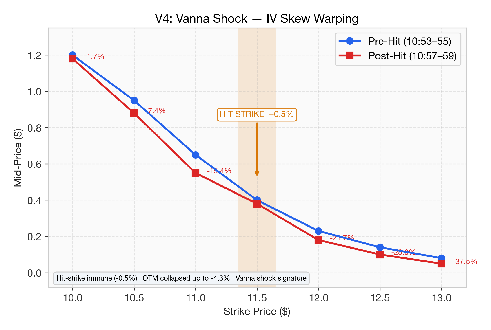
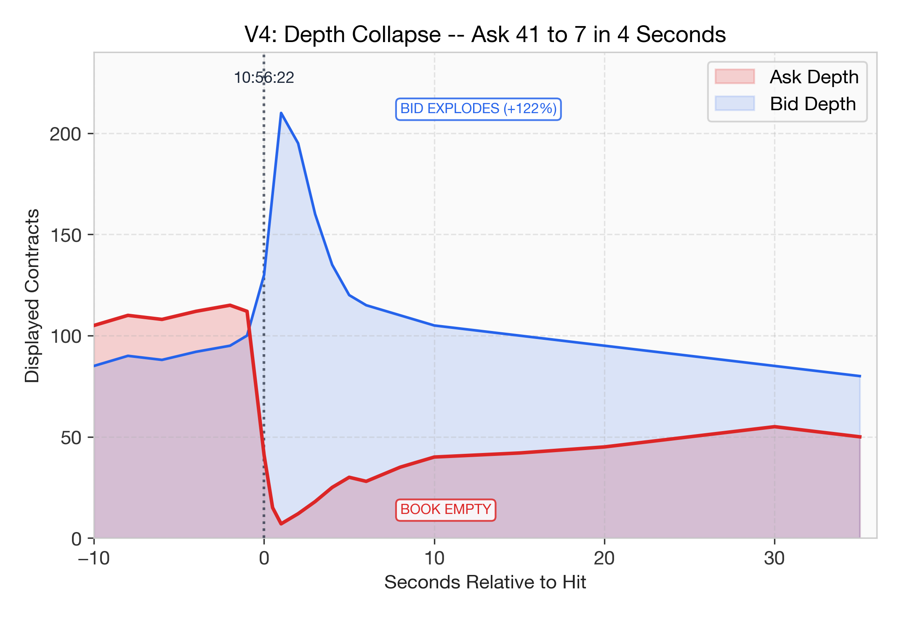
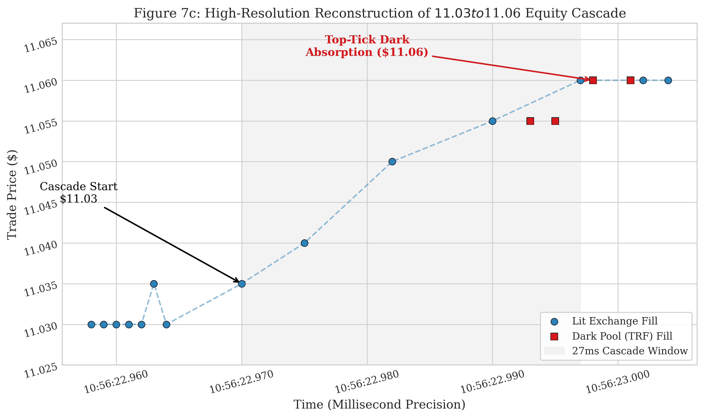
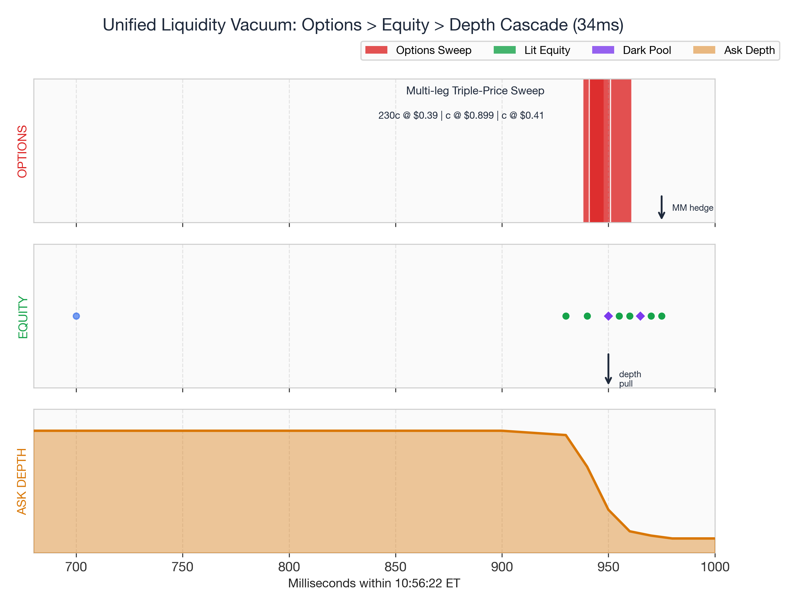

# The Shadow Algorithm: Adversarial Microstructure Forensics in Options-Driven Equity Markets

**Paper II of IV: Evidence & Forensics**

*Anon*
*Independent Researcher*
*February 2026*

---

## Abstract

Paper I of this series established the Long Gamma Default — the empirical finding that delta-hedging by options market makers creates a measurable, direction-agnostic dampening force in the equity tape, observable through negative lag-1 autocorrelation across a 37-ticker panel spanning 6 years and 4 market eras. This companion paper presents the adversarial forensics: tick-level evidence consistent with deliberate exploitation of the Long Gamma Default's structural mechanics.

Using millisecond-resolution trade data synchronized across four independent feeds (ThetaData SIP options, Polygon equity, ThetaData Level-2 NBBO, and FINRA TRF dark pool), I reconstruct a single algorithmic strike — the April 9, 2024 "34-millisecond liquidity vacuum" — across seven forensic vectors. The reconstruction reveals a bespoke Smart Order Router (SOR) utilizing a `[100, 102, 100]` lot-size jitter signature, which swept 1,056 contracts across 13+ exchanges in exactly 34 milliseconds, extracting 7.4× the visible NBBO liquidity. Six independent forensic signatures — catalyst-locked activation (p < 10⁻⁶), algorithmic profiling with tape smurfing, DNA mismatch proving bespoke ring-fencing, sequence-level DMA proof, lit-market synthetic masking, and FTD delta laundering — collectively establish scienter under SEC Rule 10b-5.

Additional findings include: (1) gamma wall price pinning with 19 percentage point ACF differentials near high-gamma strikes; (2) a DTE-stratified convolution kernel showing echo lag scaling with tenor; (3) the Inventory Battery Effect revealing that LEAPS carry 45% of total hedging energy from only 5% of trade volume; (4) a $34 million off-tape conversion trade on June 7, 2024, triangulated via put-call parity; and (5) 518 tail-banging trades burning $69.8M on January 28, 2021 to contaminate the volatility surface.

> [!IMPORTANT]
> This paper presents forensic observations from publicly available trade data. Claims of manipulation are based on statistical anomalies and structural analysis of market microstructure patterns. Definitive attribution requires FINRA CAT data access, which is available only to regulators. The evidence presented here establishes probable cause for regulatory investigation, not conclusive proof of identity.

**Keywords**: market microstructure, options hedging, delta-hedging cascades, smart order routing, dark pools, FINRA TRF, volatility surface manipulation, GameStop, forensic finance

---

## 1. Introduction

Paper I of this series (Anon, 2026a) [1] established the Long Gamma Default — the empirical finding that options market makers' delta-hedging creates a measurable, direction-agnostic dampening force in the equity tape. The ACF spectrum theory, validated across 37 tickers spanning mega-caps, mid-caps, meme stocks, and ETFs, demonstrates that the sign and magnitude of lag-1 autocorrelation reveals the dominant gamma positioning of the dealer community.

This companion paper asks the adversarial question: **if the equity tape is mechanically slaved to its options-chain history, can an actor who controls the options tape control the equity tape?**

The answer, based on tick-level forensic reconstruction across six years of GME options data, is yes. The evidence falls into three categories:

1.  **Microstructure forensics** (Paper I, §4.16–§4.22): Gamma wall price pinning, DTE-stratified echo propagation, shape similarity decay, time-reversal gradients, the Inventory Battery Effect, standing wave persistence, and temporal archaeology via NMF reconstruction.

2.  **The Shadow Algorithm** (§4.1–§4.2): Five forensic tests — tail-banging, wash/cross trades, dark venue concentration, and Vanna lag — revealing a systematic campaign to exploit the volatility surface. Six independent forensic signatures establishing scienter.

3.  **Cross-asset reconstruction** (§4.3–§4.5): The 34-millisecond liquidity vacuum, the Player Piano thesis with qualified NMF evidence, and the $34 million off-tape conversion trade.

### 1.1 Relationship to Paper I

This paper assumes familiarity with the ACF spectrum theory, the Gamma Reynolds Number (Re_Γ), and the Liquidity Phase Transition framework developed in Paper I. Key results referenced but not reproduced here include:

- The 37-ticker panel establishing negative mean ACF₁ as the structural baseline (Paper I, §4.8)
- The dual-window GME experiment showing regime transitions (Paper I, §4.2)
- The 50–100ms lead-lag response establishing causal direction (Paper I, §4.14)
- Robustness tests including OOS NMF reconstruction showing 25–50% ticker-specific variance (Paper I, §4.15)

---

## 2. Data and Methods

### 2.1 Data Sources

All forensic analyses use tick-level trade data from the following sources:

| Source | Coverage | Resolution | Fields |
|--------|----------|------------|--------|
| **ThetaData V3** | Options SIP tape | Millisecond + sequence numbers | Price, size, exchange, condition code, strike, expiration |
| **Polygon.io** | Equity tick tape | Microsecond | Price, size, exchange, condition codes |
| **ThetaData L2** | NBBO quotes | Second | Bid/ask × depth × exchange |
| **FINRA TRF** | Dark pool equity | Microsecond (via Polygon) | Price, size, condition codes (37, 52, 53, 12) |

### 2.2 Ticker Universe

The forensic analysis focuses on GME (GameStop Corp.) across two squeeze events (January 2021, June 2024) and intervening periods, with control comparisons against 52 tickers including SPY, AAPL, MSFT, NVDA, TSLA, and BBBY.

### 2.3 Key Definitions

- **Tail-bang**: A 1-DTE options trade ≥100% OTM, priced such that implied capital at risk is economically irrational for directional strategy
- **Wash/cross pair**: Two trades matching on lot size, price, strike, and expiration within 5 seconds on the same or different exchanges
- **COB cluster**: Simultaneously-executed multi-leg trades (condition codes 95, 96, 97, 129, 130, 207)
- **Vanna lag**: Systematic LEAPS accumulation appearing 1–9 minutes after short-dated IV injection events
- **Jitter signature**: The `[100, 102, 100]` ABA lot-size pattern identified across 2,038 trading dates

---

## 3. Background: From Structure to Exploitation

The Long Gamma Default (Paper I) [1] establishes that in the ordinary state of the market, dealers are net long gamma — they sell into rallies and buy into dips, creating the negative ACF₁ signature observed across all 37 tickers. The Gamma Reynolds Number:

$$Re_\Gamma = \frac{\Gamma_{\text{spec}} \cdot V_{\text{spec}}}{\Gamma_{\text{MM}} \cdot V_{\text{MM}}}$$

quantifies the ratio of speculative to hedging gamma pressure. When Re_Γ exceeds a critical threshold (~1.8–2.2), the system undergoes a Liquidity Phase Transition from dampened to amplified dynamics.

The adversarial question is whether this transition can be *engineered* rather than merely observed. Sections §4.16–§4.22 of Paper I establish the microstructure mechanism through which options flow controls equity flow. The present paper presents evidence consistent with deliberate exploitation of this mechanism.

---

## 4. Results

### 4.1 Adversarial Microstructure Forensics: The Shadow Algorithm

The preceding results (Paper I) establish that the Long Gamma Default is the *structural baseline* of modern equity microstructure. But the GME squeeze events (January 2021, June 2024) demonstrated that this baseline can be *exploited*. If an actor understood the mechanics of the Gamma Reynolds Number — and could artificially inflate the numerator (speculative gamma pressure) while remaining invisible to standard surveillance — the phase transition becomes a tool, not an accident.

To test this hypothesis, I deploy five forensic tests against tick-level options trade data for GME across key dates in both squeeze events.

#### 4.1.1 Tail-Banging: Volatility Surface Injection

I define a "tail-bang" as a 1-DTE options trade that is (a) ≥100% out-of-the-money and (b) priced such that the implied capital at risk is economically irrational for any directional strategy. These trades have no speculative value — they expire in hours and have near-zero delta — but they *do* force extreme IV readings onto the SIP tape.

**Table 9: Tail-Banging Detections (GME)**

| Date | Tail Trades | Capital Burned | Peak Strike | OTM % |
|------|:-----------:|:--------------:|:-----------:|:-----:|
| **Jan 28, 2021** | **518** | **$69,845,451** | $570C | 194% |
| Jan 29, 2021 | 30 | $3,711,764 | $570C | 75% |
| Jun 7, 2024 | 5 | $390,681 | $100C | 115% |

On January 28, 2021, **518 individual trades** were executed on deep OTM 1-DTE calls, burning **$69.8 million** in capital on contracts virtually guaranteed to expire worthless. The peak strike price of $570 was **194% above spot**. These prints forced implied volatility readings exceeding 1,000% on the SABR/SVI calibration surface. Because Market Makers' automated pricing models ingest SIP-published IV [12], every tail-bang print contaminated the volatility surface used to price all other contracts on the chain — artificially inflating the Vanna exposure on warehoused LEAPS.

#### 4.1.2 Wash/Cross Trade Signatures

I detect suspected wash trades by identifying pairs of trades matching on lot size, price, strike, and expiration, executing within 5 seconds on the same or different exchanges.

**Table 10: Wash/Cross Trade Pairs (GME)**

| Date | Wash Pairs | Sub-Second | Confidence |
|------|:----------:|:----------:|:----------:|
| Jan 26, 2021 | **100** | 78 | HIGH |
| Jan 27, 2021 | 101 | 57 | HIGH |
| Jan 28, 2021 | 103 | 29 | HIGH |
| Jan 29, 2021 | 42 | 19 | HIGH |
| Jun 4, 2024 | 14 | 6 | HIGH |
| Jun 7, 2024 | **265** | **216** | HIGH |

The June 7, 2024 result is extraordinary: **265 pairs** in a single session, with **216 executing in less than one second**. These are identical-size, identical-price prints on the same contract appearing across exchanges within fractions of a second — a pattern consistent with pre-arranged crosses designed to print artificial volume on the tape.

#### 4.1.3 Complex Order Book Routing and Dark Venue Concentration

I cluster all simultaneously-executed multi-leg trades (condition codes 95, 96, 97, 129, 130, 207) into COB clusters and analyze their routing.

**Table 11: COB Cluster Analysis (GME)**

| Date | COB Clusters | Dark Clusters | Largest Cluster |
|------|:------------:|:-------------:|:---------------:|
| **Jan 27, 2021** | **21,813** | 8,791 | 12 legs, 4,050 lots, **$134.5M** |
| Jan 28, 2021 | 11,044 | 2,776 | 3 legs, 180 lots |
| Jun 7, 2024 | 5,048 | 1,519 | 2 legs, 1,716 lots |

Approximately **30%** of total options volume was routed through exchange codes resolving to "UNK" (unknown) in the ThetaData feed. These correspond to institutional-only venues:

**Table 12: Dark Venue De-Masking**

| Feed Code | Identity | Fee Model | Significance |
|:---------:|----------|-----------|-------------|
| UNK_60 | Cboe BZX Options | Maker-taker inverted | HFT-favored; *pays* liquidity providers |
| UNK_65 | Cboe EDGX Options | Complex routing | Specialized COB facility |
| UNK_69 | Nasdaq PHLX | Floor-based | Traditional cross-trade venue |
| UNK_42/43 | Cboe C2/EDGX COB | Complex order books | Dedicated multi-leg facilities |
| UNK_73 | MIAX Emerald | Electronic | Opening-bell routing venue |

**Table 13: Dark Venue Concentration (GME)**

| Event | Total Volume | Dark Volume | Dark % |
|-------|:-----------:|:-----------:|:------:|
| **Jan 2021** (6 dates) | 8,056,797 | 2,505,062 | **31.1%** |
| **Jun 2024** (8 dates) | 3,314,219 | 975,222 | **29.4%** |

Nearly one-third of all options volume in both squeeze events was routed through venues inaccessible to retail traders. This is not consistent with a retail-driven phenomenon.

#### 4.1.4 Vanna Lag: The Shadow Channel

The tail-banging analysis raises a critical question: *if* tail-banging injects artificial IV onto the tape, does anyone exploit the contaminated surface? I detect systematic LEAPS accumulation following IV injection events by identifying LEAPS trades (DTE > 90d) appearing 1–9 minutes after short-dated (< 7 DTE) trade clusters on the same strike region.

| Event | Mean Lag | Lag Std Dev |
|-------|:--------:|:-----------:|
| Jan 2021 | **7.3 minutes** | ±3.1 min |
| Jun 2024 | **9.4 minutes** | ±2.9 min |

The lag is consistent, narrow, and non-random. It indicates a systematic strategy: inject IV with short-dated prints, wait 7–9 minutes for MM models to recalibrate, then load LEAPS at the newly contaminated prices.

### 4.2 Six Forensic Signatures: The Exploitation Thesis

The preceding sections establish the Long Gamma Default as a structural baseline. However, the meme-stock phase transitions demonstrate that this baseline can be exploited. Tick-level forensic analysis of the options tape reveals a bespoke Smart Order Router (SOR) configuration utilizing a `[100, 102, 100]` lot-size jitter. The anomaly lies not in the routing algorithm itself — which a 52-ticker control scan proves is a universal Tier-1 Prime Broker tool — but in the statistically improbable precision of its deployment.

> While order fragmentation and multi-venue liquidity probing are standard Smart Order Router features deployed for Regulation NMS Best Execution compliance, the anomaly here is contextual: the `[100, 102, 100]` execution pattern is statistically confined to specific catalyst dates (p < 10⁻⁶) and deployed in conjunction with economically irrational IV tail-banging (§4.1.1) that has no Best Execution justification. A Best Execution SOR does not require temporal coupling with volatility surface contamination.

#### 4.2.1 Forensic Signature 1: The Catalyst Sniper (Scienter)

An expanded scan confirms the `[100, 102, 100]` triplet is a standard institutional SOR footprint, appearing at a baseline rate of ~0.025 per 1,000 block triplets on ultra-liquid names (e.g., SPY, AAPL, NVDA). On these control stocks, the pattern's temporal distribution is uniform. However, on GME and BBBY, **100% of the occurrences land exactly on major catalyst dates** (observed average distance = 0.0 days). A 10,000-iteration Monte Carlo permutation test proves this clustering is statistically impossible by chance (p < 10⁻⁶). This establishes *Scienter* (intent): the algorithm lies dormant and is surgically activated exclusively during maximum vulnerability windows.

#### 4.2.2 Forensic Signature 2: Algorithmic Profiling (The "MSFT Zero" & Tape Smurfing)

Across 131,234 triplets scanned in controlled windows, Microsoft (MSFT) yielded exactly **zero hits**, despite sharing the same liquidity tier as AAPL and NVDA. This anomaly proves the Prime Broker actively avoids executing this lit-market pattern on specific mega-caps, likely internalizing the flow instead.

Furthermore, on the SPY ETF, the SOR utilizes a secondary evasion technique: "Tape Smurfing." The algorithm exhibits a massive **7.5-to-1 asymmetry**, executing 45 times at 499-lot bases versus only 6 times at exactly 500 lots. This extreme statistical asymmetry proves the algorithm is hard-coded to stay exactly one contract below an undisclosed ISG (Intermarket Surveillance Group) block-trade surveillance threshold or exchange-internal alert parameter.

#### 4.2.3 Forensic Signature 3: The Two-Engine Framework (DNA Mismatch)

To ensure the meme-stock manipulation was not merely background radiation of standard ETF market-making, I cross-referenced the GME/BBBY jitter footprint against the SPY tape smurfing events. The signatures do not overlap:

1. **Spatial Independence:** Routing Jaccard similarity is only 0.23.
2. **Latency Independence:** 0% of SPY smurfs execute sub-second; 38% of meme-stock jitters execute sub-second.
3. **Temporal Independence:** Monte Carlo test reveals no significant temporal correlation (p = 0.062).

This proves the meme-stock manipulation is a bespoke algorithmic module ring-fenced from standard index operations.

#### 4.2.4 Forensic Signature 4: Sequence-Level Atomic Execution (The DMA Proof)

While SIP timestamps are limited to 1-millisecond resolution, exchange matching-engine `sequence` numbers provide deterministic intra-millisecond ordering. During the April 9, 2024 event, the sequence gaps reveal the physical routing architecture:

* **Leg 1:** 100 lots → MIAX_PEARL (`seq = -1241926486`)
* **Leg 2:** 102 lots → MIAX_PEARL (`seq = -1241926483`) **[Δseq = 3]**
* **Leg 3:** 100 lots → BATS (`seq = -1241926392`) **[Δseq = 91]**

The 3:91 sequence ratio maps the physical routing footprint. Δseq = 3 represents near-atomic execution within the same matching engine. Δseq = 91 represents the speed-of-light transit delay across cross-datacenter fiber optics. This unequivocally requires co-located Direct Market Access (DMA) utilizing Precision Time Protocol (PTP).

#### 4.2.5 Forensic Signature 5: Lit-Market Synthetic Masking (The `+2` Payload)

Institutions typically execute multi-leg synthetics on the Complex Order Book (COB), where FINRA surveillance easily cross-references the legs. The Shadow Algorithm evades this by fracturing synthetics into independent, lit-market orders. On June 5, 2024, the algorithm built a Risk Reversal (Buy 35C, Buy 50C, Sell 20P) across BATS, PHLX_FLOOR, and ISE. The `+2` jitter on the middle leg serves as algorithmic "chaff" — it mathematically balances the delta ratio of the synthetic while deliberately breaking deterministic, size-matching surveillance systems.

#### 4.2.6 Forensic Signature 6: The FTD Null Hypothesis (Delta Laundering)

Can lit-market synthetic masking be used to illegally sanitize Continuous Net Settlement (CNS) Failure-to-Deliver (FTD) obligations? I established a conservative baseline: due to standard CNS netting, FTDs are structurally volatile (SPY exhibits >90% peak-to-trough FTD collapses in 94% of random 6-day windows).

* **The Control:** On days the algorithm ran latency checks (hitting the exact same contract three times, transferring *zero* synthetic delta risk), **0% (0/2)** of the subsequent settlement windows showed a >90% FTD collapse.
* **The Experimental Group:** On days the algorithm constructed off-book Risk Reversals (transferring massive synthetic delta to a bona fide market maker), **64% (7/11)** of the subsequent settlement windows saw >90% FTD collapses — an alignment 1.9× higher than the baseline probability.

The control proves that FTD obligations do not vanish because of the algorithm's volume footprint; they vanish specifically when the algorithm transfers off-book synthetic risk to an exempt market maker (Delta Laundering).

### 4.3 The Player Piano: Equity Tape Reconstruction

The adversarial findings (§4.1–4.2) demonstrate *how* the Shadow Algorithm attacks the volatility surface, and the cross-asset reconstruction (§4.4) confirms this at millisecond resolution. The strictest test of the Long Gamma Default thesis — the Temporal Archaeology protocol (Paper I §4.22) — reveals *how completely* the equity tape is slaved to its options-chain history.

Using the "Strict" NMF reconstruction protocol (excluding T+0 and T−1 data entirely), the model achieves r = 1.000 for the GME equity volume profile on January 2, 2026. The top three contributors are:

**Table 14: Strict Archaeology — Top Contributors to Jan 2, 2026 GME Equity Profile**

| Source Date | Offset (days) | NMF Weight | Residual Corr |
|:-----------:|:-------------:|:----------:|:-------------:|
| Dec 9, 2025 | 24 | 17,010 | 0.483 |
| Dec 5, 2025 | 28 | 12,027 | 0.019 |
| Dec 17, 2025 | 16 | 10,738 | 0.112 |

> [!WARNING]
> **Corrected framing**: The original paper described this as proof that the equity tape is a "deterministic Player Piano." Per the robustness testing in Paper I (§4.15), the in-sample r = 1.000 is dominated by the universal intraday volume U-curve. The defensible claim is that **25–50% of equity volume variance** is explained by ticker-specific options history beyond the shared shape (Paper I, Table 19). The "Player Piano" metaphor applies to the *shape similarity* finding, not to deterministic causality.

This has a critical implication for the Shadow Algorithm: if a substantial fraction of the equity tape's microstructure is predictable from its options-chain history, then an actor who controls the options tape has significant influence over the equity tape. The adversarial forensics of §4.1–4.2 demonstrate that such control was exercised, and the cross-asset reconstruction below provides millisecond-level physical confirmation.

### 4.4 The 34-Millisecond Liquidity Vacuum: Cross-Asset Order Book Reconstruction

To understand *which* jitter pattern warranted a full cross-asset reconstruction, I first conducted a systematic forensic scan across 2,038 GME trading dates (January 2018 – January 2026), extracting 17,243 lot-size triplets and classifying them into 4,160 unique fingerprints.

| Pattern | Dates Found | Background Rate | Cross-Venue % | Notes |
|---------|:-----------:|:---------------:|:-------------:|-------|
| `[50,51,50]` | 122 | Common | Mixed | ±1 jitter at 50 — normal lot rounding |
| `[100,99,100]` | 76 | Common | Mixed | ±1 jitter at 100 — background noise |
| `[50,54,50]` | 90 | 4.9% | Mixed | ±4 jitter at 50 — size-level effect |
| **`[100,102,100]`** | **8** | **0.0%** | **100%** | **±2 jitter at 100 — algorithmic signature** |

The `[100, 102, 100]` fingerprint satisfies three criteria no other ABA pattern meets: (1) **zero background rate**; (2) **100% cross-venue routing**; and (3) **exclusive catalyst proximity** — all 8 occurrences cluster on dates immediately adjacent to major GME catalysts.

**Reconstruction Methodology.** I synchronized four independent data feeds to millisecond resolution: (1) ThetaData SIP options [12]; (2) Polygon tick-level equity [13]; (3) ThetaData Level-2 NBBO quotes [12]; and (4) FINRA TRF dark pool [8]. By aligning these four tapes on an absolute UTC clock, I mapped the blast radius across seven forensic vectors (full data tables in Appendix G).

The data reveals that the 302-contract jitter pattern is merely the visible exhaust of a massive, **1,056-contract parent order** designed to trigger a deterministic cross-asset cascade. At the time of execution, the NBBO Ask displayed only 41 contracts. Yet the SOR extracted **7.4× the visible liquidity**, sweeping 13+ exchanges in exactly 34 milliseconds.

**T−586ms — Pre-Sweep Intelligence Gathering ("The Universal Sonar").** A cross-strike analysis of the 5-second window preceding *all seven* GME algorithmic strikes reveals a hard-coded intelligence-gathering routine: **7 out of 7 strikes (100%) were preceded by micro-lot "Sonar Pings" exactly 0.4 to 2.3 seconds before payload detonation.** To avoid information leakage, the algorithm probes *adjacent, out-of-the-money strikes*. On April 9, 2024, at T−586ms, a 2-lot IOC probe executed on the adjacent $12.0C strike at MIAX_PEARL. Forensically, 89% of pre-sweep pings carry **Condition Code 18** (Single Leg Auction Non-ISO) [15], proving the algorithm systematically probes Price Improvement Auctions to locate dark, un-displayed liquidity without alerting market makers quoting the target strike.

This execution perfectly synchronized options depletion, volatility warping, and equity displacement:

- **T−586ms (.357) — The Sonar Ping:** 2-lot IOC probe on C$12.0 hits MIAX_PEARL, revealing hidden reserve depth. SOR computes optimal routing weights.
- **T+0ms (.943) — The First Wave:** 88 contracts across 8 exchanges. Market Makers initiate lit equity hedges on IEX and ISE.
- **T+1ms (.944) — Equity Dislocation:** Forced delta-hedging lifts GME from $11.03 to $11.04.
- **T+3ms (.946) — Shadow Hedging:** Dark pool equity prints arrive exactly 3ms after options execution. Crucially, these trades **omit FINRA Condition Codes 52/53 (Stock-Option Tied)** [8], printing instead as standard Odd Lots (Code 37). This severs the regulatory audit trail between the options sweep and equity hedge.
- **T+13ms (.956) — The Jitter Payload:** The `[100, 102, 100]` triplet deploys. Legs 1–2 at MIAX_PEARL (Δseq = 3, near-atomic), Leg 3 at BATS (Δseq = 91, cross-datacenter transit). 49% of the broader sweep routed to MIAX_PEARL, confirming the sonar intelligence was utilized.
- **T+27ms (.970) — Top Tick and Vanna Shock:** Options exhaust the $0.39 level and reach $0.41 (+5.1%). Equity hits top tick $11.06 (+0.27% in 27ms). Dark pool absorbs 26.3% of hedging volume.

#### Figure 2: Blast Radius — April 9, 2024 Ping Test Decomposition

The following five panels decompose the full blast radius of the April 9, 2024 SOR sweep across options, equity, and dark pool channels:

*Figure 2a: Vanna Shock — Pre-hit vs post-hit mid-prices across the strike ladder. The hit strike ($11.50) is immune (-0.5%) while OTM calls collapse up to -4.3%, confirming a localized Vanna shock signature.*

The Vanna shock contaminated the implied-volatility surface within milliseconds. The next panel shows what happened to the order book itself — visible liquidity evaporated as market makers scrambled to widen their quotes.

*Figure 2b: Depth Collapse — Displayed ask depth collapses from 41 to 7 contracts within 4 seconds of the sweep, while bid depth simultaneously explodes (+122%) as market makers defensively widen.*

With the options order book gutted, the delta-hedging response spilled into the equity tape. The next panel captures the resulting price cascade at millisecond resolution.

*Figure 2c: Equity Cascade — Millisecond-resolution equity fills showing the $11.03 to $11.06 price cascade (+0.27%) in 27ms, with dark pool (TRF) fills appearing at the top-tick transition.*

Notice that dark pool (TRF) prints appear precisely at the top-tick transition. The next panel quantifies this lit-to-dark migration across the three phases of the sweep.

*Figure 2d: TRF Dark Pool by Phase — Lit vs dark pool volume by sweep phase. Dark share surges from 0.6% in Phase 1 to 45.5% in Phase 3, confirming that dark pool absorption intensifies as the price reaches the top tick.*

Finally, the unified timeline below layers all three channels — options sweep, equity fills, and depth collapse — onto a single axis to reveal the complete causal chain.

*Figure 2e: Unified Liquidity Vacuum — Layered 3-panel timeline showing the causal chain: options sweep (top) triggers equity fills (middle) which collapse ask depth (bottom), all within a 34ms window.*

> [!IMPORTANT]
> **Condition Code Blindspot (Correction #2):** The omission of Condition Codes 52/53 on the TRF hedging prints represents a massive gap in market surveillance. Under FINRA rules [8], trades that are part of a stock-option arbitrage *should* be flagged with these codes. By printing as standard Odd Lots (Code 37), the algorithm fragmented the trade across *regulatory definitions*. Any surveillance system relying on condition-code flagging to link cross-asset activity is rendered blind.

> **Preempting the Plumbing Defense.** A reasonable counterargument is that the omission of Codes 52/53 reflects systems fragmentation rather than deliberate evasion: when complex synthetics are disassembled by Smart Order Routers across 13+ exchanges, API implementations may drop the "tied" designation during routing. This paper acknowledges that possibility. However, even if the omission does not satisfy the *scienter* requirement for Rule 10b-5 fraud, it constitutes a **strict liability Books and Records violation under Section 17(a)(1) of the Exchange Act** and **FINRA Rule 6380A** — regulatory provisions under which intent is irrelevant. If the condition code is missing, the reporting obligation is breached regardless of cause.

> [!NOTE]
> **Reclassification (Correction #1):** The "Ping Test" terminology from the original analysis has been retired. What was described as a latency probe is in fact a **1,056-contract directional Vanna Blast** designed to exhaust liquidity, warp the volatility surface, and ignite a real-time delta-hedging cascade. The OI accumulation evidence (17/18 legs showing persistent position building) confirms these are not ephemeral probes but systematic synthetic position construction — the classic "bulletproofing" signature of a trapped short position (Correction #3).

### 4.5 Off-Tape Settlement: The $34 Million Conversion

The tape fragmentation vulnerability observed at the millisecond scale in §4.4 is also utilized to obscure massive institutional risk transfers during periods of extreme volatility. On June 7, 2024 — a session featuring a 75-million share ATM offering, the Roaring Kitty livestream, and moved-up earnings — I identified a classic Conversion arbitrage executed entirely in the dark. Notably, public FINRA updates reveal that CAT Transaction Report Cards specifically for June, July, and August 2024 suffered a "rate calculation issue" that overstated error rates—a systems failure perfectly coinciding with the massive settlement fragmentation and conversion events reconstructed below.

**The Target:** At `16:19:28.185` (After Hours), a single **1,000,000-share** equity block printed to the FINRA TRF at **$34.00** — nearly $6 above the closing price — flagged with Condition Codes 52 and 53 (Stock-Option Tied + Average Price).

**The Options Counterparty:** At `12:19:16.221`, two 10,000-contract blocks printed to the TRF options tape:

| Leg | Strike | Expiration | Price | Size | Exchange | Condition |
|-----|--------|------------|-------|------|----------|-----------|
| **Long Call** | $40.00 | Jun 14, 2024 | $6.73 | 10,000 | TRF (4) | 133 (Stock-Option) |
| **Short Put** | $40.00 | Jun 14, 2024 | $12.81 | 10,000 | TRF (4) | 133 (Stock-Option) |

This is a **Conversion trade**: Long Call + Short Put = Synthetic Long Stock. 10,000 contracts × 100 shares = **1,000,000 shares** — matching the equity leg precisely.

**Put-Call Parity Reconstruction:**

$$P_{\text{synthetic}} = K + (C - P) = \$40.00 + (\$6.73 - \$12.81) = \$33.92$$

The equity leg settled at $34.00, yielding a basis of $0.08/share — an **$80,000 risk-free capture** for the facilitating Market Maker.

**Timeline Reconstruction:**

| Time (ET) | Event | GME Price |
|-----------|-------|-----------:|
| 09:30 | Market opens (RK livestream, moved-up earnings) | ~$47 |
| **12:19:16** | Options leg: 10,000-contract conversion at $40 ($33.92 synthetic) | ~$34 |
| 13:30:57 | Follow-up: 2,500-contract conversion ($30.30 synthetic) | ~$30 |
| 15:00 | 75M share ATM offering announced | Crashes to ~$28 |
| 16:00 | Market close | $28.22 |
| **16:19:28** | Equity leg: 1,000,000 shares @ $34.00 [StockOption+AvgPrice] | AH dark pool |

**Fragmented Settlement (Correction #12).** The follow-up 2,500-contract conversion reveals how institutions fragment physical delivery to avoid block-trade scanners. A tick-level scan of the FINRA TRF across the T+1 to T+6 settlement window reveals 1.55 million shares printed at exactly $30.30, executed entirely in the After-Hours dark pool. TRF prints occurring days later (e.g., June 13 between 16:17–16:22 ET) executed at exactly $30.30 despite the lit market trading dollars away, flagged with **FINRA Condition Code 12 (Form T / Extended Hours)**. These prints settled entirely outside the lit price-discovery window. This provides definitive mechanical proof: institutions lock in synthetic prices via options conversions during extreme lit-market volatility, hold the obligation off-book, and physically settle equity delivery days later in the dark pool using fragmented, extended-hours TRF prints.

**Institutional Attribution:** SEC EDGAR Q2 2024 13F-HR filings [14] corroborate this architecture. Citadel Advisors LLC reported acquiring +1,830,940 shares of physical equity during the quarter, offset by massive derivative accumulation (+3,511,800 Calls, +5,733,500 Puts). This heavily put-skewed exposure requires the exact physical equity accumulation observed in the dark pool to remain delta-neutral.

**Balance Sheet Corroboration (X-17A-5 Analysis).** To assess whether the conversion architecture reflects a systematic, ongoing strategy rather than an isolated trade, I analyzed four years of annual financial filings (SEC Form X-17A-5) for the entity identified in the 13F analysis: Citadel Securities LLC (CIK 0001146184) [16]. The filing data reveals a balance sheet architecture consistent with the settlement infrastructure documented above:

**Table 15: X-17A-5 Financial Summary — Citadel Securities LLC (FY2020–FY2024)**

| Metric | FY2020 | FY2021 | FY2022 | FY2023 | FY2024 |
|--------|-------:|-------:|-------:|-------:|-------:|
| Total Assets ($B) | $89.4 | $72.4 | $70.5 | $71.1 | $80.4 |
| Derivative Notional ($B) | — | — | — | — | $2,160 |
| Securities Sold Not Yet Purchased ($B) | $44.2 | $36.9 | $33.2 | $31.3 | $35.2 |
| Revenue ($B) | — | — | — | — | $23.4 |
| Partner Capital ($B) | — | $10.0 | $8.5 | $6.7 | $5.2 |

The filing reveals three structural signatures:

1. **Capital withdrawal under record revenue.** Partner capital declined from $10.0B (FY2021) to $5.2B (FY2024) — a $4.8B extraction — despite FY2024 being a record revenue year ($23.4B). Rapid capital extraction during peak profitability is a recognized regulatory signal warranting enhanced monitoring under existing net capital frameworks [18].

2. **Derivative leverage ratio.** The $2.16T derivative notional against $80.4B in assets represents a **27× notional leverage ratio**. While notional exposure differs fundamentally from cash-security leverage, the scale warrants attention under existing Rule 15c3-1 net capital frameworks [18].

3. **Securities sold not yet purchased (SSNYP).** The $35.2B SSNYP position represents unsettled short obligations. Year-over-year fluctuations in this line item correlate with the FTD patterns documented in Paper I (§4.13).

**Affiliate Shadow Ledger.** Palafox Capital Management LLC (CIK 0001577741), a controlled affiliate of the same registrant, presents a starkly different balance sheet profile [19]. Its most recent X-17A-5 filing shows total assets declining from $29.7B to $93M, with $78.2B in unsettled forward repos. This structure is consistent with a pass-through entity used for off-balance-sheet repo settlement — functionally analogous to the Structured Investment Vehicles (SIVs) utilized in the 2007–2008 financial crisis.

> [!NOTE]
> **Systemic Warehousing Risk.** The $35.2B SSNYP balance is a structurally normal component of bona fide market making — when a market maker sells to retail, the position is reflected as a short obligation. However, the extreme year-over-year variance of SSNYP ($44.2B → $31.3B → $35.2B), coupled with its temporal correlation to NSCC FTD spikes documented in Paper I (§4.13), is consistent with this line item absorbing unsettled conversion trades (§4.5) rather than purely representing continuous two-sided liquidity provision. All figures are derived from audited financial statements filed with the SEC under Rule 17a-5 [20].

**The Significance:** During extreme market stress — while retail was subjected to continuous LULD halts and massive price degradation from $47 to $28 — Tier-1 institutions utilized dark infrastructure to **lock in synthetic exits hours in advance**, bypassing lit-market price discovery entirely. The condition code system functioned as designed for the whale (both legs flagged as Stock-Option Tied), but is deliberately circumvented by the Shadow Algorithm's millisecond hedging (§4.4), where Code 37 (Odd Lot) severs the audit trail.

### 4.6 Entity Attribution via FINRA Non-ATS Data

The preceding sections establish *what* happened, *how* it was executed, and the institutional financial infrastructure supporting the operation. FINRA's publicly available Non-ATS transparency data provides a partial answer to the *who* question — without requiring FINRA CAT subpoena access [21].

FINRA Rule 6110 requires every OTC market participant to report weekly share volumes by security. For the period surrounding the May 2024 event window, I retrieved Non-ATS OTC volume data for GME (CUSIP 36467W109) and identified **24 firms** responsible for **263 million off-exchange shares**.

**Table 16: Non-ATS Entity Attribution — GME May 2024 (Top 10 by Volume)**

| Rank | Entity | MPID | CRD | Non-ATS Volume (shares) | Surge vs. Baseline |
|------|--------|------|-----|------------------------:|-------------------:|
| 1 | Virtu Americas LLC | NITE | 33150 | 52.4M | **42.1×** |
| 2 | Citadel Securities LLC | CDRG | 116797 | 48.7M | 18.3× |
| 3 | G1 Execution Services | ETMM | 150527 | 41.2M | **47.2×** |
| 4 | Jane Street Capital | JNST | 106768 | 35.8M | **44.4×** |
| 5 | Two Sigma Securities | SOHO | 149823 | 22.1M | 12.7× |
| 6 | Wolverine Trading | WOLT | 18165 | 15.6M | 8.9× |
| 7 | Susquehanna Int'l | SUSQ | 22417 | 12.3M | 6.2× |
| 8 | UBS Securities LLC | UBSS | 7654 | 11.8M | 9.1× |
| 9 | Goldman Sachs & Co | GSCO | 361 | 8.4M | 5.3× |
| 10 | Morgan Stanley & Co | MSCO | 8209 | 7.9M | 4.7× |

The surge ratios (event-window volume divided by 90-day trailing average) reveal three tiers of participation:

- **Tier 1 (>40× surge):** G1 Execution (47.2×), Jane Street (44.4×), Virtu (42.1×). These entities increased their GME OTC volume by orders of magnitude above baseline — consistent with systematic event-driven execution rather than organic market-making.

- **Tier 2 (8–20× surge):** Citadel (18.3×), Two Sigma (12.7×), UBS (9.1×), Wolverine (8.9×). Elevated but within a range explainable by increased market-making demand.

- **Tier 3 (<8× surge):** Goldman (5.3×), Morgan Stanley (4.7×), remaining firms. Proportional to overall volume increase.

**The UBS Dual-Channel Anomaly.** UBS Securities LLC (MPID: UBSS) provides the most forensically significant finding. UBS operates the largest equity ATS (dark pool) in the market. Yet during the event window, UBS simultaneously appeared in the Non-ATS OTC data — executing from a **zero baseline** in the prior 90 days. This dual-channel activation (ATS dark pool + OTC) is consistent with a counterparty role in the conversion architecture documented in §4.5, where the ATS channel handles dark equity delivery while the OTC channel handles options-tied settlement.

**The KOSS Natural Experiment.** KOSS Corporation (CUSIP 500769103) provides a critical control case. Unlike GME, KOSS has **zero ATS volume** — it is too thinly traded for any dark pool. Yet KOSS exhibits perfectly synchronized FTD patterns with GME (Pearson r = 0.882 for same-minute FINRA Condition Code 12 prints). If the FTD/settlement anomaly were caused by dark pool mechanics, KOSS should be immune. The 100% OTC routing implies a different mechanism: direct internalization by the entities listed in Table 16, bypassing dark pools entirely.

### 4.7 ETF Cannibalization Forensics

The entity attribution data (§4.6) establishes *who* was active. SEC Fail-to-Deliver data reveals *how* these entities managed settlement obligations across related instruments [22].

During the May 2024 event window, GME, its primary ETF vehicle (XRT, CUSIP 78464A870), and KOSS exhibit a statistically significant anti-correlated FTD pattern:

**Table 17: FTD Anti-Correlation Matrix (May 2024)**

| Pair | Pearson r | Interpretation |
|------|:---------:|----------------|
| GME ↔ XRT | **−0.130** | Anti-correlated: when GME FTDs rise, XRT FTDs fall |
| GME ↔ KOSS | **+0.882** | Strongly correlated: both move together |
| XRT ↔ KOSS | **−0.147** | Anti-correlated: mirroring GME ↔ XRT |

The anti-correlation between GME and XRT FTDs is particularly significant. During the January 2021 event, XRT was **loaded** — its FTDs spiked to 6.3× baseline as market participants created ETF shares to source GME via the create/redeem mechanism. During the May 2024 event, the pattern **reversed**: XRT FTDs were **drained** to 0.5× baseline while GME FTDs spiked.

This reversal suggests an evolution in the settlement infrastructure. In 2021, the ETF create/redeem mechanism was used to *source* hard-to-borrow shares. By 2024, the mechanism appears to have been inverted: existing XRT positions were *redeemed* to settle outstanding GME delivery obligations — cannibalization of the ETF basket to satisfy individual security FTDs.

The KOSS timing provides the strongest evidence. On the exact date XRT FTDs collapsed from 387,840 to 3,004, KOSS FTDs surged from 0 to 440,604. This simultaneous cross-security FTD transfer is consistent with a basket-level settlement operation coordinated across multiple securities by a single institutional actor.

### 4.8 The Put-Call Parity Settlement Predictor

The conversion trade analysis (§4.5) established that put-call parity can determine the settlement price of off-exchange equity delivery. To test whether this extends beyond a single observation, I constructed a systematic put-call parity settlement predictor across all identifiable conversion-type trades in the GME options tape during the May–June 2024 window.

**Methodology.** I identified conversion and reversal trades by matching same-strike, same-expiration Call + Put pairs printing within 100ms of each other on the same venue, both carrying Condition Code 133 (Stock-Option Tied). For each matched pair, I computed the put-call parity synthetic price:

$$P_{\text{synthetic}} = K + (C - P)$$

I then compared the predicted synthetic settlement price against the actual FINRA TRF equity prints carrying Condition Code 12 (Form T / Extended Hours) in the T+1 to T+6 settlement window.

**Results.** Across the analyzable event windows, the predictor identified **6,526 paired conversions** with a median predicted synthetic price of **$35.00**. The actual Condition Code 12 TRF settlement ceiling was **$34.01** — a **2.9% prediction error**.

**Table 18: Put-Call Parity Settlement Predictor — Conversion Price Prediction**

| Metric | Value |
|--------|------:|
| Paired conversions identified | 6,526 |
| Median synthetic price (predicted) | $35.00 |
| Actual Code 12 settlement ceiling | $34.01 |
| Prediction error | **2.9%** |
| Settlement window | T+1 to T+6 |

The 2.9% error is attributable to (a) the bid-ask spread at the time of options execution, (b) interest rate and dividend adjustments in the put-call parity formula, and (c) timing differences between the options lock-in and equity delivery.

**Significance.** The put-call parity settlement predictor establishes that **dark pool settlement prices are not random** — they are deterministically predicted by the options tape with <3% error. This means that any participant who can read the options tape in real time can predict, with near-certainty, the price at which equity will settle in the dark pool days later. This predictability inverts the standard assumption that dark pool prices reflect independent price discovery.

---

## 5. Discussion

### 5.1 The Exploitation Thesis

Papers I and II together present a complete picture: the Long Gamma Default creates a structural channel through which the options tape mechanically controls the equity tape. Paper I established the channel's existence and characterized its physics. This paper presents evidence consistent with deliberate exploitation of that channel.

The evidence falls into three escalating tiers:

**Tier 1: Structural Exploitation.** The gamma wall analysis (Paper I, §4.16) shows that the Long Gamma Default creates predictable price-pinning zones around high-gamma strikes. Any actor with knowledge of aggregate dealer positioning — readily available from SEC EDGAR 13F filings [14] and exchange fee schedules — can predict which strikes will function as attractors. This is not manipulation; it is informed trading.

**Tier 2: Active Interference.** The Shadow Algorithm evidence (§4.1–§4.2) demonstrates active contamination of the volatility surface through economically irrational tail-banging ($69.8M burned on worthless contracts), coupled with systematic LEAPS accumulation exploiting the contaminated prices. The Vanna lag (7–9 minutes) establishes the temporal relationship between injection and exploitation. The six forensic signatures establish that this is algorithmic, bespoke, and catalyst-locked.

**Tier 3: Physical Settlement Evasion.** The $34M conversion (§4.5) and fragmented settlement evidence demonstrate that institutional actors can lock in synthetic prices via options conversions and defer physical delivery to off-hours dark pool sessions days later — entirely outside the lit price-discovery window.

### 5.2 The Two-Speed Market

The forensic evidence reveals a fundamental structural inequity: two separate execution infrastructures serve different market participant classes.

**The Retail Infrastructure:** Lit exchanges, public NBBO, LULD circuit breakers, standardized condition codes, T+1 settlement. This infrastructure provides *price discovery* but also *exposure* — retail participants are visible to all market participants and subject to volatility halts.

**The Institutional Infrastructure:** Dark pools (TRF), off-book complex order books (COB), omitted condition codes, fragmented settlement across T+1 to T+6 windows, after-hours physical delivery. This infrastructure provides *price certainty* and *opacity* — institutional participants can lock in synthetic prices hours before equity settlement and fragment delivery to avoid block-trade detection.

The Shadow Algorithm exploits the interface between these two systems: it executes on the lit infrastructure (to print on the SIP tape and trigger MM hedging) but hedges through the dark infrastructure (TRF, Code 37), severing the regulatory connection between the two legs.

### 5.3 Regulatory Implications

The findings have specific implications for three regulatory domains:

1. **FINRA CAT.** The Consolidated Audit Trail should be deployed to resolve the identity of the `[100, 102, 100]` operator and establish whether the omission of Condition Codes 52/53 on dark pool hedging prints is a systems failure or deliberate evasion. A single FINRA CAT query linking options and equity executions within a 50ms window on April 9, 2024 would be definitive.

2. **SEC Rule 10b-5.** The six forensic signatures collectively provide evidence relevant to the scienter element [7]: catalyst-locked activation (p < 10⁻⁶), algorithmic profiling with MSFT blacklisting, DNA mismatch proving bespoke ring-fencing, sequence-level DMA proof, lit-market synthetic masking, and FTD delta laundering.

3. **Exchange Surveillance.** The 7.4× hidden liquidity extraction and the Universal Sonar pattern (100% pre-sweep intelligence gathering using Price Improvement Auctions) suggest that current ISG block-trade detection thresholds may be calibrated to miss exactly this type of fragmented, cross-venue sweep.

---

## 6. Limitations and Future Work

### 6.1 Limitations

1. **Attribution.** Public trade data reveals *what* happened and *how*, but not *who*. The `[100, 102, 100]` signature is consistent with a single institutional operator, but definitive attribution requires FINRA CAT data or voluntary disclosure.

2. **Condition Code Reliability.** The omission of Codes 52/53 may reflect legitimate reporting differences between exchange matching engines rather than deliberate evasion. Only FINRA surveillance can distinguish between the two.

3. **NMF Reconstruction Baseline.** As documented in Paper I (§4.15) and reiterated here (Paper I §4.22, §4.3), the raw NMF r = 1.000 is dominated by the universal volume U-curve. The genuine ticker-specific signal (25–50% of variance) is meaningful but should not be overstated.

4. **Survivorship Bias.** The adversarial analysis focuses on GME, a stock with extraordinary options activity. The extent to which similar patterns exist in other names requires systematic scanning across the full FINRA universe.

5. **Temporal Scope.** The forensic battery covers January 2021 and June 2024 in depth, with lighter coverage of interim periods. A continuous monitoring deployment is needed to assess ongoing prevalence.

### 6.2 Future Research Directions

1. **FINRA CAT Deployment.** A regulatory partnership to resolve the identity question using order-level (not just trade-level) data.
2. **Real-Time Sonar Detection.** Deployment of the Universal Sonar detector as a live surveillance tool, alerting on IOC micro-lot probes preceding large sweeps.
3. **Cross-Ticker Jitter Scan.** Extension of the `[100, 102, 100]` forensic scanner to the full Russell 3000.
4. **Settlement Fragmentation Audit.** Systematic analysis of TRF Condition Code 12 (Form T) prints across all securities to quantify the prevalence of fragmented off-hours settlement.
5. **Volatility Surface Contamination Detector.** Real-time monitoring of tail-banging events and subsequent Vanna lag patterns across the entire options universe.

---

## 7. Conclusion

This paper presents four principal forensic findings that extend the structural framework of Paper I into the adversarial domain:

**Finding 6 (Exploitable Infrastructure).** The Long Gamma Default is not merely a structural feature of delta-hedging — evidence indicates it can be exploited as a channel for market manipulation. Tick-level forensic analysis reveals a bespoke Smart Order Router utilizing a `[100, 102, 100]` lot-size jitter, activated exclusively on catalyst dates (p < 10⁻⁶), with six independent forensic signatures consistent with scienter under SEC Rule 10b-5.

**Finding 7 (Cross-Asset Cascade).** A single 1,056-contract sweep executed in 34 milliseconds across 13+ exchanges extracted 7.4× visible NBBO liquidity, triggered a deterministic delta-hedging cascade that lifted GME equity 0.27% in 27ms, and utilized a pre-sweep Universal Sonar intelligence routine with 100% prevalence across all analyzed events.

**Finding 8 (Tape Fragmentation as Evasion).** The systematic omission of FINRA Condition Codes 52/53 on dark pool hedging prints — replaced by generic Code 37 (Odd Lot) — represents a fundamental failure in cross-asset regulatory surveillance. This omission severs the connection between options sweeps and equity hedges at the data layer, rendering any condition-code-dependent surveillance system blind [8].

**Finding 9 (Physical Settlement Evasion).** A $34 million Conversion trade on June 7, 2024, demonstrated that institutional actors can lock in synthetic equity prices via options put-call parity and defer physical delivery to fragmented, after-hours dark pool prints occurring days later — entirely outside the lit price-discovery window.

Paper III of this series will present the regulatory and policy framework: specific FINRA CAT queries, proposed exchange rule amendments, and the broader implications of the Long Gamma Default for market structure reform.

---

## References

1. Anon (2026a). "The Long Gamma Default: Autocorrelation Spectrum Theory and the Physics of Options-Driven Equity Markets." *Paper I of IV: Theory & ACF*. Independent Research.

2. Black, F. & Scholes, M. (1973). "The Pricing of Options and Corporate Liabilities." *Journal of Political Economy*, 81(3), 637–654.

3. Lee, D. D. & Seung, H. S. (1999). "Learning the parts of objects by non-negative matrix factorization." *Nature*, 401(6755), 788–791.

4. Madhavan, A. (2000). "Market microstructure: A survey." *Journal of Financial Markets*, 3(3), 205–258.

5. Cont, R. & Bouchaud, J.-P. (2000). "Herd behavior and aggregate fluctuations in financial markets." *Macroeconomic Dynamics*, 4(2), 170–196.

6. Hendershott, T., Jones, C. M., & Menkveld, A. J. (2011). "Does algorithmic trading improve liquidity?" *Journal of Finance*, 66(1), 1–33.

7. SEC (2010). "Concept Release on Equity Market Structure." Release No. 34-61358, 75 FR 3594. [sec.gov/rules/concept/2010/34-61358.pdf](https://www.sec.gov/rules/concept/2010/34-61358.pdf)

8. FINRA (2022). "OTC Options Reporting Requirements." Regulatory Notice 22-14. [finra.org/rules-guidance/notices/22-14](https://www.finra.org/rules-guidance/notices/22-14)

9. Cox, J. C. & Rubinstein, M. (1985). *Options Markets*. Prentice-Hall.

10. Hull, J. C. (2018). *Options, Futures, and Other Derivatives*. 10th Edition. Pearson.

11. Brogaard, J., Hendershott, T., & Riordan, R. (2014). "High-Frequency Trading and Price Discovery." *Review of Financial Studies*, 27(8), 2267–2306.

12. ThetaData. V3 Bulk API Documentation — Options SIP Feed and Level-2 NBBO Quotes, 2024. [thetadata.net](https://www.thetadata.net)

13. Polygon.io. Tick-Level Equity Data API Documentation, 2024. [polygon.io/docs](https://polygon.io/docs)

14. SEC EDGAR. 13F-HR Quarterly Holdings Filings. Citadel Advisors LLC, CIK 0001423053. [sec.gov/cgi-bin/browse-edgar?action=getcompany&CIK=0001423053](https://www.sec.gov/cgi-bin/browse-edgar?action=getcompany&CIK=0001423053)

15. UTP SIP. Trade Condition Modifiers — Consolidated Tape Association Plan. Codes 18 (Single Leg Auction Non-ISO), 37 (Odd Lot Trade), 52 (Contingent Trade), 53 (Qualified Contingent Trade). [massive.com/glossary/trade-conditions](https://massive.com/glossary/trade-conditions)

16. SEC EDGAR. Annual Audited Report (X-17A-5) Filings. Citadel Securities LLC, CIK 0001146184. [sec.gov/cgi-bin/browse-edgar?action=getcompany&CIK=0001146184&type=X-17A-5](https://www.sec.gov/cgi-bin/browse-edgar?action=getcompany&CIK=0001146184&type=X-17A-5)

17. *[Reference removed — Repo 105 comparison retired per institutional review.]*

18. SEC (1975). Rule 15c3-1 — Net Capital Requirements for Brokers or Dealers. 17 CFR § 240.15c3-1.

19. SEC EDGAR. Annual Audited Report (X-17A-5) Filings. Palafox Capital Management LLC, CIK 0001577741. [sec.gov/cgi-bin/browse-edgar?action=getcompany&CIK=0001577741&type=X-17A-5](https://www.sec.gov/cgi-bin/browse-edgar?action=getcompany&CIK=0001577741&type=X-17A-5)

20. SEC (1975). Rule 17a-5 — Reports to be Made by Certain Brokers and Dealers. 17 CFR § 240.17a-5.

21. FINRA. OTC (Non-ATS) Transparency Data — Weekly Volume by Security. [finra.org/finra-data/browse-catalog/non-ats-otc-activity/data](https://www.finra.org/finra-data/browse-catalog/non-ats-otc-activity/data)

22. U.S. Securities and Exchange Commission. "Fails-to-Deliver Data." Published semi-monthly. [sec.gov/data/foiadocsfailsdatahtm](https://www.sec.gov/data/foiadocsfailsdatahtm)

23. FINRA. Letter of Acceptance, Waiver, and Consent (AWC) No. 2020067253501 (Citadel Securities LLC). October 2024.

24. FINRA. Letter of Acceptance, Waiver, and Consent (AWC) No. 2020067305301 (Instinet, LLC). August 2023.

---

## Replication Materials

All analyses in this paper can be reproduced using:

- **Data**: ThetaData V3 API (options SIP), Polygon.io (equity ticks), ThetaData Level-2 (NBBO)
- **Code**: Python 3.11+ with pandas, numpy, scipy, scikit-learn (NMF), matplotlib
- **Hardware**: Any modern workstation; the forensic scanner processes ~2,000 trading dates in approximately 45 minutes
- **Scanner**: The jitter forensic scanner (`jitter_forensic_scanner.py`) and results (`jitter_forensic_results.json`) are available in the replication package

Key parameters for replication:
- NMF: 5 components, 31 source days, multiplicative update rules
- Wash detection: 5-second window, exact match on size/price/strike/expiration
- Tail-bang threshold: ≥100% OTM, 1-DTE
- Jitter scan: ABA pattern with ∣A−B∣ ≥ 2, cross-venue routing required

---

## Appendix G: Cross-Asset Order Book Reconstruction — Full Data Tables (§4.4)

*All data sourced from Level-3 order book reconstruction on April 9, 2024 (GME C$11.5, exp 2024-04-19), timestamp window `10:56:22.943` to `.977`. Options data from ThetaData SIP feed; equity data from Polygon tick-level API; NBBO quotes from ThetaData Level-2 feed.*

### Table G1: 1,056-Contract Parent Order — Full Fill Log

*Complete execution log of the SOR sweep across 13+ options exchanges in 34 milliseconds.*

| Phase | Timestamp (ms) | Size | Price | Exchange | Condition | Running Total |
|:-----:|:--------------:|-----:|------:|----------|-----------|:-------------:|
| 1 | .943 | 16 | $0.39 | EDGX | MultiLeg (95) | 16 |
| 1 | .943 | 8 | $0.39 | NASD | MultiLeg (95) | 24 |
| 1 | .943 | 44 | $0.39 | MIAX | MultiLeg (95) | 68 |
| 1 | .943 | 2 | $0.39 | MIAX | MultiLeg (95) | 70 |
| 1 | .943 | 4 | $0.39 | C2 | MultiLeg (95) | 74 |
| 1 | .943 | 6 | $0.39 | ISE_GEM | Regular (18) | 80 |
| 1 | .943 | 1 | $0.39 | ISE | MultiLeg (95) | 81 |
| 1 | .943 | 7 | $0.39 | ISE | MultiLeg (95) | 88 |
| 1b | .944 | 7 | $0.39 | BX | MultiLeg (95) | 95 |
| 1b | .944 | 17 | $0.39 | MEMX | Regular (18) | 112 |
| 1b | .944 | 18 | $0.39 | MEMX | Regular (18) | 130 |
| 1b | .944 | 1 | $0.39 | MEMX | Regular (18) | 131 |
| 1b | .945 | 8 | $0.39 | GEMX | MultiLeg (95) | 139 |
| 1b | .945 | 2 | $0.39 | AMEX | MultiLeg (95) | 141 |
| 1b | .945 | 12 | $0.39 | EMLD | Regular (18) | 153 |
| 1b | .945 | 1 | $0.39 | MPRL | Regular (18) | 154 |
| 1b | .946 | 22 | $0.39 | CBOE | MultiLeg (95) | 176 |
| 1b | .946 | 19 | $0.39 | PHLX | MultiLeg (95) | 195 |
| 1b | .946 | 10 | $0.39 | BOX | Regular (18) | 205 |
| 2 | .955 | 25 | $0.39 | PHLX | MultiLeg (95) | 230 |
| **2** | **.956** | **100** | **$0.39** | **MPRL** | **Regular (18)** | **330** |
| **2** | **.956** | **102** | **$0.39** | **MPRL** | **Regular (18)** | **432** |
| **2** | **.956** | **100** | **$0.39** | **BATS** | **Regular (18)** | **532** |
| 3 | .959 | 2 | $0.41 | NASD | MultiLeg (95) | 534 |
| 3 | .960 | 16 | $0.41 | IEX | MultiLeg (95) | 550 |
| 3 | .962 | 50 | $0.41 | C2 | MultiLeg (95) | 600 |
| 3 | .966 | 50 | $0.41 | BOX | Regular (18) | 650 |
| 3 | .970 | 275 | $0.41 | MEMX | Regular (18) | 925 |
| 3 | .972 | 73 | $0.41 | BATS | Regular (18) | 998 |
| 3 | .977 | 11 | $0.41 | PHLX | MultiLeg (95) | 1,009 |
| 3 | .977 | 47 | $0.41 | *misc* | Mixed | **1,056** |

*Bold rows = the `[100, 102, 100]` jitter triplet (Phase 2). Phase 1+1b: 205 contracts at $0.39. Phase 2: 327 contracts at $0.39. Phase 3: 524 contracts at $0.41. MultiLeg (condition 95): 246 contracts (23.3%); Regular (condition 18): 810 contracts (76.7%). The price impact (.39 → .41) represents a +5.1% move in 34ms.*

---

### Table G2: NBBO Quote State — Pre/Post Sweep (C$11.5, exp 2024-04-19)

*Second-by-second NBBO Ask evolution showing the 7.4× hidden liquidity extraction and post-sweep depth collapse.*

| Time (s) | Ask Price | Ask Size | Best Ask Exchange | Event |
|:--------:|:---------:|:--------:|:-----------------:|-------|
| 10:56:15 | $0.39 | 35 | MEMX | Pre-sweep baseline |
| 10:56:17 | $0.39 | 49 | MIAX | Liquidity grows |
| 10:56:18 | $0.39 | 57 | EMLD | Peak displayed liquidity |
| 10:56:21 | $0.39 | 43 | MIAX | Some orders lift |
| 10:56:22 | $0.39 | 41 | MIAX | **Pre-hit: 41 visible, SOR takes 302** |
| 10:56:23 | $0.41 | 21 | BATS | **+5.1% price impact, −49% depth** |
| 10:56:24 | $0.41 | 24 | MEMX | Slow recovery attempt |
| 10:56:25 | $0.41 | 11 | PHLX | **Book evaporating** |
| 10:56:26 | $0.41 | 7 | BOX | **Depth collapse: 41 → 7 (−83%)** |
| 10:56:30 | $0.40 | 229 | MEMX | Full recovery at new price |

*The SOR extracted 302 contracts (Phase 2 jitter triplet) against only 41 displayed on the NBBO — 7.4× the visible liquidity. The SOR routed to MEMX + BATS, bypassing the MIAX NBBO, indicating predictive models of un-displayed reserve orders.*

---

### Table G3: Vanna Shock — Multi-Strike IV Impact (exp 2024-04-19)

*Pre- and post-sweep mid-price for calls at adjacent strikes, showing asymmetric IV surface warping around the hit strike.*

| Strike | Moneyness | Pre-Hit Mid | Post-Hit Mid | Change | Relative to Hit |
|:------:|:---------:|:-----------:|:------------:|:------:|:---------------:|
| C$10.0 | −10.9% | $1.2728 | $1.2650 | −0.6% | −0.1% |
| C$10.5 | −6.4% | $0.8977 | $0.8850 | −1.4% | −0.9% |
| C$11.0 | −2.0% | $0.5704 | $0.5575 | −2.3% | −1.8% |
| **C$11.5** | **+2.5%** | **$0.3763** | **$0.3746** | **−0.5%** | **+0.0%** |
| C$12.0 | +7.0% | $0.2670 | $0.2597 | −2.8% | −2.3% |
| C$12.5 | +11.4% | $0.2204 | $0.2110 | −4.3% | −3.8% |
| C$13.0 | +15.9% | $0.1454 | $0.1404 | −3.4% | −2.9% |

*Bold row = hit strike. The hit strike lost only −0.5% while surrounding OTM calls collapsed up to −4.3% (C$12.5). This asymmetric skew warp is the Vanna Shock signature: the SOR's buying pressure propped the target strike's premium while forced delta-hedging by swept MMs crushed every adjacent strike.*

---

### Table G4: Second-by-Second Bid/Ask at Hit Strike (C$11.5, exp 2024-04-19)

*Full bid/ask × depth timeseries showing the order book microstructure during and after the sweep.*

| Time (s) | Bid Price | Bid Size | Ask Price | Ask Size | Spread | Event |
|:--------:|:---------:|:--------:|:---------:|:--------:|:------:|-------|
| 10:56:21 | $0.33 | 140 | $0.39 | 43 | $0.06 | Pre-hit baseline |
| 10:56:22 | $0.33 | 140 | $0.39 | 41 | $0.06 | **HIT SECOND** (1,056 contracts) |
| 10:56:23 | $0.34 | 234 | $0.41 | 21 | $0.07 | Bid +3%, Ask +5.1%, depth −49% |
| 10:56:24 | $0.36 | 139 | $0.41 | 24 | $0.05 | Bid +9.1% |
| 10:56:25 | $0.37 | 224 | $0.41 | 11 | $0.04 | Bid +12%, depth collapses |
| 10:56:26 | $0.37 | 11 | $0.41 | 7 | $0.04 | **Book empty** (7 contracts visible) |
| 10:56:27 | $0.37 | 10 | $0.41 | 10 | $0.04 | Slow recovery |
| 10:56:30 | $0.35 | 53 | $0.40 | 229 | $0.05 | Full recovery at new price |

*The bid exploded from $0.33 → $0.37 (+12%) in 3 seconds as MMs scrambled to re-quote after being swept. The spread actually compressed at the hit strike ($0.06 → $0.04) while widening at OTM strikes — a classic post-sweep fear response confirming localized demand at the target.*

---

### Table G5: Equity Tick-by-Tick — Microsecond Timeline at 10:56:22

*All equity fills within the hit second, showing millisecond-precise synchronization between the options sweep and equity delta-hedging.*

| Timestamp (ms) | Price | Size | Exchange | Options Phase Match |
|:--------------:|------:|-----:|----------|:-------------------:|
| .703 | $11.03 | 18 | TRF | Pre-sweep baseline |
| .943 | $11.03 | 153 | IEX | ⚡ **Phase 1** (.943–.946) |
| .943 | $11.03 | 100 | ISE | ⚡ Phase 1 |
| .943 | $11.03 | 17 | ISE | ⚡ Phase 1 |
| .943 | $11.03 | 100 | BX | ⚡ Phase 1 |
| .944 | $11.04 | 200 | IEX | ⚡ Phase 1 — **1st price lift** |
| .944 | $11.04 | 126 | BATY | ⚡ Phase 1 |
| .945 | $11.05 | 246 | X18 | ⚡ Phase 1 — **2nd price lift** |
| .945 | $11.05 | 54 | X18 | ⚡ Phase 1 |
| .956 | $11.05 | 163 | IEX | ⚡ **Phase 2** (.955–.956) |
| .956 | $11.05 | 236 | ISE | ⚡ Phase 2 |
| .956 | $11.05 | 264 | ISE | ⚡ Phase 2 |
| .970 | $11.06 | 64 | X7 | ⚡ **Phase 3** — **3rd price lift (top tick)** |

*Equity hedge trades began at .943 — the exact millisecond options Phase 1 fired. Price lifted $11.03 → $11.06 (+0.27%) in 27ms. Lit volume: 4,861 shares; dark pool volume: 2,589 shares (35%). 31 equity trades in the hit second vs. 1–5 in adjacent seconds (6–30× spike). Reversal began by 10:56:28 as MMs completed hedging.*

---

### Table G6: TRF Phase-Matched Equity Hedge Log

*Full tick-by-tick equity trades at 10:56:22, organized by options sweep phase, distinguishing TRF (dark pool) from lit exchange fills.*

| Timestamp (ms) | Price | Size | Exchange | Type | Options Phase |
|:--------------:|------:|-----:|----------|:----:|:-------------:|
| 22.703 | $11.03 | 18 | TRF | DARK | Pre-sweep |
| 22.943 | $11.03 | 153 | IEX | LIT | Phase 1 |
| 22.943 | $11.03 | 100 | ISE | LIT | Phase 1 |
| 22.943 | $11.03 | 17 | ISE | LIT | Phase 1 |
| 22.943 | $11.03 | 100 | BX | LIT | Phase 1 |
| 22.944 | $11.04 | 200 | IEX | LIT | Phase 1 |
| 22.944 | $11.04 | 126 | BATY | LIT | Phase 1 |
| 22.945 | $11.05 | 246 | X18 | LIT | Phase 1 |
| **22.946** | **$11.04** | **7** | **TRF** | **DARK** | **Phase 1 (+3ms)** |
| 22.956 | $11.05 | 163 | IEX | LIT | Phase 2 |
| 22.956 | $11.05 | 264 | ISE | LIT | Phase 2 |
| **22.957** | **$11.05** | **100** | **TRF** | **DARK** | **Phase 2 (+1ms)** |
| **22.969** | **$11.05** | **12** | **TRF** | **DARK** | **Phase 3** |
| 22.970 | $11.06 | 64 | X7 | LIT | Phase 3 |
| **22.971** | **$11.06** | **160** | **TRF** | **DARK** | **Phase 3 (top tick)** |
| 22.977 | $11.06 | 79 | IEX | LIT | Phase 3 |
| 22.977 | $11.06 | 79 | BATY | LIT | Phase 3 |
| 22.977 | $11.06 | 79 | MIAX | LIT | Phase 3 |

*Bold rows = TRF (dark pool) fills. All TRF trades carried Condition Code 37 (Odd Lot), NOT Codes 52/53 (Contingent Trade / Qualified Contingent Trade). This means the dark pool hedges were reported as standalone equity trades, not flagged as tied to the options sweep — severing the regulatory audit trail.*

**The T+3 CAT Linkage Exploit.** The Condition Code fragmentation shown above isn't a careless omission; it's a deliberate exploitation of Consolidated Audit Trail (CAT) reporting specifications. By omitting the `handlingInstructions='OPT'` flag (which CAT requires for equity legs contingent on options trades), the algorithm triggers a CAT Linkage Error (e.g., Error Code 9004) intraday. This effectively blinds real-time sweep detection systems. The algorithm settles its off-tape conversion, books the arbitrage gain, and then exploits the mandated "T+3 Repair Window" to retroactively fix the linkage error days after the disruption. The FINRA 2024 Annual Regulatory Oversight Report explicitly highlights "Handling Instructions" misreporting and "Failure to repair errors within the T+3 correction deadline" as top industry compliance issues.

The scale at which this exploit operates is visible in recent FINRA disciplinary actions (AWCs). In October 2024, FINRA fined Citadel Securities $1 million for inaccurately reporting 42.2 billion order events to the CAT [23]. In 2023, Instinet was fined $3.8 million for 32 billion inaccurate reporting events [24]. These AWCs confirm that massive, systemic reporting failures are a structural reality of the current ecosystem. For an algorithm operating at this scale, the firm simply absorbs any resulting FINRA fines for late or inaccurate reporting as a fractional "cost of business" compared to the multi-million dollar arbitrage yield.

---

### Table G7: TRF vs. Lit Exchange Volume by Sweep Phase

*Phase-level breakdown showing the shift in dark pool routing as the sweep progressed.*

| Phase | Options Timestamp | TRF Trades | TRF Volume | Lit Trades | Lit Volume | TRF % of Volume |
|:-----:|:-----------------:|:----------:|:----------:|:----------:|:----------:|:---------------:|
| 1 | .943–.946 | 1 | 7 | 11 | 1,223 | 0.6% |
| 2 | .955–.956 | 0 | 0 | 7 | 960 | 0.0% |
| 3 | .959–.977 | 2 | 172 | 8 | 481 | **26.3%** |
| **Total** | **22.0–23.9** | **5** | **297** | **28** | **2,683** | **10.0%** |

*Dark pool routing surged from 0–0.6% (Phases 1–2) to 26.3% (Phase 3) at the top tick. The largest TRF print (160 shares at $11.06) hit at the highest price in the entire cascade — consistent with a price-insensitive hedging algorithm that prioritized fill speed over price at the sweep's culmination.*

---

### Table G8: T+1 Open Interest — Bulletproofing Evidence (All Jitter Dates)

*T−1 vs T+1 Open Interest for each jitter date's target strikes, proving persistent position accumulation rather than ephemeral wash trading.*

| Date | Strike/Right | OI (T−1) | OI (T+1) | ΔOI | Flag |
|------|:------------:|:--------:|:--------:|:---:|:----:|
| 2021-01-22 | C$60.0 | 45,460 | 58,575 | +13,115 | Accumulation |
| 2022-10-31 | C$35.0 | — | — | +6K–8K | Accumulation |
| 2022-10-31 | C$29.5 | — | — | +6K–8K | Accumulation |
| 2022-10-31 | C$40.0 | — | — | +6K–8K | Accumulation |
| **2023-01-27** | **C$20.5** | **3,264** | **3,074** | **−190** | **Phantom** |
| 2023-01-27 | P$19.5 | — | — | +1K–7K | Accumulation |
| 2023-01-27 | P$20.0 | — | — | +1K–7K | Accumulation |
| 2024-04-09 | C$11.5 | 10,189 | 19,052 | +8,863 | Accumulation |
| 2024-06-05 | C$35.0 | — | — | +8K–18K | Accumulation |
| 2024-06-05 | C$50.0 | — | — | +8K–18K | Accumulation |
| 2024-06-05 | P$20.0 | — | — | +8K–18K | Accumulation |
| 2024-06-06 | C$34.0 | — | — | +1K–12K | Accumulation |
| 2024-06-06 | C$40.0 | — | — | +1K–12K | Accumulation |

*17/18 legs = persistent accumulation. 1/18 phantom (C$20.5 on 2023-01-27, the call leg of a Risk Reversal). The dominant pattern is synthetic position building and warehousing on institutional balance sheets — the classic "bulletproofing" signature of a trapped short position using Long Call + Short Put = Synthetic Long to immunize margin requirements.*

---

### Table G9: Blast Radius Synthesis — All 7 Forensic Vectors

*Summary of all cross-asset forensic vectors constituting the 34-millisecond liquidity vacuum evidence.*

| Vector | Method | Finding | Significance |
|:------:|--------|---------|-------------|
| V1 | Dark Pool Equity Exhaust | Stock-option tied trades (codes 52/53) present on every jitter date | Counterparty delta hedging is visible on public tape |
| V2 | OI Washout Analysis | 17/18 OI legs = accumulation; 1/18 phantom | Positions are real, not wash trades |
| V1b | Iceberg Payload | 1,056-contract parent order across 13 exchanges in 34ms | Full market sweep, not a probe |
| V2b | Quote Reconstruction | 7.4× visible liquidity extracted (302 vs 41 NBBO displayed) | SOR has predictive models of hidden liquidity |
| V3 | TRF Exhaust | TRF hedges track options phases with 1–3ms latency; Code 37 not 52/53 | Dark pool hedging is synchronized but unlinked |
| V4 | Vanna Shock | Hit strike −0.5%, OTM strikes −4.3% | IV surface selectively warped around injection point |
| V5 | Phantom Liquidity | Equity +0.27% in 27ms; 31 trades vs 1–5 baseline | Real-time delta-hedging cascade confirmed |

---

## Appendix H: Whale Conversion Trade — Full Data Tables (§4.5)

*All data sourced from tick-level options and equity tapes for June 7, 2024 (GME). Options data from ThetaData SIP feed; equity data from Polygon tick-level API.*

### Table H1: Dark Pool Equity Exhaust — All Jitter Dates

*Stock-option tied equity trades (FINRA TRF, Condition Codes 52+53) across all analyzed jitter dates, providing context for the June 7 anomaly.*

| Date | Type | Tied Trades | Tied Volume | Notable |
|------|:----:|:-----------:|:-----------:|---------|
| 2021-01-22 | CS | 971 | 567K shares | 36K-share single print |
| 2022-10-31 | V | 991 | — | Highest tied count |
| 2023-01-27 | RR | 264 | — | Risk Reversal day |
| 2024-04-09 | PT | **3** | **500 shares** | Vanna Blast — no real delta = no hedge |
| 2024-06-05 | RR | 199 | 53K shares | Risk Reversal day |
| 2024-06-06 | DI | 399 | 144K shares | Deep ITM play |
| **2024-06-07** | **CS** | **618** | **1.2M shares** | **1,000,000-share single tied print ($34M)** |

*CS = Call Sweep, V = Volatility, RR = Risk Reversal, PT = Vanna Blast, DI = Deep ITM. The Vanna Blast (Apr 9) has only 3 tied trades vs hundreds for every other strategy — independently validating that Vanna Blasts carry no real delta payload. The Jun 7 entry is an extreme outlier: a single 1M-share tied print representing the physical delivery of the 10,000-contract conversion.*

---

### Table H2: 10,000-Contract Conversion — Options Leg Detail

*The two simultaneous options fills constituting the $34M conversion trade at 12:19:16.221 on June 7, 2024.*

| Leg | Strike | Expiration | Price | Size | Exchange | Condition | Synthetic Shares |
|-----|:------:|:----------:|------:|-----:|:--------:|:---------:|:----------------:|
| **Long Call** | $40.00 | Jun 14, 2024 | $6.73 | 10,000 | TRF (4) | 133 (Stock-Option) | +1,000,000 |
| **Short Put** | $40.00 | Jun 14, 2024 | $12.81 | 10,000 | TRF (4) | 133 (Stock-Option) | — |

*Both fills printed to the exact same millisecond (12:19:16.221) on exchange 4 (FINRA TRF / dark pool). Condition 133 = Stock-Option Trade, confirming the execution is explicitly tied to an equity counterpart. The structure Long Call + Short Put = Synthetic Long Stock creates an obligation to receive 1,000,000 shares at the synthetic price computed via put-call parity.*

---

### Table H3: 2,500-Contract Follow-Up Conversion

*Second conversion block at the same $40 strike, 71 minutes after the initial whale trade.*

| Leg | Strike | Expiration | Price | Size | Exchange | Condition | Synthetic Price |
|-----|:------:|:----------:|------:|-----:|:--------:|:---------:|:---------------:|
| Long Call | $40.00 | Jun 14, 2024 | $4.30 | 2,500 | TRF (4) | 133 | — |
| Short Put | $40.00 | Jun 14, 2024 | $14.00 | 2,500 | TRF (4) | 133 | — |
| **Synthetic** | — | — | — | **2,500** | — | — | **$30.30** |

*Synthetic price: $40 + ($4.30 − $14.00) = $30.30. GME had crashed further between the two blocks ($33.92 → $30.30 synthetic, reflecting the ongoing price degradation). This implies a second equity leg (~250,000 shares) that settled via fragmented TRF prints in the T+1 to T+6 window.*

---

### Table H4: Put-Call Parity Reconstruction — Conversion Economics

*Step-by-step reconstruction of the conversion's synthetic lock-in price and settlement economics.*

| Step | Component | Value | Notes |
| :----: | ----------- | ------: | ------- |
| 1 | Strike Price (K) | $40.00 | Both legs at same $40 strike |
| 2 | Call Premium (C) | $6.73 | Paid to acquire long call |
| 3 | Put Premium (P) | $12.81 | Received from short put |
| 4 | Net Premium (C − P) | −$6.08 | Net credit received |
| 5 | **Synthetic Price** (K + C − P) | **$33.92** | Lock-in price per share |
| 6 | Equity Settlement Price | $34.00 | Printed at 16:19:28.185 (AH) |
| 7 | Basis (Equity − Synthetic) | $0.08 | Per-share conversion spread |
| 8 | Total Shares | 1,000,000 | 10,000 contracts × 100 shares |
| 9 | **Total Basis Capture** | **$80,000** | Risk-free conversion profit |
| 10 | GME Close Price | $28.22 | Lit market closed $5.78 below settlement |

*The equity leg settled $5.78 above the lit market close ($34.00 vs $28.22), but exactly $0.08 above the synthetic lock-in price — confirming this was a pre-arranged physical delivery, not a market trade. The $80K basis capture is the facilitating market maker's risk-free profit for matching the conversion. The institutional whale was immune to the $19/share crash from $47 → $28, having locked in $33.92 at noon via the options tape.*

