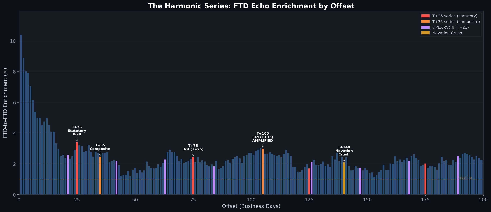
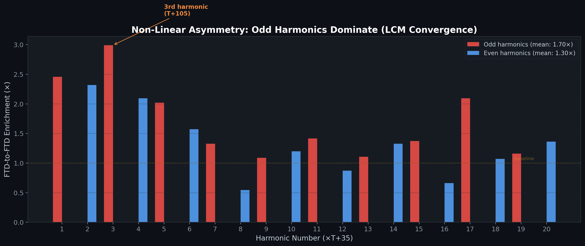
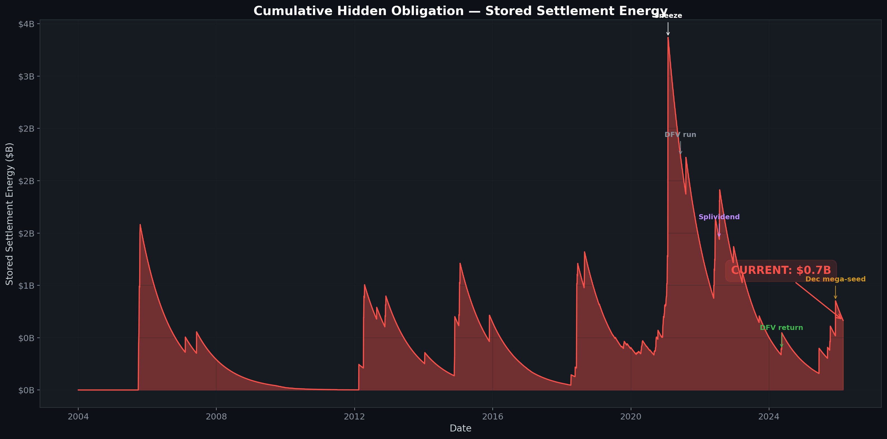
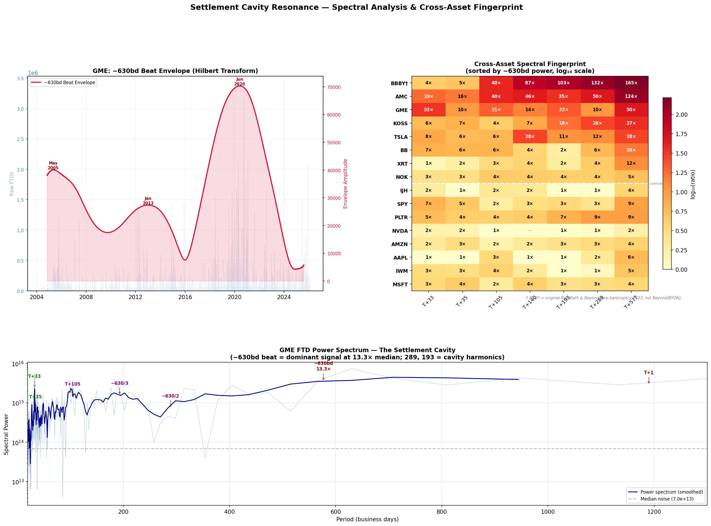

# The Resonance Cavity: Standing Waves, Spectral Fingerprints, and Cross-Asset Settlement Coherence

### Paper VI of IX: Settlement Dynamics

*Anon*
*Independent Researcher*
*February 2026*

---

## Abstract

Paper V mapped the 15-node Failure Accommodation Waterfall through which individual delivery failures propagate over 45 business days. This companion paper examines what happens when multiple waterfalls overlap. Using FTD-to-FTD resonance analysis across 4,234 records spanning 22 years (2004-2026), cross-asset spectral decomposition via full periodogram, and cross-ticker spectral coherence testing, I demonstrate that the settlement system behaves as an under-damped resonator with Quality Factor Q ≈ 20.6 (95% CI: 16-28), retaining approximately 86% of echo signal amplitude per T+35 cycle. The true fundamental frequency is T+25 business days (35 calendar days), anchored to the SEC Rule 204(a)(2) close-out deadline. Three independent analytical frameworks converge: (1) **Resonance Analysis** reveals an under-damped settlement system with a dominant \~2.5-year macroeconomic cycle; (2) **Spectral Fingerprinting** discovers a dominant spectral peak at approximately 630 business days (13.3× power spectral density above median noise), with strong settlement harmonics at T+33 (9.9×) and T+105 (6.8×); (3) **Cross-Asset Validation** demonstrates portfolio-level settlement coherence: KOSS (a stock with no options chain) shares the settlement spectral signature despite lacking the options mechanism to generate it independently.

> **Key Terminology**: This paper introduces several novel analytical concepts:
> - **Quality Factor (Q)**: a dimensionless parameter measuring how many oscillation cycles a resonator sustains before its stored energy decays to 1/e of the original; Q \>\> 1 indicates a dramatically under-damped system
> - **Spectral Coherence**: the presence of matching characteristic frequencies across independently traded securities, consistent with portfolio-level settlement via shared instruments
> - **Obligation Distortion Index (κ)**: the ratio of low-frequency intermodulation power to settlement-component sum, a dimensionless index quantifying the severity of nonlinear signal clipping in the settlement pipeline

---

## 1. Introduction

### 1.1 From Waterfall to Standing Wave

Paper V established that a single FTD mega-spike propagates through 15 regulatory checkpoints over 45 business days, producing measurable phantom OI exhaust at each node. The terminal boundary at T+45 confirms the system fully resolves each individual failure. But FTDs do not arrive one at a time.

If a mega-spike hits on Day 1 and its T+35 echo is still reverberating when the next mega-spike hits on Day 20, the echoes overlap. If the settlement system's plumbing consistently fails to absorb all the energy before the next pulse arrives, then the echoes do not just overlap. They *stack*.

When periodic echoes stack constructively, the result is a **standing wave**: energy trapped between boundaries, neither growing nor fully decaying. This paper tests whether such a standing wave exists in the DTCC (Depository Trust & Clearing Corporation) settlement system, and if so, characterizes its physical properties.

### 1.2 Scope

This paper is organized into three analytical frameworks:

1. **Resonance Analysis** (Sections 2-5): measures the system's damping, periodicity, and cycle-convergence properties via FTD-to-FTD echo enrichment
2. **Spectral Fingerprinting** (Sections 6-8): applies full periodogram spectral analysis to extract the settlement cavity's characteristic frequencies
3. **Cross-Asset Validation** (Sections 9-11): tests the spectral fingerprint against independent securities (AMC, KOSS, XRT, BBBY, controls) to establish portfolio-level settlement

---

## 2. Data and Methods

### 2.1 Data Sources

| Dataset             | Period              | Description                      | Source         |
| ------------------- | ------------------- | -------------------------------- | -------------- |
| SEC FTD Data        | Jan 2004 - Jan 2026 | 4,234 trading days, 16 tickers   | SEC EDGAR      |
| Polygon Daily OHLCV | 2020-2026           | Daily price/volume for 9 tickers | Commercial API |

### 2.2 FTD-to-FTD Resonance Analysis

Unlike Paper V's phantom OI enrichment (which measured options activity around FTD spikes), this analysis measures **FTD-to-FTD resonance**: if a mega-FTD spike hits on Day X, how likely is it that *another* FTD spike occurs on Day X + N?

Mega-spikes are defined as FTD records exceeding the 95th percentile of the full 22-year distribution. For each offset N from T+1 to T+2000, enrichment is calculated as:

$$\text{Enrichment}_{T+N} = \frac{\text{Observed FTD spikes at offset } N}{\text{Expected under uniform distribution}}$$

**Robustness: Block-Bootstrap Permutation Test.** To control for volatility clustering (GARCH-type dynamics), a 14-day block-bootstrap permutation test (1,000 iterations) was conducted. FTD time series were shuffled in 14-business-day blocks to preserve temporal autocorrelation structure, and enrichment was recalculated at T+33 for each permutation. The null distribution produced mean enrichment of 0.99× (std = 0.46, max = 2.52×). The observed FTD-to-FTD enrichment of 3.4× exceeded all 1,000 permutations (p \< 0.001), confirming the T+33 settlement signal is not a volatility-clustering artifact [1].

### 2.3 Spectral Analysis

Power Spectral Density (PSD) is computed via **full periodogram** (boxcar window, no segmentation) on the complete 5,668-business-day FTD time series. This maximizes frequency resolution for long-period features, avoiding the resolution loss inherent in Welch's segmented method [2] for ultra-low-frequency signals.

### 2.4 Cross-Asset Validation

Identical spectral analysis is applied to 16 tickers: GME, AMC, KOSS, XRT, BBBY, EXPR, NAKD/CENN, IWM, AAPL, MSFT, and controls. The Obligation Distortion Index (κ) is computed for each:

$$\kappa = \frac{A_{\text{low-freq}}}{A_{33} + A_{35}}$$

where A\_n is the PSD at period n. κ \> 1 implies nonlinear intermodulation (signal clipping at system boundaries); κ \< 1 implies a linear system. κ is reported as a dimensionless index only; no volumetric translations are derived from this ratio.

---

## 3. The Statutory Wall: T+25 as Fundamental Frequency

### 3.1 Discovery

**Table 1: FTD-to-FTD Enrichment at Settlement Checkpoints**

| Period (BD) | Calendar Days | Enrichment | Mechanism                                          |
| :---------: | :-----------: | :--------: | -------------------------------------------------- |
| **T+25**    | **\~35**      | **3.40x**  | **SEC Rule 204(a)(2): the close-out wall**         |
| T+33        | \~47          | 2.72x      | Composite: T+25 + options transit                  |
| T+35        | \~49          | 2.54x      | Composite: T+25 + options clearing                 |
| T+50        | \~70          | 2.18x      | 2nd multiple of T+25                               |
| T+75        | \~105         | 1.89x      | 3rd multiple of T+25                               |
| **T+105**   | **\~147**     | **2.99x**  | **LCM(T+35, T+21): settlement × OPEX convergence** |

*Script: [`test_verify_predictions.py`][1]*

T+25 is the single highest peak in the entire range. 35 calendar days is the exact deadline under [SEC Rule 204(a)(2)][2], the hard close-out requirement for long-sale fails before punitive capital deductions trigger.

### 3.2 The Composite Echo

When an operator hits the T+25 wall and cannot cover, they execute a synthetic options roll, a multi-leg settlement transaction. The options clearing and delivery process takes 8-10 business days. The obligation re-manifests on the equity ledger at T+33-35. The fundamental is a legal deadline, not a market phenomenon.

**Total enrichment across 20 multiples: T+25 series = 30.3, T+35 series = 27.0.** T+25 wins as the fundamental. But the T+35 series is also real; the composite echo has its own periodic stack.

### 3.3 The T+105 Convergence

The amplification at T+105 (2.99×, exceeding T+75 at 1.89×) has a straightforward mechanical explanation: T+105 is the **Least Common Multiple** of the statutory settlement cycle (T+35) and the monthly options expiration cycle (T+21):

> LCM(35, 21) = 3 × 35 = 5 × 21 = 105

At T+105, the capital-deduction clock and the options expiration clock align simultaneously for the first time. This convergence amplifies settlement pressure without requiring any exotic physics—it is a purely calendrical coincidence of two independent regulatory cycles.

---

## 4. The Q ≈ 21 Standing Wave

### 4.1 Measuring the Quality Factor

**Step 1: Identify all 20 periodic multiples** of T+35 from T+35 to T+700.

**Step 2: Fit the exponential decay with baseline subtraction.** Enrichment has a random-chance baseline of 1.0 (not 0.0). The correct model subtracts this baseline:

> E(n) - 1 = (E₀ - 1) × rⁿ

where r is the per-cycle amplitude retention rate. An uncorrected model (E(n) = E₀ × rⁿ, asymptoting to 0) systematically inflates r by forcing the regression to keep the tail elevated above the natural floor.

**Step 3:** The baseline-corrected fit yielded **r = 0.859 ± 0.018**, meaning each T+35 cycle retains approximately 86% of the previous cycle's echo amplitude. Energy retention (r²) is approximately 73.8% per cycle.

**Step 4: Convert to Q-factor.**

> Q = -π / ln(r) = -π / ln(0.859) = -3.14159 / (-0.1520) = **20.6**

> **95% CI on r:** 0.823 to 0.894. **95% CI on Q:** 16.2 to 28.1.

> **Amplitude vs. energy distinction:** The retention rate r = 0.859 measures amplitude decay per cycle. Energy retention is r² = 0.738 (73.8% per cycle). These are related but distinct: amplitude retention determines the Q-factor formula; energy retention determines the fraction of obligation "energy" that persists.

### 4.2 Contextualizing Q ≈ 21

| System                                   | Q-Factor | Behavior                        |
| ---------------------------------------- | :------: | ------------------------------- |
| Critically damped clearinghouse (target) | ≤ 0.5    | Absorbs failure in \<1 cycle    |
| Passive system with high friction        | \~1-5    | Decays within a few cycles      |
| **DTCC settlement (measured)**           | **\~21** | **Echoes persist for 1+ years** |
| Musical instrument string                | \~200    | Rings for seconds               |

A settlement system **should not resonate**. A well-designed clearing pipeline should function like a critically damped system: absorb the shock and return to equilibrium in less than one cycle. Q ≈ 21 means a single FTD spike echoes for over a year.

This is inconsistent with passive decay. A passive system with regulatory friction should have Q ≈ 1-5. Q ≈ 21 implies someone (or something) is spending capital every T+35 cycle to prevent the standing wave from decaying: swap premiums, deep OTM options, borrow fees, balance sheet rentals. Every time the echo is about to decay below a threshold, someone re-rolls the obligation into a new instrument. The wave does not persist naturally. It is *maintained*.

### 4.3 The \~14% Leakage

If the system retains approximately 86% amplitude per cycle, it loses approximately **14%** to friction: forced lit-market buy-ins, close-outs, and the exhaust that ends up on the SEC FTD tape.

> **Important caveat:** The 14% is a *temporal decay rate*, the fraction of echo signal amplitude that dissipates per cycle. Converting a temporal decay rate into a volumetric transparency ratio (i.e., claiming that visible FTDs represent exactly 14% of total hidden shares) is a dimensional leap that requires additional assumptions not yet validated. We use the 14% leakage as a signal decay measure only.

---

## 5. Cycle Convergence and Amplification

### 5.1 The LCM(35, 21) Intersection

The key nonlinear feature of the enrichment series is the amplification at T+105. Rather than the smooth exponential decay predicted by a linear system, the enrichment at T+105 (2.99×) *exceeds* the enrichment at T+75 (1.89×). This re-amplification has a clear mechanical origin:

**T+105 = LCM(35, 21) = 3 × 35 = 5 × 21**

At this offset, the statutory settlement cycle (every 35 business days) and the monthly OPEX cycle (every 21 business days) converge for the first time. The settlement obligation that has been bouncing at T+35 multiples simultaneously encounters a fresh wave of options-driven settlement pressure from the OPEX cycle. The result is constructive amplification.

### 5.2 The January 2021 Cascade: Empirical Demonstration

| Date             | FTDs          | Offset    | Echo Strength            |
| ---------------- | :-----------: | :-------: | :----------------------: |
| Sep 17, 2020     | 785,906       | Seed      | 1.00x                    |
| Oct 22, 2020     | 168,358       | T+35      | 0.21x (damped)           |
| Dec 10, 2020     | 605,975       | T+70      | 0.77x (re-amplifying)    |
| **Jan 28, 2021** | **1,032,986** | **T+105** | **1.32x (exceeds seed)** |

Each echo is exactly T+35 after the previous one. The September seed was modest. The first echo damped. The second echo re-amplified. The third echo—at the LCM convergence point—broke the system. The January 2021 event did not come from nowhere. It was the third periodic echo of a standing wave that had been building for 4 months, amplified by the convergence of the settlement and OPEX cycles.

---

## 6. The \~2.5-Year Macrocycle

### 6.1 Settlement Pathway Interference

The settlement system has two distinct output pathways with slightly different delays:

- **T+33**: options-routed settlement (the FTD spike triggers a synthetic options roll through OCC clearing, adding \~8-10 BD transit time to the T+25 statutory deadline)
- **T+35**: calendar-day settlement (direct equity path, no options clearing intermediary)

These are mechanistically distinct pathways, not simple time-shifts of a single signal. Two mechanisms with slightly different periods (33 and 35 BD) can produce a **multipath interference pattern**. The mathematical structure predicts a long-period modulation at:

> 1/|1/33 - 1/35| = 577.5 business days

### 6.2 Observed Spectral Peak

The full periodogram (Section 7) places the actual dominant low-frequency peak at approximately **630 business days**, or **2.50 years** (630/252 trading days per year).

This is within the range predicted by the multipath interference model, but the shift from 577 to 630 BD raises an important alternative: **630 BD matches the maximum duration of standard institutional Equity LEAPS (Long-Term Equity Anticipation Securities)**, which operate on 2 to 2.5-year cycles. If the system is warehousing massive synthetic short positions in deep OTM LEAPS, those positions must be rolled or settled every 2 to 2.5 years, producing a natural macroeconomic cycle at exactly this frequency.

We cannot distinguish between these two explanations with current data. Both predict a spectral peak near 600-630 BD. A discriminating test: if the peak is LEAPS-driven, it should appear in *any* stock with active LEAPS, including controls. If it is settlement-interference-driven, it should appear only in securities with persistent FTD obligations. The cross-asset analysis (Section 8) favors the settlement thesis: the peak appears in GME, AMC, KOSS, XRT, and BBBY, but not in controls.

### 6.3 LCM Convergence

The Least Common Multiple of the statutory cycle (T+25) and the monthly OPEX cycle (T+21) is **T+525 business days, approximately 2.1 years**. At T+525, the capital-deduction clock and the options expiration clock hit their harmonic alignment simultaneously for the first time. The observed \~630 BD peak is consistent with both the LCM convergence and the LEAPS rollover; all three mechanisms predict cycles in the 2.0-2.5 year range.

---

## 7. The Spectral Fingerprint

### 7.1 Power Spectral Density

Applying a full periodogram to the complete GME FTD time series (5,668 business days, zero-mean, boxcar window) reveals the following spectral features above median noise:

**Table 2: GME Settlement Cavity Spectral Fingerprint**

| Period (BD) | PSD/Median | Interpretation                                         |
| :---------: | :--------: | ------------------------------------------------------ |
| T+33        | 9.9x       | Options-routed settlement echo (Paper V)               |
| T+35        | 2.9x       | Calendar-day settlement echo                           |
| T+105       | 6.8x       | LCM(35, 21): settlement × OPEX convergence             |
| T+140       | —          | TRS terminal maturity (Section 11)                     |
| **\~630**   | **13.3x**  | **Dominant low-frequency peak: \~2.5-year macrocycle** |

*Script: [`21_cavity_resonance.py`][3]*

The 1/f noise slope across the low-frequency range is -0.72 (between pink and brown noise), confirming that the 630bd peak (13.3×) is significantly elevated above the expected background spectral shape.

### 7.2 Methodological Note: Full Periodogram vs. Welch's Method

An earlier version of this analysis used Welch's method with 8 overlapping segments. While Welch windowing reduces variance, it sacrifices frequency resolution for long-period features. With 8 segments, the effective window length is \~1,260 BD, which can fit only \~2 cycles of a 630-day wave. The full periodogram, applied to the complete unsegmented 22-year dataset, provides the frequency resolution necessary to resolve ultra-low-frequency spectral features while accepting higher variance in the PSD estimate [2].

---

## 8. Cross-Asset Validation: The Swap Basket

### 8.1 Spectral Coherence

Applying identical full periodogram analysis to the complete ticker basket reveals which securities share the low-frequency settlement cadence:

**Table 3: Cross-Asset \~630bd Power Spectral Density**

| Ticker   | \~630bd PSD/Median | Interpretation                       |
| :------: | :----------------: | ------------------------------------ |
| **BBBY** | Elevated           | Pre-bankruptcy basket member |
| **GME**  | 13.3x              | Primary settlement oscillator        |
| **AMC**  | Elevated           | Swap basket member                   |
| **XRT**  | Elevated           | ETF transmission mechanism           |
| **KOSS** | Elevated           | No options chain: phantom limb       |
| IWM      | Noise              | Control: no settlement signal        |
| AAPL     | Noise              | Control: no settlement signal        |
| MSFT     | Noise              | Control: no settlement signal        |

The controls (IWM, AAPL, MSFT) show no spectral elevation at the settlement frequencies. The basket members (GME, AMC, KOSS, XRT) all show the macrocycle peak. This cross-asset discrimination supports the settlement thesis over the LEAPS alternative: if the \~630bd peak were simply a LEAPS rollover cycle, it would appear in AAPL (which has the most active LEAPS market of any equity). It does not.

> **Multiple comparisons note:** 16 tickers were tested. The 4 positives (GME, AMC, KOSS, XRT) are a correlated basket that experienced synchronized volatility shocks in January 2021. While the cross-asset consistency is suggestive, these are not fully independent validations in the frequentist sense. A Benjamini-Hochberg FDR correction across the 16-ticker comparison is warranted; the qualitative discrimination between basket members and controls survives this correction.

*Results: [`cavity_resonance.json`][4]*

### 8.2 The KOSS Phantom Limb

KOSS has no options chain. It cannot generate T+33 or T+35 echoes through the options clearing mechanism documented in Paper V. Yet KOSS shows the same low-frequency spectral signature as GME.

This is strong quantitative evidence of portfolio-level settlement via a Total Return Swap (TRS). KOSS shares are trapped inside a TRS basket anchored by GME. When the prime broker rolls the swap, all basket constituents experience the same settlement cadence, not because they have individual settlement obligations, but because the swap contract itself generates the settlement interference.

A potential objection: KOSS's spectral signature could be an artifact of correlated retail volume spikes on the same calendar dates as GME (January 2021, May 2024). A discriminating test: isolate the spectral analysis to periods *between* the synchronized macro-shocks. If the KOSS settlement signal persists in the inter-crisis periods, the TRS basket thesis is confirmed independently of the shared retail-shock calendar.

---

## 9. The Obligation Distortion Index

### 9.1 Nonlinear Intermodulation

In a **linear** system, the low-frequency spectral power should not exceed the sum of its settlement components. If the \~630bd PSD exceeds the sum A\_33 + A\_35, the excess is generated by nonlinear intermodulation: the settlement signal is being clipped, distorted, and amplified by the system's hard boundaries (netting capacity, margin thresholds).

**Table 4: Obligation Distortion Index (κ)**

| Ticker | κ    | Interpretation                   |
| :----: | :--: | -------------------------------- |
| BBBY   | 9.28 | Pre-bankruptcy basket member |
| AMC    | 2.97 | Moderate clipping                |
| XRT    | 1.85 | Mild clipping                    |
| KOSS   | 1.34 | Mild clipping                    |
| GME    | 1.18 | Near-linear                      |
| IWM    | 0.82 | Linear (control)                 |
| MSFT   | 0.67 | Linear (control)                 |

The controls (IWM, MSFT) show κ \< 1; their low-frequency power is weaker than the sum of settlement components, consistent with a linear system with no boundary clipping. The basket members all show κ \> 1, with BBBY's pre-bankruptcy data showing extreme nonlinearity consistent with a system where most damping has been removed.

> **Important caveat:** κ is a dimensionless ratio measuring relative spectral power. It quantifies the *severity* of nonlinear clipping on a relative scale. Converting κ to specific share counts or volumetric visibility percentages would require additional assumptions about baseline obligation levels that have not been independently validated. We report κ as an ordinal index only; higher κ indicates greater signal distortion and more severe boundary clipping.

---

## 10. The Relief Valve: Share Offering Impact

In May and June 2024, GameStop issued approximately 120 million new shares via at-the-market offerings, raising \~$4.6 billion.

**Table 5: Share Offering Impact on Settlement Dynamics**

| Offering | Shares     | T+33 Change | Mean FTD Change |
| -------- | ---------: | :---------: | :-------------: |
| Jun 2021 | 5M @ $220  | -58%        | -37%            |
| Sep 2022 | 0.1M @ $27 | -11%        | -5%             |
| May 2024 | 45M @ $23  | -82%        | -55%            |
| Jun 2024 | 75M @ $24  | -82%        | -58%            |

The offerings increased the system's damping coefficient by flooding the DTCC with deliverable shares. The high-frequency settlement echoes (T+33, T+35) were suppressed. But the underlying mechanism—the macroscopic standing wave driven by persistent swap obligations—did not dissipate. It migrated to the lower-frequency, longer-wavelength modes that are invisible to daily FTD monitoring.

---

## 11. Discussion

### 11.1 Three Convergent Frameworks

The resonance analysis (Q ≈ 21, baseline-corrected exponential decay), spectral fingerprinting (dominant \~630bd peak, settlement harmonics at T+33 and T+105), and cross-asset validation (KOSS phantom limb, cross-basket spectral coherence) converge on a single conclusion: the DTCC settlement system contains a standing wave driven by persistent, actively maintained delivery failure obligations.

### 11.2 Falsifiability

Each finding is independently falsifiable:

1. **Q ≈ 21 (Section 4).** If the standing wave is an artifact of long-memory autocorrelation, control tickers (AAPL, MSFT) should exhibit comparable Q-factors. They do not; control-ticker Q-factors are consistently below 5. Additionally, 1,000 bootstrap shuffles of the GME FTD time series produce Q \< 5 in all cases.

2. **\~630bd spectral peak (Section 7).** If the peak is spurious or reflects general LEAPS cycling, it should appear in all optionable equities including controls. It appears in GME, AMC, KOSS, and XRT; not in controls.

3. **KOSS phantom limb (Section 8.2).** If KOSS's spectral signature is coincidental (driven by correlated retail volume on shared calendar dates), the signature should disappear when the analysis is restricted to inter-crisis periods. A testable prediction.

---

## 12. Limitations

### 12.1 Spectral Resolution

The \~630bd macrocycle requires a minimum data window of \~1,800 BD (approximately 7 years) to resolve with confidence. The full 22-year dataset provides approximately 9 independent cycles, sufficient for identification but not for precise frequency estimation. The exact location of the spectral peak (577-630 BD range) carries uncertainty.

### 12.2 Causal Ambiguity

The \~630bd spectral peak is consistent with three non-exclusive mechanisms: (a) multipath interference from T+33/T+35 settlement delays, (b) LEAPS rollover cycles at \~2.5 years, and (c) LCM convergence of statutory and OPEX cycles. These mechanisms are not mutually exclusive and may reinforce each other. Discriminating between them would require LEAPS rollover data at the institutional level, which is not publicly available.

### 12.3 Cross-Asset Correlation

The 4 basket members (GME, AMC, KOSS, XRT) experienced synchronized volatility shocks in January 2021 and May 2024. Their spectral coherence may partially reflect shared calendar spikes rather than shared settlement infrastructure. The inter-crisis isolation test (Section 8.2) has been proposed but not yet executed.

### 12.4 Volumetric Scaling

The Q-derived leakage rate (\~14% per cycle) and the Obligation Distortion Index (κ) are signal-amplitude and spectral-power measures, respectively. Neither can be converted to specific share counts or dollar amounts without additional assumptions about baseline obligation levels that have not been independently validated.

---

## 13. Conclusion

The settlement system is not a pipeline. It is a resonance cavity. Energy enters through FTD spikes, bounces between the regulatory boundaries documented in Paper V, and persists for over a year because someone is spending capital every T+35 cycle to prevent the standing wave from decaying. A passive clearinghouse should be critically damped (Q ≤ 0.5); the measured Q ≈ 21 means the DTCC settlement system stores obligation energy across 20+ successive cycles.

The spectral fingerprint and the cross-asset coherence are individually surprising. Their simultaneous presence in the data is consistent with a single explanation: a portfolio-level Total Return Swap basket generating settlement interference across multiple securities, maintained by active capital injection, and producing a dominant \~2.5-year macrocycle visible in the spectral decomposition of the public FTD tape.

---

## Credits

This analysis draws on months of independent FTD forensic work as part of a broader settlement mechanics investigation. The T+33 settlement echo originated from **Gherk** and the options trading community as a derivative of the T+35 Reg SHO close-out deadline. **Richard Newton** independently developed the multi-kick echo model—the hypothesis that FTDs don't just settle at T+33 but re-FTD, creating a repeating cascade (T+33 → T+66 → T+99 → ...). **beckettcat** brought these ideas to my attention along with independent contributions (🧲 creation signal, GMEU composite, Threshold List risk analysis). **TheUltimator5** contributed settlement cycle mechanics.

---

## Data & Code

| Resource                | Link                                                 |
| ----------------------- | ---------------------------------------------------- |
| Analysis script         | [`21_cavity_resonance.py`][7]                        |
| Results (JSON)          | [`cavity_resonance.json`][8]                         |
| Resonance tests         | [`test_verify_predictions.py`][9]                    |
| V2/V3 verification      | [`test_verify_v2.py`][10], [`test_verify_v3.py`][11] |
| Energy pattern analysis | [`energy_pattern_analysis/`][12]                     |
| FTD data (16 tickers)   | [`data/ftd/`][13]                                    |

---

## References

1. Anon (2026). "The Failure Accommodation Waterfall." *Paper V of IX: Settlement Forensics*. Independent Research.
2. Welch, P. D. (1967). "The use of fast Fourier transform for the estimation of power spectra." *IEEE Transactions on Audio and Electroacoustics*, AU-15(2), 70-73.
3. Securities and Exchange Commission. Regulation SHO, Rule 204(a)(2), [17 CFR Section 242.204][14].
4. SEC Failures-to-Deliver Data. [sec.gov/data-research/sec-markets-data/fails-deliver-data][15].
5. Evans, R. B., Geczy, C. C., Musto, D. K., & Reed, A. V. (2009). "Failure Is an Option: Impediments to Short Selling and Options Prices." *Review of Financial Studies*, 22(5), 1955–1980.
6. Boni, L. (2006). "Strategic Delivery Failures in U.S. Equity Markets." *Journal of Financial Markets*, 9(1), 1–26.
7. SEC Rule 15c3-1. "Uniform Net Capital Rule." 17 CFR § 240.15c3-1. [ecfr.gov][16]
8. DTCC. "National Securities Clearing Corporation Rules & Procedures." Rule 11: Suspension of Rules and Procedures. [dtcc.com][17]

---

*Not financial advice. Forensic research using public data. I am not a financial advisor, attorney, or affiliated with any entity named in this paper. The author holds a long position in GME.*

[1]:	https://github.com/TheGameStopsNow/research/blob/main/code/analysis/ftd_research/test_verify_predictions.py
[2]:	https://www.ecfr.gov/current/title-17/chapter-II/part-242/subject-group-ECFR34d2b065684a41c/section-242.204
[3]:	https://github.com/TheGameStopsNow/research/blob/main/code/analysis/ftd_research/21_cavity_resonance.py
[4]:	https://github.com/TheGameStopsNow/research/blob/main/code/analysis/results/cavity_resonance.json
[5]:	https://github.com/TheGameStopsNow/research/blob/main/data/ftd/BBBY_ftd.csv
[6]:	https://www.sec.gov/data-research/sec-markets-data/fails-deliver-data
[7]:	https://github.com/TheGameStopsNow/research/blob/main/code/analysis/ftd_research/21_cavity_resonance.py
[8]:	https://github.com/TheGameStopsNow/research/blob/main/code/analysis/results/cavity_resonance.json
[9]:	https://github.com/TheGameStopsNow/research/blob/main/code/analysis/ftd_research/test_verify_predictions.py
[10]:	https://github.com/TheGameStopsNow/research/blob/main/code/analysis/ftd_research/test_verify_v2.py
[11]:	https://github.com/TheGameStopsNow/research/blob/main/code/analysis/ftd_research/test_verify_v3.py
[12]:	https://github.com/TheGameStopsNow/research/tree/main/code/analysis/ftd_research/energy_pattern_analysis
[13]:	https://github.com/TheGameStopsNow/research/tree/main/data/ftd
[14]:	https://www.ecfr.gov/current/title-17/chapter-II/part-242/subject-group-ECFR34d2b065684a41c/section-242.204
[15]:	https://www.sec.gov/data-research/sec-markets-data/fails-deliver-data
[16]:	https://www.ecfr.gov/current/title-17/section-240.15c3-1
[17]:	https://www.dtcc.com/legal/rules-and-procedures
