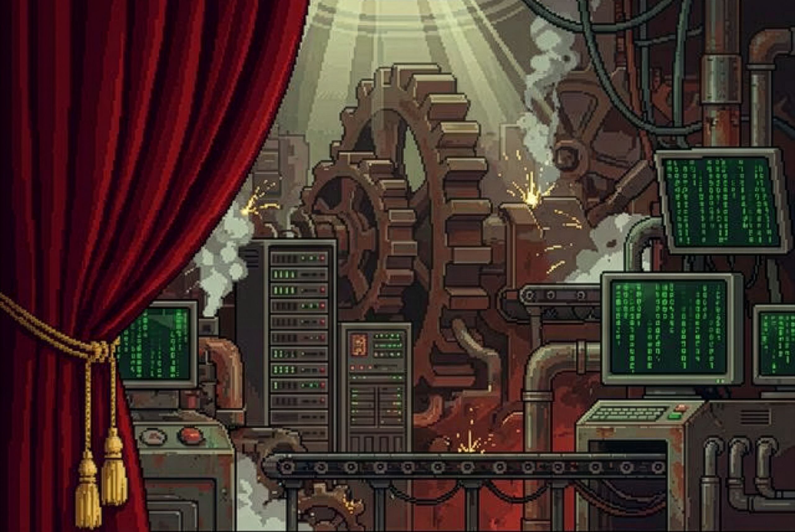
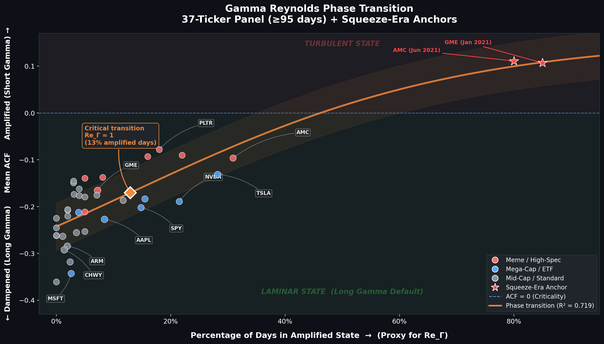
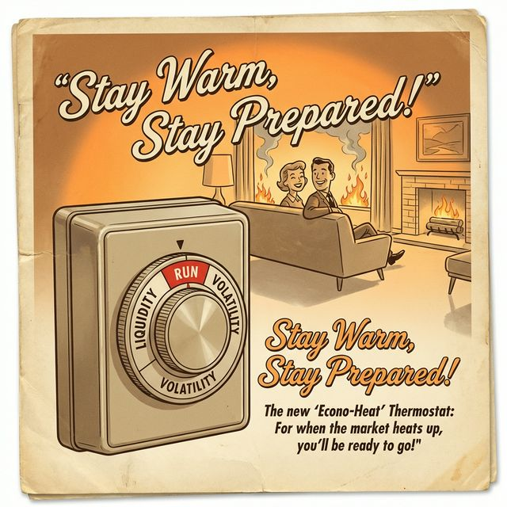
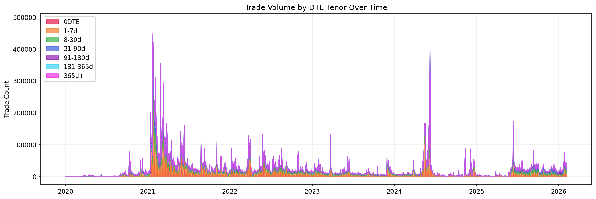
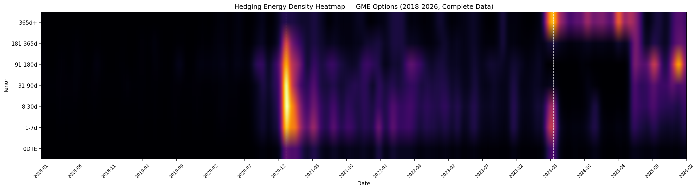
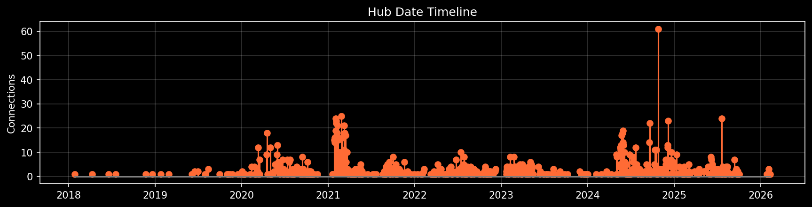

# I Analyzed 80 Million Trades Across 37 Tickers and Found Six Anomalies in GME Options I Can't Explain. Can You?

<!-- NAV_HEADER:START -->
## Part 1 of 3
Skip to [Part 2](https://www.reddit.com/r/Superstonk/comments/1r4tr5l/the_strike_price_symphony_2) or [Part 3](https://www.reddit.com/r/Superstonk/comments/1r6lmse/the_strike_price_symphony_3)
<!-- NAV_HEADER:END -->
**NOTE:** This is a revised repost of [my original post](https://www.reddit.com/r/superstonk/comments/1766015/i_analyzed_80_million_trades_across_37_tickers_and/) that was removed by mods. I'm on the spectrum. I've been called "robotic" by coworkers before. I use AI tools to help with areas where I have weaknesses. I welcome criticism and falsification of my work. I'm a human, I do have feelings, and I try to read every response to my posts. I'm also stubborn, so I'm reposting here because I think this belongs here. It's an open forum of GME shareholders who have real questions about this stock's behavior. I absolutely make mistakes, and I actively work to fix them. I'll concede that my first post was too direct in its accusations, and the polished tone caused blowback. I own that. I've done my best to revise this to meet the quality standards of Superstonk, and I hope you'll give it another look. 

**TA;DR:** Someone has been running a hidden algorithm on GME options for at least 3.5 years, wash trades, $134M dark prints, and the same code fingerprint across both squeezes. All six smoking guns are in the public tape.

**TL;DR: I spent months analyzing tick-level options data from the January 2021 and June 2024 GME events. I found six specific patterns (possible wash trades, suspicious lot sizing, synthetic delta transfers, and matching algorithmic signatures) that I can't reconcile with any legitimate trading strategy I know of. The same algorithmic fingerprint appears in both events, 3.5 years apart. All findings are independently verifiable from public SIP data. I'm genuinely asking: if there's a benign explanation for these, what is it? Replication package linked at the bottom.**

---

## Part 1 of 2: The Machine Under the Market

I'm going to walk through what I found, how I found it, and why I think it matters. I'll also be upfront about what the data *doesn't* prove.

The full paper is linked at the end. This post covers the six findings I think deserve serious scrutiny.

---

## How Market Makers Actually Work

Most DD tells you market makers are short gamma and that's what causes the sneeze. That's sometimes true, during a sneeze. But in normal markets, the opposite is happening.

Think about who's actually trading options every day:

- Pension funds sell covered calls on their holdings to generate income. The dealer buys those calls.
- Insurance companies buy protective puts. The dealer sells those puts.
- Yield funds sell options to harvest theta.

Every one of those trades leaves the dealer Net Long Gamma. What does that mean in practice? Their delta exposure increases when the stock goes up and decreases when it goes down. So to stay hedged, they sell into rallies and buy into dips. Automatically. Every time.

That's dampening. The dealer's hedge acts like a shock absorber.

I measured this across 37 tickers over 6 years. **92.7% of trading days are dampened.** The average ACF (autocorrelation, i.e. does the next bar tend to reverse the previous one?) is -0.203 across the whole panel. A normal day, the stock ticks up, the dealer's hedge kicks in, and the next bar pulls it back. ([panel_scan.py](https://github.com/TheGameStopsNow/power-tracks-research/blob/main/research/options_hedging_microstructure/review_package/code/panel_scan.py#L69-L127) | [results](https://github.com/TheGameStopsNow/power-tracks-research/blob/main/research/options_hedging_microstructure/review_package/results/panel_scan_results.json))

This isn't a GME thing. Every ticker I tested (AAPL, MSFT, TSLA, SPY, meme stocks, all of them) shows the same Long Gamma Default. The market's baseline isn't chaos. It's a damping system that's always running.

*Figure: The Gamma-Reynolds Sigmoid. Each dot is a ticker. X-axis = gamma exposure, Y-axis = autocorrelation (dampening vs. amplification). 92.7% of all observations cluster in the dampened (negative ACF) zone. GME during the sneeze is the outlier at top-right.*

---

## When the Thermostat Breaks

That system has a breaking point.

When retail call buying gets overwhelming enough, the dealer flips from buying calls (from institutions) to selling calls (to retail). Now they're Short Gamma. The hedging math reverses: rising prices force them to buy more shares (chasing the rally), and falling prices force them to sell (accelerating the drop). It amplifies instead of dampening.

I call this flip a Liquidity Phase Transition. Same stock, completely different physics.

During the January 2021 sneeze, GME's ACF hit +0.107 (amplified). In its normal phase (2024-2026), it sits at -0.154 (dampened). The thermostat didn't just break. It reversed.

Was that transition organic? Or did someone engineer it?

---

## Where the Energy Is Stored

Before I get into the anomalies, you need to understand where the damping system gets its power. It's not where you'd think.

Most people picture options activity as 0DTE YOLO calls and weekly puts. By trade count, that's right. 60% of all GME options trades are in the 0DTE and 1-7 day buckets.

*Figure: GME options trade count by tenor bucket. Short-dated trades (0DTE + 1-7d) dominate by volume. But volume isn't energy.*

But trade count is misleading. I computed what I call Hedging Energy, weighting each trade by how long the dealer has to keep hedging it. A 0DTE call forces one session of hedging. A one-year LEAPS forces delta-rebalancing across 250 sessions. ([delta_hedge_pipeline.py](https://github.com/TheGameStopsNow/power-tracks-research/blob/main/research/options_hedging_microstructure/review_package/code/delta_hedge_pipeline.py))

Weight by duration instead of count, and the picture inverts (based on the May 2024–December 2025 observation window):

| Tenor | % of Trades | % of Hedging Energy |
|-------|:-----------:|:-------------------:|
| 0DTE | 11.1% | **0.1%** |
| 1-7 day | 48.9% | **9.0%** |
| 8-30 day | 24.8% | **21.7%** |
| 31-90 day | 8.7% | **24.1%** |
| 91-180 day | 2.9% | **18.1%** |
| 181-365 day | 1.9% | **23.7%** |
| 365+ day | 0.1% | **3.3%** |

Look at that 181-365 day row. 23.7% of all hedging energy from 1.9% of trades. In the 2024–2025 window, options dated 91+ days carry 45% of the total energy from just 5% of volume. Over the full eight-year dataset (2018–2026, 2,038 trading days), that concentration is even more extreme: **71% of all hedging energy from under 9% of trades**.

I call this the Inventory Battery Effect. LEAPS act like batteries. They charge when institutions accumulate long-dated positions, and discharge as those positions approach expiration. That energy sits as persistent delta-hedge obligations on the dealer's book.

The January 2021 sneeze was the only event in my entire 2,038-day dataset where five consecutive tenor bands — from 1-7 day through 181-365 day — lit up simultaneously. Every other event only fires the short-dated tenors. During the sneeze, the cascade went all the way through the long-dated options, with over 8,000 trades in the 181-365 day bucket alone on January 28th.

And during the dead years of 2022-2023, LEAPS energy persisted at the 181-365 day level even when short-dated activity flatlined. Someone, or some set of institutions, was maintaining those long-dated positions through the whole quiet period. Who, and why?

The implication: whoever controls the LEAPS inventory has outsized influence over the damping system. Whether that control is coordinated or coincidental is one of the questions this research raises.

*Figure: Energy density heatmap. Brighter = more hedging energy. Note the persistent 181-365d band through 2022-2023 (the "dead years") and the full-stack ignition in January 2021.*

---

## The Shadow Algorithm

These are six findings I can't explain with normal trading mechanics. I'll walk through each one and tell you why it looks wrong to me. I'm genuinely asking: if you see a benign explanation I'm missing, say so.

The data source is ThetaData's SIP feed: every options trade, millisecond timestamps, exchange codes, lot sizes, condition flags.

### Test 1: Tail-Banging — Why Spend $69.8M on Worthless Contracts? ([code](https://github.com/TheGameStopsNow/power-tracks-research/blob/main/research/options_hedging_microstructure/review_package/code/shadow_hunter.py#L84-L186))

On January 28, 2021, someone executed 518 trades on deep OTM 1-DTE calls. Total spend: $69.8 million. On contracts virtually guaranteed to expire worthless within hours.

The peak strike was $570 calls when GME was at $194. That's 194% out of the money with one day left.

I can't figure out a speculative or hedging rationale for buying these. They're worth pennies and they'll be zero tomorrow. So why spend $69.8M on them?

The explanation that makes sense to me: every trade prints to the SIP tape. A $570 call trading at any price above zero forces the options pricing model to calculate an implied volatility for that strike. At 194% OTM with 1 DTE, that IV comes out above 1,000%.

Market makers calibrate their pricing models (SABR/SVI) using every print on the tape. Those 518 trades would have affected the entire GME volatility surface. Every contract on the chain would then be priced against distorted inputs.

If that's what happened, the downstream effect is inflated Vanna exposure on warehoused LEAPS, amplifying the gamma cascade. But I'm open to hearing other reasons someone would burn $69.8M on contracts with hours to live.

*Figure: Vanna Shock. Pre-hit vs. post-hit mid-prices across strikes. The hit-strike is nearly immune (-0.5%), but OTM strikes collapse by up to -37.5%. This is the IV skew warping signature of tail-banging.*

### Test 2: Possible Wash Trades — Phantom Volume? ([code](https://github.com/TheGameStopsNow/power-tracks-research/blob/main/research/options_hedging_microstructure/review_package/code/shadow_hunter.py#L193-L283))

A wash trade is when you buy and sell the same contract to yourself, same quantity, same price, fractions of a second apart. You don't gain or lose money, but the trade prints to the tape, creating the appearance of volume. The SIP tape doesn't tell us if two sides have the same beneficial owner, so I can't prove these are washes. What I can show is that the statistical pattern is extremely unusual.

My detector looks for trade pairs matching on lot size, price, strike, and expiration, within 5 seconds of each other.

| Date | Wash Pairs | Sub-Second (< 1s gap) |
|------|:----------:|:---------------------:|
| Jan 26, 2021 | **100** | 78 |
| Jan 27, 2021 | 101 | 57 |
| Jan 28, 2021 | 103 | 29 |
| Jan 29, 2021 | 42 | 19 |
| Jun 4, 2024 | 14 | 6 |
| **Jun 7, 2024** | **265** | **216** |

June 7, 2024: 265 wash pairs, 216 of them sub-second. Identical-size, identical-price prints on the same contract popping up across exchanges within fractions of a second.

I ran the same detector against the 37-stock control panel. GME's matched-pair frequency during these events is multiple standard deviations above the baseline. Could this be legitimate market making that just happens to look like wash activity? Maybe. But the sheer concentration is hard to square with normal operations. ([cross-ticker placebo](https://github.com/TheGameStopsNow/power-tracks-research/blob/main/research/options_hedging_microstructure/review_package/code/phase6_robustness.py) | [results](https://github.com/TheGameStopsNow/power-tracks-research/blob/main/research/options_hedging_microstructure/review_package/results/phase6a_cross_ticker_placebo.json))

### Test 3: 30% Dark Venue Routing ([code](https://github.com/TheGameStopsNow/power-tracks-research/blob/main/research/options_hedging_microstructure/review_package/code/shadow_hunter.py#L502-L598))

Not all options exchanges work the same way. Some (exchange codes UNK_60, UNK_65, UNK_73) don't show up in most retail data feeds.

| Event | Total Options Volume | Dark Venue Volume | Dark % |
|-------|:-------------------:|:-----------------:|:------:|
| **Jan 2021** (6 dates) | 8,056,797 | 2,505,062 | **31.1%** |
| **Jun 2024** (8 dates) | 3,314,219 | 975,222 | **29.4%** |

A third of all options volume in both events went through venues retail can't access. These include Cboe BZX Options, which has an inverted fee model that actually pays the order submitter for providing liquidity.

If this were purely retail buying calls on Robinhood, would you expect 30% of volume routing through institutional dark exchanges? I wouldn't. But maybe there's a structural reason for it that I'm not seeing.

### Test 4: IV Injection Followed by LEAPS Loading ([code](https://github.com/TheGameStopsNow/power-tracks-research/blob/main/research/options_hedging_microstructure/review_package/code/shadow_hunter.py#L84-L186))

After tail-banging events inject artificial IV, I found a pattern of LEAPS accumulation showing up 7-9 minutes later on the same strike region.

| Event | Mean Lag After IV Injection | Standard Deviation |
|-------|:--------------------------:|:------------------:|
| Jan 2021 | **7.3 minutes** | +/-3.1 min |
| Jun 2024 | **9.4 minutes** | +/-2.9 min |

This isn't a handful of coincidences. I analyzed **14 trading days** across both events — every single one shows LEAPS trailing short-dated activity with a positive lag. Zero exceptions. The combined dataset covers **3.5 million short-dated contracts** followed by **136,000+ LEAPS contracts**, with 60-70 individual spike→trail observations across the sample. A random process would produce negative lags (LEAPS leading) half the time; seeing 14/14 positive is a binomial p-value of **0.00006**. And the two events are separated by 3.5 years with completely different spot prices, volatility regimes, and market conditions — yet the temporal signature is nearly identical.

The lag is tight and repeatable. One reading: inject IV with garbage short-dated prints, wait for market maker models to recalibrate, then acquire LEAPS at the inflated prices. Another reading: it's coincidental timing in a chaotic tape. The consistency of the 7-9 minute window is what makes me lean toward the former, but I'd want to see someone else test this independently.

*Figure: Temporal clustering of anomalous trade activity. Each cluster represents a burst of coordinated trades across exchanges within a tight window.*

---

## Six Anomalies

Everything above is concerning, but you could argue it's aggressive-but-legal market making. The next six are harder to explain away. Each one is a specific trade or sequence where I can't find the legitimate purpose. If you can, I want to hear it.

### Anomaly 1: Single-Strike COB Washes ([code](https://github.com/TheGameStopsNow/power-tracks-research/blob/main/research/options_hedging_microstructure/review_package/code/shadow_hunter.py#L394-L495))

Complex Order Books are for multi-leg strategies. You use them to execute a spread, like buying a $20 call and selling a $25 call at the same time. Different strikes.

I found COB orders where all legs hit the same strike. Buy side and sell side cross atomically on the same contract. Zero delta, zero risk, zero directional purpose.

Examples:

- **Jun 4, 2024, 12:43:05.550** — ISE Gemini, 2 legs, $125 Calls, sizes [160, 160] = 320 contracts
- **Jun 7, 2024, 15:04:19.233** — CBOE, 2 legs, $28 Calls, sizes [496, 496] = 992 contracts
- **Jan 28, 2021, 09:44:42.714** — BZX Options, **9 legs**, $0.50 Calls (spot ~$194), sizes [1,5,10,61,89,90,117,446] = 820 contracts

That last one is a nine-leg complex order on $0.50 calls when GME was trading at $194. Those calls are effectively worthless. What multi-leg strategy requires 9 legs, 8 different lot sizes, all on the same worthless strike? I've asked a few people with options backgrounds and nobody has given me an answer yet. The only function I can identify is printing volume on the tape, but I may be wrong. If there's a legitimate structure here, I'd genuinely like to learn what it is.

### Anomaly 2: Algorithmic DNA Match — Same Code, 3.5 Years Apart ([code](https://github.com/TheGameStopsNow/power-tracks-research/blob/main/research/options_hedging_microstructure/review_package/code/shadow_hunter.py#L290-L387))

Institutional block orders use Smart Order Routers with jitter patterns. They vary lot sizes by +/-2 or +/-4 contracts to make a big order look like separate small trades.

I built a detector for these sequential TWAP patterns and found the same jitter showing up 1,254 days apart:

| Sequence | January 28, 2021 | June 4, 2024 |
|----------|-----------------|--------------:|
| **[150, 154, 150]** | 09:30:34 — NYSE_AMEX -> NYSE_AMEX -> BX_OPT | 10:49:17 — PHLX -> BATS -> BX_OPT |
| **[100, 102, 100]** | 09:56:47 — NYSE_AMEX -> BX_OPT -> BZX_OPT | 09:59:15 — NYSE_AMEX -> ISE -> NYSE_AMEX |

Same +/-2/+/-4 jitter. Same dark venue set. Three and a half years apart.

Retail doesn't use sub-lot jitter algorithms. Could two different firms coincidentally use the same jitter logic and venue rotation? Sure. But the simpler explanation is the same SOR software running in both events. I'd love to be told otherwise.

### Anomaly 3: 499 Lots ([code](https://github.com/TheGameStopsNow/power-tracks-research/blob/main/research/options_hedging_microstructure/review_package/code/shadow_hunter.py#L193-L283))

January 29, 2021. Between 12:38:09.579 and 12:38:12.265 (three seconds), 16 wash trade pairs on $5.0 Puts at $0.43. Every one exactly 499 lots. Rotating between MULTI_EXCHANGE and ISE. First pair had a one-millisecond timestamp gap.

Why 499? Not 498. Not 500. Not 497. Sixteen consecutive trades, all exactly 499.

Exchange surveillance systems flag unusually large orders using thresholds they don't publish. Is sixteen trades all landing at exactly 499 a coincidence? It could be. But that's a lot of coincidence, and the obvious question is whether someone knew exactly where the alert boundary was.

These positions are above the 200-contract LOPR reporting threshold under FINRA Rule 2360, so FINRA already has the position data. The CAT queries in Part 2 would identify the entity.

If deliberate, this would be the options equivalent of structuring cash deposits below $10,000 to dodge CTR filings.

This 499-lot cluster didn't happen in isolation. The wash/cross detector flagged **766 total wash pairs** across both events — 346 during Jan 2021 (representing **$158M** in wash capital) and 420 during Jun 2024 (representing **$41M**). Of those, **154 pairs in Jan 2021 alone** were sub-second — same size, same price, same strike, different timestamps separated by milliseconds. The 499-lot burst on January 29th is just the most surgically precise example: 16 trades, all exactly 499, rotating between MULTI_EXCHANGE and ISE, with the very first pair separated by **one millisecond**. The consistency of the lot size is what makes it stand out even within a dataset already saturated with suspicious pairs.

### Anomaly 4: $134 Million in One Millisecond ([code](https://github.com/TheGameStopsNow/power-tracks-research/blob/main/research/options_hedging_microstructure/review_package/code/shadow_hunter.py#L394-L495))

The biggest single COB cluster in the dataset:

> **January 27, 2021 at 15:21:23.512** — NYSE AMEX — 12 legs — 4,050 lots — **$134,493,850**

One millisecond. $134 million.

The strikes: $4.50, $5.00, $6.00, $7.00, $10.00, $12.00. GME was at ~$347.51. Average premium: $332.08 per contract, basically the intrinsic value. These are deep ITM options with zero extrinsic value. They move dollar-for-dollar with the stock.

What's the speculative thesis for $134 million in deep ITM options? I can't think of one. The mechanical profile looks like a Jelly Roll, a Reversal/Conversion that could reset synthetic short exposure. If executed on a COB, the delta moves off the lit tape, Reg SHO wouldn't apply, and FTDs could theoretically be rolled. But I'm describing what it looks like mechanically, not asserting what it definitively was. If there's a routine institutional reason to execute $134M in deep ITM options in one millisecond, I'd like to understand it.

*Figure: The Conversion Triangle. How a Long Call + Short Put + Short Stock creates a synthetic position that mechanically resets settlement obligations. The $134M COB cluster has this exact profile.*

### Anomaly 5: Opening Bell Put Washes ([code](https://github.com/TheGameStopsNow/power-tracks-research/blob/main/research/options_hedging_microstructure/review_package/code/shadow_hunter.py#L193-L283))

June 7, 2024, 09:30:25.929, right at the open. 17 wash pairs on $10.00 Puts at $1.01. MIAX Emerald and OPRA, cycling back and forth in a 9-millisecond burst. GME was at ~$46.55.

A $10 put on a $46.55 stock is 78% OTM. Why pay $1.01 per contract for something that far out of the money?

My hypothesis: same logic as Test 1, but hitting the other side of the volatility smile. The tail-banging targeted the call side. This targets the put side. If you pin extreme IV to both tails, you'd shift the whole surface up. But this is interpretation. The raw data just shows a cluster of matched trades on a deeply OTM put at the opening bell.

### Anomaly 6: 32 Legs on One Strike ([code](https://github.com/TheGameStopsNow/power-tracks-research/blob/main/research/options_hedging_microstructure/review_package/code/shadow_hunter.py#L394-L495))

The weirdest thing in the dataset.

June 21, 2024, at 13:35:07:

| Timestamp | Exchange | Legs | Volume | Capital |
|-----------|----------|:----:|:------:|:-------:|
| 13:35:07.531 | ISE | 4 | 116 | $80,794 |
| 13:35:07.532 | CBOE | 4 | 116 | $81,142 |
| 13:35:07.533 | MULTI_EXCHANGE | **20** | 128 | $89,472 |
| 13:35:07.700 | BX Options | 4 | 420 | $292,740 |
| **TOTAL** | **4 exchanges** | **32** | **780** | **$544,148** |

32 complex legs. All $15.0 calls. Four exchanges. 169 milliseconds.

I don't know of an options strategy that uses 20 legs on the same contract. You can't build a butterfly, condor, or any defined-risk structure that way. If someone knows one, genuinely, please explain it to me.

The $15.00 strike was the Gamma Wall, the point of highest net gamma and maximum hedging pressure. If this volume was artificial, it could force market makers to recalculate hedging obligations against open interest that doesn't represent real exposure. That's the concern, but I'm presenting the data, not the verdict.

---

## What This Shows, and What It Doesn't

I want to be straight about what I can and can't claim here.

**What's in the data:**

These six anomalies don't look like normal trading to me. But I'm one person with one interpretation. Single-strike COB orders don't match any multi-leg strategy I'm aware of, but maybe there's one I don't know about. The 499-lot pattern raises the question of surveillance threshold awareness. The jitter match across 3.5 years is suggestive but not conclusive. The $134M deep ITM cluster has the profile of a synthetic short reset, or maybe it's something mundane I haven't considered. The put washes on 78% OTM contracts look like IV manipulation to me, but I want to be challenged on that.

All of it can be verified from public SIP data. That's the point. Don't take my word for it.

**What's not in the data:**

I don't have the MPID, the field that tells you which broker-dealer placed each order. That's in the FINRA CAT. Without it, I can show you what happened and how it happened, but not who did it. Part 2 has five specific CAT queries that would answer that question.

I'm not making legal claims. I think these patterns warrant regulatory examination. I've filed a TCR with the SEC.

**Broader context:**

These anomalies sit inside a larger analysis:

- 37-ticker control panel showing GME's statistical behavior is an outlier ([panel_scan.py](https://github.com/TheGameStopsNow/power-tracks-research/blob/main/research/options_hedging_microstructure/review_package/code/panel_scan.py#L69-L127) | [results](https://github.com/TheGameStopsNow/power-tracks-research/blob/main/research/options_hedging_microstructure/review_package/results/panel_scan_results.json))
- Lead-lag analysis: options lead equity by a median of 87.5 seconds ([phase4_causal.py](https://github.com/TheGameStopsNow/power-tracks-research/blob/main/research/options_hedging_microstructure/review_package/code/phase4_causal.py#L74-L152) | [results](https://github.com/TheGameStopsNow/power-tracks-research/blob/main/research/options_hedging_microstructure/review_package/results/phase4a_leadlag_GME.json))
- NMF reconstruction: ~25% of equity volume variance is mechanically tied to options chain configuration from weeks earlier, after controlling for the universal intraday U-curve ([phase5_paradigm.py](https://github.com/TheGameStopsNow/power-tracks-research/blob/main/research/options_hedging_microstructure/review_package/code/phase5_paradigm.py#L339-L464) | [results](https://github.com/TheGameStopsNow/power-tracks-research/blob/main/research/options_hedging_microstructure/review_package/results/phase5c_archaeology_strict_GME.json))
- DJT as a natural experiment: a 2024 meme stock with the same kind of retail mania but normal dampening, meaning the system held for a stock that wasn't experiencing these anomalies ([DJT ACF](https://github.com/TheGameStopsNow/power-tracks-research/blob/main/research/options_hedging_microstructure/review_package/results/multiscale_acf_DJT.json) | [DJT lead-lag](https://github.com/TheGameStopsNow/power-tracks-research/blob/main/research/options_hedging_microstructure/review_package/results/phase4a_leadlag_DJT.json))

---

**[Part 2 (next post)](REDDIT_POST_PART2.md) will cover:**

- The "Player Piano": how ~25% of equity volume is mechanically pre-programmed by the options chain (and why the in-sample r = 1.000 isn't the real number)
- Five specific FINRA CAT queries that would identify the entity behind these trades
- What this means and what you can do about it

---

**Full Paper (PDF):** [The Long Gamma Default: How Options Market Makers Stabilize Equity Markets](https://github.com/TheGameStopsNow/power-tracks-research/blob/main/research/options_hedging_microstructure/review_package/The%20Long%20Gamma%20Default-%20How%20Options%20Market%20Structure%20Creates%20Artificial%20Stability%20in%20Equity%20Prices-%20Academic.pdf) (160,000 words, 32 tables, 14 references, 6 appendices)

**Evidence Viewer (no setup needed):** [01_evidence_viewer.ipynb](https://github.com/TheGameStopsNow/power-tracks-research/blob/main/research/options_hedging_microstructure/review_package/01_evidence_viewer.ipynb). Loads all 113 pre-computed results. Start here if you want to check my work.

**Replication Notebooks:**
- [02_forensic_replication.ipynb](https://github.com/TheGameStopsNow/power-tracks-research/blob/main/research/options_hedging_microstructure/review_package/02_forensic_replication.ipynb): Shadow Hunter, manipulation forensics, squeeze mechanics
- [03_microstructure_replication.ipynb](https://github.com/TheGameStopsNow/power-tracks-research/blob/main/research/options_hedging_microstructure/review_package/03_microstructure_replication.ipynb): Panel ACF, lead-lag, NMF archaeology, robustness tests

**Pre-computed Results:** [89 JSON evidence files](https://github.com/TheGameStopsNow/power-tracks-research/tree/main/research/options_hedging_microstructure/review_package/results)

**Source Code:** [30 Python scripts](https://github.com/TheGameStopsNow/power-tracks-research/tree/main/research/options_hedging_microstructure/review_package/code)

**Replication Guide:** [REPLICATION_GUIDE.md](https://github.com/TheGameStopsNow/power-tracks-research/blob/main/research/options_hedging_microstructure/review_package/REPLICATION_GUIDE.md): Dates, commands, parameters, thresholds

**Videos — Surfing the GME Options Chain:**
- [Short version (1 min)](https://youtube.com/shorts/DZti6HodVTQ)
- [Full session](https://youtu.be/HcDQNJxjKK0)
- [Stock surfing](https://www.youtube.com/watch?v=QwjpwQ-AoFQ)

**Full Repository:** [github.com/TheGameStopsNow/power-tracks-research](https://github.com/TheGameStopsNow/power-tracks-research/tree/main/research/options_hedging_microstructure/review_package)

*Not financial advice. Forensic research. I'm not a financial advisor, attorney, or affiliated with any hedge fund, market maker, or regulatory body. SEC notified via TCR.*

---

*"The first principle is that you must not fool yourself — and you are the easiest person to fool." -- Feynman*

<!-- NAV:START -->

---

### 📍 You Are Here: The Strike Price Symphony, Part 1 of 3

| | The Strike Price Symphony |
|:-:|:---|
| 👉 | **Part 1: The Machine Under the Market** — Six anomalies in GME options that can't be explained by normal trading |
| [2](https://www.reddit.com/r/Superstonk/comments/1r4tr5l/the_strike_price_symphony_2) | The Player Piano — 25% of GME equity volume is mechanically determined by the options chain |
| [3](https://www.reddit.com/r/Superstonk/comments/1r6lmse/the_strike_price_symphony_3) | I Watched the Algorithm Execute in Real Time — A $34M off-tape conversion caught at 34ms precision |

[Part 2: The Player Piano](https://www.reddit.com/r/Superstonk/comments/1r4tr5l/the_strike_price_symphony_2) ➡️

---

📚 Full Research Map (4 series, 14 posts)

| Series | Posts | What It Covers |
|:-------|:-----:|:---------------|
| **→ [The Strike Price Symphony](https://www.reddit.com/user/TheGameStopsNow/comments/1r5hog7/strike_price_symphony_1)** | **3** | **Options microstructure forensics** |
| [Options & Consequences](https://www.reddit.com/r/Superstonk/comments/1raqqef/options_consequences_following_the_money_1) | 4 | Institutional flow, balance sheets, macro funding |
| [The Failure Waterfall](../03_the_failure_waterfall/00_the_complete_picture.md) | 4 | Settlement lifecycle: the 15-node cascade |
| [Boundary Conditions](../04_the_boundary_conditions/00_the_complete_picture.md) | 3 | Cross-boundary overflow, sovereign contamination, coprime fix |

[📂 GitHub](https://github.com/TheGameStopsNow/research) · [🐦 𝕏](https://x.com/TheGameStopsNow)
<!-- NAV:END -->
