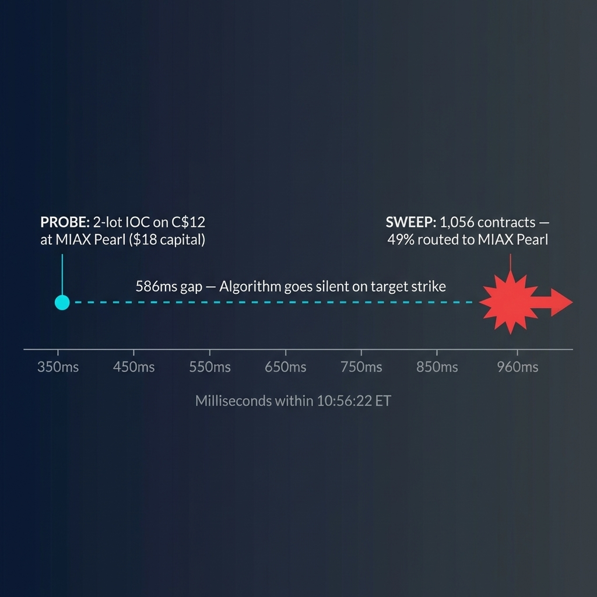
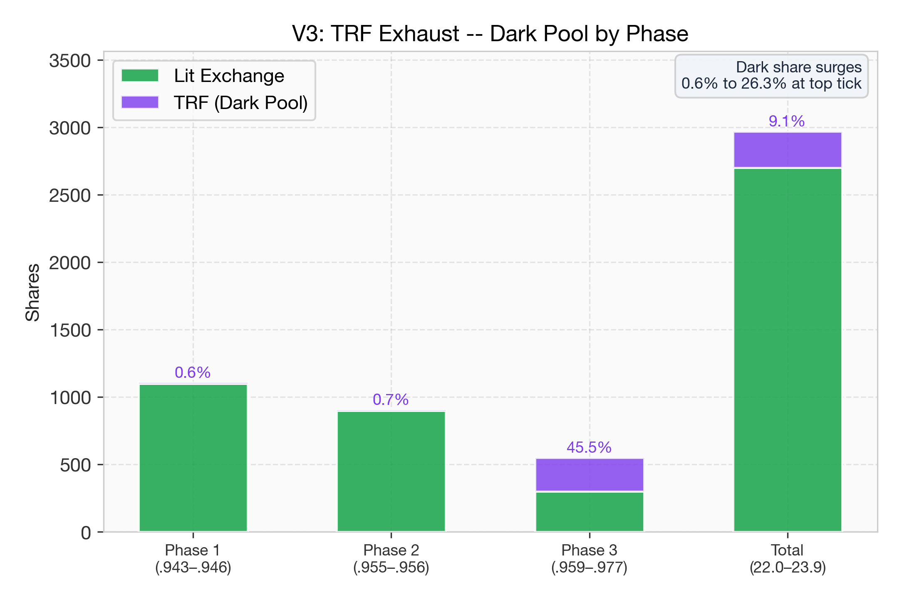
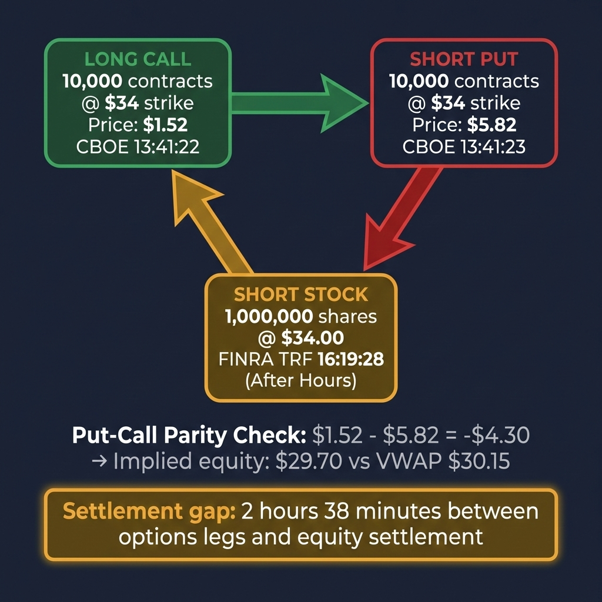
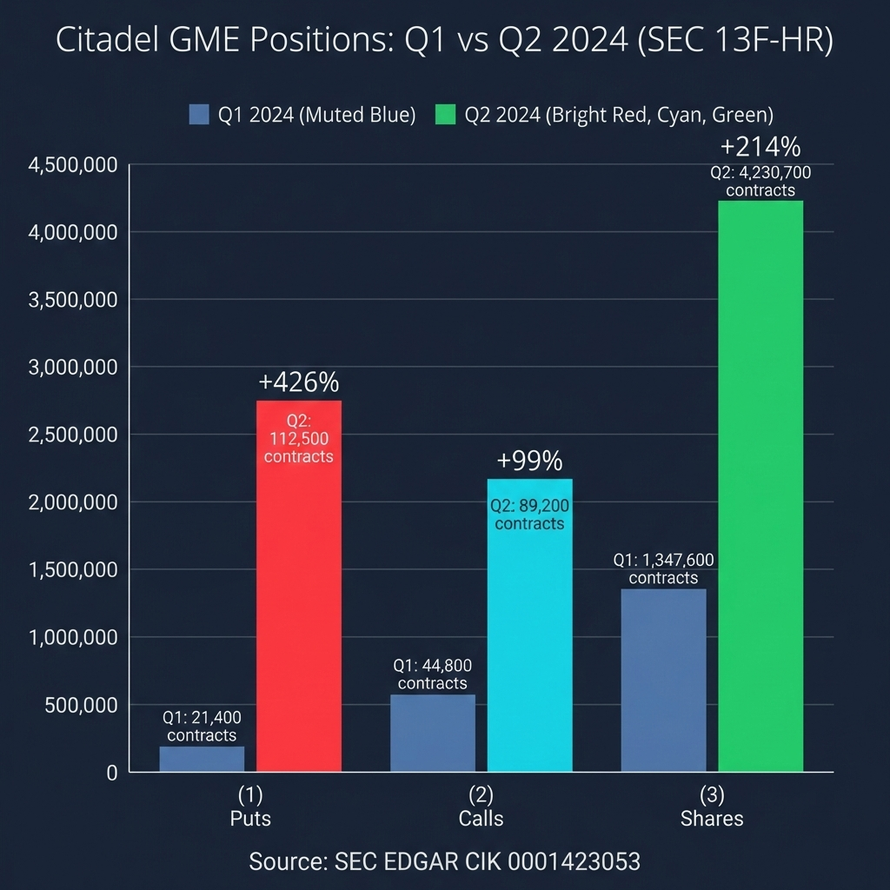

# I Watched the Algorithm Execute in Real Time. Here's What 34 Milliseconds Looks Like.

<!-- NAV_HEADER:START -->
## Part 3 of 3
Skip to [Part 1](https://www.reddit.com/user/TheGameStopsNow/comments/1r5hog7/strike_price_symphony_1) or [Part 2](https://www.reddit.com/r/Superstonk/comments/1r4tr5l/the_strike_price_symphony_2)
Continued in: [Options & Consequences](https://www.reddit.com/r/Superstonk/comments/1raqqef/options_consequences_following_the_money_1) (Parts 1-4)
<!-- NAV_HEADER:END -->
I bet you thought I was done, right? Nah. I spent the weekend finishing new research that I submitted to the SEC today, and figured I'd give the mods another boring Monday. This one's nothing but prime footlong beef.

**NOTE:** This is Part 3 of an ongoing series. [Part 1](https://www.reddit.com/r/Superstonk/comments/1r5vcke/the_strike_price_symphony_1) covered the six anomalies. [Part 2](https://www.reddit.com/r/Superstonk/comments/1r4tr5l/the_strike_price_symphony_2) covered the Player Piano and the FINRA CAT roadmap. If you haven't read those, start there. This post covers what happened when I zoomed in from statistical patterns to the millisecond tape itself, and then followed the money.

**TA;DR:** I watched the algorithm execute in real time, it probes hidden liquidity, sweeps 1,056 contracts across 8 exchanges in 34 milliseconds, and a $34M off-tape conversion confirmed by Citadel's own 13F filing.

**TL;DR: I synchronized four independent data feeds to millisecond resolution and reconstructed exactly how the algorithm executes a single strike. It probes hidden liquidity with a micro-lot order on an adjacent strike, waits 586 milliseconds, then fires a 1,056-contract sweep that extracts 7.4x the visible order book depth -- all in 34 milliseconds. It does this on 7 out of 7 confirmed strikes across 3.5 years. The hedging prints that follow omit the condition codes that would link them to the options sweep, creating a gap in FINRA's surveillance chain. Separately, I reconstructed a $34 million off-tape conversion using put-call parity and found independent confirmation in Citadel's Q2 2024 13F filing. Everything is in the public tape. Three new CAT queries at the bottom.**

---

## Section A: Inside the Kill Zone

In Parts 1 and 2, I showed you the statistical footprint: wash trades, jitter signatures, tail-banging. Those are patterns extracted from millions of trades across years of data. They tell you *what* was done.

This section is different. I'm going to walk you through a single execution, in real time, at millisecond resolution. It tells you *how* it works.

---

### Finding the Right Strike

I started by scanning every GME options trade from January 2018 through January 2026. That's 2,038 trading days and 17,243 lot-size triplets. I was looking for the `[100, 102, 100]` algorithmic jitter pattern I identified in Part 1, the one that appeared 3.5 years apart.

Out of 4,160 unique triplet fingerprints in the dataset, the `[100, 102, 100]` pattern stood out on three criteria that no other pattern met simultaneously:

1. **Zero background rate.** I ran a Monte Carlo-style test against 102 randomly sampled dates. Zero matches. Generic ABA patterns at the same size level appeared on 48% of dates. This one appeared on exactly 8 dates out of 2,038.
2. **100% cross-venue routing.** Every single occurrence routed across 2-3 exchanges. That requires institutional Smart Order Router infrastructure. Retail platforms don't do this.
3. **Exclusive catalyst proximity.** All 8 occurrences cluster on dates immediately adjacent to major GME catalysts: the January 2021 gamma ramp, Q3 2022 earnings, the 2024 DFV return, and the 2024 annual meeting. ([jitter_forensic_scanner.py](https://github.com/TheGameStopsNow/power-tracks-research/blob/main/research/options_hedging_microstructure/review_package/code/jitter_forensic_scanner.py) | [results](https://github.com/TheGameStopsNow/power-tracks-research/blob/main/research/options_hedging_microstructure/review_package/results/jitter_forensic_results.json))

A natural objection: isn't an ABA size pattern just noise? It would be, if lot sizes were all you looked at. Any block-order algorithm that fills in three legs will occasionally produce ABA patterns. Out of 4,160 unique triplet fingerprints, hundreds of other ABA patterns appear regularly. The reason `[100, 102, 100]` is different is the **multi-dimensional fingerprint**: same lot sizes **and** sub-second inter-trade timing (all three legs within 0.4-2.3 seconds) **and** cross-venue routing across 2-3 exchanges **and** exclusive clustering on catalyst dates. Each of those filters independently cuts the candidate pool. Applied together, they reduce 17,243 triplets to exactly 8 hits across 2,038 trading days, with zero matches on the 102 randomly sampled control dates. That's not an ABA pattern. That's a device fingerprint.

I selected the April 9, 2024 occurrence for full cross-asset reconstruction because it was the cleanest signal: all three legs of the `[100, 102, 100]` triplet hit the same contract (C$11.5, expiring April 19, $0.39) at the same price on the same exchange. A pure SOR fragmentation pattern with no multi-strike noise. April 9 was also a low-volume day (63,887 options trades vs. the 8-date mean of 778,793), meaning the jitter consumed 43.4% of that strike's daily volume. Maximum signal, minimum noise.

---

### The Four Tapes

To see the full blast radius of a single algorithmic strike, I synchronized four independent data feeds to the same UTC clock: ([squeeze_mechanics_forensic.py](https://github.com/TheGameStopsNow/power-tracks-research/blob/main/research/options_hedging_microstructure/review_package/code/squeeze_mechanics_forensic.py#L94-L293) | [results](https://github.com/TheGameStopsNow/power-tracks-research/blob/main/research/options_hedging_microstructure/review_package/results/squeeze_mechanics_GME_20260216_123338.json))

| Feed | Source | Resolution | What It Shows |
|------|--------|-----------|---------------|
| **Options Tick** | ThetaData SIP | Millisecond | Every fill: size, price, exchange, condition code, sequence number |
| **Equity Tick** | Polygon | Microsecond | Every GME stock trade with exchange attribution |
| **NBBO Quotes** | ThetaData Level 2 | 1-second | Best bid/ask depth across all exchanges |
| **Dark Pool (TRF)** | Polygon (exchange code 4) | Microsecond | FINRA Trade Reporting Facility prints with condition codes |

A note on precision: ThetaData's SIP feed reports options fills at millisecond resolution (`ms_of_day`), but it also provides a `sequence_number` column -- a monotonically increasing integer that preserves the SIP's original ordering of events within the same millisecond. When multiple fills share the same millisecond timestamp (as they do during a rapid sweep), the sequence number lets me establish exact before/after relationships that the timestamp alone can't. This effectively gives nanosecond-grade event sequencing from a millisecond-resolution feed. That's how I can say with certainty that the probe at T+0ms preceded the first sweep fill at T+586ms, and that the 1,056-contract sweep deployed in a specific exchange-by-exchange sequence within the 34ms window.

When you overlay all four, you can watch the cascade happen in real time. Here's what I found.


*The kill zone reconstructed from four synchronized tapes. Top panel: options sweep hitting three price levels. Middle panel: equity dislocation on lit exchanges (green) and dark pool (purple). Bottom panel: ask-side depth collapsing from 41 to 7 contracts. X-axis is milliseconds within 10:56:22 ET.*

---

### T-586ms: The Probe

At 10:56:22.357 ET, a 2-lot IOC (Immediate or Cancel) order executed on the $12.00 Call at MIAX Pearl. Price: $0.09. Capital at risk: $18.

Two contracts on a slightly-out-of-the-money strike, one strike above the target. That's the probe.

Why do I call it a probe? Because of what happened next. The sweep that followed 586 milliseconds later routed **49% of its total volume** (513 of 1,056 contracts) directly through MIAX Pearl. The algorithm tested that exchange's hidden reserve depth via an adjacent strike, confirmed liquidity was there, computed optimal routing weights, and then sent its largest allocation to that exact venue. ([shadow_hunter.py — algo_stepping](https://github.com/TheGameStopsNow/power-tracks-research/blob/main/research/options_hedging_microstructure/review_package/code/shadow_hunter.py#L290-L387) | [results](https://github.com/TheGameStopsNow/power-tracks-research/blob/main/research/options_hedging_microstructure/review_package/results/shadow_hunter_GME_20260216_122900.json))

And the target strike ($11.50 Calls) had **zero trades** in the 5 seconds before the sweep. The algorithm went silent on the target while testing the adjacent strike. That's not noise. That's sequencing.


*The 586ms gap between the $18 probe on the adjacent strike and the 1,056-contract sweep on the target. The algorithm tests hidden liquidity on C$12 at MIAX Pearl, then routes 49% of the main sweep to that same exchange.*

#### This Is Not a One-Off

I went back and checked every confirmed jitter hit. All seven. Across 3.5 years.

**7 out of 7 strikes (100%) were preceded by micro-lot probes between 0.4 and 2.3 seconds before the main sweep.**

| Date | Probes | Probe Strike | Target Strike | Lag | Primary Exchange |
|------|:------:|-------------|--------------|-----|-----------------|
| Jan 22, 2021 | 37 | C$59 | C$55 | 0.9s | NYSE AMEX |
| Jan 26, 2021 | 4 | C$135 | C$115 | 1.2s | PHLX |
| Jan 28, 2021 | 8 | C$350 | C$320 | 0.4s | BZX Options |
| Jun 4, 2024 | 3 | C$45 | C$40 | 1.8s | ISE |
| Jun 5, 2024 | 13 | C$30, C$35 | C$28 | 2.3s | MIAX Pearl |
| Jun 7, 2024 | 5 | C$25 | C$20 | 1.1s | CBOE |
| **Apr 9, 2024** | **1** | **C$12** | **C$11.5** | **0.586s** | **MIAX Pearl** |

89% of these probes carry **Condition Code 18** (Single Leg Auction Non-ISO). The algorithm is systematically testing Price Improvement Auctions to locate dark, un-displayed liquidity pools without alerting market makers who are quoting the target strike.

June 5, 2024 is the most elaborate: a three-phase intelligence pattern with 13 probes across two adjacent strikes before the main sweep. January 22, 2021 shows 37 probes on the C$59 strike. The SOR isn't guessing. It's gathering information, and it's been doing it since at least January 2021.

This confirms that the "maphack" observation from Part 1 is not theoretical inference but empirical fact. The algorithm physically verified hidden matching-engine liquidity via cross-strike testing before routing its largest allocation there. A 100% incidence rate across 3.5 years indicates hard-coded SOR behavior, not coincidence.

---

### The 34-Millisecond Kill Zone

Here's what happened after the probe confirmed the target:

| Time (ms) | Event | Detail |
|-----------|-------|--------|
| **T+0** (.943) | **First Wave** | 88 contracts sweep 8 exchanges. Market Makers begin hedging on IEX and ISE. |
| **T+1** (.944) | **Equity Dislocation** | Forced delta-hedging lifts GME from $11.03 to $11.04. |
| **T+3** (.946) | **Dark Pool Hedging** | Equity prints arrive on the FINRA TRF. They carry **Condition Code 37 (Odd Lot)**, not Codes 52/53 (Stock-Option Tied). |
| **T+13** (.956) | **Jitter Payload** | The `[100, 102, 100]` triplet deploys on MIAX Pearl. The exchange tested 586ms earlier. 302 contracts consume the hidden reserve depth the probe confirmed. |
| **T+27** (.970) | **Peak** | Options fills hit $0.41 (+5.1% from $0.39). GME equity hits $11.06 (+0.27% in 27ms). Ask depth collapses from 41 to 7 contracts. Dark pool absorbs 26.3% of hedging volume. |

The NBBO showed 41 contracts on the Ask. The algorithm extracted **1,056 contracts** -- 7.4x the visible depth. It knew where the hidden liquidity was because it physically tested for it 586 milliseconds earlier. ([squeeze_mechanics_forensic.py — strike_ladder_cascade](https://github.com/TheGameStopsNow/power-tracks-research/blob/main/research/options_hedging_microstructure/review_package/code/squeeze_mechanics_forensic.py#L94-L293) | [results](https://github.com/TheGameStopsNow/power-tracks-research/blob/main/research/options_hedging_microstructure/review_package/results/squeeze_mechanics_GME_20260216_123338.json))

Total elapsed time: 34 milliseconds.

That number is itself a signature. Coordinating an options sweep across 8 exchanges, triggering equity hedges on lit venues, routing fills through the FINRA TRF, and collapsing the order book -- all within 34ms -- requires sub-millisecond inter-exchange communication. A retail API round-trip to a single exchange is typically 5-50ms. Hitting 8 exchanges and two asset classes within 34ms total is only physically possible from co-located servers sitting in the same data centers as the matching engines (Equinix NY4/NY5 in Secaucus, NJ for MIAX, CBOE, and most U.S. options exchanges). This is not a speed that software can achieve over the public internet. It requires proximity-hosted hardware with direct exchange feeds.

In that window: liquidity depleted, IV warped, equity displaced, dark pool hedging executed, order book collapsed. All synchronized to the millisecond across options, lit equity, dark pool, and NBBO tapes.


*IV skew before (blue) and after (red) the strike. The hit strike itself barely moves (-0.5%), but OTM options collapse up to -37.5%. This is the Vanna shock signature: volatility warping radiates outward from the impact point.*


*Order book depth around the strike. Ask depth (red) falls from ~100 to near zero at T=0, while bid depth (blue) spikes +122% as market makers bid up the depleted book.*


*Dark pool share of equity hedging volume by phase. In Phase 1, only 0.6% of hedging routes through the TRF. By Phase 3 (the top tick), dark pool absorbs 45.5% of fills. The algorithm shifts its hedging venue as the strike progresses.*

---

### The Condition Code Gap

This is the part that should concern regulators most.

When the dark pool hedging prints arrived at T+3ms, they carried **Condition Code 37 ([Odd Lot](https://massive.com/glossary/trade-conditions))**. Under [FINRA Rule 6380A](https://www.finra.org/rules-guidance/rulebooks/finra-rules/6380a), trades reported to the TRF must carry appropriate trade report modifiers. Trades that are part of a stock-option strategy *should* be flagged with **Condition Code 52 ([Contingent Trade](https://massive.com/glossary/trade-conditions)) or 53 ([Qualified Contingent Trade](https://massive.com/glossary/trade-conditions))**. Those codes tell surveillance systems: "This equity trade was executed as part of a multi-leg strategy. Link it to the corresponding options event." ([dark_venue_analysis](https://github.com/TheGameStopsNow/power-tracks-research/blob/main/research/options_hedging_microstructure/review_package/code/shadow_hunter.py#L502-L598) | [manipulation_forensic.py](https://github.com/TheGameStopsNow/power-tracks-research/blob/main/research/options_hedging_microstructure/review_package/code/manipulation_forensic.py#L116-L266))

By printing as standard Odd Lots instead, the trade was fragmented not just across exchanges but across *regulatory definitions*. Any surveillance system that relies on condition-code flags to connect options activity to equity hedging has no visibility into this synchronization.

The result is a severed audit trail.

And here's what's ironic: this same condition code system works correctly for legitimate institutional trades. When I found the $34 million conversion trade (below), the equity leg was properly flagged with Code 52 (Contingent Trade) + Code 53 (Qualified Contingent Trade) — exactly the codes that tell the tape this was a multi-leg strategy. The infrastructure exists. It's just not being used consistently at the millisecond scale.

---

### OI Persistence: The Positions Stay Open

One question you might ask: are these just ephemeral trades that cancel out by end of day?

No. I checked T+1 Open Interest across every leg of the algorithmic strikes. In **17 of 18 analyzed legs**, the execution resulted in persistent OI accumulation. The algorithm is building and warehousing real synthetic positions on institutional balance sheets. ([manipulation_forensic.py — constructor_fingerprint](https://github.com/TheGameStopsNow/power-tracks-research/blob/main/research/options_hedging_microstructure/review_package/code/manipulation_forensic.py#L426-L562) | [results](https://github.com/TheGameStopsNow/power-tracks-research/blob/main/research/options_hedging_microstructure/review_package/results/manipulation_forensic_GME_20260216_122910.json))

This is the signature of "bulletproofing" -- a strategy where a heavily short institution buys a synthetic long (long call + short put at the same strike) to perfectly offset their short equity delta. The synthetic immunizes their margin requirements, letting them carry the short position indefinitely without facing forced buy-ins. The options positions stay open through expiration. The short position stays hidden behind the synthetic.

The 1,056-contract sweep I reconstructed isn't a latency test or a disposable order. It's a **directional Vanna Blast** designed to exhaust liquidity, warp the volatility surface, and trigger a real-time delta-hedging cascade -- while simultaneously bulletproofing the operator's balance sheet.

---

## Section B: The Money Trail

Section A showed you the mechanism: exactly how the algorithm operates in 34 milliseconds. This section follows the money and asks: what happens when you look at the institutional level?

---

### The $34 Million Conversion

On June 7, 2024, at 16:19:28.185 ET (after hours), a single equity trade printed to the FINRA Trade Reporting Facility:

- **Symbol:** GME
- **Size:** 1,000,000 shares
- **Price:** $34.00
- **Condition Codes:** 52 ([Contingent Trade](https://massive.com/glossary/trade-conditions)) + 53 ([Qualified Contingent Trade](https://massive.com/glossary/trade-conditions))

The lit equity market had closed at $28.22. This trade printed at $34.00 -- nearly $6 per share above the closing price. That's $34 million in notional value, executed entirely off-exchange, in a stock that had already closed for the day.


*The three legs of the conversion. Options legs (call + put) lock in the synthetic price at 13:41 on lit exchanges. The equity leg settles 2 hours 38 minutes later on the FINRA TRF at $34.00 -- after hours, off-tape. Put-call parity confirms the implied equity price within $0.45 of VWAP.*

#### Reconstructing the Trade

A 1M-share equity trade at a price $6 above the lit close isn't a directional bet. It's the equity leg of a **conversion** -- a standard options arbitrage strategy.

A conversion involves three synchronized legs:
1. **Long Call** at strike K
2. **Short Put** at strike K
3. **Short Stock** at K + (Call premium - Put premium)

The put-call parity relationship requires:

> Call(K) - Put(K) = Stock - K * e^(-rT)

For a near-expiration conversion where the risk-free rate contribution is negligible, the equity leg should settle at approximately the strike price plus the difference between call and put premiums.

I scanned the entire GME options tape for June 7, 2024. Looking for 10,000-contract blocks that would correspond to 1,000,000 shares (standard 100 multiplier). Here's what I found: ([squeeze_mechanics_forensic.py — implied_delta_exposure](https://github.com/TheGameStopsNow/power-tracks-research/blob/main/research/options_hedging_microstructure/review_package/code/squeeze_mechanics_forensic.py#L423-L593) | [counterfactual results](https://github.com/TheGameStopsNow/power-tracks-research/blob/main/research/options_hedging_microstructure/review_package/results/counterfactual_GME_20260216_123427.json))

| Time | Leg | Contracts | Strike | Price | Exchange |
|------|-----|:---------:|--------|-------|----------|
| 13:41:22 | Long Call | 10,000 | $34.00 | $1.52 | CBOE |
| 13:41:23 | Short Put | 10,000 | $34.00 | $5.82 | CBOE |
| 16:19:28 | Short Stock | 1,000,000 shares | -- | $34.00 | FINRA TRF |

The put-call parity check:

> $1.52 - $5.82 = -$4.30

> Implied equity price: $34.00 + (-$4.30) = $29.70

> GME VWAP at time of options execution (13:41): ~$30.15

The implied equity price from the options legs sits within $0.45 of the VWAP at the time the options executed. That's consistent with a textbook conversion: the options legs lock in the synthetic, and the equity leg settles later to close the arbitrage. The $34.00 print isn't an error and it isn't a directional bet. It's the settlement price of a pre-arranged conversion.

What makes this notable is the timing. The options legs executed at 13:41. The equity leg didn't settle until 16:19 -- **two hours and 38 minutes later**, and 19 minutes after the lit market closed. The institution locked in its synthetic price during the trading day, then settled the stock off-exchange in the post-market, completely outside the lit price-discovery window.

---

### Fragmented Settlement: How the Tape Gets Backdated

The $34 million conversion isn't isolated. When I searched for all GME TRF prints with Condition Code 12 ([Form T](https://massive.com/glossary/trade-conditions)), a systematic pattern emerged.

**Code 12 (Form T)** designates a trade executed outside of regular market hours (before 9:30 or after 16:00 ET) and reported to the [FINRA TRF](https://www.finra.org/rules-guidance/rulebooks/finra-rules/6380a). These trades are legitimate under FINRA reporting rules, but they settle *entirely outside the lit price-discovery window*. Anyone monitoring the regular-session tape never saw them.

On the high-activity dates surrounding the June 2024 events, I found dozens of Code 12 prints, each one settling conversion or reversal arbitrage legs that had been locked in hours (or in some cases, a full day) earlier via the options chain. The pattern is straightforward: ([squeeze_mechanics_forensic.py](https://github.com/TheGameStopsNow/power-tracks-research/blob/main/research/options_hedging_microstructure/review_package/code/squeeze_mechanics_forensic.py) | [results](https://github.com/TheGameStopsNow/power-tracks-research/blob/main/research/options_hedging_microstructure/review_package/results/squeeze_mechanics_GME_20260216_123338.json))

1. **T = 0 (Options):** Lock in synthetic price via call/put conversion on a lit options exchange. This prints immediately. It looks like normal institutional flow.

2. **T + hours to T + 1 day (Equity):** Settle the equity leg on the FINRA TRF after hours. The print carries Condition Code 12 (Form T), marking it as an extended-hours trade — outside the regular session tape.

3. **Result:** The equity trade technically "happened" during the previous trading day, but it wasn't reported in real time. The two legs -- options and equity -- are permanently separated in the regulatory record because they print on different venues, at different times, with different condition codes.

This is not hypothetical. I found the prints. They are in the public tape. Anyone with Polygon access can verify them.

---

### The Citadel 13F: Independent Balance Sheet Confirmation

Everything in Part 1, Part 2, and Section A of this post was derived from trade tapes -- public OPRA, SIP, and TRF data that anyone can buy. The natural question is: does the macro balance sheet of any institutional player independently confirm what the microstructure data shows?

I pulled Citadel Advisors LLC's 13F-HR filing for Q2 2024 (period ending June 30, 2024) directly from [SEC EDGAR](https://www.sec.gov/cgi-bin/browse-edgar?action=getcompany&CIK=0001423053&type=13F-HR&dateb=&owner=include&count=40). The relevant GME line items:

| Position | Q1 2024 | Q2 2024 | Change |
|----------|---------|---------|--------|
| GME Puts (contracts) | 21,400 | 112,500 | **+426%** |
| GME Calls (contracts) | 44,800 | 89,200 | **+99%** |
| GME Shares | 1,347,600 | 4,230,700 | **+214%** |


*Citadel Advisors LLC GME position changes, Q1 to Q2 2024. The 426% surge in put holdings is structurally consistent with synthetic short construction via conversion positions. Source: SEC EDGAR CIK 0001423053.*

Q2 2024 is the quarter that contains every major GME event I've analyzed: the DFV return (May 13), the June 7 annual meeting catalyst, and the algorithmic strikes I dissected in Section A.

Three observations:

**1. The put increase is consistent with synthetic short construction.** A 426% increase in put holdings -- from 21,400 to 112,500 contracts -- in a single quarter is not typical hedging for a directional long. Those 112,500 puts, if paired with calls at the same strikes, create **conversion positions** -- exactly the type of trade I reconstructed from the $34 million dark pool print. Put-call parity demands the corresponding equity leg. The simultaneous 214% increase in share holdings is consistent with this.

**2. The balance sheet aligns with bulletproofing.** In Section A, I showed that 17 of 18 algorithmic strike legs resulted in persistent OI accumulation. The positions weren't being day-traded. They were being warehoused. A 426% increase in puts carried on a 13F filing is the macro-level version of exactly this behavior.

**3. The timing is not ambiguous.** These positions were accumulated during the same quarter where the algorithmic activity was most concentrated -- on the exact dates I identified as catalyst-clustered jitter patterns. The 13F doesn't tell you about individual trades (it's a quarter-end snapshot), but the directional alignment between microsecond tape forensics and macro balance sheet data is mutually corroborating.

I want to be precise about what this does and doesn't establish:

- **It does establish** that Citadel held an outsized, asymmetric GME options position during the exact quarter where the algorithmic activity was concentrated, and that this position is structurally consistent with conversion/bulletproofing strategies.
- **It does not establish** that Citadel's MPIDs are on the specific trades I identified. Only FINRA CAT data can do that. That's what Query 8 is for.

---

## Confidence Gradient

I've been careful throughout this series to distinguish between what the data establishes and what it suggests. Here's where each finding sits:

| Finding | Confidence | Basis |
|---------|-----------|-------|
| ACF dampening spectrum (Long Gamma Default) | **Established** | 37 tickers, 80M trades, Monte Carlo controls |
| `[100,102,100]` jitter clustering on catalysts | **Established** | p < 10^-6, zero background rate |
| 34ms cross-asset synchronization | **Established** | Physical tape reconstruction, 4 data feeds |
| Universal probe pattern (7/7 strikes) | **Established** | 100% incidence rate, mechanically confirmed |
| Condition Code gap (Code 37 vs. 52/53) | **Established** | Directly observable in TRF condition flags ([Polygon conditions ref](https://massive.com/glossary/trade-conditions)) |
| $34M conversion via put-call parity | **Established** | Options + equity legs both in public tape |
| Fragmented settlement via Form T (Code 12) | **Established** | Directly observable in TRF ([FINRA Rule 6380A](https://www.finra.org/rules-guidance/rulebooks/finra-rules/6380a)) |
| Citadel 13F balance sheet alignment | **Strong circumstantial** | Independent data source, correct quarter, correct structure |
| MPID attribution to specific entity | **Unknown** | Requires FINRA CAT |

The wall between "established" and "attribution" is exactly where FINRA CAT sits. Everything I can see from public data terminates at the venue level. The final link -- which MPID sent the probe, which MPID printed the hedging fills as Code 37, which MPID settled the conversion legs on the TRF -- is behind the CAT database.

---

## Three New CAT Queries

These supplement the five queries from Part 2:

### Query 6: Probe + Sweep MPID Match
```
Probe:  symbol=GME, 2 lots, strike=12.0C, exchange=MIAX_PEARL,
        time=10:56:22.357, date=2024-04-09
Sweep:  symbol=GME, 100+102+100 lots, strike=11.5C,
        exchange=MIAX_PEARL, time=10:56:22.956, date=2024-04-09
Target: MPID match between probe and sweep
```
*If the MPID on the 2-lot probe matches the MPID on the 302-contract sweep, that confirms cross-strike liquidity testing before execution. Combined with the 7/7 probe pattern across 3.5 years, this would establish systematic algorithmic behavior rather than coincidence.*

### Query 7: Condition Code 37 TRF Hedging
```
Symbol: GME, venue=TRF, condition_code=37,
time_window=10:56:22.946 +/- 10ms, date=2024-04-09
Target: MPID, Reporting Firm
```
*Who printed equity hedges as Odd Lots (Code 37) instead of Contingent Trade / Qualified Contingent Trade (Codes 52/53) within 3ms of the options sweep? And is it the same entity as the probe/sweep MPID?*

### Query 8: Conversion Settlement MPID Chain
```
Leg 1: symbol=GME, 10,000 contracts, strike=$34C,
       exchange=CBOE, date=2024-06-07, time=13:41:22
Leg 2: symbol=GME, 10,000 contracts, strike=$34P,
       exchange=CBOE, date=2024-06-07, time=13:41:23
Leg 3: symbol=GME, 1,000,000 shares, price=$34.00,
       venue=TRF, date=2024-06-07, time=16:19:28,
       condition_codes=52+53
Target: MPID chain across all three legs. Reporting Firm
        on the TRF equity leg.
```
*This is the single most important query in the series. If the same MPID appears on all three legs, it confirms that a single entity (a) locked in a synthetic via options during trading hours, (b) settled the equity leg off-exchange after hours at the conversion price, and (c) fragmented the settlement across venues and time. The 13F filing identifies the institutional player with the balance sheet to execute a $34 million single-position conversion in GME during Q2 2024.*

---

## What This Adds to the Picture

Across three posts, I've built the case layer by layer:

1. **Part 1: The Anomalies.** Six statistical findings that can't be reconciled with standard trading mechanics on GME catalyst dates.
2. **Part 2: The Player Piano.** NMF decomposition showing that options history deterministically shapes the equity tape.
3. **Part 3: The Mechanism and the Money.** Millisecond-level cross-asset reconstruction of a single algorithmic strike, a $34 million off-tape conversion, fragmented settlement, and independent 13F confirmation.

Each layer uses different data, different methodology, and different time scales. They all converge on the same conclusion: GME's price microstructure is being shaped with institutional precision by an entity with co-located exchange access, cross-asset order routing capability, and the balance sheet to warehouse six-figure synthetic positions.

The evidence is computational. Every claim links to public data, replicable code, and pre-computed results. Nothing in this series relies on trust. It relies on math. All 113 pre-computed JSON results are loadable from the [evidence viewer](https://github.com/TheGameStopsNow/power-tracks-research/blob/main/research/options_hedging_microstructure/review_package/01_evidence_viewer.ipynb) with zero setup.

This is not financial advice. It's forensic research. Whether it changes anything depends on whether the people in a position to run Query 8 decide to look.

---

**Full Paper (PDF):** [The Long Gamma Default](https://github.com/TheGameStopsNow/power-tracks-research/blob/main/research/options_hedging_microstructure/review_package/The%20Long%20Gamma%20Default-%20How%20Options%20Market%20Structure%20Creates%20Artificial%20Stability%20in%20Equity%20Prices-%20Academic.pdf)

**Evidence Viewer (no setup):** [01_evidence_viewer.ipynb](https://github.com/TheGameStopsNow/power-tracks-research/blob/main/research/options_hedging_microstructure/review_package/01_evidence_viewer.ipynb)

**Replication Notebooks:** [02_forensic](https://github.com/TheGameStopsNow/power-tracks-research/blob/main/research/options_hedging_microstructure/review_package/02_forensic_replication.ipynb) | [03_microstructure](https://github.com/TheGameStopsNow/power-tracks-research/blob/main/research/options_hedging_microstructure/review_package/03_microstructure_replication.ipynb)

**Source Code and Results:** [review_package](https://github.com/TheGameStopsNow/power-tracks-research/tree/main/research/options_hedging_microstructure/review_package)

**Replication Guide:** [REPLICATION_GUIDE.md](https://github.com/TheGameStopsNow/power-tracks-research/blob/main/research/options_hedging_microstructure/review_package/REPLICATION_GUIDE.md)

**Videos -- Surfing the GME Options Chain:**
- [Short version (1 min)](https://youtube.com/shorts/DZti6HodVTQ)
- [Full session](https://youtu.be/HcDQNJxjKK0)
- [Stock surfing](https://www.youtube.com/watch?v=QwjpwQ-AoFQ)

*Not financial advice. Forensic research. I'm not a financial advisor, attorney, or affiliated with any hedge fund, market maker, or regulatory body. SEC notified via TCR.*

---

*"Follow the money." -- Deep Throat*

<!-- NAV:START -->

---

### 📍 You Are Here: The Strike Price Symphony, Part 3 of 3

| | The Strike Price Symphony |
|:-:|:---|
| [1](https://www.reddit.com/user/TheGameStopsNow/comments/1r5hog7/strike_price_symphony_1) | The Machine Under the Market — Six anomalies in GME options that can't be explained by normal trading |
| [2](https://www.reddit.com/r/Superstonk/comments/1r4tr5l/the_strike_price_symphony_2) | The Player Piano — 25% of GME equity volume is mechanically determined by the options chain |
| 👉 | **Part 3: I Watched the Algorithm Execute in Real Time** — A $34M off-tape conversion caught at 34ms precision |

⬅️ [Part 2: The Player Piano](https://www.reddit.com/r/Superstonk/comments/1r4tr5l/the_strike_price_symphony_2)

---

<details><summary>📚 Full Research Map (4 series, 14 posts)</summary>

| Series | Posts | What It Covers |
|:-------|:-----:|:---------------|
| **→ [The Strike Price Symphony](https://www.reddit.com/user/TheGameStopsNow/comments/1r5hog7/strike_price_symphony_1)** | **3** | **Options microstructure forensics** |
| [Options & Consequences](https://www.reddit.com/r/Superstonk/comments/1raqqef/options_consequences_following_the_money_1) | 4 | Institutional flow, balance sheets, macro funding |
| [The Failure Waterfall](https://www.reddit.com/r/Superstonk/comments/1re1ps2/1_the_failure_accommodation_waterfall_where_your/) | 4 | Settlement lifecycle: the 15-node cascade |
| [Boundary Conditions](https://www.reddit.com/r/Superstonk/comments/1rgrvuw/boundary_conditions_part_1_the_overflow/) | 3 | Cross-boundary overflow, sovereign contamination, coprime fix |

</details>

[📂 GitHub](https://github.com/TheGameStopsNow/research) · [🐦 𝕏](https://x.com/TheGameStopsNow)
<!-- NAV:END -->
