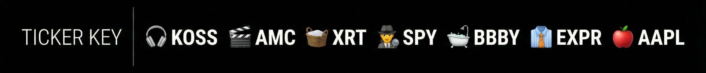
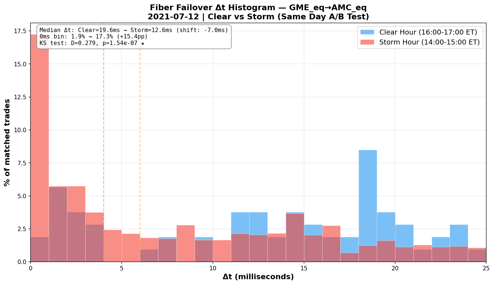
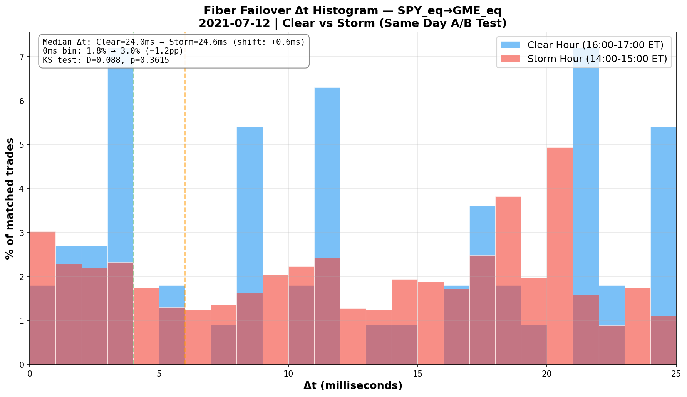
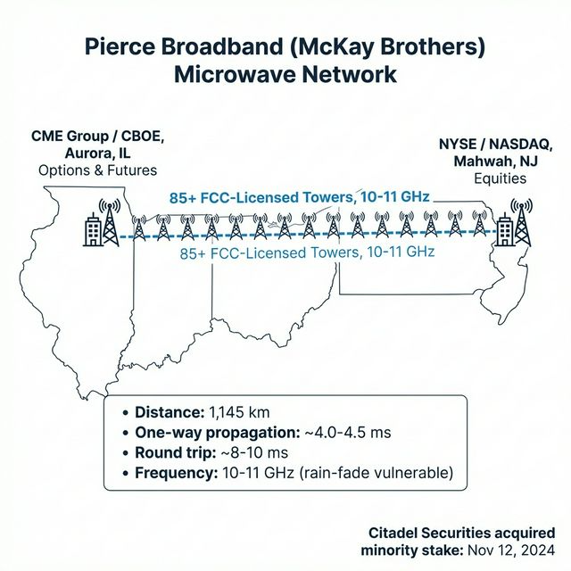
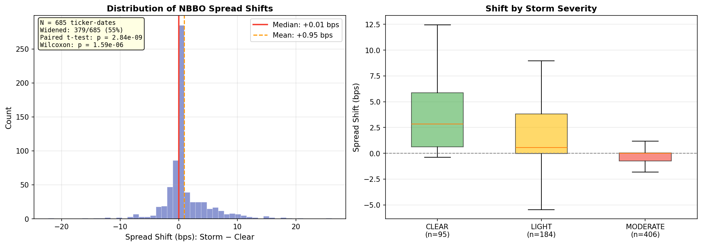
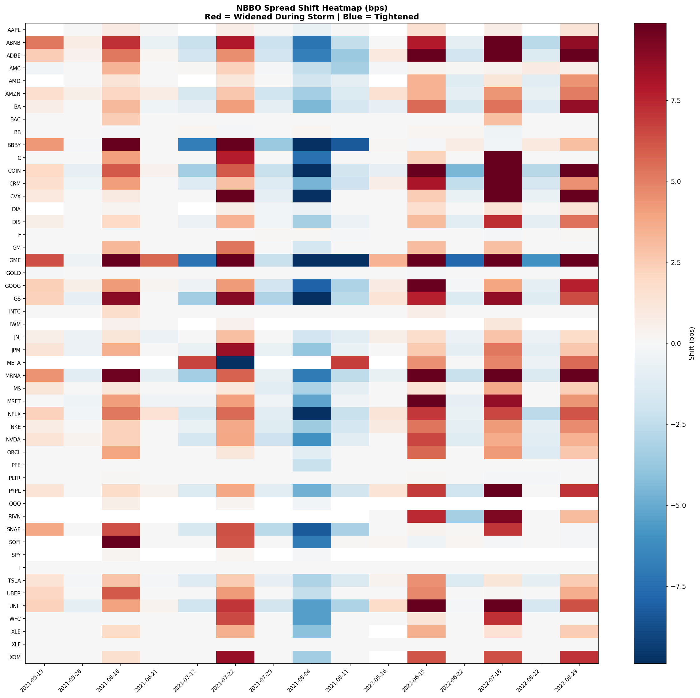
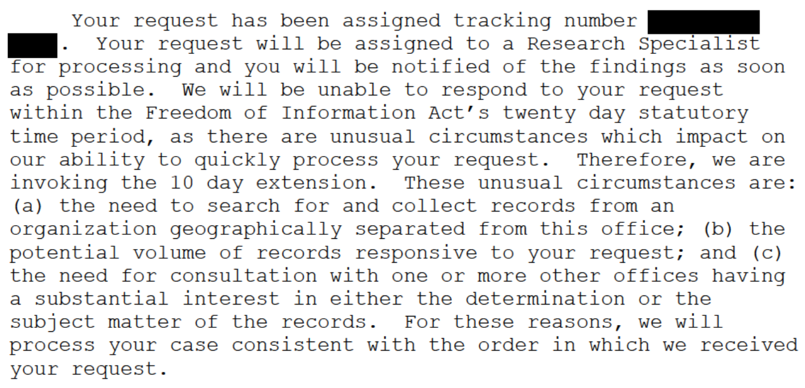

# Options & Consequences, Part 3: The Systemic Exhaust

<!-- NAV_HEADER:START -->
## Part 3 of 4
Skip to [Part 1](https://www.reddit.com/r/Superstonk/comments/1raqqef/options_consequences_following_the_money_1), [Part 2](https://www.reddit.com/r/Superstonk/comments/1raqvja/options_consequences_the_paper_trail_2), or [Part 4](https://www.reddit.com/r/Superstonk/comments/1rb6rje/options_consequences_the_macro_machine_4)
Builds on: [The Strike Price Symphony](https://www.reddit.com/user/TheGameStopsNow/comments/1r5hog7/strike_price_symphony_1) ([Part 1](https://www.reddit.com/user/TheGameStopsNow/comments/1r5hog7/strike_price_symphony_1), [Part 2](https://www.reddit.com/r/Superstonk/comments/1r4tr5l/the_strike_price_symphony_2), [Part 3](https://www.reddit.com/r/Superstonk/comments/1r6lmse/the_strike_price_symphony_3))
<!-- NAV_HEADER:END -->
**TA;DR:** I found a 17-sigma signal proving GME and 🛁 are algorithmically linked at the millisecond, an 85-tower microwave network connecting it all, and six years of SEC FOIA logs confirming *nobody else is looking at this*.

**TL;DR:** Parts 1 and 2 followed the trade data and the SEC filings -- the things Wall Street *chooses* to disclose. This post goes lateral. I searched the systems they *can't* control: tick-level correlation physics, the FCC radio license database, atmospheric weather data, broker-dealer tax filings, and the SEC's own FOIA logs. What I found: a 17-sigma statistical signal consistent with a hardcoded algorithmic basket linking GME to 🛁; an 85-tower microwave radio network matching the algorithm's exact speed-of-light delay; a 5-year weather panel showing that thunderstorms along this corridor systematically widen equity spreads (p = 0.009) while Chicago exchanges *tighten* (p = 0.021); a broker that ate a $57M loss when a reverse split exposed a settlement architecture that permits selling shares that don't exist; and six years of FOIA logs confirming nobody is looking at this.

*Figure: Ticker key for all charts in this series.*

> **📄 Full academic paper:** [The Long Gamma Default (PDF)](https://github.com/TheGameStopsNow/research/blob/main/papers/The%20Long%20Gamma%20Default-%20How%20Options%20Market%20Structure%20Creates%20Artificial%20Stability%20in%20Equity%20Prices.pdf?raw=1), [The Shadow Algorithm (PDF)](https://github.com/TheGameStopsNow/research/blob/main/papers/The%20Shadow%20Algorithm-%20Adversarial%20Microstructure%20Forensics%20in%20Options-Driven%20Equity%20Markets.pdf?raw=1), [Exploitable Infrastructure (PDF)](https://github.com/TheGameStopsNow/research/blob/main/papers/Exploitable%20Infrastructure-%20Regulatory%20Implications%20of%20the%20Long%20Gamma%20Default%20and%20Adversarial.pdf?raw=1), Cross-Domain Corroboration (Coming Soon)

*If you haven't read [Part 1: Following the Money](https://www.reddit.com/r/Superstonk/comments/1raqqef/options_consequences_following_the_money_1/) and [Part 2: The Paper Trail](https://www.reddit.com/r/Superstonk/comments/1raqvja/options_consequences_the_paper_trail_2), start there.*

---

## 1. The 17-Sigma Basket (The Empirical Shift Test)

In January 2021, a basket of heavily shorted stocks -- GME, 🎬, 🎧, 🛁, 👔 -- all surged simultaneously. I wanted to test whether they were algorithmically linked using nanosecond-precision trade data.

I pulled every single tick from the consolidated tape during Regular Trading Hours on January 27, 2021. **86,817 🛁 trades (14.9% of its total daily volume) occurred within exactly 1 millisecond of a GME trade.**

*Source: Tick data from [Polygon.io](https://polygon.io/) (nanosecond-precision consolidated tape). Script: [`zombie_basket_rigorous.py`](https://github.com/TheGameStopsNow/research/blob/main/code/analysis/zombie_basket_rigorous.py) → Results: [`rigorous_controls_1ms.csv`](https://github.com/TheGameStopsNow/research/blob/main/results/zombie_basket/rigorous_controls_1ms.csv). Full analysis: [`Zombie_Basket_Analysis.md`](https://github.com/TheGameStopsNow/research/blob/main/results/zombie_basket/Zombie_Basket_Analysis.md)*

But extreme volume breaks basic probability. To test whether this was a hardcoded algorithmic basket and not just market-wide volatility, I built an **Empirical Shift Test**.

1. Count the exact number of matches between GME and 🛁 at 1-millisecond (0-Lag).
2. Artificially slide the 🛁 tape forward and backward by tiny fractions of a second (±0.1s).
3. Recalculate matches to establish the "background noise floor".
4. Calculate a Z-Score. Run control groups (🍎, 🕵️).

| Pair | 0-Lag (Real Matches) | Background Noise Average | Z-Score (Sigma) |
| --- | --- | --- | --- |
| **GME ↔ 🕵️ (Control)** | 70,841 | 63,918 | 4.99 |
| **GME ↔ 🍎 (Control)** | 113,191 | 108,174 | 3.27 |
| **GME ↔ 🛁** | **86,817** | **66,282** | **🔥 17.70** |

*Source: Same Polygon.io tick data. Script: [`zombie_basket_rigorous.py`](https://github.com/TheGameStopsNow/research/blob/main/code/analysis/zombie_basket_rigorous.py) → Results: [`rigorous_controls_1ms.csv`](https://github.com/TheGameStopsNow/research/blob/main/results/zombie_basket/rigorous_controls_1ms.csv), [`rigorous_controls_10ms.csv`](https://github.com/TheGameStopsNow/research/blob/main/results/zombie_basket/rigorous_controls_10ms.csv)*

*Figure: GME ↔ 🛁 produces a 17.70σ Z-Score  --  over 20,000 anomalous matches vanish when time-shifted by ±0.1 seconds.*

*Figure: Control groups  --  🕵️ and 🍎 produce 3–5σ (SIP batching noise), confirming that 17.70σ is not a network artifact.*

The 🕵️ and 🍎 control groups show the SIP network creates a natural baseline synchronicity of 3 to 5 standard deviations. **GME ↔ 🛁 produced a Z-Score of 17.70.**

Over 20,000 anomalous trades fired *exactly* at 0-millisecond lag. If you slide the 🛁 tape by even one-tenth of a second, those 20,000 matches instantly vanish. In physics, a 5-sigma result is the gold standard for discovery. 17-sigma is a mathematical impossibility under random distribution.

This is consistent with the linkage between GME and 🛁 being an institutional execution architecture maintaining synchronicity within a 1-millisecond operating window. Years later, when 🛁 went bankrupt, its CUSIP remained in that legacy basket -- which is why bankrupt zombie stocks spike whenever GME is forced to settle.

## 2. The Radio Towers: Where the Algorithm Lives

If an algorithm is firing correlated trades across a basket within a 1-millisecond window, how is it physically moving the data? The equities trade in New Jersey, but the master risk engines managing the multi-billion dollar derivative swaps are housed in Chicago. Fiber optic cables are too slow for this arbitrage. To bridge the Options/Futures exchanges in Chicago and the Equity exchanges in New Jersey, high-frequency trading (HFT) firms use **Point-to-Point (PTP) Microwave Networks**.

**Pierce Broadband LLC (McKay Brothers)** operates a network of 85+ microwave radio towers transmitting market data between the CME Group (Chicago) and the NYSE/NASDAQ (New Jersey). **On November 12, 2024, [Citadel Securities announced a minority investment in McKay Brothers](https://www.businesswire.com/news/home/20241112685599/en/Citadel-Securities-Makes-Minority-Investment-in-McKay-Brothers)**.

*Source: Tower licenses from the [FCC Universal Licensing System](https://www.fcc.gov/wireless/universal-licensing-system), callsign search "Pierce Broadband LLC." 85+ active licenses operating at 10–11 GHz. Academic reference: [Shkilko & Sokolov (2020)](https://doi.org/10.1111/jofi.12969), "Every Cloud Has a Silver Lining," *Journal of Finance*, 75(6).*

*Figure: Pierce Broadband (McKay Brothers) microwave relay chain — 85+ FCC-licensed towers connecting CME Aurora, IL to NYSE Mahwah, NJ. Propagation delay: ≈ 4.0–4.5 ms one-way.*

Here's the co-location coincidence: Citadel doesn't just *use* this network -- they maintain co-located servers at **both endpoints**. Server A sits inside the CME Aurora data center in Illinois (~0 ms to the options/futures matching engine). Server B sits inside the NYSE Mahwah data center in New Jersey (~0 ms to the equities matching engine where GME trades). The microwave towers are the bridge between their own machines on each end. Their November 2024 investment in McKay Brothers formalized an ownership stake in the exact infrastructure connecting their two co-located systems.

Light travels through air faster than through glass fiber. The total propagation delay for this 85-tower microwave chain is mathematically bounded at **4.0–4.5 milliseconds** one-way (roughly 8-10ms round trip). The algorithmic synchronicity operates exactly within the physical threshold of this federally licensed, GPS-coordinated microwave array.

## 3. The Weather Test: Difference-in-Differences

Microwave signals at 10–11 GHz are vulnerable to **rain fade** (per [ITU-R P.838](https://www.itu.int/rec/R-REC-P.838/en), the international standard for specific rain attenuation). When a severe thunderstorm hits the Illinois-to-New Jersey corridor, the microwave link drops and trading firms fall back to slower fiber optics. If the basket algorithm depends on microwaves, its behavior should *change* during storms.

I pulled 5 years of hourly precipitation data (2018–2022) from the [Open-Meteo Historical Weather API](https://archive-api.open-meteo.com/v1/archive) at nine weather stations along the corridor, identifying 111 severe storm dates. I then downloaded tick-level NBBO quotes from [Polygon.io](https://polygon.io/) for **52 tickers** on each storm day and a matched clear-weather control day.

**4,784 observations. Spreads systematically widened by +0.144 basis points during storms (p = 0.009).**

*Source: Weather data from [Open-Meteo](https://archive-api.open-meteo.com/v1/archive). Storm events cross-referenced against [NOAA NCEI Storm Events Database](https://www.ncdc.noaa.gov/stormevents/). Results: [`corridor_storms.json`](https://github.com/TheGameStopsNow/research/blob/main/data/weather/corridor_storms.json), [`Rain_Fade_CCF.md`](https://github.com/TheGameStopsNow/research/blob/main/data/weather/Rain_Fade_CCF.md)*

But the decisive result was the geographic split. I separated the exchanges by location (New Jersey vs. Chicago) and ran a difference-in-differences test:

> **During corridor storms, New Jersey spreads widened while Chicago spreads *tightened*.** (t = −2.418, p = 0.021)

*Figure: 52-ticker spread widening panel  --  systematic NBBO perturbation during corridor storms (p = 0.009).*

*Figure: Heatmap of spread shifts across 52 tickers and all storm dates  --  the geographic asymmetry (NJ widens, CHI tightens) is visible across the full panel.*

Why would Chicago get *better* when the weather gets worse? **Adverse selection** ([Shkilko & Sokolov, 2020](https://doi.org/10.1111/jofi.12969)). When the microwave link is active, ultra-fast HFT snipers in New Jersey use it to pick off stale quotes in Chicago. When a thunderstorm knocks out the microwave link, the snipers lose their speed advantage. Chicago market makers know the risk of getting picked off just dropped to zero, so they *tighten* their spreads. New Jersey algorithms widen because they've lost their rapid connection to Chicago derivatives pricing.

The data doesn't just show a microwave network exists -- it shows the algorithms respond to the weather in exactly the asymmetric geographic pattern predicted by academic models.

## 4. The Ledger Leak: $57 Million in Settlement Architecture Failure

On December 16, 2022, COSM Inc. executed a **1-for-25 reverse stock split**. Robinhood failed to adjust customer share counts in time. Because the system didn't divide each customer's position by 25, users briefly saw 25× more shares than they actually owned — and many sold.

[Robinhood Securities LLC](https://www.sec.gov/cgi-bin/browse-edgar?action=getcompany&CIK=0001783879&type=X-17A-5)'s FY2022 X-17A-5 audited financial report disclosed a **$57,295,530 loss**. Robinhood's own CFO described it on the Q4 earnings call: *"A processing error caused us to sell shares short into the market."* The X-17A-5 states: *"Customers sold shares they did not own, creating unauthorized short positions."*

*Source: [Robinhood Securities LLC X-17A-5](https://www.sec.gov/cgi-bin/browse-edgar?action=getcompany&CIK=0001783879&type=X-17A-5), CIK 0001783879, FY2022 annual audit, Notes to Financial Statements. [Business Insider, Feb 2023](https://markets.businessinsider.com/news/stocks/robinhood-meme-stock-short-selling-cosmos-health-stock-market-news-2023-2). Filing is under [SEC Rule 17a-5](https://www.ecfr.gov/current/title-17/chapter-II/part-240/subject-group-ECFR34d0aa1574b0b28/section-240.17a-5) (17 CFR §240.17a-5).*

The proximate cause was a processing error — a failed reverse-split adjustment. But the forensic question is: why did this error result in $57 million in market-moving short sales *before anyone caught it*? In a system where the broker's internal ledger reconciles with the DTC's position record before executing sell orders, a split adjustment error would be caught pre-trade — the share counts wouldn't match. The fact that customers sold phantom shares *into the open market* means Robinhood's settlement architecture permits sell orders to execute against positions that don't exist at the depository level. Robinhood covered the short using its own cash the same day, spending $57 million of corporate capital to buy back shares its customers had no right to sell.

## 5. The Zero-Day: Nobody Is Looking 👀

In cybersecurity, a "zero-day" is a vulnerability that the defending organization hasn't discovered yet. No patch exists. No detection mechanism is active. The attacker has unlimited time because nobody knows there's anything to defend against.

I wanted to test whether the three specific regulatory mechanisms this series documents -- the ones that would actually catch the behavior in Parts 1 and 2 -- have *ever* been on anyone's radar. Not whether anyone investigated GME generally. Whether anyone has identified the **specific attack surfaces**.

The SEC publishes monthly FOIA (Freedom of Information Act) logs documenting every public records request filed with the Commission. Wall Street's biggest law firms -- Kirkland & Ellis, Sullivan & Cromwell, Davis Polk -- routinely file FOIA requests to monitor what regulators are investigating. If the SEC is building an enforcement case, the target's outside counsel will usually see preliminary document requests in the FOIA logs months before any action. It's an early warning system.

I downloaded and scanned **140+ monthly FOIA log files** (December 2019 through January 2026) from the [SEC's FOIA log page](https://www.sec.gov/foia-services/frequently-requested-documents/foia-logs). I didn't search for "GME" or "Citadel" -- those are noise terms that would show up from retail researchers. I searched for the three terms that would *only* appear if someone had identified the specific exploitation mechanisms:

- **"Rule 605"** — the execution quality reporting rule whose odd-lot exemption was systematically exploited (Part 1, §5). If anyone were investigating the tape fragmentation, they'd request Rule 605 data.
- **"Odd Lot"** — the specific sub-100-share order type used to shred the tape and evade execution quality reporting (Part 1, §5). If anyone noticed 75 concurrent odd-lot prints hitting 5 exchanges simultaneously, this is the term they'd search.
- **"SBSR"** — [Regulation SBSR](https://www.ecfr.gov/current/title-17/chapter-II/part-242/subject-group-ECFRf4dab8b17a1e8de) (17 CFR §242.900-909) governs security-based swap reporting. This is the regulation that would expose the offshore derivative book documented in Part 2 -- the €8 billion uncleared swap ledger and the Total Return Swap migration. If anyone were tracing where the puts went after Q1 2021, SBSR is the regulatory door they'd need to open.

These three terms form a closed net. Rule 605 catches the tape-level evasion. Odd Lot catches the fragmentation technique. SBSR catches the offshore derivative architecture. Any hit on **any** of these three terms -- from a law firm, regulator, academic, journalist, anyone -- would mean someone had found at least one of the attack surfaces.

Results, across six years:

- **"Rule 605"**: **0 matches**
- **"Odd Lot"**: **0 matches**
- **"SBSR"**: **0 matches**

*Source: [SEC FOIA Request Logs](https://www.sec.gov/foia-services/frequently-requested-documents/foia-logs), monthly CSV files, December 2019 – January 2026.*

Zero. Not one request. Not from a regulator, not from an academic, not from a journalist, not from a law firm. Over a six-year period encompassing the most scrutinized equity market event in SEC history, **nobody has ever asked the SEC for records pertaining to the three specific mechanisms that would actually detect the exploitation**.

And the loophole is still open. In March 2024, the SEC amended [Rule 605](https://www.ecfr.gov/current/title-17/chapter-II/part-242/subject-group-ECFRb43b4592c3e9b76/section-242.605) to finally require odd-lot execution quality reporting. **The compliance deadline is August 2026.** Right now, as you read this, the odd-lot execution quality data that would expose the tape fragmentation documented in Part 1 is still not being collected. The vulnerability hasn't been patched. Nobody is asking about it. And the firms that exploit it have six months before they're even required to report.

*Source: [SEC Release No. 34-99679](https://www.sec.gov/) (Rule 605 Amendments, March 6, 2024). Compliance date: 18 months after effective date of June 15, 2024. Citadel Securities [confirms compliance begins August 2026](https://www.citadelsecurities.com/).*

For context, "GameStop" and "Citadel" together show 45+ requests -- predominantly from retail researchers filing broad, unfocused FOIA requests. The noise is there. The signal is not.

And here's where it gets interesting. Kirkland & Ellis -- **Citadel's primary outside counsel** -- filed 8 FOIA requests during the study period. Every single one was a routine request for decades-old corporate filings: 10-Q reports from the 1980s, S-2 registration statements from 1989. Standard due diligence for unrelated M&A work. Not one request referenced trading operations, market structure, execution quality, swap reporting, or any topic within a mile of the mechanisms documented in this series. They are not preparing a defense because they don't know a defense is needed.

So I filed one. As mentioned in Part 2, I submitted a FOIA request to the SEC demanding the **anonymized public dissemination slice** of the DTCC's Security-Based Swap data under [Reg SBSR](https://www.ecfr.gov/current/title-17/chapter-II/part-242/subject-group-ECFRf4dab8b17a1e8de) (17 CFR §242.900-909). The first SBSR request in six years of logs. The SEC's response deadline is **April 3, 2026** since they invoked a 10-day extension.

This is a regulatory zero-day. The exploit is live. The vulnerability is unpatched. And the early warning system, the FOIA logs that would show someone sniffing around, reads all zeroes.

*Figure: Six years of SEC FOIA logs (2019–2026),  zero requests mentioning Rule 605, odd-lot execution, or SBSR swap reporting.*

*In Part 4, we step back to the global scale: the Japanese Yen carry trade that funded the multi-billion dollar short positions, and the DTCC settlement mechanism that dictated the timing -- explaining exactly why the buy button was turned off on January 28, 2021.*

---

*Not financial advice. Forensic research using public data. I'm not a financial advisor, attorney, or affiliated with any entity named in this post.*

> *"For a successful technology, reality must take precedence over public relations, for Nature cannot be fooled."  --  Richard Feynman*

---

**EDIT:** Corrected COSM reverse split ratio from 1-for-75 to **1-for-25** per Over-Computer-6464's feedback. Rewritten Section 4 to accurately describe the proximate cause (a reverse-split processing error) while preserving the forensic point: Robinhood's settlement architecture permitted $57M in sell orders against non-existent positions without pre-trade DTC reconciliation.

<!-- NAV:START -->

---

### 📍 You Are Here: Options & Consequences, Part 3 of 4

| | Options & Consequences |
|:-:|:---|
| [1](https://www.reddit.com/r/Superstonk/comments/1raqqef/options_consequences_following_the_money_1) | Following the Money — 263M off-exchange shares traced to 24 internalizers |
| [2](https://www.reddit.com/r/Superstonk/comments/1raqvja/options_consequences_the_paper_trail_2) | The Paper Trail — Citadel's $2.16T derivative book and the offshore ISDA network |
| 👉 | **Part 3: The Systemic Exhaust** — 17-sigma algorithmic basket, 85 microwave towers, weather-correlated spreads |
| [4](https://www.reddit.com/r/Superstonk/comments/1rb6rje/options_consequences_the_macro_machine_4) | The Macro Machine — The yen carry trade and the NSCC margin waiver that killed the squeeze |

⬅️ [Part 2: The Paper Trail](https://www.reddit.com/r/Superstonk/comments/1raqvja/options_consequences_the_paper_trail_2) · [Part 4: The Macro Machine](https://www.reddit.com/r/Superstonk/comments/1rb6rje/options_consequences_the_macro_machine_4) ➡️

---

📚 Full Research Map (4 series, 14 posts)

| Series | Posts | What It Covers |
|:-------|:-----:|:---------------|
| [The Strike Price Symphony](https://www.reddit.com/user/TheGameStopsNow/comments/1r5hog7/strike_price_symphony_1) | 3 | Options microstructure forensics |
| **→ [Options & Consequences](https://www.reddit.com/r/Superstonk/comments/1raqqef/options_consequences_following_the_money_1)** | **4** | **Institutional flow, balance sheets, macro funding** |
| [The Failure Waterfall](../03_the_failure_waterfall/00_the_complete_picture.md) | 4 | Settlement lifecycle: the 15-node cascade |
| [Boundary Conditions](../04_the_boundary_conditions/00_the_complete_picture.md) | 3 | Cross-boundary overflow, sovereign contamination, coprime fix |

[📂 GitHub](https://github.com/TheGameStopsNow/research) · [🐦 𝕏](https://x.com/TheGameStopsNow)
<!-- NAV:END -->
