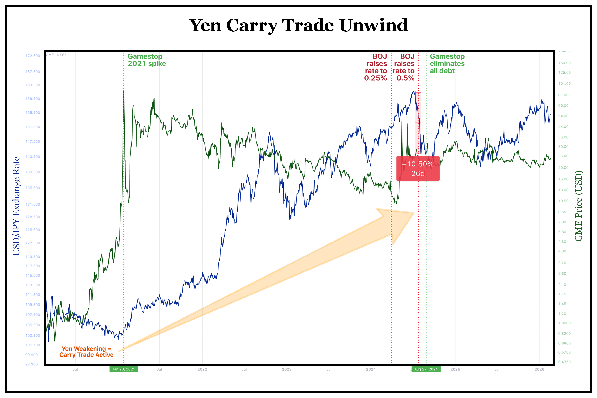

# Options & Consequences, Part 4: The Macro Machine

<!-- NAV_HEADER:START -->
## Part 4 of 4
Skip to [Part 1](https://www.reddit.com/r/Superstonk/comments/1raqqef/options_consequences_following_the_money_1), [Part 2](https://www.reddit.com/r/Superstonk/comments/1raqvja/options_consequences_the_paper_trail_2), or [Part 3](https://www.reddit.com/r/Superstonk/comments/1rb695i/options_consequences_the_systemic_exhaust_3)
Builds on: [The Strike Price Symphony](https://www.reddit.com/user/TheGameStopsNow/comments/1r5hog7/strike_price_symphony_1) ([Part 1](https://www.reddit.com/user/TheGameStopsNow/comments/1r5hog7/strike_price_symphony_1), [Part 2](https://www.reddit.com/r/Superstonk/comments/1r4tr5l/the_strike_price_symphony_2), [Part 3](https://www.reddit.com/r/Superstonk/comments/1r6lmse/the_strike_price_symphony_3))
Continued in: [The Failure Waterfall](https://www.reddit.com/r/Superstonk/comments/1re1ps2/1_the_failure_accommodation_waterfall_where_your/) (Parts 1-4)
<!-- NAV_HEADER:END -->
**TA;DR:** The short machine was funded by borrowing Japanese yen at 0% interest. The buy button was turned off because the people who voted to waive the $3B margin call were the same firms holding the shorts. Conflict of interest? You decide.

**TL;DR:** Parts 1–3 documented *what* happened (tape fractures), identified *who* was involved (balance sheets), and showed *how* they did it (17-sigma microwave algorithms). This final post answers the two remaining questions: **How was it funded?** and **Why January 28?** The short machine was powered by the Japanese Yen carry trade -- borrowing near-zero-interest yen to fund dollar-denominated margin. And January 28 was dictated by the NSCC's VaR-based margin model, which generated a $3 billion margin call against Robinhood on GME's CNS positions. But the NSCC Risk Management Committee — composed of executives from the exact clearing members holding the short side — chose to **waive** the charge rather than let Robinhood default. A default would have forced the NSCC itself to buy GME shares on the open market to close out, triggering the squeeze. The buy button was not turned off to protect Robinhood. It was turned off to protect the clearinghouse from its own computers.

> **📄 Full academic paper:** [The Long Gamma Default (PDF)](https://github.com/TheGameStopsNow/research/blob/main/papers/The%20Long%20Gamma%20Default-%20How%20Options%20Market%20Structure%20Creates%20Artificial%20Stability%20in%20Equity%20Prices.pdf?raw=1), [The Shadow Algorithm (PDF)](https://github.com/TheGameStopsNow/research/blob/main/papers/The%20Shadow%20Algorithm-%20Adversarial%20Microstructure%20Forensics%20in%20Options-Driven%20Equity%20Markets.pdf?raw=1), [Exploitable Infrastructure (PDF)](https://github.com/TheGameStopsNow/research/blob/main/papers/Exploitable%20Infrastructure-%20Regulatory%20Implications%20of%20the%20Long%20Gamma%20Default%20and%20Adversarial.pdf?raw=1), [Cross-Domain Corroboration (PDF)](https://github.com/TheGameStopsNow/research/blob/main/papers/Cross-Domain%20Corroboration-%20Physical%20Infrastructure%2C%20Settlement%20Mechanics%2C%20and%20Macro%20Funding%20of.pdf?raw=1)

*This is the conclusion of a four-part series. [Part 1](https://www.reddit.com/r/Superstonk/comments/1raqqef/options_consequences_following_the_money_1/) mapped the tape. [Part 2](https://www.reddit.com/r/Superstonk/comments/1raqvja/options_consequences_the_paper_trail_2) mapped the filings. [Part 3](https://www.reddit.com/r/Superstonk/comments/1rb695i/options_consequences_the_systemic_exhaust_3) mapped the physical infrastructure. This post maps the macro machine.*

---

## 1. The Locates: Your Pension Funded the Shorts

To execute short sales at this magnitude, prime brokers need "locates" -- they need to borrow physical shares. Wall Street doesn't own those shares; passive indexers do. Specifically: state pension funds.

**[CalPERS](https://www.calpers.ca.gov/investments/about-investment-office/policies)** is the largest public pension fund in the U.S. Look at their [public financial reports](https://www.calpers.ca.gov/investments/about-investment-office/investment-financial-reports) for their revenue from Securities Lending:

- FY2021: $90M
- **FY2022: $416M** (+362%)
- **FY2023: $614M** (+48%)

*Source: [CalPERS Annual Comprehensive Financial Reports](https://www.calpers.ca.gov/investments/about-investment-office/investment-financial-reports), FY2019–FY2023. Investment Income  --  Securities Lending Revenue line items.*

CalPERS securities lending income exploded by **583%** between 2021 and 2023. Prime brokers were suddenly paying astronomical fees to borrow every share they could find to supply the meme-stock shorting machine. California's teachers and firefighters were unknowingly put on the hook for the counterparty risk.

## 2. The Funding: The Yen Carry Trade

In Part 2, the math validated a $35.2 billion swap position. How do you fund a $35 billion short without blowing up your USD borrowing costs? You go to Japan.

The **Yen Carry Trade** is simple: Borrow Japanese Yen at 0% interest, convert it to U.S. Dollars, and use those dollars to fund your margin collateral. Global yen carry trade positions are estimated at [$1–4 trillion](https://www.nomuraholdings.com/en/) (Nomura Holdings, Q3 2024).

But "they probably used the carry trade" isn't evidence. Here's the paper trail.

**Link 1: The Offshore Counterparties.** In Part 2, we mapped the [UK Companies House charges](https://find-and-update.company-information.service.gov.uk/company/05462867/charges) for Citadel Securities Europe. Eight global prime brokers signed ISDA margin agreements in August 2022: **JPMorgan, Morgan Stanley, Citibank, Barclays, Goldman Sachs, HSBC, BofA, and Merrill Lynch**.

"Several of these banks have Tokyo operations" isn't the interesting part. The interesting part is that the [Japan Ministry of Finance](https://www.mof.go.jp/english/policy/jgbs/debt_management/pd/) publishes the exclusive list of **JGB Market Special Participants** — the 19 institutions authorized to bid directly in Japanese Government Bond auctions. Cross-referencing:

| ISDA Counterparty | JGB Primary Dealer? | Japanese Entity |
| --- | --- | --- |
| **JPMorgan** | ✅ | JPMorgan Securities Japan Co., Ltd. |
| **Morgan Stanley** | ✅ | Morgan Stanley MUFG Securities Co., Ltd. |
| **Citibank** | ✅ | Citigroup Global Markets Japan Inc. |
| **Goldman Sachs** | ✅ | Goldman Sachs Japan Co., Ltd. |
| **Barclays** | ✅ | Barclays Securities Japan Limited |
| **BofA / Merrill Lynch** | ✅ | BofA Securities Japan Co., Ltd. |
| **HSBC** | ❌ | HSBC Securities (Japan) — JGB clearing participant, not primary dealer |

**Six of eight ISDA counterparties are designated JGB primary dealers** — they don't just "have Tokyo offices," they hold a formal mandate from the Japanese government to maintain yen liquidity. When you need to borrow ¥500 billion at near-zero rates, you go to the exact counterparties on this list.

**Link 1b: The August 2022 Timestamp.** That same month — **August 2022** — Citadel Securities Japan Co., Ltd. completed its registration as a [Type I Financial Instruments Business Operator](https://citadelsecurities.com/) with the Japan Financial Services Agency (JFSA Registration No. Kanto 3342, Marunouchi, Chiyoda-ku, Tokyo). In the same month that 8 prime brokers signed ISDA margin agreements with the European arm, Citadel opened its own Tokyo office.

The Japan buildout didn't stop there. The [JFSA High-Speed Trader registry](https://www.fsa.go.jp/en/regulated/licensed/hst.xlsx) confirms that **Citadel Securities (Asia) II Pte.** registered as HST No. 77 on **February 22, 2024** — giving it authorized high-frequency trading access to Japanese exchanges. In early 2023, the Citadel *hedge fund* (not just the securities arm) [announced it was reopening its Tokyo office](https://www.hedgeweek.com/citadel-to-reopen-tokyo-office/) — the same office it shuttered during the 2008 financial crisis. And in **June 2024**, Citadel [acquired Energy Grid Corp.](https://www.energyconnects.com/news/utilities/2024/june/citadel-buys-goldman-alum-s-company-to-trade-power-in-japan/), a Tokyo-based power trading firm founded by a former Goldman Sachs trader, deepening its Japanese commodities infrastructure.

This is not a firm that "might be using the yen carry trade." This is a firm that registered a securities subsidiary, a high-speed trading entity, and a commodities acquisition in Japan within a 24-month window — while simultaneously signing ISDA agreements with 6 of the 19 JGB primary dealers.

**Link 2: The Physical Infrastructure.** In September 2016, [Bloomberg reported](https://www.bloomberg.com/news/articles/2016-09-29/citadel-jump-trading-back-high-speed-link-to-japanese-markets) that **Citadel, Jump Trading, and Virtu Financial** were in discussions to build a microwave tower chain from Chicago to the Pacific Northwest -- the **"Go West" project**. Its purpose: connect to an **undersea fiber cable running from Seattle to Japan**, reducing Chicago-to-Tokyo latency from ~14 ms to ~9.5 ms. Why would equity market makers spend hundreds of millions on microwave infrastructure to Tokyo unless they had positions funded in yen that required real-time cross-currency execution? The "Go West" project documents that the same firms whose trading generated the 17-sigma basket signal in Part 3 were simultaneously building physical infrastructure to connect to Japanese funding markets. And all three consortium members now have independent Japanese market access: **Virtu** was one of the first firms on the [JFSA High-Speed Trader registry](https://www.fsa.go.jp/en/regulated/licensed/hst.xlsx) (HST No. 2, June 2018), **Jump Trading** registered a dedicated Tokyo entity ([Jump Trading Digital Japan LLC](https://info.gbiz.go.jp/hojin/ichiran?hojinBango=1010403021491), September 2019), and **Citadel** registered as HST No. 77 (February 2024). Three competitors who co-funded microwave infrastructure to Tokyo all independently registered for direct Japanese market access.

**Link 3: The FX Data.** If the positions are yen-funded, the USD/JPY exchange rate should move in predictable directions during GME events. It does.

During the January 2021 squeeze, the yen didn't strengthen. It **weakened** (+2.2% from Jan 4 to Feb 4). Weakening yen means prime brokers were actively borrowing *more* yen, converting it to dollars, and doubling down on their short positions. They weren't liquidating. They were reloading.

But here's the part nobody has surfaced. The CFTC data doesn't just show the 2024 unwind — it shows **exactly when the carry trade was switched on.**

| Period | Lev. Money Net Position | What Was Happening |
| --- | --- | --- |
| **H2 2019** | +15,924 avg (net long yen) | Go West infrastructure being built. No carry trade yet. |
| **Jan 2021** | **+11,046 avg** (net long yen) | Squeeze. Leveraged funds were NOT short yen. |
| **Feb 23, 2021** | +169 | Inflection point. Nearly zero. |
| **Mar 2, 2021** | **−6,528** | **Crossed zero.** Carry trade activated. |
| **Mar 23, 2021** | −43,647 | Massive buildout in 3 weeks |
| **Nov 9, 2021** | −71,946 | 2021 peak short |
| **Jul 9, 2024** | **−110,635** | All-time peak. $11.1B notional short. |

*Source: [CFTC Commitments of Traders](https://www.cftc.gov/MarketReports/CommitmentsofTraders/index.htm) — Traders in Financial Futures (TFF), Japanese Yen CME contract 097741, "Leveraged Money" net positions, weekly 2019–2024.*

The carry trade wasn't the *cause* of the squeeze. It was the *response.* After January 28, leveraged funds spent February draining their net long positions. Then on **March 2, 2021** — exactly five weeks after the buy button was turned off — they crossed zero and went massively net short yen. They deployed the carry trade to fund the ongoing suppression. And once deployed, it never came back. From March 2021 through July 2024, leveraged funds were persistently net short yen — right up until the Bank of Japan blew it up.

On **July 31, 2024**, the [Bank of Japan raised its policy rate to 0.25%](https://www.boj.or.jp/en/mopo/mpmdeci/state_2024/k240731a.htm). The trade unwound. Between July 10 and August 5, 2024, the Yen violently strengthened by **11.0%**. This forced prime brokers to dump USD assets to repay their suddenly-expensive Japanese loans, culminating in the historic August 5th market crash (Nikkei −12.4%, S&P 500 −3.0%).

And we can quantify the unwind directly. The [CFTC Commitments of Traders](https://www.cftc.gov/MarketReports/CommitmentsofTraders/index.htm) report publishes weekly positioning data for Japanese Yen futures on the CME. "Leveraged Money" — hedge funds and CTAs — hit their most aggressive yen short in the entire five-year dataset on **July 9, 2024: −110,635 contracts net short** (each contract = ¥12.5 million, total notional ~**$11.1 billion**). One week after the BoJ rate hike, the position collapsed:

| Date | Lev. Net Position | Δ Weekly | Notional (est.) |
| --- | --- | --- | --- |
| Jul 9, 2024 | **−110,635** | — | ~$11.1B short |
| Jul 30, 2024 | −70,333 | +40,302 | covering |
| Aug 6, 2024 | −24,158 | +46,175 | forced unwind |
| Aug 13, 2024 | **−2,415** | +21,743 | nearly flat |

In five weeks, leveraged funds unwound **108,220 contracts** — over **$10.8 billion** in yen exposure. This is the carry trade unwind, measured in real-time CFTC data.

*Source: [FRED Series DEXJPUS](https://fred.stlouisfed.org/series/DEXJPUS)  --  Japan/U.S. Foreign Exchange Rate (daily), Board of Governors of the Federal Reserve System. [CFTC Commitments of Traders](https://www.cftc.gov/MarketReports/CommitmentsofTraders/index.htm) — Traders in Financial Futures, Japanese Yen (097741), "Leveraged Money" positions. JGB Primary Dealers: [Japan Ministry of Finance](https://www.mof.go.jp/english/policy/jgbs/debt_management/pd/). High-Speed Trader registry: [JFSA](https://www.fsa.go.jp/en/regulated/licensed/hst.xlsx). Citadel Japan registration: JFSA Kinsho No. 3342 (August 2022). "Go West" project: Bloomberg, September 2016. Academic reference: [Nomura Holdings (2024)](https://www.nomuraholdings.com/en/), "Yen Carry Trade Sizing and Risk," Q3 2024 Research Note.*

*Figure: USD/JPY exchange rate ([FRED DEXJPUS](https://fred.stlouisfed.org/series/DEXJPUS))  --  yen weakened during January 2021 (brokers borrowing more), then violently unwound in August 2024 when BoJ raised rates.*

### Roaring Kitty's Warning

On June 7, 2024, Roaring Kitty hosted his first livestream in three years. The cover image featured a quote: *"I'LL WAGER WITH YOU. I'LL MAKE YOU A BET."* The community correctly identified this as the Bank of Japan Carry Trade thesis. He signaled the funding mechanism weeks before the BoJ triggered the unwind.

And GME reacted. In August 2024, GME voluntarily terminated its credit facility, extinguishing all long-term debt. A company with zero debt cannot be squeezed by rising interest rates. Ryan Cohen made GME the only stock in the carry-trade crossfire that was completely immune to the macroeconomic shock.

*Source: [GameStop Corp. 10-K](https://www.sec.gov/cgi-bin/browse-edgar?action=getcompany&CIK=0001326380&type=10-K), CIK 0001326380, FY2024 annual report (debt extinguishment disclosure).*

## 3. The Clock: Why January 28, 2021?

For five years, the narrative has been that Robinhood faced a $3 billion NSCC margin call on January 28, 2021, forcing them to turn off the buy button.

But I pulled the **[Federal Reserve Discount Window](https://www.federalreserve.gov/regreform/discount-window.htm)** lending data for Q1 2021. If the clearing system was facing a catastrophic liquidity crisis, Tier-1 clearing banks (JPMorgan, BofA) would have tapped the Fed's emergency window. They didn't. Zero Tier-1 banks used the Discount Window that week.

*Source: [Federal Reserve Board of Governors  --  Discount Window Lending Data](https://www.federalreserve.gov/regreform/discount-window.htm), Q1 2021 transaction-level data (released under Dodd-Frank §1103 with 2-year delay).*

The liquidity crisis wasn't at the retail broker level. It was inside the **DTCC settlement machinery**.

### The NSCC Margin Model and the Conflict of Interest

GME is a CNS-eligible NMS security. Its FTDs stay within the NSCC's **Continuous Net Settlement (CNS)** system — they get re-netted daily against new transactions, and NSCC charges escalating fees on aging fails. GME fails do *not* enter the Obligation Warehouse.

What creates the acute margin pressure is NSCC's **VaR-based margining model**. When GME's price volatility spiked from $20 to $347 in two weeks, the model recalculated clearing fund requirements for every member with GME exposure. This is what generated the **$3 billion "excess capital premium" deposit** demand to Robinhood on the morning of January 28 ([Congressional testimony, Vlad Tenev, Feb 2021](https://congress.gov/)). Robinhood couldn't pay.

Here's the part that matters: **if Robinhood defaulted, the NSCC would be legally obligated to assume Robinhood's portfolio.** The clearinghouse would have to go to the open market and *buy* millions of GME shares to close out the unbalanced books — at any price. That is the MOASS, triggered not by retail but by the clearinghouse's own settlement computers.

So the NSCC **waived the charge**, reducing it from $3 billion to $700 million. And the NSCC's Risk Management Committee — the body that decided to waive the charge — is composed of executives from **the exact clearing members holding the short side of the GME trade.** The same firms that would have been destroyed by a clearinghouse-triggered squeeze voted to waive the margin call that would have caused it.

*Source: [SEC Staff Report on Equity and Options Market Structure Conditions in Early 2021](https://www.sec.gov/files/staff-report-equity-options-market-struction-conditions-early-2021.pdf) (October 2021), p. 33–38. [Congressional testimony, Vlad Tenev](https://congress.gov/), Feb 2021. NSCC Rule 4, Section 1 (Clearing Fund). GME closing prices from [Polygon.io](https://polygon.io/) / [Yahoo Finance](https://finance.yahoo.com/quote/GME/history/).*

- Jan 27 Close: $347
- Jan 28 Intraday: **$483**
- Jan 28 Close (after PCO): $193

They did not turn off the buy button to save Robinhood. **They turned off the buy button to prevent a clearinghouse default that would have forced the NSCC to buy GME at $483.** The conflict of interest is structural: the committee that waived the margin call was composed of the firms that benefited from the waiver.

### The Zombie Basket: Evidence of the Swap Architecture

The NSCC margin model explains the *mechanism* of January 28. But it doesn't explain a deeper mystery: why did **dead, bankrupt stocks** move in lockstep with GME?

Part 3's Empirical Shift Test (Z = 17.70) proved GME is algorithmically linked in a basket with other securities. Several basket components are *delisted* — **Blockbuster (BLIAQ)**, delisted 2010; **Sears (SHLDQ)**, delisted 2018. These zombie stocks spiked thousands of percent on the exact same days GME ran — despite having zero retail interest, zero fundamental catalyst, and zero volume in the months before.

The explanation is derivative linkage. If a prime broker holds the entire basket through **Total Return Swaps** or portfolio margin, then a squeeze on GME creates mark-to-market pressure across every position in the basket — including the zombies. The dead stocks didn't cause anything. They are **receipts.** They prove the basket is real, the swaps are real, and the exposure is portfolio-wide.

*Source: [DTCC Important Notice A#6848](https://www.dtcc.com/-/media/Files/pdf/2009/7/22/a6848.pdf), July 22, 2009 (Obligation Warehouse service description); Zombie stock price data from [Polygon.io](https://polygon.io/). The Empirical Shift Test analysis is in [Part 3](https://www.reddit.com/r/Superstonk/comments/1rb695i/options_consequences_the_systemic_exhaust_3).*

## The Complete Picture

Across four posts, here is what the publicly verifiable data shows:

| Layer | Evidence | Primary Sources |
| --- | --- | --- |
| **The Tape** | 263M off-exchange shares; ETF Cannibalization; Rule 605 odd-lot evasion | [SEC FTD Data](https://www.sec.gov/data-research/sec-markets-data/fails-deliver-data), [FINRA Non-ATS](https://otctransparency.finra.org/otctransparency/OtcIssueData), [Polygon.io](https://polygon.io/) |
| **The Balance Sheets** | $2.16T derivative book; 47% increase in puts; UK ISDA offshore map | [SEC EDGAR X-17A-5](https://www.sec.gov/cgi-bin/browse-edgar?action=getcompany&CIK=0001146184&type=X-17A-5), [UK Companies House](https://find-and-update.company-information.service.gov.uk/company/05462867/charges) |
| **The Physical Reality** | 17-Sigma algorithmic math; FCC microwave networks; $57M synthetic tax loss | [FCC ULS](https://www.fcc.gov/wireless/universal-licensing-system), [Open-Meteo](https://archive-api.open-meteo.com/v1/archive), [Robinhood X-17A-5](https://www.sec.gov/cgi-bin/browse-edgar?action=getcompany&CIK=0001783879&type=X-17A-5) |
| **The Macro Machine** | Funded by 0% Japanese Yen; Triggered by NSCC VaR margin + clearinghouse conflict of interest | [FRED DEXJPUS](https://fred.stlouisfed.org/series/DEXJPUS), [SEC Staff Report](https://www.sec.gov/files/staff-report-equity-options-market-struction-conditions-early-2021.pdf), [Fed Discount Window](https://www.federalreserve.gov/regreform/discount-window.htm) |

None of this is hidden. Every source is free to access. The problem was never that the evidence didn't exist; it's that nobody had assembled it from across the SEC, FINRA, FCC, FRED, and the DTCC to see the full picture.

My ask: **Verify it.** The data, the python scripts, and the source links are in the GitHub repo below.

**[github.com/TheGameStopsNow/research](https://github.com/TheGameStopsNow/research)**

---

*Not financial advice. Forensic research using public data. I'm not a financial advisor, attorney, or affiliated with any entity named in this post.*

> *"It is difficult to get a man to understand something when his salary depends upon his not understanding it."  --  Upton Sinclair*

---

**EDIT 1:** Section 3 originally claimed GME's failed obligations sit in the Obligation Warehouse and get repriced by RECAPS. That was wrong — GME is CNS-eligible, so its FTDs stay in CNS. Corrected per Over-Computer-6464's feedback citing [DTCC Important Notice A#6848](https://www.dtcc.com/-/media/Files/pdf/2009/7/22/a6848.pdf).

**EDIT 2:** Intermediate version attempted to explain January 28 as a convergence of NSCC VaR + RECAPS repricing of zombie basket stocks (Blockbuster, Sears) transmitting through derivative linkage. After further red-teaming, this was also flawed: (a) Robinhood had zero OTC/zombie exposure, so RECAPS margin would hit hedge funds, not the broker whose buy button was turned off; (b) zombie stocks trading at fractions of a penny would generate margin obligations in the low millions — a rounding error for prime brokers; (c) the documented cause is the NSCC VaR charge per the SEC Staff Report and sworn testimony. Section 3 is now rewritten to attribute January 28 solely to the NSCC VaR margin model and the clearinghouse conflict of interest. The zombie basket finding is preserved as evidence that the swap architecture is real (dead stocks don't spike 1000% without derivative linkage), but it is no longer presented as a cause of the buy-button removal.

<!-- NAV:START -->

---

### 📍 You Are Here: Options & Consequences, Part 4 of 4

| | Options & Consequences |
|:-:|:---|
| [1](https://www.reddit.com/r/Superstonk/comments/1raqqef/options_consequences_following_the_money_1) | Following the Money — 263M off-exchange shares traced to 24 internalizers |
| [2](https://www.reddit.com/r/Superstonk/comments/1raqvja/options_consequences_the_paper_trail_2) | The Paper Trail — Citadel's $2.16T derivative book and the offshore ISDA network |
| [3](https://www.reddit.com/r/Superstonk/comments/1rb695i/options_consequences_the_systemic_exhaust_3) | The Systemic Exhaust — 17-sigma algorithmic basket, 85 microwave towers, weather-correlated spreads |
| 👉 | **Part 4: The Macro Machine** — The yen carry trade and the NSCC margin waiver that killed the squeeze |

⬅️ [Part 3: The Systemic Exhaust](https://www.reddit.com/r/Superstonk/comments/1rb695i/options_consequences_the_systemic_exhaust_3)

---

📚 Full Research Map (4 series, 14 posts)

| Series | Posts | What It Covers |
|:-------|:-----:|:---------------|
| [The Strike Price Symphony](https://www.reddit.com/user/TheGameStopsNow/comments/1r5hog7/strike_price_symphony_1) | 3 | Options microstructure forensics |
| **→ [Options & Consequences](https://www.reddit.com/r/Superstonk/comments/1raqqef/options_consequences_following_the_money_1)** | **4** | **Institutional flow, balance sheets, macro funding** |
| [The Failure Waterfall](https://www.reddit.com/r/Superstonk/comments/1re1ps2/1_the_failure_accommodation_waterfall_where_your/) | 4 | Settlement lifecycle: the 15-node cascade |
| [Boundary Conditions](https://www.reddit.com/r/Superstonk/comments/1rgrvuw/boundary_conditions_part_1_the_overflow/) | 3 | Cross-boundary overflow, sovereign contamination, coprime fix |

[📂 GitHub](https://github.com/TheGameStopsNow/research) · [🐦 𝕏](https://x.com/TheGameStopsNow)
<!-- NAV:END -->
