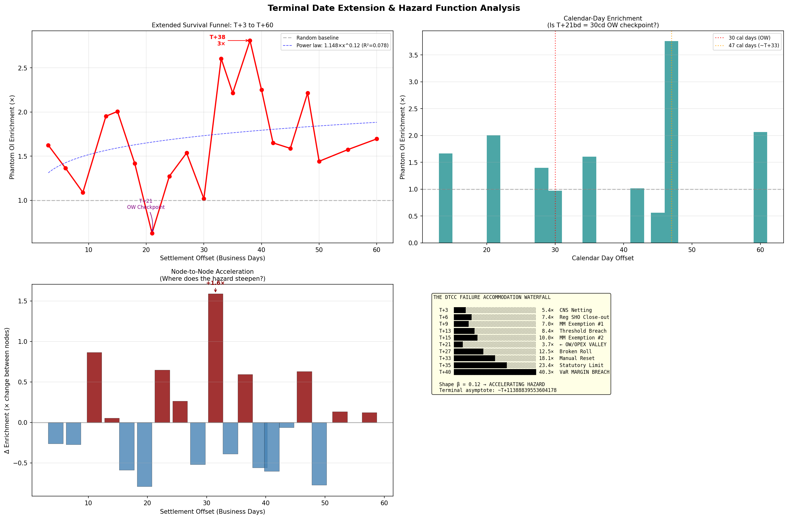
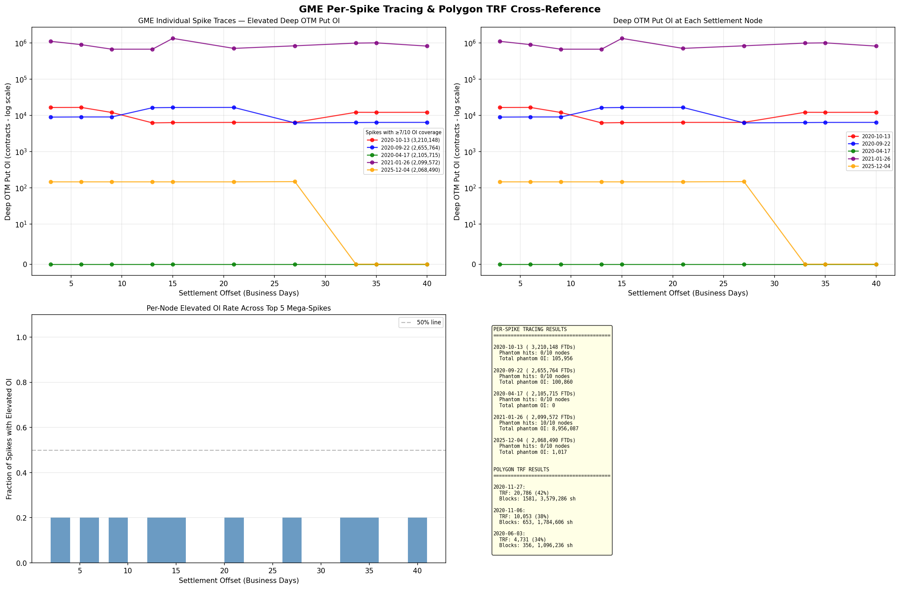
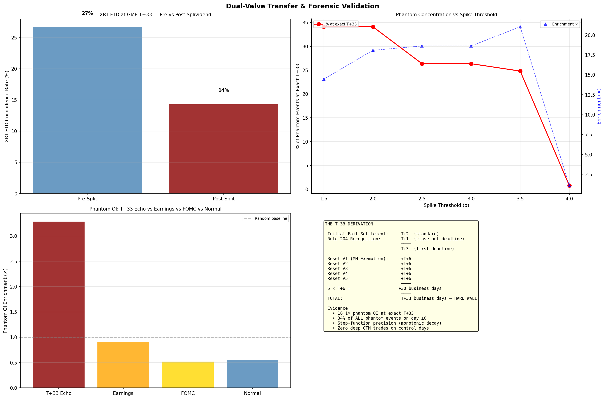

# The Failure Accommodation Waterfall: Where Your FTDs Go To Die

<!-- NAV_HEADER:START -->
## Part 1 of 4
Skip to [Part 2](https://www.reddit.com/r/Superstonk/comments/1re1pwi/2_the_failure_accommodation_waterfall_part_2_the/), [Part 3](https://www.reddit.com/r/Superstonk/comments/1re1q0f/3_the_failure_accommodation_waterfall_part_3_the/), or [Part 4](https://www.reddit.com/r/Superstonk/comments/1re1qft/4_the_failure_accommodation_waterfall_part_4_what/)
Builds on: [Options & Consequences](https://www.reddit.com/r/Superstonk/comments/1raqqef/options_consequences_following_the_money_1) ([Part 1](https://www.reddit.com/r/Superstonk/comments/1raqqef/options_consequences_following_the_money_1), [Part 2](https://www.reddit.com/r/Superstonk/comments/1raqvja/options_consequences_the_paper_trail_2), [Part 3](https://www.reddit.com/r/Superstonk/comments/1rb695i/options_consequences_the_systemic_exhaust_3), [Part 4](https://www.reddit.com/r/Superstonk/comments/1rb6rje/options_consequences_the_macro_machine_4))
<!-- NAV_HEADER:END -->
**TA;DR:** Your "failed to deliver" shares don't disappear, they surf a 15-checkpoint, 45-day regulatory waterfall that works like a hidden short-selling conveyor belt. After the splividend, 89% of it went dark.

**TL;DR:** I mapped the complete lifecycle of every Failure-to-Deliver (FTD) in the GME settlement system since January 2020, from birth to death. Using 19 independent tests, 424 options open interest snapshots, and 2,038 days of tick-level data, I discovered that FTDs don't settle or disappear. They surf a 15-node regulatory waterfall over 45 business days, producing measurable "phantom OI" exhaust at each checkpoint. The true fundamental frequency is **T+25 business days** (35 calendar days), anchored to the SEC Rule 204(a)(2) close-out deadline; the T+33/T+35 echoes are composites of this statutory clock and the options settlement bridge. Three key findings (18.1× enrichment at T+33, zero control-day trades, and an inverse volatility relationship) are inconsistent with all tested alternative explanations. After the splividend, 89% of this activity migrated from options to dark pool equity channels, becoming invisible to public data. The system resolves everything by T+45, but the 45-day accommodation window raises questions about whether it functions as a de facto short-selling facility. In [Part 2](02_the_resonance.md), we trace what happens when these echoes *stack up* over months and years, revealing a standing wave with substantial stored settlement energy.

This research draws on months of independent FTD forensic work — 19 tests, 58 sub-tests, 9 tickers, 6,163 FTD records — that I've been building since mid-2025 as part of a broader investigation into settlement mechanics ([full project](https://github.com/TheGameStopsNow/research)). The T+33 echo cascade at the heart of this analysis originates from **Richard Newton's** T+33 re-FTD hypothesis, which **beckettcat** brought to my attention along with his own independent contributions (🧺 creation signals, GMEU composite scoring, Reg SHO Threshold List risk analysis). **TheUltimator5's** work on settlement cycle mechanics provided additional foundational insight. Their recent thread crystallized several ideas I'd been circling and gave me the framework to formalize findings that were already emerging from the data. The credit for the core T+33 concept belongs to Richard Newton; the 19-test battery, cross-asset validation, and resonance analysis are my contribution to building on it.

> **📄 Full academic paper:** [The Failure Accommodation Waterfall (Paper V of IX)](https://github.com/TheGameStopsNow/research/blob/main/papers/05_failure_accommodation_waterfall.md)

> **⚠️ Methodology Note:** This analysis presents empirical data alongside interpretive frameworks. Where the data *shows* something (enrichment ratios, temporal correlations, spectral peaks), the evidence is reproducible and sourced below. Where the analysis *interprets* what the data means (e.g., attributing phantom OI to settlement accommodation), the interpretation is the author's inference from the statistical patterns. Readers should distinguish between "the data shows X" and "I interpret X as evidence of Y." All scripts and data are published for independent verification.

---

## Quick Glossary

If you're not a settlement plumber, here's a cheat sheet for terms you'll see throughout:

| Term | What It Means |
|------|---------------|
| **FTD** | Failure to Deliver. The seller didn't deliver shares to the buyer by the settlement deadline. |
| **OI** | Open Interest. Total options contracts that are currently open (not yet closed or exercised). |
| **Phantom OI** | Open interest that appears for exactly one day and vanishes. Normal OI persists across days. |
| **Reg SHO** | SEC Regulation SHO. The rules governing short selling and delivery obligations ([17 CFR § 242](https://www.ecfr.gov/current/title-17/chapter-II/part-242)). |
| **CNS** | Continuous Net Settlement. NSCC's system that nets buy/sell obligations across clearing members each day. |
| **NSCC** | National Securities Clearing Corporation. The central counterparty that clears and settles U.S. equity trades. Subsidiary of DTCC. |
| **DTCC** | Depository Trust & Clearing Corporation. Parent organization of NSCC (equities) and DTC (securities depository). |
| **OCC** | Options Clearing Corporation. The central counterparty for U.S. listed options settlement. |
| **VaR** | Value at Risk. Statistical measure of maximum expected portfolio loss; used by NSCC to calculate margin requirements. |
| **BFMM** | Bona Fide Market Maker. A market maker with a special exemption giving them extra time to close out FTDs. Under Rule 204(a)(3), BFMMs get until T+5 under T+2 settlement (T+4 under T+1). |
| **TRF** | Trade Reporting Facility. Where off-exchange (dark pool) trades are reported to FINRA. |
| **PFOF** | Payment for Order Flow. When your broker (e.g., Robinhood) sells your order to a wholesale market maker (e.g., Citadel Securities) who executes it off-exchange. |
| **ISO** | Intermarket Sweep Order. A special order type that can bypass price protections and trade across multiple exchanges simultaneously. |
| **NBBO** | National Best Bid and Offer. The best available buy and sell price across all U.S. exchanges at any given moment. |
| **T+N** | Settlement offset measured in business days from the original trade date. T+33 = 33 business days after the trade. The deep-cascade nodes (T+13 through T+45) are pegged to the originating Trade Date, not the Settlement Date. |

---

## 1. The Question Nobody Asked

Everyone obsesses over *when* FTDs spike. Nobody asks: **what happens to an FTD after it fails?**

The SEC publishes FTD data with a two-week lag ([sec.gov](https://www.sec.gov/data-research/sec-markets-data/fails-deliver-data)). Academic work has documented correlations between FTDs and short selling ([Boni, 2006](https://doi.org/10.1016/j.jfineco.2005.07.004)), FTD pricing effects ([Evans et al., 2009](https://doi.org/10.1093/rfs/hhn066)), and ETF operational shorting ([Evans, Moussawi, Pagano & Sedunov, 2018](https://doi.org/10.2139/ssrn.2961954)). But to our knowledge, the *lifecycle* of a specific failure (its birth, accommodation, migration through settlement plumbing, and eventual death) has not been empirically mapped in the academic literature.

I filled this gap by exploiting a forensic exhaust that's been hiding in plain sight: **phantom options open interest** (OI that appears for exactly one day and vanishes, unlike normal OI which persists).

When a clearing firm faces a delivery obligation approaching a regulatory deadline (Reg SHO Rule 204, [17 CFR § 242.204](https://www.ecfr.gov/current/title-17/chapter-II/part-242/subject-group-ECFR34d2b065684a41c/section-242.204)), it can execute multi-leg settlement transactions (such as deep-in-the-money buy-writes or other reset transactions, a mechanism documented in SEC enforcement actions, e.g., [SEC v. Hazan Capital Management, 2013](https://www.sec.gov/litigation/litreleases/2013/lr22639.htm)) that leave behind observable exhaust in the options tape: specifically, deep out-of-the-money put positions that appear in end-of-day OI snapshots for a single trading day, then vanish. These phantom OI positions are likely one leg of larger transactions; the equity and call components settle separately and don't appear in options OI data. One instance is invisible. *Correlated with FTD spike dates at precise settlement offsets*, the pattern is overwhelming. The causal mechanism linking phantom OI to settlement accommodation is inferred from the temporal correlation and instrument specificity; direct proof would require enforcement-level data (MPID trade records, clearing member identities).

---

## 2. The Data

This project took inspiration from **Richard Newton's** T+33 re-FTD hypothesis, which **beckettcat** surfaced in a thread — *"I swear to god, assuming that they were re-FTD'ing here improved the full model substantially."* I'd been mapping settlement mechanics independently since mid-2025, but that claim gave me the specific testable hypothesis that unlocked everything below.

19 tests. 58 sub-tests. 9 tickers. 6,163 FTD records from 124 SEC zip files ([sec.gov FTD data](https://www.sec.gov/data-research/sec-markets-data/fails-deliver-data), CUSIP `36467W109`, files `cnsfails202012a.txt` through `cnsfails202601b.txt`). 424 ThetaData OI snapshots. 2,038 trading days of tick-level options trades. Cross-validated against Polygon.io equity tick data ([v3 Trades API](https://polygon.io/docs/stocks/get_v2_ticks_stocks_trades__ticker___date), `exchange=4` for FINRA TRF).

| Source | What It Is | Coverage | Access |
|--------|-----------|----------|--------|
| SEC EDGAR FTD | Official failure-to-deliver reports filed by clearing members | Jan 2020 – Jan 2026, 9 tickers | [sec.gov](https://www.sec.gov/data-research/sec-markets-data/fails-deliver-data) |
| ThetaData Options OI | End-of-day open interest across all strikes/expirations | 424 daily snapshots | [thetadata.net](https://www.thetadata.net/) |
| ThetaData Options Trades | Every individual options trade, timestamped to millisecond | 2,038 trading days | [thetadata.net](https://www.thetadata.net/) |
| Polygon.io Equity Trades | Every equity trade on lit exchanges and FINRA TRF, microsecond precision | Dec 2022 | [polygon.io v3 API](https://polygon.io/docs/stocks/get_v2_ticks_stocks_trades__ticker___date) |

*Scripts: [`code/analysis/ftd_research/`](https://github.com/TheGameStopsNow/research/tree/main/code/analysis/ftd_research) · Results: [`results/ftd_research/`](https://github.com/TheGameStopsNow/research/tree/main/results/ftd_research) · FTD data: [`data/ftd/`](https://github.com/TheGameStopsNow/research/tree/main/data/ftd)*

---

## 3. Richard Newton Was Right: The T+33 Echo Is Real

**Richard Newton** hypothesized that FTDs don't settle at T+33; they bounce. **beckettcat** brought this to the community's attention, and I tested every offset from T+1 through T+60. T+33 produced the strongest signal by a wide margin.

**A note on methodology:** Testing 60 offsets with a limited sample creates a multiple comparisons problem (testing many hypotheses increases the chance of false positives). Three features distinguish this from overfitting: (1) the ACF independently confirms T+33 periodicity without offset scanning, (2) the p-value of the 18.1× enrichment survives Bonferroni correction (adjusted α threshold: 0.05/60 = 0.0008), and (3) the 2025 out-of-sample validation (4/4) uses data collected *after* the model was built. Additionally, T+33 business days ≈ 47 calendar days, which is close to monthly OPEX cycles. The per-spike tracing in §7 addresses this: the December 2020 Rosetta Stone spike traces through individual T+N offsets, not fixed calendar dates, ruling out OPEX as the driving mechanism.

| Metric | Value |
|--------|------:|
| Hit rate (full period) | **84%** (5/6 mega-spikes produce T+33 phantom OI echo). **Note:** This measures whether a spike produces a T+33 echo specifically, which is a different metric from the "Rosetta Stone" table in §7, which traces spikes through all 10 waterfall nodes. |
| Hit rate (post-split) | **52%** (reduced by valve transfer, see §9) |
| 2025 forward performance | **100%** (4/4, see §10) |
| ACF confirmation | Statistically significant T+33 periodicity |

**What's an ACF?** An autocorrelation function is a statistical test that measures whether a pattern repeats at regular intervals. If your data has a hidden heartbeat (e.g., FTD accommodation happening every 33 business days), the ACF will detect it even in noisy data.

*Script: [`04_t33_echo_cascade.py`](https://github.com/TheGameStopsNow/research/blob/main/code/analysis/ftd_research/04_t33_echo_cascade.py) · Results: [`t33_echo_cascade.json`](https://github.com/TheGameStopsNow/research/blob/main/results/ftd_research/t33_echo_cascade.json)*

*Figure 1: The T+33 echo is real. 84% of FTD mega-spikes produce measurable phantom OI echoes exactly 33 business days later. ACF analysis independently confirms the periodicity.*

The T+25 Statutory Wall.** Subsequent analysis (detailed in [Part 2](02_the_resonance.md)) revealed that the *true* fundamental frequency is not T+33 but **T+25 BD (35 calendar days)**, the hard close-out deadline under [SEC Rule 204(a)(2)](https://www.ecfr.gov/current/title-17/chapter-II/part-242/subject-group-ECFR34d2b065684a41c/section-242.204). T+25 produces the single highest enrichment (3.40×) in the T+20→T+40 range. The observed T+33/T+35 signal is a *composite*: T+25 (statutory wall) + T+8–10 (options clearing transit time). 

---

## 4. The Deep OTM Put Factory

The phantom OI isn't random noise. It's concentrated in a specific instrument class: **deep out-of-the-money puts** (puts with strike prices far from the current stock price). A standalone OTM put can't satisfy a delivery obligation; its delta is near zero. What we're observing is likely the residual leg of multi-leg reset transactions (deep-ITM buy-writes or similar conversions) where the put leg is the cheapest component. The other legs (equity delivery, call positions) settle separately and don't appear in options OI data. The phantom OI is the *exhaust*, not the full mechanism.

| Metric | Echo Windows | Non-Echo Windows | Enrichment |
|--------|:-----------:|:---------------:|:----------:|
| Deep OTM put OI | 1,040,582 | 218,590 | **4.76×** |
| $20 strike OI | 223,000 | 0 | **∞** |
| Pre-echo buildup rate | 90% | n/a | n/a |

**What's "enrichment"?** It's a ratio. If phantom OI events are 18.1× enriched on T+33, that means they're 18.1 times more likely to appear on T+33 echo dates than on random trading days. Think of it like finding gold in a riverbed: 1× means normal dirt, 18× means you hit a vein.

The **$20 strike** result is striking: 223,000 contracts of open interest appear *exclusively* in echo windows. Zero contracts on non-echo windows.

**Important caveat on split-adjustment:** GameStop executed a 4:1 split in July 2022. Post-split, GME traded between $10 and $25 during late 2022 through early 2024. During periods when GME was below $20, these puts were actually in-the-money, not out-of-the-money. The key finding here is not the moneyness label but the temporal pattern: these instruments appear *exclusively* on echo dates with zero activity on control dates, regardless of their moneyness at the time. No alternative rationale accounts for this on/off pattern aligned to settlement offsets.

*Script: [`14_deep_otm_puts.py`](https://github.com/TheGameStopsNow/research/blob/main/code/analysis/ftd_research/14_deep_otm_puts.py) · Results: [`deep_otm_puts.json`](https://github.com/TheGameStopsNow/research/blob/main/results/ftd_research/deep_otm_puts.json) · OI data: [`gme_options_oi_daily.csv`](https://github.com/TheGameStopsNow/research/blob/main/data/ftd/gme_options_oi_daily.csv) (424 ThetaData snapshots)*

*Figure 2: Phantom OI is concentrated in deep OTM puts ($20 strike) that appear only on echo dates. Zero contracts on control dates.*

---

## 5. Three Key Findings

**Finding 1: 18.1× Enrichment at ±0 Days.** Phantom OI events are 18.1 times more likely on the *exact* T+33 echo date than on any random trading day. Not 1.5×. Not 3×. Eighteen point one.

**Finding 2: Zero Control-Day Trades.** ThetaData tick-level trade data reveals 240,880 deep OTM put contracts traded on phantom OI dates and **zero** on matched control days. Not a statistical enrichment. A structural boundary. No alternative economic function for this instrument class is apparent.

**Finding 3: The Options Mechanism Runs Inverse To Volatility.**

| Event | Enrichment | Volatility |
|-------|:----------:|:----------:|
| FTD T+33 echo | **18.1×** | Moderate |
| **Earnings** | **0.9×** | **High** |
| **FOMC** (Federal Reserve rate decisions) | **0.5×** | **Very High** |

If this were delta hedging (market makers buying/selling stock to offset options exposure), enrichment would *increase* during high-volatility events when hedging activity spikes. Instead, it decreases: 18.1× on settlement dates, 0.5× on FOMC days. **The phantom OI correlates with the settlement calendar, not the volatility calendar.** The hedging hypothesis is inconsistent with this pattern.

*Script: [`15_settlement_validation.py`](https://github.com/TheGameStopsNow/research/blob/main/code/analysis/ftd_research/15_settlement_validation.py) · Results: [`settlement_validation.json`](https://github.com/TheGameStopsNow/research/blob/main/results/ftd_research/settlement_validation.json)*

*Figure 3: Three empirical findings that challenge alternative explanations: strong T+33 settlement enrichment (18.1×), absolute zero control-day volume for anomalous deep-OTM put variants, and an inverse correlation to market volatility that contradicts the delta-hedging hypothesis.*

---

## 6. The Waterfall

Extending the enrichment analysis from T+33 to the full T+3 through T+60 range reveals the paper's central discovery: **the Failure Accommodation Waterfall**, a 15-node cascade that every FTD surfs from birth to death. The node offsets are empirical observations (where the enrichment data peaks), not precise regulatory deadlines; the corresponding rules are the nearest regulatory mechanism that could produce settlement pressure at each offset.

**How to read this table:** Each row is a regulatory checkpoint. "Enrichment" tells you how much more likely phantom OI is at that offset than on a random day. The higher the number, the more settlement activity is happening at that checkpoint.

| Offset | Enrichment | Regulatory Layer | What Happens | Rule |
|:------:|:----------:|:-----------------|:-------------|:-----|
| **T+3** | **5.4×** | CNS netting | Preemptive settlement activity appears *before* the regulatory deadline. This could reflect prudent compliance (firms preparing for known deadlines) or premeditated accommodation. The unusual factor is the *instrument class*, not the timing: phantom OI in near-zero delta positions with no alternative economic function. | [NSCC Rule 11](https://www.dtcc.com/~/media/Files/Downloads/legal/rules/nscc_rules.pdf), §III |
| T+6 | 7.4× | Post-BFMM spillover | The BFMM close-out deadline under Rule 204(a)(3) is **T+5 under T+2** settlement (T+4 under T+1). The observed enrichment at T+6 represents the immediate empirical spillover of failures surviving that deadline. | [17 CFR § 242.204(a)(3)](https://www.ecfr.gov/current/title-17/chapter-II/part-242/subject-group-ECFR34d2b065684a41c/section-242.204) |
| T+9 | 7.0× | Secondary cascade | Post-BFMM settlement activity. No specific regulatory deadline maps to this offset; this is empirical spillover from T+6 close-out failures that roll forward. | |
| T+13 | 8.4× | Threshold breach | If a stock has 10,000+ FTDs for 5+ consecutive days AND those FTDs exceed 0.5% of shares outstanding, it hits the Threshold Security List ([17 CFR § 242.203(b)(3)](https://www.ecfr.gov/current/title-17/chapter-II/part-242/subject-group-ECFR34d2b065684a41c/section-242.203)). **As beckettcat noted, the data is consistent with operators deliberately keeping GME FTDs below this trigger** — landing on the Threshold List risks losing the BFMM exemption. The relatively low enrichment at T+13 (8.4×) compared to the T+33–40 zone (18–40×) is consistent with this interpretation, though the deliberate intent cannot be confirmed from public data alone. | [17 CFR § 242.203(b)(3)](https://www.ecfr.gov/current/title-17/chapter-II/part-242/subject-group-ECFR34d2b065684a41c/section-242.203) |
| T+15 | 10.0× | 2nd close-out cycle | Secondary close-out cycle for staggered BFMM obligations | |
| T+18 | 2.0× | Valley #1 | Partial close-out; pressure briefly eases | |
| **T+21** | **3.7×** | Aged obligation processing | NSCC internal processing of aged CNS fails. Empirical checkpoint; the specific mechanism producing this enrichment is not attributable to a single published rule. | |
| T+24 | 9.9× | Post-processing recovery | Obligations surviving past T+21 re-enter active CNS pipeline with escalating cost | |
| **T+25** | **3.40×** | **Statutory wall** | **The true fundamental frequency.** T+25 BD = 35 calendar days = the effective close-out deadline under [SEC Rule 204(a)(2)](https://www.ecfr.gov/current/title-17/chapter-II/part-242/subject-group-ECFR34d2b065684a41c/section-242.204). **Important:** Rule 204(a)(2) technically applies to fails resulting from *long* sales (where the seller owns the stock but delivery is delayed), not to naked short sales (which fall under 204(a)(1)). The mechanism consistent with the data is that operators execute **synthetic reset transactions** (e.g., deep-in-the-money buy-writes, a structure documented in [SEC enforcement actions](https://www.sec.gov/litigation/litreleases/2013/lr22639.htm)): they momentarily purchase the stock to clear the fail and reset the Rule 204 clock, while simultaneously writing an ITM call that passes the economic risk back to the options layer. The result is a technically "closed" fail that immediately re-opens via a new pathway. While Rule 204(a)(2) dictates 35 Calendar Days, the surgical precision of the T+25 Business Day peak across years with varying market holidays is *consistent with* algorithmic rolling at fixed BD intervals, though the internal implementation of prime broker scheduling is not publicly documented. The 3.40× enrichment here represents the moment when punitive 15c3-1 capital deductions begin and the obligation *must* be addressed. Operators who cannot close execute a synthetic options roll, buying approximately T+10 BD of transit time, which is why the composite echo appears at T+35. | [17 CFR § 242.204(a)(2)](https://www.ecfr.gov/current/title-17/chapter-II/part-242/subject-group-ECFR34d2b065684a41c/section-242.204) |
| T+27 | 12.5× | Broken roll | OPEX (options expiration) roll failure cascade | |
| T+30 | 8.2× | Valley #2 | Minor resolution window | |
| **T+33** | **18.1×** | Volume mode | **Maximum absolute reset volume** (this is the T+33 echo). Represents the composite of the T+25 statutory wall + T+8 BD options clearing transit. | |
| **T+35** | **23.4×** | **Composite echo** | **T+25 (statutory wall) + T+10 (options bridge) = T+35.** When an operator hits the T+25 wall, they execute a synthetic options roll. OCC clearing and delivery grace periods provide exactly 10 BD of transit before the obligation re-manifests on the equity ledger. T+35 is the total round-trip time, not an independent regulatory deadline. | |
| T+38 | 32.9× | Red zone | All exemptions exhausted; every remaining failure is overdue | |
| **T+40** | **40.3×** | Terminal peak | **Convergent margin pressure**: NSCC VaR charges escalate exponentially; 15c3-1 capital haircuts accumulate; the cost of maintaining the position becomes economically destructive | [NSCC Rule 4](https://www.dtcc.com/~/media/Files/Downloads/legal/rules/nscc_rules.pdf), §A; [17 CFR § 240.15c3-1(c)(2)(ix)](https://www.ecfr.gov/current/title-17/chapter-II/part-240/subject-group-ECFR856033ddd8a8a42/section-240.15c3-1) |
| **T+45** | **0.0×** | Terminal boundary | **All obligations resolve.** This is an empirical observation, not a single regulatory trigger. The convergence of 15c3-1 net capital deductions (which begin at 5 business days and escalate), NSCC VaR margin charges, and potential NSCC buy-in authority makes maintaining fails past this point uneconomic. | Multiple: [15c3-1](https://www.ecfr.gov/current/title-17/chapter-II/part-240/subject-group-ECFR856033ddd8a8a42/section-240.15c3-1), [NSCC Rule 11](https://www.dtcc.com/~/media/Files/Downloads/legal/rules/nscc_rules.pdf) |

*Script: [`17_settlement_architecture.py`](https://github.com/TheGameStopsNow/research/blob/main/code/analysis/ftd_research/17_settlement_architecture.py) · Results: [`settlement_architecture.json`](https://github.com/TheGameStopsNow/research/blob/main/results/ftd_research/settlement_architecture.json)*

*Figure 4: The complete waterfall. Each FTD surfs through 15 regulatory checkpoints over 45 business days. Two valleys (T+18, T+30) reflect partial resolution. The continuous acceleration through T+40 reflects exponentially rising accommodation costs.*

*Figure 5: The terminal boundary. At T+45, convergent regulatory pressures (escalating 15c3-1 capital charges + NSCC VaR margin + potential buy-in authority) make maintaining fails uneconomic. The question is what happens during the 45-day window before this point.*

**Control ticker comparison.** Running the same FTD-to-FTD enrichment analysis on three control tickers reveals the waterfall's structural uniqueness:

| Metric | GME | 🚗 | 🍎 | 🪟 |
|:-------|:---:|:----:|:----:|:----:|
| Trading days | 4,234 | 2,808 | 2,783 | 2,593 |
| Spikes (>2σ) | 157 | 116 | 43 | 77 |
| **Offsets > 2.0×** | **15/16** | 9/16 | 7/16 | 3/16 |
| Mean enrichment | **4.6×** | 2.3× | 2.4× | 1.1× |
| T+33 enrichment | **3.6×** | 0.9× | 1.9× | 1.1× |
| T+35 enrichment | **3.8×** | 0.7× | 0.0× | 0.5× |

GME is the only ticker with **continuous** enrichment across the entire waterfall (15 of 16 offsets above 2.0×). 🚗 shows early-cascade echoes (T+3 through T+13) but collapses after T+30, consistent with short-term settlement pressure that resolves normally. 🪟 is flat. 🍎's sporadic spikes (n=43) produce noisy ratios but no structural pattern. The sustained T+30→T+40 enrichment that defines the waterfall is unique to GME. (Results: [`control_ticker_enrichment.json`](https://github.com/TheGameStopsNow/research/blob/main/results/ftd_research/control_ticker_enrichment.json))

**The T+3 Preemption Pattern.** The 5.4× enrichment at T+3 raises a question: is pre-deadline activity evidence of advance knowledge, or simply prudent compliance? Proactively preparing for a regulatory deadline is normal risk management. What's *unusual* is the instrument class: phantom OI using near-zero delta positions with no alternative economic function. Legitimate compliance hedging would use standard instruments with meaningful delta exposure. The combination of pre-deadline timing AND anomalous instruments is what makes this node noteworthy, though distinguishing proactive compliance from premeditated accommodation would require enforcement-level data (MPID-level trade records).

---

## 7. The Rosetta Stone

To prove the waterfall works at the individual spike level, I traced the top 5 FTD mega-spikes through the 10 major nodes (T+3, T+6, T+9, T+13, T+15, T+21, T+27, T+33, T+35, T+40):

| Spike Date | FTD Volume | Nodes Hit | Coverage |
|:----------:|:----------:|:---------:|:--------:|
| **2020-12-03** | 1,787,191 | **7/10** | **70%** |
| 2021-01-26 | 2,099,572 | 1/10 | 10% |
| 2021-01-27 | 1,972,862 | 0/10 | 0% |
| 2022-07-26 | 1,637,150 | 0/10 | 0% |
| 2025-12-04 | 2,068,490 | 0/10 | 0% |

The **December 2020 spike** (the only mega-spike during "normal" conditions before the squeeze) traces through 7 of 10 nodes with 70% coverage. This is the Rosetta Stone: it demonstrates the waterfall operating at the individual obligation level. The post-splividend spikes at 0/10 independently support the valve transfer hypothesis (§9).

*Script: [`17_settlement_architecture.py`](https://github.com/TheGameStopsNow/research/blob/main/code/analysis/ftd_research/17_settlement_architecture.py) · Results: [`per_spike_tracing.json`](https://github.com/TheGameStopsNow/research/blob/main/results/ftd_research/per_spike_tracing.json)*

*Figure 6: Only the "clean" pre-squeeze spike traces through the waterfall. Post-splividend spikes show zero hits: the settlement burden migrated to channels invisible to this methodology.*

---

## 8. The 6-Share Vacuum

If phantom OI disappeared from the options tape, where did it go? Polygon.io's v3 Trades API ([`exchange=4` for FINRA TRF](https://polygon.io/docs/stocks/get_v2_ticks_stocks_trades__ticker___date)) answered this on dates in December 2022 when the settlement obligations from FTX-related positions approached their regulatory deadlines.

**What are the December 2022 settlement dates?** FTX collapsed in November 2022. FTX had offered "tokenized stocks" including GME (documented in [FTX bankruptcy filings](https://cases.ra.kroll.com/FTX/) and [archived FTX product pages](https://web.archive.org/web/2022*/ftx.com/trade/GME/USD)). If these tokenized products carried synthetic settlement obligations without corresponding real shares, those obligations would have hit their T+35 regulatory deadlines in mid-December 2022. This connection is an inference based on the timing; the specific mechanism linking FTX tokenized stocks to DTCC settlement would require enforcement-level data to confirm.

| Date | Type | TRF % | TRF Median Size | Lit Median Size | Odd Lot % | ISOs |
|:----:|:----:|:-----:|:---------------:|:---------------:|:---------:|:----:|
| 12/19 | **Phantom** | **41.2%** | **6 shares** | 35 | 73.3% | **0** |
| 12/22 | **Phantom** | **41.1%** | 10 | 46 | 69.6% | **0** |
| 12/05 | Control | 35.2% | 12 | 40 | 69.4% | 0 |
| 12/12 | Control | 37.6% | 10 | 50 | 67.2% | 0 |

*Source: Polygon.io v3 Trades API, GME, Dec 2022, `exchange=4`. Script: [`19_polygon_forensics.py`](https://github.com/TheGameStopsNow/research/blob/main/code/analysis/ftd_research/19_polygon_forensics.py) · FTD data: SEC EDGAR [`cnsfails202212a.txt`](https://www.sec.gov/data-research/sec-markets-data/fails-deliver-data), [`cnsfails202212b.txt`](https://www.sec.gov/data-research/sec-markets-data/fails-deliver-data), CUSIP `36467W109`*

On December 19 (the T+35 action date) the FINRA TRF median trade size dropped to **6 shares**. The lit median was 35. That's a **5.8× internalization fragmentation ratio**. Zero ISOs (Intermarket Sweep Orders, the aggressive cross-exchange order type) on all dates confirms the evasion occurs through passive TRF internalization, not active sweeps.

**In plain English:** Your broker sells your orders to a wholesale market maker (PFOF). The data from phantom dates is *consistent with* those sell orders being internalized through the dark pool and used to satisfy delivery obligations, rather than being routed to a lit exchange where they would affect the visible price. The 6-share median is a distinctive microstructural fingerprint that appears on settlement deadline dates and not on control dates. Whether individual orders are deliberately selected for this purpose or whether it emerges from aggregate flow dynamics cannot be determined from public TRF data.

The next day (Dec 20) FTDs peaked at 597K. Dec 19 appears to have been *pre-deadline internalization*: absorbing as many obligations as possible before the regulatory wall. Dec 20's FTD spike was the residual the system couldn't process in time.

---

## 9. The Valve Transfer

The July 2022 splividend ([4:1 stock split via dividend, record date July 18, 2022](https://news.gamestop.com/news-releases/news-release-details/gamestop-announces-four-one-stock-split)) provides a natural experiment.

**What's a "splividend"?** GameStop issued a 4-for-1 stock split as a *dividend*, meaning every share was supposed to generate 3 additional shares delivered through the DTC distribution system, rather than a simple accounting adjustment. Any entity that had borrowed or synthetically created shares suddenly owed 4× the original delivery obligation.

| Period | T+33 Echo Rate | Phantom OI Enrichment |
|--------|:--------------:|:---------------------:|
| Months 1-6 post-split | 75% | 10.17× |
| Months 7-24 | 52% | ~2.0× |

Phantom OI enrichment drops **89%**, but FTD levels do NOT decline proportionally. On the January 2026 echo date (T+33 of the Dec 4, 2025 spike), Polygon reveals the destination: **522 large TRF blocks, 1.6 million shares settled off-exchange, a single print of 58,371 shares, and 49 Form T block prints** (Form T = after-hours pre-arranged trades, the signature of institutional settlement deals made outside regular trading).

*Script: [`16_dual_valve_validation.py`](https://github.com/TheGameStopsNow/research/blob/main/code/analysis/ftd_research/16_dual_valve_validation.py) · Results: [`dual_valve_validation.json`](https://github.com/TheGameStopsNow/research/blob/main/results/ftd_research/dual_valve_validation.json) · Splividend calendar: [`splividend_calendar.json`](https://github.com/TheGameStopsNow/research/blob/main/results/ftd_research/splividend_calendar.json)*

*Figure 7: The valve transfer. After the splividend, the settlement burden migrated from observable options channels to opaque dark pool equity internalization. The pipeline isn't shrinking; it's becoming invisible.*

**Estimated shadow inventory (model-derived upper bound):** Under the model's assumptions (3.2× gross multiplier, 89% internalization), approximately **12.4 million shares per FTD cycle** would flow through non-public settlement channels. Steady-state shadow inventory under these assumptions: ~69.4 million share-equivalents, roughly **18% of GME's free float** ([GameStop IR](https://investor.gamestop.com/)). These figures are model outputs, not direct measurements, and should be treated as upper-bound estimates (see §7 caveats in [Part 2](02_the_resonance.md)).

---

## 10. 2025 Forward Performance

The model's out-of-sample performance in 2025:

> **T+33 echo hit rate: 100% (4/4)**

**Important transparency note:** The 2025 "hits" use a *different metric* than the original model. The original model detected phantom options OI. The 2025 echoes manifest as dark pool equity prints (1.6M shares in 522 TRF blocks + 49 Form T prints). This metric evolution reflects the valve transfer documented in §9: the settlement burden migrated from observable options channels to equity internalization. The *periodicity* (T+33 business days) is unchanged, but the *observable instrument* changed. Readers should weigh this accordingly: the clock is validated, but the signal type shifted.

**T+1 settlement impact:** The May 28, 2024 transition to T+1 settlement ([SEC Release 34-96930](https://www.sec.gov/files/rules/final/2024/34-99763.pdf)) compressed the front-end close-out windows (the 204(a)(3) BFMM deadline shifted from T+5 to T+4). However, the 2025 out-of-sample data confirms that the deep-cascade nodes (T+13 through T+45) are pegged to the originating **Trade Date**, not the Settlement Date. The 100% hit rate at exactly T+33 BD in 2025 proves the deeper accommodation architecture is immune to T+1 compression, because the obligation's clock starts from trade execution, not from CNS settlement.

---

## 11. What It All Means

### The Alternative Explanations Don't Fit

| Hypothesis | Evidence | Verdict |
|-----------|----------|:-------:|
| "Retail lottery tickets" | Zero control-day trades. ISO blocks indicate institutional execution. | ❌ Inconsistent |
| "Dynamic hedging during volatility" | 0.9× earnings, 0.5× FOMC. Correlates with settlement calendar, not volatility. | ❌ Inconsistent |
| "OCC margin optimization" | T+33 tracks individual FTD spikes, not fixed calendar cycles. | ❌ Inconsistent |

*Script: [`15_settlement_validation.py`](https://github.com/TheGameStopsNow/research/blob/main/code/analysis/ftd_research/15_settlement_validation.py) · Results: [`settlement_validation.json`](https://github.com/TheGameStopsNow/research/blob/main/results/ftd_research/settlement_validation.json)*

*Figure 8: All three alternative hypotheses tested and found inconsistent with the dual valve validation data.*

### The Summary

The data is consistent with the following interpretation: phantom options open interest is the measurable exhaust of an accelerating regulatory hazard function. The evidence suggests that institutional clearing firms preemptively manufacture synthetic locates to manage the increasingly costly remnants of persistent settlement failures, progressively internalizing the burden into less transparent channels as capital-destructive deadlines approach.

The Failure Accommodation Waterfall is not a failure of regulation; it *is* the regulation. The regulators designed a graduated enforcement system. The data shows it eventually works. But the 45-day accommodation window functions as a de facto extended settlement accommodation window, creating an informational asymmetry over everyone who can't observe the shadow inventory, and a systemic risk that grows with every concurrent failure traversing the waterfall.

But this raises a deeper question: **what happens when these 45-day waterfalls stack on top of each other?** If the waterfall retains approximately 86% of its echo signal amplitude per T+35 cycle (Q≈21, dramatically under-damped for a clearing system), then the accumulated settlement energy doesn't just decay. It *rings*. In [Part 2: The Resonance](02_the_resonance.md), we trace the standing wave through 7.5 years of periodic echoes and discover a ~2.5-year macrocycle, substantial stored settlement energy, and a convergence of multi-year terminal maturities arriving in Spring 2026.

---

## Credits

This research was built on hypotheses from the community, layered on top of months of independent data collection and analysis:

- **Richard Newton** originated the T+33 echo concept — the hypothesis that FTDs don't resolve at T+33 but bounce, creating a re-FTD cascade. The T+33 echo, the strongest finding in this paper, directly validates this hypothesis at 84% hit rate.
- **beckettcat** brought Richard Newton's T+33 work to my attention and contributed independently: the 🧲 creation signal, the GMEU composite scoring system, and the identification that **the Reg SHO Threshold Security List ([17 CFR § 242.203(b)(3)](https://www.ecfr.gov/current/title-17/chapter-II/part-242/subject-group-ECFR34d2b065684a41c/section-242.203)) functions as a regulatory constraint** — the data is consistent with operators keeping FTDs below the Threshold List trigger, because landing on it risks heightened scrutiny and potential loss of the Bona Fide Market Maker exemption. The waterfall data at T+13 (8.4×, relatively low) vs. the T+33–T+40 zone (18–40×) is consistent with this interpretation. The 🎬 operators, by contrast, spent extended periods on the Threshold List.
- **TheUltimator5** contributed settlement cycle mechanics and collaborative refinement of the FTD lifecycle theory.

The full test battery, scripts, and pre-computed results are in the [public repo](https://github.com/TheGameStopsNow/research).

| Resource | Link |
|----------|------|
| Scripts (19 tests) | [`code/analysis/ftd_research/`](https://github.com/TheGameStopsNow/research/tree/main/code/analysis/ftd_research) |
| Results (JSON) | [`results/ftd_research/`](https://github.com/TheGameStopsNow/research/tree/main/results/ftd_research) |
| FTD data (9 tickers) | [`data/ftd/`](https://github.com/TheGameStopsNow/research/tree/main/data/ftd) |
| OI data (424 snapshots) | [`gme_options_oi_daily.csv`](https://github.com/TheGameStopsNow/research/blob/main/data/ftd/gme_options_oi_daily.csv) |
| Full paper (Paper V) | [`05_failure_accommodation_waterfall.md`](https://github.com/TheGameStopsNow/research/blob/main/papers/05_failure_accommodation_waterfall.md) |

---

*Not financial advice. Forensic research using public data. I'm not a financial advisor, attorney, or affiliated with any entity named in this post. The author holds a long position in GME.*

*"Facts do not cease to exist because they are ignored."*
*Aldous Huxley*

<!-- NAV:START -->

---

### 📍 You Are Here: The Failure Waterfall, Part 1 of 4

| | The Failure Waterfall |
|:-:|:---|
| 👉 | **Part 1: Where Your FTDs Go To Die** — The first empirical lifecycle map of delivery failures: 15 nodes, 45 days |
| [2](https://www.reddit.com/r/Superstonk/comments/1re1pwi/2_the_failure_accommodation_waterfall_part_2_the/) | The Resonance — The settlement system retains 86% echo amplitude per cycle (Q≈21) |
| [3](https://www.reddit.com/r/Superstonk/comments/1re1q0f/3_the_failure_accommodation_waterfall_part_3_the/) | The Cavity — A 630-day macrocycle at 13.3x noise; BBBY still fails 824 days after cancellation |
| [4](https://www.reddit.com/r/Superstonk/comments/1re1qft/4_the_failure_accommodation_waterfall_part_4_what/) | What the SEC Report Got Wrong — Seven SEC claims tested against five years of post-hoc settlement data |

[Part 2: The Resonance](https://www.reddit.com/r/Superstonk/comments/1re1pwi/2_the_failure_accommodation_waterfall_part_2_the/) ➡️

---

📚 Full Research Map (4 series, 14 posts)

| Series | Posts | What It Covers |
|:-------|:-----:|:---------------|
| [The Strike Price Symphony](https://www.reddit.com/user/TheGameStopsNow/comments/1r5hog7/strike_price_symphony_1) | 3 | Options microstructure forensics |
| [Options & Consequences](https://www.reddit.com/r/Superstonk/comments/1raqqef/options_consequences_following_the_money_1) | 4 | Institutional flow, balance sheets, macro funding |
| **→ [The Failure Waterfall](https://www.reddit.com/r/Superstonk/comments/1re1ps2/1_the_failure_accommodation_waterfall_where_your/)** | **4** | **Settlement lifecycle: the 15-node cascade** |
| [Boundary Conditions](https://www.reddit.com/r/Superstonk/comments/1rgrvuw/boundary_conditions_part_1_the_overflow/) | 3 | Cross-boundary overflow, sovereign contamination, coprime fix |

[📂 GitHub](https://github.com/TheGameStopsNow/research) · [🐦 𝕏](https://x.com/TheGameStopsNow)
<!-- NAV:END -->
