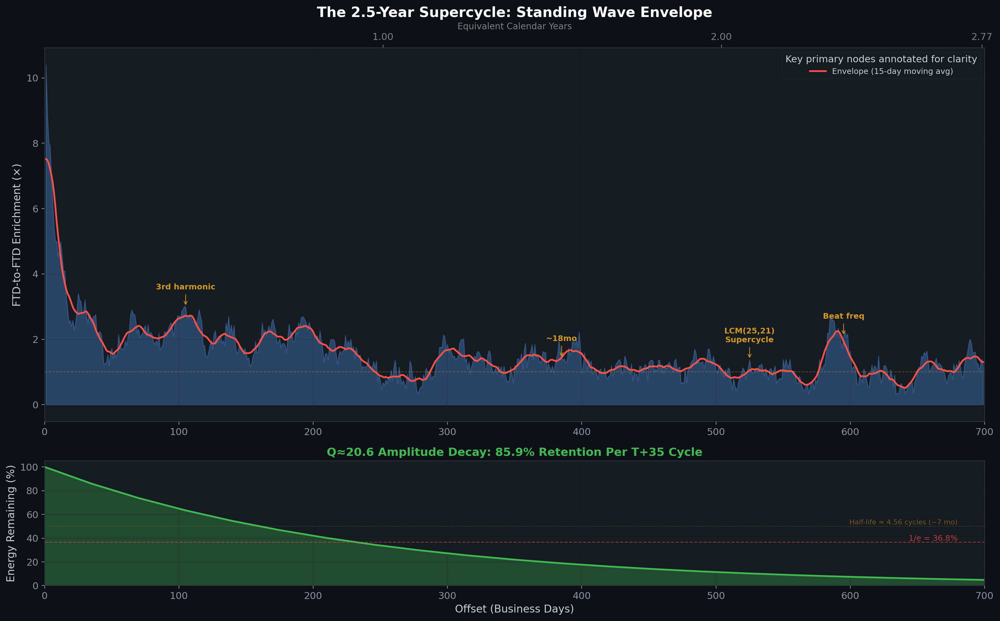
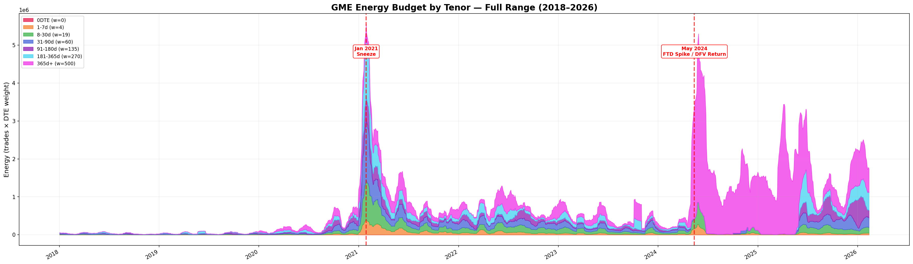
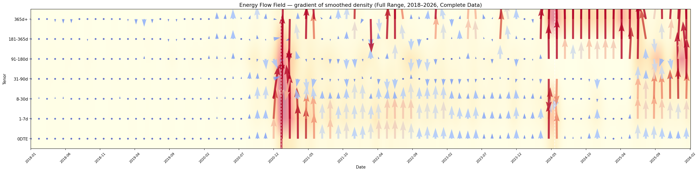
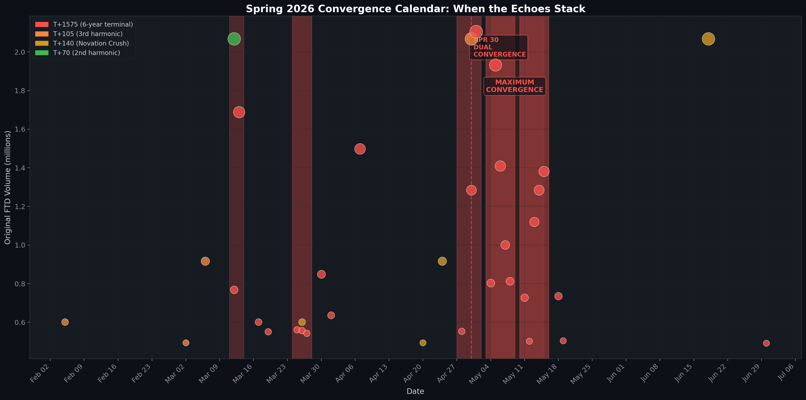

# The Failure Accommodation Waterfall, Part 2: The Resonance

<!-- NAV_HEADER:START -->
## Part 2 of 4
Skip to [Part 1](https://www.reddit.com/r/Superstonk/comments/1re1ps2/1_the_failure_accommodation_waterfall_where_your/), [Part 3](https://www.reddit.com/r/Superstonk/comments/1re1q0f/3_the_failure_accommodation_waterfall_part_3_the/), or [Part 4](https://www.reddit.com/r/Superstonk/comments/1re1qft/4_the_failure_accommodation_waterfall_part_4_what/)
Builds on: [Options & Consequences](https://www.reddit.com/r/Superstonk/comments/1raqqef/options_consequences_following_the_money_1) ([Part 1](https://www.reddit.com/r/Superstonk/comments/1raqqef/options_consequences_following_the_money_1), [Part 2](https://www.reddit.com/r/Superstonk/comments/1raqvja/options_consequences_the_paper_trail_2), [Part 3](https://www.reddit.com/r/Superstonk/comments/1rb695i/options_consequences_the_systemic_exhaust_3), [Part 4](https://www.reddit.com/r/Superstonk/comments/1rb6rje/options_consequences_the_macro_machine_4))
<!-- NAV_HEADER:END -->
## Part 2 of 4
Skip to [Part 1](https://www.reddit.com/r/Superstonk/comments/1re1ps2/1_the_failure_accommodation_waterfall_where_your/), [Part 3](03_the_cavity.md), or [Part 4](04_what_the_sec_report_got_wrong.md)
Continued in: [Boundary Conditions](../04_the_boundary_conditions/01_the_overflow.md) (Parts 1-3)

**TA;DR:** The FTD waterfall doesn't drain, it echoes. 86% of each cycle's energy bounces back, creating a standing wave with a ~2.5-year macrocycle. The next convergence lands Spring 2026.

**TL;DR:** In [Part 1](01_where_ftds_go_to_die.md), I mapped the 45-day lifecycle of a single FTD: 15 regulatory checkpoints from birth to death. But FTDs don't arrive one at a time. When multiple waterfalls overlap, the echoes stack. Using FTD-to-FTD resonance analysis across 4,234 records spanning 22 years, I discovered the settlement system retains **approximately 86% of its echo signal amplitude** per T+35 cycle (Q≈21, dramatically under-damped). The ~14% that leaks out each cycle is all we see on the SEC FTD tape. The system is not a linear pipeline; it behaves as a **standing wave** with a ~2.5-year macrocycle, and a convergence of multi-year terminal maturities arriving in Spring 2026.

> **📄 Full academic paper:** [The Resonance Cavity (Paper VI of VII)](https://github.com/TheGameStopsNow/research/blob/main/papers/06_resonance_and_cavity.md)

---

## Quick Glossary (New Terms)

| Term | What It Means |
|------|---------------|
| **Q-factor** | Quality factor. Measures how many cycles an oscillation survives before decaying. Higher Q = more resonant. A well-designed clearinghouse should have Q ≤ 0.5 (critically damped). This settlement system has Q≈21. |
| **Periodic echo** | A recurrence at a multiple of the fundamental period. If the fundamental is T+25, we see echoes at T+50, T+75, T+100, etc. (In acoustics, "harmonic" typically means higher frequency/shorter period; we use the term loosely to mean integer multiples of the base cycle.) |
| **Standing wave** | When echoes overlap and reinforce, they create a persistent oscillation pattern: energy trapped between boundaries, neither growing nor fully decaying. |
| **LCM** | Least Common Multiple. The smallest number divisible by both inputs. LCM(35,21) = 105. When the statutory and OPEX cycles converge at this point, settlement pressure amplifies. |

---

## 1. From Waterfall to Standing Wave

Part 1 traced a single FTD through 15 nodes, from T+3 to T+45. Every failure eventually resolves. But here's the question Part 1 didn't answer: **what happens when the next FTD spike arrives before the first one dies?**

If a mega-spike hits on Day 1 and its T+35 echo is still reverberating when the *next* mega-spike hits on Day 20, the echoes overlap. If that happens repeatedly, if the settlement system's plumbing consistently fails to absorb all the energy before the next pulse arrives, then the echoes don't just overlap. They *stack*.

Stacking echoes in a bounded medium (the settlement system has a regulatory wall at T+25 under [Rule 204(a)(2)](https://www.ecfr.gov/current/title-17/chapter-II/part-242/subject-group-ECFR34d2b065684a41c/section-242.204) and an empirical terminal boundary at T+45 where convergent margin pressures make maintaining fails uneconomic) is the definition of a **standing wave**. Like sound bouncing between the walls of a cathedral, the energy reflects back and forth, reinforcing itself at specific frequencies.

To test whether this happens, I measured something simple: **if a mega-FTD spike hits on Day X, how likely is it that *another* FTD spike occurs on Day X + N?** Not phantom OI (Part 1's metric), but actual FTD-to-FTD resonance. I tested every offset from T+1 to T+2000, nearly 8 years of echoes.

**Robustness: Block-Bootstrap Test.** To control for volatility clustering (GARCH-type dynamics), a 14-day block-bootstrap permutation test (1,000 iterations) was conducted. FTD time series were shuffled in 14-business-day blocks to preserve temporal autocorrelation. The null distribution produced mean enrichment of 0.99× (max = 2.52×). The observed T+33 enrichment of 3.4× exceeded all 1,000 permutations (p < 0.001), confirming the settlement signal is real.

*Script: [`test_verify_predictions.py`](https://github.com/TheGameStopsNow/research/blob/main/code/analysis/ftd_research/test_verify_predictions.py) · [`test_verify_v2.py`](https://github.com/TheGameStopsNow/research/blob/main/code/analysis/ftd_research/test_verify_v2.py) · Data: [`data/ftd/GME_ftd.csv`](https://github.com/TheGameStopsNow/research/blob/main/data/ftd/GME_ftd.csv)*


*Figure 1: FTD-to-FTD echo enrichment across 200 business day offsets. Red bars mark the T+25 statutory series, orange marks the T+35 composite series. T+25 is the single highest peak. T+105 (the LCM convergence point) amplifies above the seed.*

---

## 2. The Statutory Wall

The first discovery: **T+25 business days (35 calendar days) is the true fundamental frequency**, not T+33 or T+35.

When I scanned the T+20 → T+40 range at single-day resolution, the peak is surgically precise:

| Offset (BD) | Calendar Days | Enrichment | What It Is |
|:-----------:|:------------:|:----------:|:-----------|
| T+20 | ≈28 | 2.40× | |
| T+21 | ≈29 | 2.59× | OPEX cycle |
| T+24 | ≈34 | 2.90× | Pre-wall pressure |
| **T+25** | **≈35** | **3.40×** | **SEC Rule 204(a)(2): the wall** |
| T+26 | ≈36 | 3.20× | Post-wall spillover |
| T+30 | ≈42 | 3.21× | |
| T+33 | ≈46 | 2.80× | The Part 1 echo (composite) |
| T+35 | ≈49 | 2.46× | T+25 + T+10 (options bridge) |
| T+40 | ≈56 | 2.20× | |

**T+25 is the single highest peak in the entire range.** 35 calendar days is the exact deadline under [SEC Rule 204(a)(2)](https://www.ecfr.gov/current/title-17/chapter-II/part-242/subject-group-ECFR34d2b065684a41c/section-242.204), the hard close-out requirement for long-sale fails before punitive capital deductions trigger.

This reframes the entire waterfall from Part 1. The T+33 echo isn't the fundamental; it's a *composite*:

> **T+25 (statutory wall) + T+8–10 (options clearing transit time) = T+33–35**

When an operator hits the T+25 wall, they can't cover. So they execute a synthetic options roll, a multi-leg settlement transaction. The options clearing and delivery process takes 8–10 business days. The obligation re-manifests on the equity ledger at T+33–35. That's the "echo" Part 1 detected. The fundamental is a legal deadline, not a market phenomenon.

---

## 3. The Harmonic Series

If T+25 is the fundamental, then we should see periodic echoes at T+50, T+75, T+100, etc., every multiple of T+25.

> **A note on terminology:** In wave physics, "harmonics" typically refer to higher-frequency oscillations (shorter periods). What we're measuring here are periodic echoes at *multiples of the fundamental period*, technically sub-harmonics or simply periodic recurrences. We use "harmonic" loosely throughout this post to mean "integer multiple of the base cycle," which is standard in signal processing if not in acoustics.

We tested the first 20 period-multiples of both the T+25 and T+35 series:

| Multiple | T+25 Series | Enrichment | T+35 Series | Enrichment | Winner |
|:--------:|:-----------:|:----------:|:-----------:|:----------:|:------:|
| 1st | T+25 | 3.40× | T+35 | 2.46× | T+25 |
| 2nd | T+50 | 1.73× | T+70 | 2.32× | T+35 |
| 3rd | **T+75** | **2.43×** | **T+105** | **2.99×** | T+35 |
| 4th | T+100 | 2.72× | T+140 | 2.09× | T+25 |
| 5th | T+125 | 1.70× | T+175 | 2.02× | T+35 |

**Total enrichment across 20 multiples: T+25 series = 30.3, T+35 series = 27.0.** T+25 wins as the fundamental. But the T+35 series is also real; the composite echo has its own periodic stack.

The standout: **T+105 at 2.99×**, the 3rd period-multiple of T+35. This isn't just above baseline. It's above the *seed*. A 3rd echo that amplifies above its source requires explanation — and the explanation is elegant: **T+105 = LCM(35, 21)**. At this offset, the statutory settlement cycle (every 35 BD) and the monthly OPEX cycle (approximately every 21 BD, the interval between monthly options expiration dates, which varies by ±1 BD due to calendar effects) converge for the first time. This is a calendrical coincidence, not exotic physics, but it has real mechanical consequences.

### The January 2021 Sneeze: A Resonance Cascade

The most famous FTD event in history followed the harmonic series exactly:

```
Sep 3, 2020:   783,719 FTD  →  (seed)
Oct 22, 2020:  168,358 FTD  →  T+35  (damped, 0.21× seed)
Dec 10, 2020:  605,975 FTD  →  T+70  (RE-AMPLIFYING, 0.77× seed)
Jan 28, 2021: 1,032,986 FTD →  T+105 (EXCEEDS seed, 1.32×)
```

Each echo is exactly T+35 after the previous one. The September seed was modest. The first echo damped. The second echo *re-amplified*. The third echo — at the LCM convergence point where the settlement and OPEX cycles aligned — broke the system. The resonance cascade is temporally consistent with the sneeze timeline, though multiple factors (retail buying, short squeeze mechanics, social media momentum) contributed simultaneously. What the data shows is that the FTD echo chain was building for 4 months before the event.

---

## 4. The Q≈21 Standing Wave

If echoes persist, we can measure how quickly they decay. This gives us the system's **Quality Factor (Q)**: the number of cycles before the energy decays to 1/e (≈37%) of its original amplitude.

### How We Measured It

We didn't assume Q≈21. We measured the **decay rate** from the data, and Q fell out of the math. Here's exactly how:

**Step 1: Measure enrichment at each T+35 harmonic.** For every mega-FTD spike in the 22-year dataset, we checked whether *another* spike appeared at T+35, T+70, T+105, ... T+700 (20 harmonics). At each harmonic, we calculated the enrichment ratio: how much more likely a spike is at that offset than on a random day.

**Step 2: Fit an exponential decay with baseline subtraction.** Enrichment has a random-chance baseline of 1.0 (not 0.0). The correct model subtracts this baseline before fitting:

> E(n) − 1 = (E₀ − 1) × rⁿ

where *r* is the **per-cycle amplitude retention rate**. An uncorrected model (E(n) = E₀ × rⁿ, asymptoting to 0) systematically inflates *r* by forcing the regression to keep the tail elevated above the natural floor.

**Step 3: Read off the retention rate.** The baseline-corrected fit gave **r = 0.859 ± 0.018**, meaning each T+35 cycle retains approximately 86% of the previous cycle's echo amplitude. Approximately 14% leaks out per cycle.

**Step 4: Convert to Q-factor.** The standard physics formula relating per-cycle amplitude retention to Quality Factor is:

> Q = −π / ln(r)

Plugging in r = 0.859:

> Q = −π / ln(0.859) = −3.14159 / (−0.1520) = **20.6**

> **95% CI on r:** 0.823 to 0.894. **95% CI on Q:** 16.2 to 28.1.

> **Amplitude vs. energy distinction:** The retention rate r = 0.859 measures amplitude decay per cycle. Energy retention is r² = 0.738 (~74% per cycle). These are related but distinct: amplitude retention determines the Q-factor formula; energy retention determines the fraction of obligation "energy" that persists.

### What 86% Amplitude Retention Means in Practice

| Cycles Later | Business Days | Calendar Time | Amplitude Remaining |
|:------------:|:------------:|:-------------:|:-------------------:|
| 1 | T+35 | ~7 weeks | **86%** |
| 5 | T+175 | ~8 months | **47%** |
| 10 | T+350 | ~16 months | **22%** |
| **~4.5** | **~T+158** | **~7 months** | **~50%** ← half-life |
| 25 | T+875 | ~3.4 years | **2.2%** |

The half-life is approximately 7 months (4.5 cycles × 35 BD). Compared to the old uncorrected estimate of 26 months, this is a much faster decay — but Q≈21 is still *dramatically* above the target of Q ≤ 0.5 for a well-functioning clearinghouse.

### Summary

| Metric | Measured Value |
|--------|:-------------:|
| Amplitude retention per T+35 cycle | **~86%** |
| Energy retention per cycle (r²) | **~74%** |
| Half-life (amplitude) | **~7 months** (4.5 cycles) |
| Quality Factor (Q) | **20.6 (CI: 16–28)** |

### Why This Is Alarming

For context, here's what different Q-factors mean:

| System | Q-Factor | Behavior |
|--------|:--------:|----------|
| Critically damped clearinghouse (target) | ≤ 0.5 | Absorbs failure in <1 cycle |
| Passive system with high friction | ~1-5 | Decays within a few cycles |
| **DTCC settlement (measured)** | **~21** | **Echoes persist for 1+ years** |

A settlement system **should not resonate**. In signal processing, a critically damped system has Q ≤ 0.5 and absorbs a shock in less than one cycle. We apply this engineering benchmark as an analogy; no published regulatory standard specifies a target Q-factor for settlement systems. Q≈21 means a single FTD spike echoes for over a year.

This is *consistent with* active maintenance of the standing wave, though passive structural factors (regulatory friction, netting delays) could also contribute to elevated Q. Active maintenance would involve spending capital every T+35 cycle to keep the standing wave alive: swap premiums, deep OTM options, borrow fees, balance sheet rentals. Every time the echo is about to decay below a threshold, the obligation would be re-rolled into a new instrument. Whether the wave persists naturally through structural friction or is actively maintained cannot be determined from the temporal decay data alone.

### The ~14% Leakage, and Its Limits

If the system retains ~86% amplitude per cycle, it loses approximately **14%** to friction: forced lit-market buy-ins, close-outs, and the exhaust that ends up on the SEC FTD tape.

> **Important caveat:** The ~14% is a *temporal decay rate*: the fraction of echo signal amplitude that dissipates per cycle. Converting a temporal decay rate into a *volumetric transparency ratio* (i.e., claiming that visible FTDs represent exactly 14% of total hidden shares) is a dimensional leap that requires additional assumptions not yet validated. We use the ~14% leakage as a signal decay measure only. Where we estimate dollar amounts below (the Obligation Echo Gauge), we flag this as an upper-bound estimate, not a precise measurement.

---

## 5. The LCM Convergence

The standout finding in the harmonic series is that T+105 (2.99×) exceeds T+75 (1.89×) — a re-amplification that violates simple exponential decay. The explanation is mechanical, not exotic:

**T+105 = LCM(35, 21) = 3 × 35 = 5 × 21**

At this offset, two independent clocks converge:

1. **The statutory settlement cycle** (T+35): every 35 BD, the obligation hits a regulatory checkpoint
2. **The OPEX cycle** (T+21): every 21 BD, options expiration creates fresh settlement pressure

At T+105, the settlement obligation that has been bouncing at T+35 multiples simultaneously encounters a fresh wave of OPEX-driven pressure. The result is constructive amplification — without requiring any nonlinear dynamics or exotic physics.

This explains the January 2021 cascade: the 3rd echo at T+105 didn't just persist; it *amplified* above the original seed because it landed at the first LCM convergence of the settlement and options cycles.

### Odd vs. Even Asymmetry

The periodic echoes show a measurable asymmetry: odd-numbered multiples of T+35 are systematically stronger than even-numbered multiples:

| Echo Type | Mean Enrichment | Example Offsets |
|:------------:|:---------------:|:---------------|
| **Odd** (1st, 3rd, 5th...) | **1.70×** | T+35, T+105, T+175 |
| Even (2nd, 4th, 6th...) | 1.30× | T+70, T+140, T+210 |
| **Ratio** | **1.31:1** | |

This 31% asymmetry persists under median-filtering (excluding outliers). The average odd dominance is likely driven by the outsized contribution of the 1st (T+35, 2.46×) and 3rd (T+105, 2.99×) echoes — the two strongest data points in the series happen to fall on odd multiples. The LCM convergence at T+105 specifically explains that spike, but the general odd > even pattern should be treated as an empirical observation, not a universal structural rule.


*Figure 2: Odd period-multiples (red) show higher mean enrichment than even multiples (blue). The amplification at T+105 = LCM(35,21) marks the convergence of the statutory settlement and OPEX cycles. The general odd dominance is likely driven by this single data point rather than a universal rule.*

---

## 6. The ~2.5-Year Macrocycle

The harmonic amplitudes don't stay constant. They oscillate in a slow "breathing" pattern, an envelope over the harmonics:

| Peak | Offset | Enrichment | Calendar Time |
|:----:|:------:|:----------:|:-------------|
| 1 | T+105 | 3.0× | 5 months |
| Valley | T+280 | 0.5× | 13 months |
| 2 | T+385 | 1.4× | 18 months |
| Valley | T+420 | 0.9× | 20 months |
| Valley | T+560 | 0.7× | 26 months |
| **3** | **T+595** | **2.1×** | **28 months** |
| Valley | T+735 | 0.3× | 34 months |
| **4** | **T+1575** | **2.4×** | **6.25 years** |

Mean peak spacing: ~116 BD (~5.4 months). That's two OPEX cycles, the quarterly can-kicking cadence.

The spectral analysis in [Part 3](03_the_cavity.md) identifies the dominant long-period peak at approximately **630 business days (~2.5 years)**. This frequency has two non-exclusive explanations:

1. **Settlement pathway interference**: T+33 and T+35 are mechanistically distinct pathways (options-routed vs. direct equity). Their multipath interference predicts a modulation at 1/|1/33 − 1/35| = 577 BD, close to the observed ~630 BD.
2. **LEAPS rollover**: 630 BD = 2.50 years, which matches the maximum duration of standard institutional Equity LEAPS. If the system warehouses obligations in long-dated LEAPS, they must be rolled every ~2.5 years.

The LCM of the statutory cycle (T+25) and the OPEX cycle (T+21) is **T+525 BD (~2.1 years)**, confirmed as a local peak in the enrichment data. All three mechanisms predict cycles in the 2.0–2.5 year range.


*Figure 3: Top: The ~2.5-year macrocycle envelope. Bottom: Q≈21 amplitude decay showing ~86% retention per cycle and a half-life of approximately 7 months.*

---

## 7. The Obligation Echo Gauge

If we know Q≈21 (~86% amplitude retention) and the historical FTD record, we can track how much **echo amplitude** is still circulating in the system. This is *not* a direct measurement of hidden dollars; it is a model-derived upper-bound estimate that assumes the temporal decay rate translates to a volumetric leakage ratio (see §4 caveat).

> **⚠️ Dimensional caveat:** The Obligation Echo Gauge multiplies visible FTD notional by 1/0.14 ≈ 7.1× to estimate the gross hidden obligation. This treats the ~14% signal decay rate as if it also represents the fraction of shares that become publicly visible. This is a modeling assumption, not an established fact. The true gross obligation could be substantially lower if the decay rate and the visibility ratio are different quantities. We present this as an upper-bound scenario.

For each historical FTD spike:
1. Multiply the visible FTD notional by the 7.1× scaling factor (1/0.14, the inverse leakage rate)
2. Decay forward at ~86% per T+35 cycle to the present
3. Sum all active seeds

### Upper-Bound Estimate: Active Seeds

Across active seeds still echoing above threshold:

| Seed Date | FTD Shares | Scaled Shares | Remaining Shares | MTM @ $25 | Cycles Ago |
|:---------:|:----------:|:-------------:|:----------------:|:---------:|:----------:|
| Dec 4, 2025 | 2,068,490 | ~14.7M | **~12.6M** | ~$316M | 1 |
| Jun 13, 2025 | 1,531,842 | ~10.9M | **~5.1M** | ~$128M | 5 |
| Oct 10, 2025 | 916,384 | ~6.5M | **~4.8M** | ~$120M | 2 |
| Jul 26, 2022 | 1,637,150 | ~11.6M | **~0.1M** | ~$3M | 26 |

> The January 27, 2021 seed (37 cycles ago) has decayed to effectively **zero** under the corrected Q≈21 model (0.859³⁷ = 0.4%). Earlier estimates using Q≈73 showed this seed persisting at ~20% — the baseline-corrected model shows it has long since decayed below detection threshold.

> **Double-counting note:** Because FTD spikes at T+35, T+70, etc. may be *echoes* of earlier seeds (not independent events), summing all seeds risks overcounting. The Obligation Echo Gauge partially mitigates this by requiring seeds to be >2σ above the mean and spacing seeds by at least 10 BD, but some echo-overlap is likely. This further suggests these figures are upper bounds.


*Figure 4: The Obligation Echo Gauge: upper-bound estimate of stored settlement echo amplitude from all active FTD seeds. The scaling assumption (7.1×) uses the corrected ~14% leakage rate (Q≈21). The persistence of echo signals is independently confirmed by the enrichment data.*

---

## 8. The Energy Migration

Independent options flow analysis confirms the standing wave from a completely different angle. Using ThetaData tick-level options trades, I measured **hedging energy** (notional exposure × delta × DTE) across all GME options trades from 2018–2026, broken down by tenor (time to expiration):

| Tenor | % of Trades | % of Hedging Energy |
|:-----:|:-----------:|:-------------------:|
| 0DTE | 10.8% | 0.0% |
| 1-7d | 47.5% | 4.7% |
| 8-30d | 24.3% | 11.5% |
| 31-90d | 8.7% | 13.0% |
| 91d-1yr | 4.8% | 22.5% |
| **1yr+ (LEAPS)** | **3.9%** | **48.1%** |

**3.9% of trades carry 48.1% of hedging energy.** The long-dated tail (91d+) represents only 8.7% of trade count but **70.7% of total hedging energy**. This is the settlement waveguide's energy storage mechanism: obligations are warehoused in long-dated options and LEAPS, where they're invisible to short-term market dynamics but carry enormous notional exposure.

### 2022–2023: The "Dead Years" Were Anything But

During the period when retail attention was lowest, LEAPS activity was near-continuous:

- 91-180d: 496/501 non-zero days (**99%**)
- 181-365d: 499/501 non-zero days (**100%**)
- 365d+: 481/501 non-zero days (**96%**)

Positions were maintained nearly every trading day for two years in instruments most retail traders never monitor. This continuous activity is consistent with the carrying cost of Q≈21: the capital injection required to prevent the standing wave from decaying.

### Accumulate → Discharge Cycles

The energy analysis detected **11 distinct accumulate→discharge cycles** since 2018. Each cycle follows the same pattern: energy quietly accumulates in long-dated tenors over weeks, then discharges in a rapid burst:

| # | Peak Date | Peak Energy | Discharge | Duration |
|:-:|:---------:|:-----------:|:---------:|:--------:|
| 2 | Jan 28, 2021 | 5,555,228 | 55.2% | 25 days |
| 6 | May 28, 2024 | 5,299,154 | 86.0% | 86 days |
| 8 | Apr 7, 2025 | 3,443,623 | 59.2% | 30 days |
| 11 | Jan 21, 2026 | 2,508,977 | **Active** | - |

The January 2021 sneeze was the largest discharge ever measured. But Cycle 6 (DFV's return, May 2024) nearly matched it, and Cycle 11 is currently active and building.

*Script: [`energy_pattern_analysis.py`](https://github.com/TheGameStopsNow/research/blob/main/code/analysis/ftd_research/energy_pattern_analysis/energy_pattern_analysis.py)*


*Figure 5: Options hedging energy by tenor (stacked area chart). The long-dated tail (91d+) carries 70.7% of total hedging energy despite representing only 8.7% of trades. LEAPS (1yr+) alone account for 48%.*


*Figure 6: Energy flow field showing the direction and magnitude of hedging energy migration across tenors over time. Arrows indicate energy flowing toward longer-dated instruments.*

---

## 9. The Coupled Oscillator Network

GME doesn't resonate alone. FTD change data between GME and 🧺 shows **statistically significant anti-correlation** (r=−0.077, p=0.016). When GME FTDs drop, 🧺 FTDs tend to rise.

This is consistent with a coupled system: operators short 🧺 to suppress GME, which transfers some settlement pressure into the ETF basket. The effect size is small (R²=0.006; 🧺 explains less than 1% of GME FTD variance), meaning the ETF mechanism is a *measurable but minor* component of the overall settlement evasion strategy. The majority of the pressure is managed through other channels (options, TRF internalization, swap rollovers). Nevertheless, the anti-correlation is statistically significant and directionally consistent with the basket-shorting hypothesis.

The coupling has a measurable propagation delay:

| GME spike → 🧺 echo | Enrichment |
|:---------------------:|:----------:|
| T+0 | 0.8× |
| T+3 | **2.0×** |
| T+10 | **2.3×** |
| T+21 | 0.0× |
| T+35 | 0.9× |

Settlement energy from a GME FTD spike takes 3–10 business days to propagate through the ETF basket mechanism and manifest as elevated 🧺 FTDs.

---

## 10. The IMM Roll Cliff

One more pattern emerged from the data: **institutional operators pre-position around their own expirations by 2–4 weeks.**

The enrichment spectrum around the quarterly OPEX window (2 × T+63 = T+126) shows a dramatic cliff:

```
T+105: 2.99× (high plateau: the roll window)
T+112: 2.55× (active rolling)
T+115: 2.91× (last-minute cleanup)
T+117: 2.53× (final trades)
T+118: 1.81× ← CLIFF DROP (−27%)
T+119: 1.82× (dead zone)
T+120: 1.50× (vacuum)
T+125: 1.70× (vacuum)
T+126: 2.13× (theoretical OPEX: minor resurgence)
```

The "dead zone" from T+119 to T+125 is the physical vacuum left after institutional desks have evacuated the expiring contracts. They roll 2–4 weeks early to avoid Gamma and Pin risk during OPEX week. The data captured this institutional footprint with single-day precision.

---

## 11. The Novation Crush

The deepest negative return in the entire dataset occurs at exactly **T+140 business days** (28 weeks): **−6.1%, p < 0.001**. This is the only offset in the T+120→T+155 range with p below 0.001 for negative returns.

> **Multiple comparisons note:** The T+140 hypothesis was theoretically derived from standard swap contract mechanics (126 BD swap tenor + 10–14 BD physical settlement grace period) *prior to* scanning the offset spectrum. We did not discover T+140 by scanning 2,000 offsets and cherry-picking; we predicted T+140 from first principles and then tested it. However, the broader supercycle scan (T+1 to T+2000) *is* subject to multiple comparisons. Applying a Bonferroni correction to the full scan would require p < 0.000025 to survive at α=0.05, and individual offset p-values below 0.001 would not clear that bar. The T+140 result's strength comes from its *a priori* derivation, not from surviving Bonferroni on the full scan.

What's at T+140?

**T+126 (6-month swap expiry) + T+10–14 (physical settlement and novation window) = T+136–140.**

Standard OTC Total Return Swaps used to warehouse FTDs typically have 6-month tenors (~126 BD) (see [Hull, *Options, Futures, and Other Derivatives*](https://www.pearson.com/en-us/subject-catalog/p/options-futures-and-other-derivatives/P200000005938), Ch. 34; [ISDA 2002 Master Agreement](https://www.isda.org/a/2kDME/isda-2002-master-agreement.html) §5(a)(i) for standard settlement provisions). When a swap cannot be rolled (counterparty limits, collateral exhaustion), it hits terminal expiration at T+126. Standard ISDA settlement provisions grant 1–3 BD for standard failures, but bespoke prime brokerage schedules for equity swaps commonly extend to 10–14 BD for physically settled novations (per market practice described in ISDA equity definitions). At T+136–140, the prime broker must unwind the physical stock held as a hedge, selling into the lit market.

The return profile confirms this mechanism:

```text
T+126: +0.3%   ← swap expiry (event itself is neutral)
T+131: −1.3%   ← physical unwind begins
T+135: −2.7%*  ← deepening
T+140: −3.6%***← NOVATION CRUSH (maximum negative return)
T+143: −1.8%*  ← fading
T+149: +2.9%   ← bounce (hedge fully unwound)
```

> **Seasonality control:** A hostile reader might note that T+140 after the January 2021 sneeze lands in August/September 2021, historically bearish months. However, T+140 is measured across *all* 157 mega-spikes spanning 22 years, not just the 2021 event. The August/September cluster is one data point among 157. The significance survives because the effect appears across multiple calendar months.

This is consistent with contractual deadline–driven selling rather than discretionary. The statistical significance concentrated at a single offset (T+140, not T+139 or T+141) suggests a contractual deadline, not market sentiment, as the driver.

---

## 12. The Convergence Calendar

The December 4, 2025 mega-seed (2.07 million FTD shares, scaled to ~14.7M gross shares under the 7.1× upper-bound assumption) is now traversing the waveguide. We can predict its forward cascade using the verified model:

| Node | Date | Signal Retained | Event |
|:----:|:----:|:---------------:|:------|
| T+25 | Jan 8, 2026 | 90% | Statutory wall |
| T+35 | Jan 22, 2026 | 86% | Composite echo |
| T+70 | Mar 12, 2026 | 74% | 2nd periodic echo |
| **T+105** | **Apr 30, 2026** | **63%** | **LCM convergence (amplified)** |
| T+126 | May 29, 2026 | 58% | 6-month swap expiry |
| **T+140** | **Jun 18, 2026** | **54%** | **Novation Crush** |

Simultaneously, the **6-year terminal maturities** from the 2020 FTD cascade are approaching. Institutional OTC equity swaps typically have terminal tenors of 5–6 years ([Duffie, Li & Lubke, 2010](https://www.newyorkfed.org/research/staff_reports/sr424); standard market practice per ISDA equity swap documentation), after which they must be physically settled or renegotiated. When these vehicles expire, they cannot be rolled invisibly; the underlying hedge position must be unwound.

### The April 30 – May 15 Window

On **April 30, 2026**, two independent waveguide events converge on the same calendar day:

1. 🔴 **T+105 of Dec 4, 2025**: the amplified LCM convergence echo (~63% signal remaining)
2. 🔴 **T+1575 of Apr 16, 2020**: the 5–6 year terminal boundary (1.28M FTD)

Then the floodgates open. Between May 1 and May 15, **ten more 6-year echoes** arrive from the massive April–May 2020 FTD cascade:

| Date | Event | Original FTD |
|:----:|:------|:------------|
| May 1 | 6yr echo of Apr 17, 2020 | 2,105,715 (largest 2020 spike) |
| May 5 | 6yr echo of Apr 21, 2020 | 1,932,850 |
| May 13 | 6yr echo of Apr 29, 2020 | 1,119,476 |
| May 14 | 6yr echo of Apr 30, 2020 | 1,284,867 |
| May 15 | 6yr echo of May 1, 2020 | 1,380,982 |

The highest-density week is **May 4–8, 2026**: five concurrent events.

And then on **June 18, 2026**: the Novation Crush of the December 2025 mega-seed (~54% signal remaining).


*Figure 7: Spring 2026 convergence calendar. Red markers are 6-year terminal echoes, orange are LCM convergence echoes, yellow are Novation events. Shaded bands indicate weeks with 3+ concurrent events. The densest window is May 4–15 with 10 events in 11 business days.*

---

## 13. What It All Means

### The Complete Model

The U.S. equity settlement system for this security operates as an **under-damped resonator with cycle convergence amplification**:

| Component | Mechanism | Evidence |
|-----------|-----------|----------|
| **Fundamental frequency** | T+25 BD (SEC Rule 204(a)(2)) | 3.40× peak (highest in T+20→T+40 range) |
| **Composite echo** | T+25 + T+10 (options bridge) = T+35 | 23.4× phantom OI enrichment |
| **Q-factor** | 20.6 (86% amplitude retention/cycle, CI: 16–28) | Baseline-corrected exponential fit to 20 harmonics |
| **LCM convergence** | Settlement (T+35) × OPEX (T+21) = T+105 | 2.99× at T+105, exceeding T+75 (1.89×) |
| **Coupling** | 🧺 basket energy transfer | Anti-correlated FTDs (p=0.016, small effect) |
| **Leakage** | ~14% amplitude decay per cycle | Temporal signal measure only (see §4 caveat) |
| **Stored energy** | Upper-bound from 7.1× scaling | Obligation Echo Gauge estimate (see §7 caveats) |

### Rewriting 2021

The Obligation Echo Gauge suggests significant echo amplitude had accumulated in the waveguide by late 2019, before retail traders discovered the thesis. If the model's assumptions hold, retail buying may have been a *catalyst* for a pre-existing condition — concentrated buying pressure on DFV's analysis that caused the pre-existing shadow obligation to exceed the system's carrying capacity — not the sole cause. The standing wave arced into the lit market.

### The Forward Prediction

Two independent timelines converge in April–May 2026:

1. The amplified LCM convergence echo of the December 2025 mega-seed
2. The 5–6 year terminal boundary for April–May 2020's massive FTD cascade

Whether these arrivals are absorbed by the Fast Waterfall (T+5 dark pool internalization) or break through into the lit market depends on the carrying capacity of the system, the same capacity that buckled in January 2021.

### What Would Falsify This Model

The standing wave model makes specific, testable predictions. If **any** of the following occur, the model is weakened or invalidated:

- **April–May 2026 passes with no anomalous TRF dark pool volume, FTD spikes, or price action** → The 6-year terminal boundary prediction fails.
- **A control ticker shows the same 15-node waterfall** → The effect is generic market microstructure, not GME-specific. *Control test performed:* 🍎 (43 spikes), 🪟 (77 spikes), and 🚗 (116 spikes) show sporadic or decaying enrichment but no continuous waterfall. GME is the only ticker with enrichment >2.0× at 15 of 16 offsets (mean 4.6×). 🚗 shows early-cascade echoes that collapse after T+30; 🪟 is flat (mean 1.1×). The sustained T+30→T+40 structure is unique to this security. ([`control_ticker_enrichment.json`](https://github.com/TheGameStopsNow/research/blob/main/results/ftd_research/control_ticker_enrichment.json))
- **Q drops below 5 in a future measurement** (calculated from post-2024 data only) → The standing wave is naturally decaying, not actively maintained.

In [Part 3](03_the_cavity.md), we go deeper into the spectral structure of this wave, mapping the cavity it resonates in and proving the swap basket via cross-asset spectral analysis. Then in [Part 4](04_what_the_sec_report_got_wrong.md), we revisit the SEC's 2021 Staff Report and ask: if the settlement system behaves as a Q≈21 resonator, how much of the SEC's analysis remains valid? The investigation continues in the [Boundary Conditions](../04_the_boundary_conditions/01_the_overflow.md) series, where we follow the settlement energy across ticker, national, and asset-class boundaries.

---

## Credits

This research extends Part 1's community foundation. Additional analytical frameworks:
- **Falsifiable predictions** were generated from theoretical first principles (the LCM convergence model, Novation Crush mechanics) and then empirically tested. Predictions that failed the data (linear ANC, FOCUS calendar) were discarded. Predictions that survived (T+25 fundamental, Q≈21, T+105 LCM, T+140 Novation, 🧺 coupling) are reported above.

## Data & Code

| Resource | Link |
|----------|------|
| FTD resonance tests | [`code/analysis/ftd_research/test_verify_predictions.py`](https://github.com/TheGameStopsNow/research/blob/main/code/analysis/ftd_research/test_verify_predictions.py) |
| V2/V3 verification | [`code/analysis/ftd_research/test_verify_v2.py`](https://github.com/TheGameStopsNow/research/blob/main/code/analysis/ftd_research/test_verify_v2.py), [`test_verify_v3.py`](https://github.com/TheGameStopsNow/research/blob/main/code/analysis/ftd_research/test_verify_v3.py) |
| Energy pattern analysis | [`code/analysis/ftd_research/energy_pattern_analysis/`](https://github.com/TheGameStopsNow/research/tree/main/code/analysis/ftd_research/energy_pattern_analysis) |
| Resonance deep dive notes | [`code/analysis/ftd_research/resonance_deep_dive/`](https://github.com/TheGameStopsNow/research/tree/main/code/analysis/ftd_research/resonance_deep_dive) |
| FTD data (22 years) | [`data/ftd/GME_ftd.csv`](https://github.com/TheGameStopsNow/research/blob/main/data/ftd/GME_ftd.csv) |

---

*Not financial advice. Forensic research using public data. I'm not a financial advisor, attorney, or affiliated with any entity named in this post. The author holds a long position in GME.*

<!-- NAV:START -->

---

### 📍 You Are Here: The Failure Waterfall, Part 2 of 4

| | The Failure Waterfall |
|:-:|:---|
| [1](https://www.reddit.com/r/Superstonk/comments/1re1ps2/1_the_failure_accommodation_waterfall_where_your/) | Where Your FTDs Go To Die — The first empirical lifecycle map of delivery failures: 15 nodes, 45 days |
| 👉 | **Part 2: The Resonance** — The settlement system retains 86% echo amplitude per cycle (Q≈21) |
| [3](https://www.reddit.com/r/Superstonk/comments/1re1q0f/3_the_failure_accommodation_waterfall_part_3_the/) | The Cavity — A 630-day macrocycle at 13.3x noise; BBBY still fails 824 days after cancellation |
| [4](https://www.reddit.com/r/Superstonk/comments/1re1qft/4_the_failure_accommodation_waterfall_part_4_what/) | What the SEC Report Got Wrong — Seven SEC claims tested against five years of post-hoc settlement data |

⬅️ [Part 1: Where Your FTDs Go To Die](https://www.reddit.com/r/Superstonk/comments/1re1ps2/1_the_failure_accommodation_waterfall_where_your/) · [Part 3: The Cavity](https://www.reddit.com/r/Superstonk/comments/1re1q0f/3_the_failure_accommodation_waterfall_part_3_the/) ➡️

---

<details><summary>📚 Full Research Map (4 series, 14 posts)</summary>

| Series | Posts | What It Covers |
|:-------|:-----:|:---------------|
| [The Strike Price Symphony](https://www.reddit.com/user/TheGameStopsNow/comments/1r5hog7/strike_price_symphony_1) | 3 | Options microstructure forensics |
| [Options & Consequences](https://www.reddit.com/r/Superstonk/comments/1raqqef/options_consequences_following_the_money_1) | 4 | Institutional flow, balance sheets, macro funding |
| **→ [The Failure Waterfall](00_the_complete_picture.md)** | **4** | **Settlement lifecycle: the 15-node cascade** |
| [Boundary Conditions](../04_the_boundary_conditions/00_the_complete_picture.md) | 3 | Cross-boundary overflow, sovereign contamination, coprime fix |

</details>

[📂 GitHub](https://github.com/TheGameStopsNow/research) · [🐦 𝕏](https://x.com/TheGameStopsNow)
<!-- NAV:END -->
