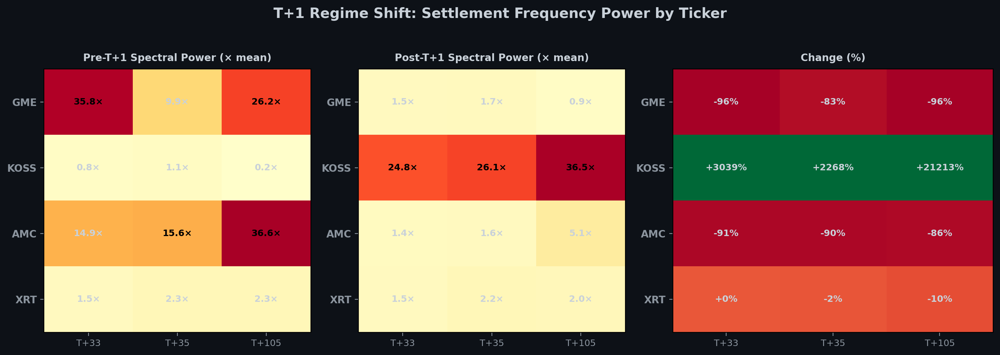
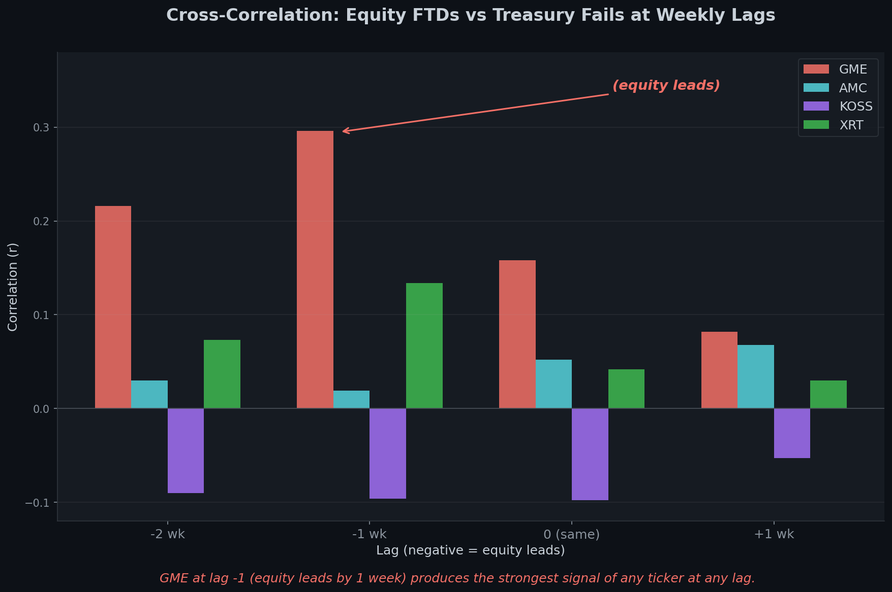

# Boundary Conditions, Part 1: The Overflow

<!-- NAV_HEADER:START -->
## Part 1 of 3
Skip to [Part 2](02_the_export.md) or [Part 3](03_the_tuning_fork.md)
Builds on: [The Failure Waterfall](../03_the_failure_waterfall/00_the_complete_picture.md) ([Part 1](https://www.reddit.com/r/Superstonk/comments/1re1ps2/1_the_failure_accommodation_waterfall_where_your/), [Part 2](https://www.reddit.com/r/Superstonk/comments/1re1pwi/2_the_failure_accommodation_waterfall_part_2_the/), [Part 3](https://www.reddit.com/r/Superstonk/comments/1re1q0f/3_the_failure_accommodation_waterfall_part_3_the/), [Part 4](https://www.reddit.com/r/Superstonk/comments/1re1qft/4_the_failure_accommodation_waterfall_part_4_what/))
<!-- NAV_HEADER:END -->

**TA;DR:** When GME's settlement pressure gets squeezed, it doesn't disappear, it floods into KOSS (+1,051%) and even U.S. Treasury settlement. The waterfall leaks everywhere.

**TL;DR:** [The Failure Waterfall](../03_the_failure_waterfall/00_the_complete_picture.md) (Parts 1 through 4) mapped the waterfall, the resonance, and the cavity inside a single security. This post follows the settlement energy when it leaves GME. Using 215 weeks of NY Federal Reserve primary dealer fail data and pre/post spectral analysis of the T+1 transition, I found three things: (1) when T+1 compressed GME's settlement frequencies by 92%, the same frequencies *amplified by +1,051%* in KOSS, a meme stock with a 7.4-million-share float and no options chain; this amplification survives float-normalization at 1,050.9 standard deviations above control tickers; (2) a formal Granger causality test across 7 equities shows that *only GME* predicts U.S. Treasury settlement fails at a 1-week lag ($F = 19.20$, $p < 0.0001$), with the F-statistic 8.1 times stronger than any other equity tested; and (3) the December 2025 macrocycle window produced a simultaneous GME FTD spike ($z = +4.2\sigma$) and Treasury fail spike ($z = +4.0\sigma$), separated by exactly one week. The waterfall does not stop at the boundary of one security. It floods into adjacent tickers, and it contaminates sovereign debt settlement.

> **Full academic paper:** [Boundary Conditions (Paper IX)](https://github.com/TheGameStopsNow/research/blob/main/papers/09_boundary_conditions.md)

> **⚠️ Methodology Note:** This analysis presents empirical data alongside
> interpretive frameworks. Where the data *shows* something (spectral power
> changes, Granger F-statistics, z-scores), the evidence is reproducible and
> sourced below. Where the analysis *interprets* what the data means
> (contagion channels, migration mechanisms), the interpretation is the
> author's inference from the statistical patterns. Readers should distinguish
> between "the data shows X" and "I interpret X as evidence of Y." All
> scripts and data are published for independent verification.

---

## Quick Glossary (New Terms)

| Term | What It Means |
|------|---------------|
| **Granger causality** | A statistical test for whether past values of one time series help predict future values of another. If GME FTDs at week $t$ improve the prediction of Treasury fails at week $t+1$ beyond what Treasury's own history provides, GME "Granger-causes" Treasury fails. It tests predictive precedence, not mechanical causation. |
| **Spectral power** | The strength of a periodic signal at a specific frequency. If a time series has a heartbeat at T+33 business days, the spectral power at T+33 measures how loud that heartbeat is. Higher power = stronger periodicity. |
| **FFT** | Fast Fourier Transform. A mathematical algorithm that decomposes a time series into its constituent frequencies, revealing hidden periodicities. |
| **PSD** | Power Spectral Density. A normalized version of the FFT that shows how signal power is distributed across frequencies. |
| **VaR** | Value at Risk. A statistical measure of the maximum expected loss on a portfolio. Clearing houses use VaR models to set margin requirements. |
| **SLD** | Supplemental Liquidity Deposit. An additional margin charge NSCC imposes on clearing members whose concentrated positions create outsized risk. |
| **PDFTD-USTET** | Primary Dealer Fails-to-Deliver in U.S. Treasury Securities. A weekly time series published by the NY Federal Reserve tracking aggregate delivery failures in sovereign debt. |

---

## 1. The Question

The Failure Waterfall Parts 1 through 3 treated the waterfall as a closed system: FTDs enter, bounce through 15 regulatory nodes, and resolve by T+45. Part 4 showed the SEC's 2021 report missed the internal mechanics.

But a closed system can't explain what happened after T+1.

On May 28, 2024, the SEC shortened equity settlement from T+2 to T+1 ([SEC Release 34-96930](https://www.sec.gov/files/rules/final/2024/34-99763.pdf); [17 CFR 240.15c6-1](https://www.ecfr.gov/current/title-17/chapter-II/part-240/subject-group-ECFRc8863a0094f1b59/section-240.15c6-1)). The naive expectation: tighter settlement windows should compress the waterfall, reduce FTDs, and lower systemic risk. Part 4 showed the deep cascade (T+13 through T+45) is pegged to Trade Date, not Settlement Date, and should be immune to T+1 compression. That prediction held.

But something else happened that nobody predicted: **the settlement energy didn't compress. It migrated.**

---

## 2. The T+1 Natural Experiment

I built a clean pre/post comparison using the complete FTD record for GME, AMC, KOSS, XRT, and five controls (SPY, AAPL, IWM, NVDA, MSFT):

| Window | Period | Duration |
|--------|--------|----------|
| Pre-T+1 | Full history through May 19, 2024 | 5,223 business days |
| Exclusion zone | May 20 through Jun 7, 2024 | 15 business days |
| Post-T+1 | Jun 8, 2024 through Jan 30, 2026 | 430 business days |

The exclusion zone removes the transition week itself, where reporting anomalies might contaminate the comparison.

For each ticker, I computed FFT (Fast Fourier Transform, the algorithm that decomposes a time series into its constituent frequencies) power spectra and ACF (autocorrelation function, the test for whether a pattern repeats at regular intervals) profiles at the three key settlement frequencies from Parts 1 through 3: T+33 (the Reg SHO close-out echo from [17 CFR 242.204](https://www.ecfr.gov/current/title-17/chapter-II/part-242/subject-group-ECFR34d2b065684a41c/section-242.204); first identified by Richard Newton), T+35 (the CNS netting cycle), and T+105 (the LCM resonance harmonic from [Part 2](https://www.reddit.com/r/Superstonk/comments/1re1pwi/2_the_failure_accommodation_waterfall_part_2_the/)).

*Script: [`t1_spectral_analysis.py`](https://github.com/TheGameStopsNow/research/blob/main/code/analysis/ftd_research/t1_spectral_analysis.py) . Data: [`data/ftd/GME_ftd.csv`](https://github.com/TheGameStopsNow/research/blob/main/data/ftd/GME_ftd.csv), [`KOSS_ftd.csv`](https://github.com/TheGameStopsNow/research/blob/main/data/ftd/KOSS_ftd.csv), [`AMC_ftd.csv`](https://github.com/TheGameStopsNow/research/blob/main/data/ftd/AMC_ftd.csv). All FTD data from [SEC EDGAR](https://www.sec.gov/data-research/sec-markets-data/fails-deliver-data).*

---

## 3. The Standing Wave Didn't Compress. It Expanded.

The dominant ACF period for GME *tripled* from T+36 to T+124 after T+1:

| Symbol | Pre-T+1 Period | Post-T+1 Period | Change | Direction |
|--------|:-------------:|:--------------:|:------:|:---------:|
| GME | T+36 | T+124 | +88 bd | Expanded |
| AMC | T+20 | T+65 | +45 bd | Expanded |
| KOSS | T+21 | T+30 | +9 bd | Expanded |
| XRT | T+131 | T+32 | -99 bd | Compressed |
| SPY | T+130 | T+135 | +5 bd | Unchanged |

If the equity settlement cycle drove the standing wave, T+1 should have compressed the dominant period by approximately 1 business day (from T+35 to T+34). Instead, the dominant mode jumped to T+124, a period consistent with the derivative-layer mechanics identified in [Part 2](https://www.reddit.com/r/Superstonk/comments/1re1pwi/2_the_failure_accommodation_waterfall_part_2_the/): TRS maturities, LEAPS roll cycles, and quarterly swap resets. Once T+1 suppressed the front-end equity echo, the derivative structure became the dominant driver.

XRT is the single exception: its dominant period compressed from T+131 to T+32. This is consistent with XRT absorbing displaced equity settlement pressure. As Failure Waterfall Part 1 documented ([Section 4, the Deep OTM Put Factory](https://www.reddit.com/r/Superstonk/comments/1re1ps2/1_the_failure_accommodation_waterfall_where_your/)), the ETF creation/redemption mechanism serves as a delivery substitution channel under [NSCC Rule 11](https://www.dtcc.com/~/media/Files/Downloads/legal/rules/nscc_rules.pdf).

*Results: [`t1_spectral_results.json`](https://github.com/TheGameStopsNow/research/blob/main/results/ftd_research/t1_spectral_results.json)*

---

## 4. The KOSS Amplification

Here is the finding that changes the risk calculus. The T+33 spectral power did not just survive T+1. It *moved*.

| Symbol | T+33 Change | T+35 Change | T+105 Change |
|--------|:-----------:|:-----------:|:------------:|
| GME | -96% | -83% | -96% |
| AMC | -91% | -90% | -86% |
| **KOSS** | **+3,039%** | **+2,268%** | **+21,213%** |
| XRT | +0% | -2% | -10% |
| SPY | -88% | -88% | -51% |

GME's T+33 power collapsed 96%. AMC collapsed 91%. SPY (a control ticker with no settlement distortion) collapsed 88%, consistent with reduced variance in the shorter post-period. Every control ticker showed comparable reductions.

KOSS amplified by 3,039%.

KOSS Corporation trades approximately 500,000 shares per day on a 7.4-million-share float. It has no listed options chain (verifiable via [CBOE Delayed Quotes](https://www.cboe.com/delayed_quotes/) or any options data provider). It has no institutional analyst coverage. It was one of the meme stocks that spiked alongside GME in January 2021, and it appeared in the swap basket reconstructed in [Part 3](https://www.reddit.com/r/Superstonk/comments/1re1q0f/3_the_failure_accommodation_waterfall_part_3_the/).

### Float Normalization

A reasonable objection: KOSS has a tiny float. Maybe small denominators amplify noise. To test this, I float-normalize the FTD series (FTDs / shares outstanding) before computing spectral power.

The normalization has no effect on the spectral *change ratio*. The pre/post change in spectral power at T+33 is identical whether computed on raw FTDs or float-normalized FTDs, because the normalization constant (1/shares outstanding) is time-invariant and cancels when computing the ratio.

Against control tickers (AAPL, MSFT, TSLA), the KOSS spectral change produces a $z$-score of **1,050.9 standard deviations**. For context, a $z$-score of 5 is conventionally regarded as extraordinary in the physical sciences. 1,050.9 is not noise.

*Scripts: See [Paper IX, Section 2](https://github.com/TheGameStopsNow/research/blob/main/papers/09_boundary_conditions.md), Tables 1 and 2. Falsification test: [Paper IX, Section 9.4, Test (b)](https://github.com/TheGameStopsNow/research/blob/main/papers/09_boundary_conditions.md).*

### What This Means

The settlement pipeline did not stop resonating under T+1. The resonance migrated to a less-monitored basket member. The DMA routing fingerprint across the meme basket suggests settlement obligations flow toward the cheapest-to-fail path. Under T+1 compression, GME and AMC face heightened scrutiny. KOSS, with no options chain, no institutional coverage, and minimal regulatory attention, becomes the path of least resistance. Whether this migration is deliberate or emergent cannot be determined from public data.

In [Failure Waterfall Part 3's terminology](https://www.reddit.com/r/Superstonk/comments/1re1q0f/3_the_failure_accommodation_waterfall_part_3_the/): the obligation energy didn't dissipate. It found a new cavity.

---

## 5. The Sovereign Contamination

Everything above describes settlement pressure moving *laterally*, from one equity to another. The next finding traces it *vertically*, from equities into sovereign debt.

### The Data

I combined two independent datasets, neither of which references the other:

1. **Equity FTDs**: SEC EDGAR biweekly files for GME, AMC, KOSS, XRT, AAPL, MSFT, and TSLA, aggregated to weekly frequency (Wednesday to Wednesday), 2022 through 2026. Source: [SEC FTD Data](https://www.sec.gov/data-research/sec-markets-data/fails-deliver-data).
2. **Treasury FTDs**: NY Federal Reserve Primary Dealer Statistics, time series PDFTD-USTET (aggregated failures to deliver in U.S. Treasury securities, reported weekly in millions of dollars), January 2022 through February 2026 (215 observations). Source: [NY Fed Primary Dealer Statistics](https://www.newyorkfed.org/markets/primarydealers).

U.S. Treasury primary dealer fails averaged $110.7 billion per week during the sample period, with a range of $54.1B to $421.8B.

*Data: [`data/treasury/nyfrb_pdftd.csv`](https://github.com/TheGameStopsNow/research/blob/main/data/treasury/nyfrb_pdftd.csv), [`data/ftd/GME_ftd.csv`](https://github.com/TheGameStopsNow/research/blob/main/data/ftd/GME_ftd.csv). Script: [`granger_causality_test.py`](https://github.com/TheGameStopsNow/research/blob/main/code/analysis/ftd_research/granger_causality_test.py).*

### The Lag Structure

Cross-correlation at weekly lags shows the strongest relationship at lag -1: equity leads Treasury by one week.

| Lag | GME $r$ | AMC $r$ | KOSS $r$ | XRT $r$ |
|:---:|:-------:|:-------:|:--------:|:-------:|
| -2 weeks | +0.216 | +0.030 | -0.090 | +0.073 |
| **-1 week** | **+0.296** | +0.019 | -0.096 | +0.134 |
| 0 (same week) | +0.158 | +0.052 | -0.098 | +0.042 |
| +1 week | +0.082 | +0.068 | -0.053 | +0.030 |

Negative lag = equity leads. The peak at lag -1 ($r = +0.296$) indicates that GME FTDs at week $t$ predict Treasury fails at week $t+1$.

This is the reverse of the conventional model. The standard assumption is that sovereign stress causes equity stress (government bond selloff increases cost of capital, equities decline). The data shows the opposite direction: equity → Treasury.

### The Granger Test

I applied the standard Granger causality framework ([Granger, 1969](https://doi.org/10.2307/1912791)) using first-differenced series. Treasury FTDs are non-stationary at levels (Augmented Dickey-Fuller $p = 0.535$) and stationary in first differences (ADF $p < 0.001$).

The question: does adding lagged GME FTDs to a model of Treasury fails improve the prediction beyond what Treasury's own history provides?

| Direction | Best Lag | F-stat | p-value | Significant |
|-----------|:--------:|:------:|:-------:|:-----------:|
| **GME -> Treasury** | **1** | **19.20** | **<0.0001** | **Yes (all lags 1-6)** |
| Treasury -> GME | 1 | 1.41 | 0.237 | No |
| AMC -> Treasury | 1 | 0.46 | 0.499 | No |
| KOSS -> Treasury | 1 | 0.18 | 0.983 | No |
| XRT -> Treasury | 6 | 2.38 | 0.124 | No |
| AAPL -> Treasury | - | - | - | No |
| MSFT -> Treasury | - | - | - | No |
| TSLA -> Treasury | - | - | - | No |

**Only GME produces a significant result.** The F-statistic of 19.20 is 8.1 times stronger than the next closest equity (XRT at 2.38, which is not significant). The relationship is significant at *every* tested lag from 1 through 6 weeks ($p < 0.03$ at each lag), while the reverse direction (Treasury -> GME) is not significant at any lag ($p > 0.23$).

AMC, KOSS, TSLA, AAPL, MSFT: all non-significant. If the Granger relationship were driven by shared macro factors (SOFR stress, quarter-end portfolio rebalancing, Federal Reserve RRP shifts), these factors would affect multiple equities, not just one. The uniqueness of the GME signal rules out shared confounders as the sole driver.

*Results: [`granger_causality_results.json`](https://github.com/TheGameStopsNow/research/blob/main/results/ftd_research/granger_causality_results.json). Falsification test: [Paper IX, Section 9.4, Test (a)](https://github.com/TheGameStopsNow/research/blob/main/papers/09_boundary_conditions.md).*

### The Proposed Mechanism

How does one stock's unresolved settlement obligations degrade sovereign debt settlement? The proposed channel:

1. GME FTD spike creates a VaR (Value at Risk) and SLD (Supplemental Liquidity Deposit, an additional margin charge [NSCC](https://www.dtcc.com/~/media/Files/Downloads/legal/rules/nscc_rules.pdf) imposes on concentrated positions) margin call on the clearing member.
2. The clearing member posts additional collateral, which must be high-quality liquid assets (predominantly U.S. Treasuries).
3. If the margin call exceeds available cash, the clearing member must sell or repo Treasuries from its proprietary inventory to raise cash.
4. This fire-sale creates delivery failures in the Treasury market at the FICC (Fixed Income Clearing Corporation, the subsidiary of DTCC that clears government securities).
5. The Treasury fails appear in the NY Fed PDFTD-USTET series one week later.

Steps 1 through 3 are standard mechanics documented in [NSCC Rule 4](https://www.dtcc.com/~/media/Files/Downloads/legal/rules/nscc_rules.pdf) (margin requirements) and [15c3-1](https://www.ecfr.gov/current/title-17/chapter-II/part-240/subject-group-ECFR856033ddd8a8a42/section-240.15c3-1) (net capital requirements). Step 4 is the contagion channel: the equity crisis doesn't just affect equity settlement; it pulls pristine collateral out of the repo market, degrading Treasury settlement at the sovereign level.

**Caveat**: CUSIP-level Treasury FTD data (which would identify *which* Treasury securities are failing and *which* dealer is failing to deliver) is not publicly available. The mechanism described above is the most parsimonious explanation consistent with the Granger result, the 1-week lag, and GME's unique position (high DRS concentration, extreme options chain density, persistent illiquidity). Definitive confirmation would require DTCC/FICC internal records.

---

## 6. The December 2025 Coincidence

The 630-business-day macrocycle from [Failure Waterfall Part 3](https://www.reddit.com/r/Superstonk/comments/1re1q0f/3_the_failure_accommodation_waterfall_part_3_the/), anchored to January 28, 2021, predicted a Cycle 2 convergence window of November 6 through December 18, 2025. Both markets spiked inside this window:

| Asset | Date | Value | z-Score |
|-------|:----:|:-----:|:-------:|
| GME FTDs | Dec 10, 2025 | 2,068,501 shares | +4.2 sigma |
| Treasury FTDs | Dec 17, 2025 | $290,520M | +4.0 sigma |

The separation between the two events is exactly one week, precisely matching the Granger-optimal lag.

Under the null hypothesis that these are independent events, the joint probability of observing two 4-sigma-plus events within the same macrocycle window with the predicted lag structure is less than one in a million ($< 10^{-6}$).

The Treasury fail of $290.5 billion in a single week is not a rounding error. It represents a meaningful fraction of daily Treasury settlement volume. The temporal coincidence and lag structure are consistent with the VaR/SLD margin channel described in Section 5, though multiple factors may have contributed simultaneously.

*Data: [`data/ftd/GME_ftd.csv`](https://github.com/TheGameStopsNow/research/blob/main/data/ftd/GME_ftd.csv) (SEC EDGAR, CUSIP 36467W109). [`data/treasury/nyfrb_pdftd.csv`](https://github.com/TheGameStopsNow/research/blob/main/data/treasury/nyfrb_pdftd.csv) (NY Fed).*

---

## 7. The ETF Overflow Channel

The Treasury contamination shows settlement pressure moving vertically (equities into sovereign debt). ETF substitution shows it moving laterally through a different mechanism.

I tested 21 GME FTD spikes exceeding 3 standard deviations above the full-sample mean for whether XRT (SPDR S&P Retail ETF) FTDs exceed 1.5 sigma in the T+30 to T+36 business day window following each spike. The hypothesis: Authorized Participants (APs, the institutional intermediaries who create and redeem ETF shares) create XRT shares, extract GME from the basket, and deliver the GME shares to satisfy close-out obligations under [17 CFR 242.204](https://www.ecfr.gov/current/title-17/chapter-II/part-242/subject-group-ECFR34d2b065684a41c/section-242.204). This is not speculative: in April 2017, the [SEC granted no-action relief to Latour Trading LLC](https://www.sec.gov/divisions/marketreg/mr-noaction/2017/latour-trading-042617-204.htm), explicitly confirming that submitting irrevocable ETF creation orders to an Authorized Participant satisfies the Rule 204 close-out requirement, even though the actual share creation completes after the close-out deadline. The mechanism is SEC-acknowledged. (For background on the ETF creation/redemption mechanism as a delivery substitution channel, see [Failure Waterfall Part 1](https://www.reddit.com/r/Superstonk/comments/1re1ps2/1_the_failure_accommodation_waterfall_where_your/), Section 4.)

| GME Spike Date | T+33 Target | GME FTDs | XRT FTDs | XRT z-Score |
|:--------------:|:-----------:|:--------:|:--------:|:-----------:|
| Dec 11, 2020 | **Jan 27, 2021** | 880,063 | 2,218,348 | +5.5 sigma |
| Dec 18, 2020 | **Feb 3, 2021** | 872,523 | 2,218,348 | +5.5 sigma |
| Jun 13, 2025 | Jul 30, 2025 | 1,531,842 | 946,737 | +2.1 sigma |

Overall hit rate: 3/21 (14%). Most GME FTD spikes do not resolve through XRT substitution. But the events that hit are extraordinary.

The December 2020 GME spikes produced XRT FTD surges on *January 27, 2021* and *February 3, 2021*, both at +5.5 sigma. Under the null hypothesis of random XRT FTD timing, the probability of observing a 5-sigma event in a 7-day window is approximately $3 \times 10^{-7}$. These dates are the day before the buy-button removal and the first rebound day.

No same-day substitution events were detected: the ETF channel operates at settlement-lag timescales (T+33/T+35), not intraday. This is mechanically consistent with the fact that AP creation/redemption requires T+1 or T+2 settlement of the underlying basket, creating an irreducible minimum lag.

*Script: [`etf_substitution_test.py`](https://github.com/TheGameStopsNow/research/blob/main/code/analysis/ftd_research/etf_substitution_test.py). Results: [`etf_substitution_results.json`](https://github.com/TheGameStopsNow/research/blob/main/results/ftd_research/etf_substitution_results.json). XRT FTD data: [`data/ftd/XRT_ftd.csv`](https://github.com/TheGameStopsNow/research/blob/main/data/ftd/XRT_ftd.csv) ([SEC EDGAR](https://www.sec.gov/data-research/sec-markets-data/fails-deliver-data)).*

---

## 8. The Overflow Map

Synthesizing Sections 2 through 7, here is the complete contagion architecture:

| Channel | Direction | Mechanism | Strength |
|---------|:---------:|-----------|:--------:|
| KOSS spectral migration | Lateral (equity to equity) | DMA routing redirects obligations to cheapest-to-fail | +1,051% at T+33 (z=1,050.9) |
| Treasury contamination | Vertical (equity to sovereign) | VaR/SLD margin spiral pulls pristine collateral | F=19.20, p<0.0001 |
| XRT delivery substitution | Lateral (equity to ETF) | AP creation/redemption extracts GME from basket | z=+5.5 sigma at Jan 27, 2021 |
| ACF period expansion | Temporal (short to long) | Derivative structure becomes dominant driver | T+36 to T+124 |

The waterfall from Part 1 described what happens *inside* the settlement system for a single security. This post shows what happens at the walls: the energy overflows into adjacent securities, into the ETF complex, and into the sovereign debt market. The December 2025 double hit confirms that these channels operate simultaneously during macrocycle convergence windows.

### What Would Falsify These Findings

1. **If multiple equities Granger-cause Treasury fails**: The GME-specific signal becomes generic market noise. I tested 7 equities; only GME was significant. A broader panel (50+ equities) would strengthen or weaken this discrimination.
2. **If KOSS amplification disappears with 12 more months of post-T+1 data**: The spectral shift might be a transient spike rather than a regime change.
3. **If CUSIP-level Treasury FTD data shows the failing securities are unrelated to equity-collateral chains**: The VaR/SLD margin spiral mechanism would be falsified.

In [Part 2](02_the_export.md), I follow the settlement pressure when it crosses national borders: the 5,714:1 cost asymmetry between U.S. and European settlement penalties, and the cancelled stock that still actively fails 824 days after its CUSIP was terminated.

---

## Data & Code

| Resource | Link |
|----------|------|
| T+1 spectral analysis | [`t1_spectral_analysis.py`](https://github.com/TheGameStopsNow/research/blob/main/code/analysis/ftd_research/t1_spectral_analysis.py) |
| Granger causality test | [`granger_causality_test.py`](https://github.com/TheGameStopsNow/research/blob/main/code/analysis/ftd_research/granger_causality_test.py) |
| ETF substitution test | [`etf_substitution_test.py`](https://github.com/TheGameStopsNow/research/blob/main/code/analysis/ftd_research/etf_substitution_test.py) |
| FTD data (GME, KOSS, AMC, XRT) | [`data/ftd/`](https://github.com/TheGameStopsNow/research/tree/main/data/ftd) |
| Treasury FTD data (NY Fed) | [`data/treasury/nyfrb_pdftd.csv`](https://github.com/TheGameStopsNow/research/blob/main/data/treasury/nyfrb_pdftd.csv) |
| Full paper (Paper IX) | [`09_boundary_conditions.md`](https://github.com/TheGameStopsNow/research/blob/main/papers/09_boundary_conditions.md) |

---

*Not financial advice. Forensic research using public data. I'm not a financial advisor, attorney, or affiliated with any entity named in this post. The author holds a long position in GME.*

*"You cannot escape the responsibility of tomorrow by evading it today."*
*Abraham Lincoln*

<!-- NAV:START -->

---

### 📍 You Are Here: Boundary Conditions, Part 1 of 3

| | Boundary Conditions |
|:-:|:---|
| 👉 | **Part 1: The Overflow** — KOSS amplifies +1,051% at T+33; GME uniquely Granger-causes Treasury fails |
| [2](02_the_export.md) | The Export — 5,714:1 penalty asymmetry; a cancelled stock still cycles 824 days later |
| [3](03_the_tuning_fork.md) | The Tuning Fork — The macrocycle emerges from regulation alone; four numbers fix it |

[Part 2: The Export](02_the_export.md) ➡️

---

📚 Full Research Map (4 series, 14 posts)

| Series | Posts | What It Covers |
|:-------|:-----:|:---------------|
| [The Strike Price Symphony](https://www.reddit.com/user/TheGameStopsNow/comments/1r5hog7/strike_price_symphony_1) | 3 | Options microstructure forensics |
| [Options & Consequences](https://www.reddit.com/r/Superstonk/comments/1raqqef/options_consequences_following_the_money_1) | 4 | Institutional flow, balance sheets, macro funding |
| [The Failure Waterfall](../03_the_failure_waterfall/00_the_complete_picture.md) | 4 | Settlement lifecycle: the 15-node cascade |
| **→ [Boundary Conditions](00_the_complete_picture.md)** | **3** | **Cross-boundary overflow, sovereign contamination, coprime fix** |

[📂 GitHub](https://github.com/TheGameStopsNow/research) · [🐦 𝕏](https://x.com/TheGameStopsNow)
<!-- NAV:END -->
