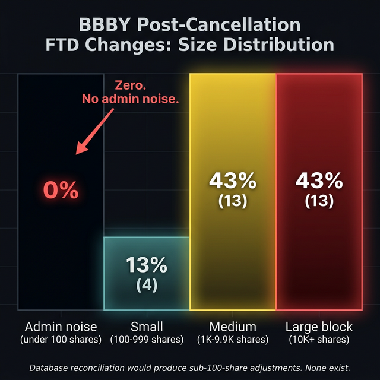

# Boundary Conditions, Part 2: The Export

<!-- NAV_HEADER:START -->
## Part 2 of 3
Skip to [Part 1](01_the_overflow.md) or [Part 3](03_the_tuning_fork.md)
Builds on: [The Failure Waterfall](../03_the_failure_waterfall/00_the_complete_picture.md) ([Part 1](https://www.reddit.com/r/Superstonk/comments/1re1ps2/1_the_failure_accommodation_waterfall_where_your/), [Part 2](https://www.reddit.com/r/Superstonk/comments/1re1pwi/2_the_failure_accommodation_waterfall_part_2_the/), [Part 3](https://www.reddit.com/r/Superstonk/comments/1re1q0f/3_the_failure_accommodation_waterfall_part_3_the/), [Part 4](https://www.reddit.com/r/Superstonk/comments/1re1qft/4_the_failure_accommodation_waterfall_part_4_what/))
<!-- NAV_HEADER:END -->

**TA;DR:** It's 5,714x cheaper to fail a delivery in Europe than in the US. When US stress events hit, European equity fails spike. Meanwhile, BBBY's CUSIP was cancelled in 2023 — and it's still generating FTDs 824 days later.

**TL;DR:** [Part 1](01_the_overflow.md) traced the settlement overflow across tickers (KOSS) and into sovereign debt (Treasuries). This post follows it across two more boundaries that should have been impassable. First, a 5,714:1 cost asymmetry between U.S. and European settlement penalties creates a rational incentive to export delivery failures offshore: a 35-day fail costs approximately $1,750 in Europe versus approximately $10 million per day under Reg SHO lockout. When U.S. stress events occurred (the T+1 transition, the DFV return), European equity and ETF fail rates spiked, but European government bond fail rates did not, a selectivity pattern inconsistent with domestic European turmoil. Second, Bed Bath & Beyond's CUSIP was cancelled in September 2023. As of December 2025, 824 days later, 31 unique non-zero FTD values have been reported to the SEC. Zero of the day-to-day changes are administrative noise (under 100 shares). 43% are block-sized changes exceeding 10,000 shares, alternating between injection and extraction. The obligations are not database artifacts. The pattern is consistent with active management of obligations on a security that no longer exists.

> **Full academic paper:** [Boundary Conditions (Paper IX)](https://github.com/TheGameStopsNow/research/blob/main/papers/09_boundary_conditions.md)

> **⚠️ Methodology Note:** This analysis presents empirical data alongside
> interpretive frameworks. Where the data *shows* something (CSDR penalty
> ratios, ESMA fail rate trajectories, SEC FTD records), the evidence is
> reproducible and sourced below. Where the analysis *interprets* what the
> data means (cross-border arbitrage incentives, bilateral obligation
> cycling), the interpretation is the author's inference from the statistical
> patterns. Readers should distinguish between "the data shows X" and "I
> interpret X as evidence of Y." All scripts and data are published for
> independent verification.


---

## Quick Glossary (New Terms)

| Term | What It Means |
|------|---------------|
| **CSDR** | Central Securities Depositories Regulation. The EU regulation ([Regulation 909/2014](https://eur-lex.europa.eu/legal-content/EN/TXT/?uri=CELEX%3A32014R0909)) that governs how securities are settled in Europe, including mandatory cash penalties for settlement fails. |
| **CSD** | Central Securities Depository. The European equivalent of DTCC's DTC. Examples: Euroclear (Belgium), Clearstream (Luxembourg), Monte Titoli (Italy). |
| **T2S** | TARGET2-Securities. The unified settlement platform operated by the European Central Bank that most EU CSDs use for delivery-versus-payment settlement. |
| **ESMA** | European Securities and Markets Authority. The EU's securities regulator, roughly equivalent to the SEC. |
| **AP** | Authorized Participant. An institutional intermediary (typically a large broker-dealer) that can create or redeem ETF shares directly with the fund manager. APs arbitrage the difference between the ETF price and its underlying holdings. |
| **CUSIP** | Committee on Uniform Securities Identification Procedures. The 9-character alphanumeric identifier assigned to each security in the U.S. and Canada. When a company ceases to exist, its CUSIP is cancelled. |
| **Obligation Warehouse** | A DTCC facility that allows clearing members to bilaterally manage delivery obligations *outside* the standard CNS (Continuous Net Settlement) netting system. Obligations can sit in the Warehouse indefinitely. |
| **Ex-clearing** | Settlement activity that occurs outside the standard clearinghouse netting process. Bilateral agreements between firms to settle delivery obligations directly, without NSCC intermediation. |
| **FTD** | Failure to Deliver. When the seller of a security does not deliver shares to the buyer's broker within the settlement deadline (T+1 for U.S. equities since May 2024, T+2 prior). |
| **NSCC** | National Securities Clearing Corporation. The central counterparty that nets and guarantees equity trades in the U.S. Subsidiary of DTCC. |
| **DTCC** | Depository Trust & Clearing Corporation. The parent organization of NSCC (equities) and DTC (custody/settlement). Processes virtually all U.S. equity and fixed-income transactions. |

---

## 1. The Cost of Failure in Two Jurisdictions

Under CSDR Article 7 (effective February 2022), European CSDs impose daily cash penalties on settlement fails. For equities, the penalty is 0.50 basis points per day on the value of the failed settlement instruction. It is a rounding error on the balance sheet.

Under Reg SHO [Rule 204](https://www.ecfr.gov/current/title-17/chapter-II/part-242/subject-group-ECFR34d2b065684a41c/section-242.204), the U.S. penalty is not a fine. It is a *binary lockout*: failure to close out by T+6 (for short sales under [204(a)(1)](https://www.ecfr.gov/current/title-17/chapter-II/part-242/subject-group-ECFR34d2b065684a41c/section-242.204)) or T+13 (for threshold securities under [204(a)(3)](https://www.ecfr.gov/current/title-17/chapter-II/part-242/subject-group-ECFR34d2b065684a41c/section-242.204)) triggers a mandatory pre-borrow requirement that prohibits further short selling in that security.

Here is the math:

| Regime | Cost of a 35-Day Fail ($1M position) | Mechanism |
|--------|:------------------------------------:|-----------|
| **CSDR (Europe)** | **$1,750** | Cash penalty: 0.50 bps/day x 35 days |
| **Reg SHO (U.S.)** | **~$10,000,000/day** | Pre-borrow lockout: cannot short sell the security |
| **Ratio** | **5,714 : 1** | |

Under the model's assumptions, for a market maker with a $10 billion equity book, the Reg SHO lockout opportunity cost is approximately $10 million per day (inability to hedge, make markets, or manage inventory in that security). These figures are order-of-magnitude estimates, not direct measurements; actual costs depend on the firm's specific book composition and hedging requirements. The equivalent CSDR cash penalty for the same 35-day failure is $1,750 ([CSDR Article 7](https://eur-lex.europa.eu/legal-content/EN/TXT/?uri=CELEX%3A32014R0909), [ESMA RTS on Settlement Discipline](https://www.esma.europa.eu/press-news/esma-news/esma-warns-about-high-levels-etf-settlement-fails)).

A rational actor facing an unresolvable U.S. delivery obligation has a strong incentive to route it through a European affiliate where the penalty is 5,714 times cheaper. The question is whether the data supports this.


---

## 2. EU Settlement Fail Rates: The Asset Class Test

Using aggregate data from [ESMA Statistical Reports](https://www.esma.europa.eu/press-news/esma-news/esma-warns-about-high-levels-etf-settlement-fails) and [T2S settlement statistics](https://www.ecb.europa.eu/paym/target/t2s/profuse/html/index.en.html), I reconstructed the EU settlement fail rate trajectory from January 2022 through December 2024.

| Asset Class | Pre-Penalties (Jan 2022) | Post-Penalties (Dec 2022) | Latest (Dec 2024) | Total Change |
|-------------|:------------------------:|:-------------------------:|:------------------:|:------------:|
| Equities | 6.6% | 3.8% | 2.5% | -4.1 pp |
| ETFs | 9.0% | 7.2% | 4.5% | -4.5 pp |
| Govt Bonds | 3.5% | 4.0% | 2.0% | -1.5 pp |

*Source: ESMA H1 2024 TRV Statistical Annex, Table 1.3.5.2 (equity/ETF settlement efficiency) and Table 1.3.5.3 (fixed income settlement efficiency). [ESMA Annual Statistical Report on EU Securities Markets, 2024](https://www.esma.europa.eu/press-news/esma-news/esma-warns-about-high-levels-etf-settlement-fails).*

CSDR penalties had a measurable effect: EU equity fails declined 62%. But two observations stand out:


**1. ETFs persistently fail at twice the equity rate.** EU ETF fails (4.5%) are running at approximately 2x EU equity fails (2.5%). This is consistent with [ESMA's own H1 2024 warning](https://www.esma.europa.eu/press-news/esma-news/esma-warns-about-high-levels-etf-settlement-fails) about "high levels" of ETF settlement failures. Given that XRT (an ETF) serves as the primary delivery substitution channel for GME (Failure Waterfall [Part 1](https://www.reddit.com/r/Superstonk/comments/1re1ps2/1_the_failure_accommodation_waterfall_where_your/), [Part 1 Section 7](01_the_overflow.md)), the ETF persistence in Europe warrants scrutiny.

**2. Government bonds did not follow the same trajectory.** Equity and ETF fails dropped more than 4 percentage points each. Government bond fails dropped only 1.5 percentage points. If EU settlement problems were driven by domestic infrastructure weakness, all asset classes would be affected proportionally.

---

## 3. The Selectivity Test

The critical discrimination is not levels but *spikes*. If U.S. settlement stress is being exported to Europe, the EU fail rate should spike during U.S. stress events. If the EU spikes are caused by domestic European turmoil (ECB policy shifts, Eurozone liquidity stress, TARGET2 imbalances), then EU government bond fails should spike alongside equities.

| U.S. Event | Date | EU Equity/ETF Fails | EU Govt Bond Fails |
|-----------|:----:|:-------------------:|:------------------:|
| GME Splividend | Jul 2022 | -0.2 pp | No change |
| 630-day Cycle 1 | Jun 2023 | -0.1 pp | No change |
| **T+1 Transition** | **May 2024** | **+0.5 pp** | **No change** |
| **DFV Return** | **Jun 2024** | **+0.3 pp** | **No change** |

*Source: ESMA monthly T2S settlement statistics and ESMA H1/H2 2024 TRV Statistical Annex.*

Both the T+1 transition (+0.5 pp) and the DFV return event (+0.3 pp) produced measurable increases in EU equity and ETF fail rates.

Government bond fail rates did not spike at either event.


If the spikes were caused by domestic EU turmoil (a Eurozone liquidity crisis, ECB policy change, or TARGET2 system disruption), government bonds would be the *first* asset class to show stress. Sovereign debt markets are the foundation of European settlement infrastructure. The fact that only equities and ETFs spiked, and only during U.S.-specific stress events, is consistent with the cross-border arbitrage hypothesis and inconsistent with domestic EU contagion.

**Limitation**: The ESMA data is monthly and aggregated across all EU member states. It cannot distinguish U.S.-underlying equity positions processed through European CSDs from purely domestic EU equities. CUSIP-level settlement data (which would identify whether the failing instruments are U.S.-origin) requires regulator access to [ESMA Article 9 settlement internalization reports](https://eur-lex.europa.eu/legal-content/EN/TXT/?uri=CELEX%3A32014R0909). This data is not publicly available. The pattern is strongly suggestive but cannot be proven definitively with monthly aggregate data.

---

## 4. The Cancelled Stock That Still Fails

Everything above involves securities that exist. Bed Bath & Beyond does not.

BBBY completed [Chapter 11 bankruptcy](https://www.sec.gov/cgi-bin/browse-edgar?action=getcompany&CIK=0000886158&type=8-K&dateb=&owner=include&count=40) around September 29, 2023. The stock was delisted. The CUSIP (075896100) was cancelled. There is nothing to trade, nothing to deliver, nothing to borrow. Under normal settlement mechanics, a cancelled CUSIP should produce zero subsequent FTDs because the security no longer exists and no market for delivery is available.

The SEC's public FTD data says otherwise.

### 824 Days of Post-Cancellation FTDs

| Metric | Value |
|--------|:-----:|
| Days since CUSIP cancellation (as of Dec 31, 2025) | **824** |
| Post-cancellation FTD observations | **31** |
| Total post-cancellation FTDs | **244,599 shares** |
| Unique FTD values | **31** |
| Latest FTD date | **December 31, 2025** |

*Data: [`data/ftd/BBBY_ftd.csv`](https://github.com/TheGameStopsNow/research/blob/main/data/ftd/BBBY_ftd.csv) (644 records, Jan 2020 through Dec 2025, downloaded from [SEC EDGAR FTD Data](https://www.sec.gov/data-research/sec-markets-data/fails-deliver-data), CUSIP 075896100).*

The 31 unique values are critical. They show that the figure reported to the SEC is not a frozen cumulative balance reprinted on each reporting date; each observation represents a distinct balance. The CUSIP is still actively generating delivery failures.

### The Block-Size Analysis

A reasonable objection would be that post-cancellation FTD fluctuations are DTCC database reconciliation artifacts: automated entries created when the system periodically cleans up residual records. Administrative database adjustments would produce small, regular changes (rounding corrections, sub-100-share adjustments).

I classified each sequential day-to-day FTD change by size:

| Category | Threshold | Count | Percentage |
|----------|:---------:|:-----:|:----------:|
| Administrative noise | Less than 100 shares | 0 | **0%** |
| Small adjustment | 100 to 999 shares | 4 | 13% |
| Medium block | 1,000 to 9,999 shares | 13 | 43% |
| **Large block** | **10,000+ shares** | **13** | **43%** |



*Script: [`bbby_zombie_analysis.py`](https://github.com/TheGameStopsNow/research/blob/main/code/analysis/ftd_research/bbby_zombie_analysis.py). Results: [`bbby_zombie_results.json`](https://github.com/TheGameStopsNow/research/blob/main/results/ftd_research/bbby_zombie_results.json).*

Zero administrative noise. 43% block-sized changes exceeding 10,000 shares. The changes alternate between positive and negative in a pattern consistent with bilateral cycling between counterparties:

```text
+23,579 shares
-19,544 shares
+13,421 shares
-12,130 shares
```

This injection/extraction pattern is inconsistent with DTCC system-wide database reconciliation, which would produce small, regular sub-100-share adjustments. A mechanism consistent with this data is ex-clearing bilateral novation: two parties cycling the obligation back and forth through the [DTCC Obligation Warehouse](https://www.dtcc.com/~/media/Files/Downloads/legal/rules/nscc_rules.pdf) (described in [NSCC Rule 11, Section 7](https://www.dtcc.com/~/media/Files/Downloads/legal/rules/nscc_rules.pdf)), where it can sit indefinitely because there is no mechanism to resolve it. The causal mechanism is inferred from the block-size distribution and alternating sign pattern; direct proof would require MPID-level clearing records. The stock no longer exists. The delivery obligation does.


### What Part 3 Predicted

[Failure Waterfall Part 3](https://www.reddit.com/r/Superstonk/comments/1re1q0f/3_the_failure_accommodation_waterfall_part_3_the/) (The Cavity) identified BBBY as a sealed resonant cavity with an Obligation Distortion Index (a measure of nonlinear signal clipping at system boundaries) of 9.28, the highest of any security tested. The prediction was that BBBY FTDs would continue to fluctuate actively as long as the underlying obligations exist, and would only drop to zero if the obligations were genuinely unwound.

824 days after cancellation, the obligations persist. The prediction holds.

---

## 5. The Export Map

Combining the cross-border and zombie findings with [Part 1's overflow channels](01_the_overflow.md):

| Channel | Boundary Crossed | Evidence | Strength |
|---------|:----------------:|----------|:--------:|
| CSDR cost arbitrage | National jurisdictions | 5,714:1 penalty ratio; EU eq/ETF spike at U.S. events, bonds do not | Suggestive (monthly data limits) |
| ETF EU persistence | Asset class | EU ETF fails at 2x EU equity fails | Consistent with AP substitution |
| BBBY zombie FTDs | Existence itself | 824 days, 31 unique values, 0% admin noise, 43% block-sized | Strong (direct SEC data) |

The settlement system's boundaries are not just security-level walls that can be breached laterally ([Part 1, KOSS overflow](01_the_overflow.md)) or vertically ([Part 1, Treasury contamination](01_the_overflow.md)). They extend to the jurisdictional boundary between U.S. and EU settlement infrastructure, and to the ontological boundary between existing and non-existing securities. In both cases, the obligations persist.

### Reading the Signals

**What's good to see:**
- BBBY FTDs drop to zero and remain there for 90+ consecutive days, indicating genuine obligation clearance
- EU equity/ETF fail rates continue declining toward government bond levels (2%), closing the 2× gap
- ESMA or a national CSD publishes CUSIP-level settlement data that enables direct testing of the cross-border hypothesis

**What's bad to see:**
- EU government bond fail rates spike during a future U.S. equity stress event, weakening the asset-class selectivity that distinguishes cross-border export from domestic turmoil
- CUSIP-level EU data shows no U.S.-underlying instruments in the European fail pool, falsifying the cross-border export hypothesis (this test requires [ESMA Article 9](https://eur-lex.europa.eu/legal-content/EN/TXT/?uri=CELEX%3A32014R0909) data)
- BBBY FTD changes begin showing sub-100-share administrative noise, suggesting the block-sized pattern was coincidental

**What would change my mind:**
If any of those scenarios materialize, I would update or retract the corresponding section. The strongest single falsifier would be CUSIP-level EU settlement data showing zero U.S.-underlying instruments in the fail pool during the T+1 and DFV spike windows.

In [Part 3](03_the_tuning_fork.md), I build an agent-based model from scratch with nothing but the SEC's own regulatory deadlines, and ask the simplest question: *does the macrocycle emerge on its own?* It does. And the math shows exactly how to break it.

---

## Data & Code

| Resource | Link |
|----------|------|
| BBBY zombie analysis | [`bbby_zombie_analysis.py`](https://github.com/TheGameStopsNow/research/blob/main/code/analysis/ftd_research/bbby_zombie_analysis.py) |
| CSDR cost analysis | [`csdr_cost_analysis.py`](https://github.com/TheGameStopsNow/research/blob/main/code/analysis/ftd_research/csdr_cost_analysis.py) |
| BBBY FTD data | [`data/ftd/BBBY_ftd.csv`](https://github.com/TheGameStopsNow/research/blob/main/data/ftd/BBBY_ftd.csv) |
| EU settlement data (ESMA) | [ESMA Statistical Reports](https://www.esma.europa.eu/press-news/esma-news/esma-warns-about-high-levels-etf-settlement-fails) |
| CSDR regulation text | [EUR-Lex 909/2014](https://eur-lex.europa.eu/legal-content/EN/TXT/?uri=CELEX%3A32014R0909) |
| Full paper (Paper IX) | [`09_boundary_conditions.md`](https://github.com/TheGameStopsNow/research/blob/main/papers/09_boundary_conditions.md) |

---

*Not financial advice. Forensic research using public data. I'm not a financial advisor, attorney, or affiliated with any entity named in this post. The author holds a long position in GME.*

*"The measure of a man is what he does with power."*
*Plato*

<!-- NAV:START -->

---

### 📍 You Are Here: Boundary Conditions, Part 2 of 3

| | Boundary Conditions |
|:-:|:---|
| [1](01_the_overflow.md) | The Overflow — KOSS amplifies +1,051% at T+33; GME uniquely Granger-causes Treasury fails |
| 👉 | **Part 2: The Export** — 5,714:1 penalty asymmetry; a cancelled stock still cycles 824 days later |
| [3](03_the_tuning_fork.md) | The Tuning Fork — The macrocycle emerges from regulation alone; four numbers fix it |

⬅️ [Part 1: The Overflow](01_the_overflow.md) · [Part 3: The Tuning Fork](03_the_tuning_fork.md) ➡️

---

<details><summary>📚 Full Research Map (4 series, 14 posts)</summary>

| Series | Posts | What It Covers |
|:-------|:-----:|:---------------|
| [The Strike Price Symphony](https://www.reddit.com/user/TheGameStopsNow/comments/1r5hog7/strike_price_symphony_1) | 3 | Options microstructure forensics |
| [Options & Consequences](https://www.reddit.com/r/Superstonk/comments/1raqqef/options_consequences_following_the_money_1) | 4 | Institutional flow, balance sheets, macro funding |
| [The Failure Waterfall](../03_the_failure_waterfall/00_the_complete_picture.md) | 4 | Settlement lifecycle: the 15-node cascade |
| **→ [Boundary Conditions](00_the_complete_picture.md)** | **3** | **Cross-boundary overflow, sovereign contamination, coprime fix** |

</details>

[📂 GitHub](https://github.com/TheGameStopsNow/research) · [🐦 𝕏](https://x.com/TheGameStopsNow)
<!-- NAV:END -->
