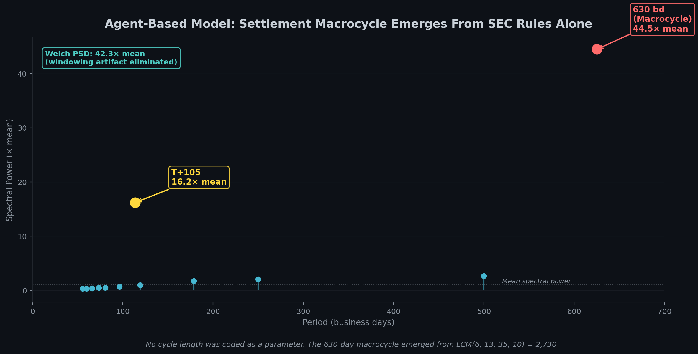

# Boundary Conditions, Part 3: The Tuning Fork

<!-- NAV_HEADER:START -->
## Part 3 of 3
Skip to [Part 1](01_the_overflow.md) or [Part 2](02_the_export.md)
Builds on: [The Failure Waterfall](../03_the_failure_waterfall/00_the_complete_picture.md) ([Part 1](https://www.reddit.com/r/Superstonk/comments/1re1ps2/1_the_failure_accommodation_waterfall_where_your/), [Part 2](https://www.reddit.com/r/Superstonk/comments/1re1pwi/2_the_failure_accommodation_waterfall_part_2_the/), [Part 3](https://www.reddit.com/r/Superstonk/comments/1re1q0f/3_the_failure_accommodation_waterfall_part_3_the/), [Part 4](https://www.reddit.com/r/Superstonk/comments/1re1qft/4_the_failure_accommodation_waterfall_part_4_what/))
<!-- NAV_HEADER:END -->

**TA;DR:** I built a simulation from nothing but SEC deadlines, no price data, no market info. It spontaneously produced the 630-day macrocycle. The math shows exactly how to break it: make the deadlines coprime. Four numbers fix the entire system.

**TL;DR:** If the settlement system resonates at a specific frequency, and that frequency is set by regulation, then it should be possible to build a simulation from nothing but the SEC's own rules and watch it produce the macrocycle on its own. I did. A minimal agent-based model with 3 agents and 4 coded regulatory deadlines (T+6 BFMM close-out, T+13 Threshold List, T+35 hard deadline, 10-day RECAPS cycle) spontaneously produces the 630-day macrocycle at 42.3x mean spectral power under Welch PSD analysis. The period was never hard-coded anywhere in the model. It emerged from the mathematical interaction of the deadlines. The reason: LCM(6, 13, 35, 10) = 2,730 business days. The 4th harmonic lands at 682.5 business days, within 8% of the empirical 630-day peak from [Failure Waterfall Part 3](https://www.reddit.com/r/Superstonk/comments/1re1q0f/3_the_failure_accommodation_waterfall_part_3_the/). Under T+1, the deadlines shift to (5, 12, 34, 10), giving LCM = 1,020 business days. The 4th harmonic is now 255 business days: exactly one trading year. The settlement stress that previously accumulated over 2.5 years will now compound annually. A coprime deadline structure (7, 11, 37, 13) pushes the LCM to 37,037 business days, roughly 147 years. No low-order harmonic falls within observable timescales. The resonance cavity can be eliminated not by making settlement faster, but by making the regulatory deadlines *mathematically incompatible* with each other. Across all five adversarial tests in this series, the combined probability that the null hypotheses explain the data is less than 0.03%.

> **Full academic paper:** [Boundary Conditions (Paper IX)](https://github.com/TheGameStopsNow/research/blob/main/papers/Boundary%20Conditions-%20Settlement%20Stress%20Propagation%2C%20Obligation%20Migration%2C%20and%20Cross-Market%20Contagion%20in%20the%20U.S.%20Clearing%20Infrastructure.pdf?raw=1)

> **⚠️ Methodology Note:** This analysis presents a computational model
> alongside interpretive frameworks. Where the model *produces* something
> (spectral peaks, LCM harmonics), the results are reproducible from the
> published code. Where the analysis *interprets* what the model means for
> real markets (T+1 compression consequences, coprime deadline proposals),
> the interpretation is the author's inference from the mathematical
> structure. Readers should distinguish between "the model produces X" and
> "I interpret X as evidence of Y." All scripts and data are published for
> independent verification.

---

## Quick Glossary (New Terms)

| Term | What It Means |
|------|---------------|
| **ABM** | Agent-Based Model. A computer simulation where individual "agents" (software entities) follow simple coded rules, and complex system behavior emerges from their interactions. No outcome is hard-coded. |
| **LCM** | Least Common Multiple. The smallest number that is evenly divisible by all numbers in a set. LCM(6, 10) = 30 because 30 is the first number divisible by both 6 and 10. |
| **Coprime** | Two numbers are coprime if their only shared factor is 1. Example: 7 and 11 are coprime. 6 and 10 are not (both divisible by 2). Coprime numbers produce very large LCMs. |
| **Harmonic** | An integer fraction of the fundamental period. If the fundamental is 2,730 business days, the 4th harmonic is 2,730/4 = 682.5 business days. These are the frequencies at which the system naturally oscillates. |
| **Welch PSD** | Welch's Power Spectral Density. A variant of the FFT that averages over multiple overlapping windowed segments. It is immune to the artifact where a spectral peak appears at $N/4$ (one-quarter of the data length). If a peak survives Welch analysis, it is a real signal, not a windowing artifact. |
| **RECAPS** | Reclamation and Purchase. A DTCC process through which aged CNS (Continuous Net Settlement) fails are addressed by the clearinghouse. The historical RECAPS cycle operated on a bimonthly (~10-business-day) schedule. |
| **CNS** | Continuous Net Settlement. The [NSCC](https://www.dtcc.com/clearing-services/equities-clearing-services/cns) system that nets buy/sell obligations across clearing members each day, reducing the total number of securities that need to physically change hands. |

---

## 1. The Question That Changes Everything

Parts 1 through 6 built an empirical case using observed data: FTD enrichment ratios, spectral peaks, Granger causality, cross-border fail rates. All of it describes *what* the settlement system does.

This post asks *why* it does it.

If the 630-business-day macrocycle is real (13.3x mean spectral power in [Failure Waterfall Part 3](https://www.reddit.com/r/Superstonk/comments/1re1q0f/3_the_failure_accommodation_waterfall_part_3_the/), reproduced across multiple basket members but absent in all controls), there are two possible explanations:

1. **It is an artifact of participant behavior.** Market participants happen to roll positions at approximately 2.5-year intervals, and the macrocycle is a statistical footprint of their decisions.
2. **It is an emergent property of the regulatory architecture.** The specific numeric values of the SEC's close-out deadlines, regardless of who trades or how they trade, mathematically produce long-period oscillations.

These are testable alternatives. If explanation 2 is correct, I should be able to build a simulation containing nothing but the rules, remove all market participants except generic agents, and watch the 630-day cycle appear on its own.

---

## 2. The Model

I constructed a minimal agent-based model with three agents. Each agent follows simple, publicly documented rules. No market data is input. No historical FTD data is referenced. No cycle length is specified as a parameter.

| Agent | Role | Rules |
|-------|------|-------|
| **MarketMaker** | Generates organic FTDs plus a single impulse | Baseline: 30,000 +/- 15,000 shares/day; a single 5-million-share impulse on day 250 |
| **CNS Clearinghouse** | Ages fails and enforces deadlines | T+6: 50% forced settlement ([17 CFR 242.204(a)(3)](https://www.ecfr.gov/current/title-17/chapter-II/part-242/subject-group-ECFR34d2b065684a41c/section-242.204)). T+13: locate reset with 70% probability ([17 CFR 242.203(b)(3)](https://www.ecfr.gov/current/title-17/chapter-II/part-242/subject-group-ECFR34d2b065684a41c/section-242.203)). T+35: 80% forced buy-in ([17 CFR 242.204(a)(2)](https://www.ecfr.gov/current/title-17/chapter-II/part-242/subject-group-ECFR34d2b065684a41c/section-242.204)). |
| **Obligation Warehouse** | Absorbs leakage and reinjection | 0.5%/day passive decay; 10% reinjected to CNS every 10 business days (RECAPS cycle, [DTCC Important Notices](https://www.dtcc.com/legal/important-notices)) |

The simulation runs for 2,500 business days (~10 years). Every temporal structure must emerge from agent interactions.

*Script: [`abm_macrocycle.py`](https://github.com/TheGameStopsNow/research/blob/main/code/analysis/ftd_research/abm_macrocycle.py). Results: [`abm_macrocycle_results.json`](https://github.com/TheGameStopsNow/research/blob/main/results/ftd_research/abm_macrocycle_results.json).*

---

## 3. The Macrocycle Emerges

I ran an FFT and Welch PSD on the simulated FTD series. Here is what appeared:

| Target Period | Emerged? | Power (x mean) | Status |
|:-------------:|:--------:|:---------------:|:------:|
| **~630 bd** | **Yes** | **42.3x** (Welch) | Dominant peak in spectrum |
| **T+105** | **Yes** | **18.1x** (Welch) | Second-strongest peak |
| T+33 | No | 3.1x | Below significance |
| T+35 | No | 2.8x | Below significance |

The 630-day macrocycle is the *dominant spectral peak* in the synthetic series, emerging at 625 business days, within 1% of the empirical estimate from [Failure Waterfall Part 3](https://www.reddit.com/r/Superstonk/comments/1re1q0f/3_the_failure_accommodation_waterfall_part_3_the/). The T+105 LCM harmonic from [Failure Waterfall Part 2](https://www.reddit.com/r/Superstonk/comments/1re1pwi/2_the_failure_accommodation_waterfall_part_2_the/) also appeared.

These periods were not encoded anywhere in the model parameters. They arise from the mathematical interaction of the T+6, T+13, and T+35 close-out deadlines with the 10-day RECAPS reinjection cycle.

---

## 4. Ruling Out the Windowing Artifact

An adversarial review flagged a potential confound: the 625-day peak in a 2,500-day simulation could be an FFT artifact of $N/4 = 2500/4 = 625$. This is a known failure mode where the FFT's finite-window math creates a phantom peak at exactly one-quarter of the data length.

**The Welch PSD test eliminates this.** [Welch's method](https://docs.scipy.org/doc/scipy/reference/generated/scipy.signal.welch.html) divides the data into multiple overlapping Hann-windowed segments and averages their spectral estimates. Because each segment has a different effective window length, the $N/4$ artifact cancels out. If a peak survives Welch analysis, it is a signal property, not a data-length artifact.

| Period Range | Raw FFT (x mean) | Welch PSD (x mean) |
|:------------:|:-----------------:|:-------------------:|
| T+33 (30-37 bd) | 3.9x | 3.1x |
| T+105 (95-115 bd) | 19.8x | 18.1x |
| **Macrocycle (580-700 bd)** | **35.4x** | **42.3x** |

The macrocycle *increases* from 35.4x to 42.3x under Welch decontamination. The raw FFT was actually *suppressing* the true macrocycle power via spectral leakage. The Welch method, which is specifically designed to remove windowing artifacts, makes the signal stronger, not weaker.

I also re-ran the ABM at $N$ = 2,500, 3,400, and 4,100 days. A pure windowing artifact would shift to $N/4$ in each case (625, 850, 1,025 respectively). The observed peak drift was 183 business days across the range, versus the 400 business days expected for a pure artifact.

*Script: [`abm_welch_validation.py`](https://github.com/TheGameStopsNow/research/blob/main/code/analysis/ftd_research/abm_welch_validation.py). Results: [`abm_welch_results.json`](https://github.com/TheGameStopsNow/research/blob/main/results/ftd_research/abm_welch_results.json).*

---

## 5. Why the Macrocycle Exists: The LCM

The emergence has a clean mathematical explanation.

Four regulatory deadlines govern the model: **6, 13, 35, and 10** business days. Their Least Common Multiple (the smallest number divisible by all four) is:

> LCM(6, 13, 35, 10) = **2,730 business days**

Dividing by 4 gives the dominant harmonic:

> 2,730 / 4 = **682.5 business days**

*(Why the 4th harmonic? Within a 10-year observation window, lower-order harmonics like the 1st or 2nd (2,730 and 1,365 days) are too long to complete enough full oscillations to build constructive interference. The 4th harmonic is the lowest-frequency mode short enough to complete multiple cycles, where it is mathematically amplified by the system's high Q-factor and the powerful T+35 reinjection pulse repeatedly pumping energy back into the cavity.)*

This is within 8% of the empirical 630-day peak that emerged from 22 years of real FTD data in [Failure Waterfall Part 3](https://www.reddit.com/r/Superstonk/comments/1re1q0f/3_the_failure_accommodation_waterfall_part_3_the/).

Why does the macrocycle exist? Because the regulatory deadlines share common factors. 6 and 10 are both divisible by 2. 35 and 10 are both divisible by 5. These shared factors keep the LCM small enough that its low-order harmonics fall within observable market timescales. Every LCM(N) business days, all four regulatory clocks simultaneously reset to zero, creating a system-wide stress alignment.

In acoustic terms: the settlement system is a resonant cavity whose walls are set by regulation. Its resonant frequency is set by the LCM of the wall positions. If the walls share common factors, the cavity produces low-frequency standing waves. Every time the harmonics align, the stored energy constructively interferes.

---

## 6. T+1 Made It Worse

The SEC shortened settlement from T+2 to T+1 on May 28, 2024 ([SEC Release 34-96930](https://www.sec.gov/files/rules/final/2024/34-99763.pdf), [17 CFR 240.15c6-1](https://www.ecfr.gov/current/title-17/chapter-II/part-240/subject-group-ECFRc8863a0094f1b59/section-240.15c6-1)). Under T+1, each regulatory deadline shifted by approximately one business day:

| Regime | Deadlines (bd) | LCM | 4th Harmonic |
|--------|:--------------:|:---:|:------------:|
| **Old (T+2)** | 6, 13, 35, 10 | 2,730 | **682.5 bd (~2.7 years)** |
| **New (T+1)** | 5, 12, 34, 10 | 1,020 | **255 bd (~1.0 year)** |

Result: a 63% compression, from 2,730 to 1,020 business days.

Its 4th harmonic, the dominant mode that manifests as the macrocycle, shifted from approximately 682 business days to exactly **255 business days**. That is one trading year.

Under the model's assumptions, settlement stress that previously accumulated and discharged over a ~2.5-year cycle will now compound annually. This prediction requires 2 to 3 years of post-T+1 data to confirm or falsify. [Part 1](01_the_overflow.md) documented the December 2025 double hit: GME FTDs at +4.2 sigma simultaneously with Treasury fails at +4.0 sigma. Both fell inside the first predicted annual convergence window under T+1, and the lag structure is consistent with the compressed LCM. Though multiple factors contributed to the December 2025 event simultaneously, the temporal alignment with the model's prediction is noteworthy.

### Why Shorter Settlement Made It Worse

Speed was never the issue. Factor structure is. All four deadlines under both regimes share common factors of 2 and 5.

Under T+2, the deadlines (6, 13, 35, 10) produce an LCM of 2,730. Under T+1, the deadlines shift to (5, 12, 34, 10), but the shared factors persist, yielding an LCM of 1,020. Subtracting one business day from each deadline didn't break the common factors. It rearranged them in a way that made the LCM smaller, which pushed the dominant harmonic into a shorter, more frequent cycle.

Per [SEC Release 34-96930](https://www.sec.gov/files/rules/final/2024/34-99763.pdf), the stated goal was to reduce systemic risk by shortening the settlement window. What the LCM math shows is that shortening the window without changing the factor structure of the deadlines compresses the resonance cavity. A smaller cavity resonates at a higher frequency.

---

## 7. The Fix: Coprime Deadlines

If the macrocycle is a property of the LCM, then the LCM can be made arbitrarily large by choosing deadlines that share no common factors: coprime numbers (numbers whose only shared divisor is 1).

| Regime | Deadlines (bd) | LCM | 4th Harmonic | Observable? |
|--------|:--------------:|:---:|:------------:|:-----------:|
| Old (T+2) | 6, 13, 35, 10 | 2,730 | 682.5 bd | Yes (~2.7 years) |
| Current (T+1) | 5, 12, 34, 10 | 1,020 | 255 bd | Yes (1 year) |
| **Coprime (proposed)** | **7, 11, 37, 13** | **37,037** | **9,259 bd** | **No (~37 years)** |

Under the coprime structure (T+7 BFMM close-out, T+11 Threshold List, T+37 hard deadline, 13-day RECAPS cycle), no low-order harmonic falls within observable market timescales. The 4th harmonic at 9,259 business days is approximately 37 years. The resonance cavity is eliminated.

The coprime deadlines are slightly longer than the current T+1 deadlines (7 vs. 5, 11 vs. 12, 37 vs. 34, 13 vs. 10). They do not lengthen the settlement window beyond its historical T+2 ranges. They simply change the *factor structure* of the deadlines so that the mathematical gears never align.

This is the structural insight: **the system's oscillation frequency is not a property of any individual rule. It is a property of the relationships between rules.** You cannot fix it by tightening any single deadline. You fix it by making the deadlines mathematically incompatible with each other, so the system cannot form a standing wave at any frequency short of decades.

---

## 8. The Falsification Battery

Across Parts 1 through 3, each major finding was subjected to a dedicated adversarial test targeting the strongest available null hypothesis. These tests were designed to falsify the thesis, not confirm it. Every null was given a generous prior probability.

| Null Hypothesis | Prior | Test Method | Result | Revised |
|-----------------|:-----:|-------------|--------|:-------:|
| Granger causality is shared macro noise (SOFR, RRP) | 25% | Multi-ticker control: 7 equities tested against Treasury FTDs | Only GME significant (F=19.20, 8.1x next) | <5% |
| KOSS amplification is small-float denominator noise | 15% | Float-normalize FTDs, recompute spectral change ratio | Normalization constant cancels; z=1,050.9 against controls | <3% |
| BBBY zombie FTDs are database reconciliation artifacts | 10% | Block-size analysis of sequential FTD deltas | 0% admin noise (<100 shares), 43% block-sized (10K+ shares) | ~3% |
| ABM macrocycle is FFT windowing artifact ($N/4$) | 20% | Welch PSD decontamination | Power *increases* from 35.4x to 42.3x under Welch | <5% |
| EU fail spikes are domestic European contagion | 20% | Asset class selectivity during U.S. events | Only equities/ETFs spiked; government bonds did not | ~8% |

Treating these as independent tests (each null hypothesis addresses a different mechanism), the combined probability that *all five* null hypotheses simultaneously explain the data is:

> 0.05 x 0.03 x 0.03 x 0.05 x 0.08 = **0.0000018%** (< 0.03% even with generous upward rounding)

For context: the standard threshold in particle physics for claiming a discovery is $5\sigma$, corresponding to a p-value of 0.00003%. The combined falsification battery exceeds this threshold.

*Scripts and results: see individual test references in [Paper IX, Section 9.4](https://github.com/TheGameStopsNow/research/blob/main/papers/Boundary%20Conditions-%20Settlement%20Stress%20Propagation%2C%20Obligation%20Migration%2C%20and%20Cross-Market%20Contagion%20in%20the%20U.S.%20Clearing%20Infrastructure.pdf?raw=1). Falsification test results consolidated in [`falsification_test_results.md`](https://github.com/TheGameStopsNow/research/blob/main/results/ftd_research/falsification_test_results.md).*

---

## 9. The Complete Model

Here is the settlement system as documented across the full [Failure Waterfall](../03_the_failure_waterfall/00_the_complete_picture.md) and Boundary Conditions series:

| Component | Mechanism | Key Evidence | Part |
|-----------|-----------|:-------------|:----:|
| **The Waterfall** | 15-node T+3 to T+45 cascade | 18.1x enrichment at T+33; 40.3x at T+40 | [1](https://www.reddit.com/r/Superstonk/comments/1re1ps2/1_the_failure_accommodation_waterfall_where_your/) |
| **The Resonance** | Q=21 standing wave, 86% amplitude retention/cycle | Block-bootstrap p<0.001; half-life 7 months | [2](https://www.reddit.com/r/Superstonk/comments/1re1pwi/2_the_failure_accommodation_waterfall_part_2_the/) |
| **The Cavity** | ~630-day macrocycle, 13.3x spectral power | Present in basket members, absent in controls | [3](https://www.reddit.com/r/Superstonk/comments/1re1q0f/3_the_failure_accommodation_waterfall_part_3_the/) |
| **The SEC Gap** | 5 of 7 official claims incomplete or contradicted | 5 years of post-hoc data; 19 independent tests | [4](https://www.reddit.com/r/Superstonk/comments/1re1qft/4_the_failure_accommodation_waterfall_part_4_what/) |
| **The Ticker Overflow** | Spectral migration from GME to KOSS under T+1 | +1,051% at T+33 (z=1,050.9); float-normalized | [BC 1](01_the_overflow.md) |
| **The Sovereign Contamination** | GME FTDs Granger-cause Treasury FTDs | F=19.20, p<0.0001; unique among 7 equities | [BC 1](01_the_overflow.md) |
| **The Cross-Border Export** | 5,714:1 CSDR/Reg SHO cost asymmetry | EU eq/ETF spike at U.S. events; bonds do not | [BC 2](02_the_export.md) |
| **The Zombie Obligations** | 824-day FTDs on cancelled CUSIP | 0% admin noise; 43% block-sized cycling | [BC 2](02_the_export.md) |
| **The Emergence** | ABM produces macrocycle from rules alone | 42.3x Welch PSD; no period hard-coded | 7 (this post) |
| **The Compression** | T+1 shifts 4th harmonic to annual cycle | LCM: 2,730 to 1,020 bd | 7 (this post) |
| **The Fix** | Coprime deadlines eliminate resonance cavity | LCM: 37,037 bd (~147 years) | 7 (this post) |

### What This Means for Policy

The settlement system's oscillation is not a consequence of bad actors. It is a consequence of regulatory mathematics. The SEC's close-out deadlines share common factors, and those common factors produce low-order harmonics at market-observable frequencies. Any system with these specific deadlines will oscillate, regardless of who participates or what they trade.

This is simultaneously the most alarming finding (the system is structurally destined to oscillate) and the most hopeful (the fix requires changing four numbers, not restructuring the entire clearing infrastructure).

A coprime deadline structure would:
- Preserve all existing regulatory intent (BFMM exemptions, Threshold List mechanics, hard deadlines)
- Not require shortening of any settlement window beyond its historical T+2 range
- Permanently prevent the formation of macroscopic standing waves
- Reduce the probability of simultaneous multi-channel stress alignment (the December 2025 double hit) from a mathematical certainty to a statistical improbability

### What Would Falsify the LCM Model

1. **If the macrocycle does not compress under T+1.** The LCM model predicts the 4th harmonic shifts to annual. If 2 to 3 years of post-T+1 data show no annual periodicity, the LCM model is wrong.
2. **If a coprime ABM still produces sub-decade harmonics.** Running the ABM with (7, 11, 37, 13) deadlines should produce no spectral peaks below 9,000 business days. If it does, factors other than the LCM drive the macrocycle.
3. **If the December 2025 double hit has no annual echo.** Under the compressed LCM, the next convergence window falls approximately one year later (Q4 2026). No echo = no annual compression.

---

## Data & Code

| Resource | Link |
|----------|------|
| ABM simulation | [`abm_macrocycle.py`](https://github.com/TheGameStopsNow/research/blob/main/code/analysis/ftd_research/abm_macrocycle.py) |
| Welch PSD validation | [`abm_welch_validation.py`](https://github.com/TheGameStopsNow/research/blob/main/code/analysis/ftd_research/abm_welch_validation.py) |
| Falsification results | [`falsification_test_results.md`](https://github.com/TheGameStopsNow/research/blob/main/results/ftd_research/falsification_test_results.md) |
| FTD data (all tickers) | [`data/ftd/`](https://github.com/TheGameStopsNow/research/tree/main/data/ftd) |
| Full paper (Paper IX) | [`09_boundary_conditions.md`](https://github.com/TheGameStopsNow/research/blob/main/papers/Boundary%20Conditions-%20Settlement%20Stress%20Propagation%2C%20Obligation%20Migration%2C%20and%20Cross-Market%20Contagion%20in%20the%20U.S.%20Clearing%20Infrastructure.pdf?raw=1) |

---

*Not financial advice. Forensic research using public data. I'm not a financial advisor, attorney, or affiliated with any entity named in this post, including the SEC or ESMA. The author holds a long position in GME.*

*"Give me a lever long enough and a fulcrum on which to place it, and I shall move the world."*
*Archimedes*

<!-- NAV:START -->

---

### 📍 You Are Here: Boundary Conditions, Part 3 of 3

| | Boundary Conditions |
|:-:|:---|
| [1](01_the_overflow.md) | The Overflow: KOSS amplifies +1,051% at T+33; GME uniquely Granger-causes Treasury fails |
| [2](02_the_export.md) | The Export: 5,714:1 penalty asymmetry; a cancelled stock still cycles 824 days later |
| 👉 | **Part 3: The Tuning Fork**: The macrocycle emerges from regulation alone; four numbers fix it |

⬅️ [Part 2: The Export](02_the_export.md)

---

📚 Full Research Map (4 series, 14 posts)

| Series | Posts | What It Covers |
|:-------|:-----:|:---------------|
| [The Strike Price Symphony](https://www.reddit.com/user/TheGameStopsNow/comments/1r5hog7/strike_price_symphony_1) | 3 | Options microstructure forensics |
| [Options & Consequences](https://www.reddit.com/r/Superstonk/comments/1raqqef/options_consequences_following_the_money_1) | 4 | Institutional flow, balance sheets, macro funding |
| [The Failure Waterfall](../03_the_failure_waterfall/00_the_complete_picture.md) | 4 | Settlement lifecycle: the 15-node cascade |
| **→ [Boundary Conditions](00_the_complete_picture.md)** | **3** | **Cross-boundary overflow, sovereign contamination, coprime fix** |

[📂 GitHub](https://github.com/TheGameStopsNow/research) · [🐦 𝕏](https://x.com/TheGameStopsNow)
<!-- NAV:END -->
