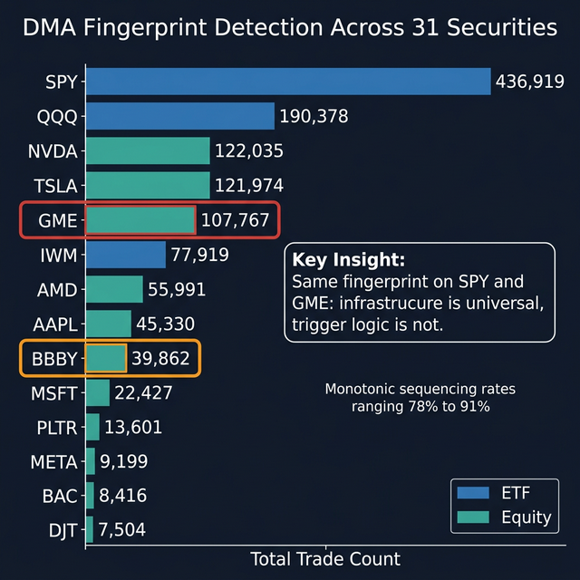
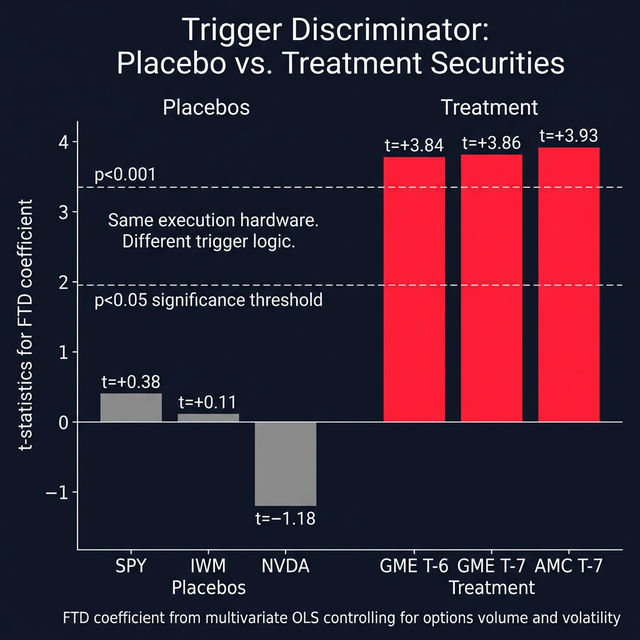
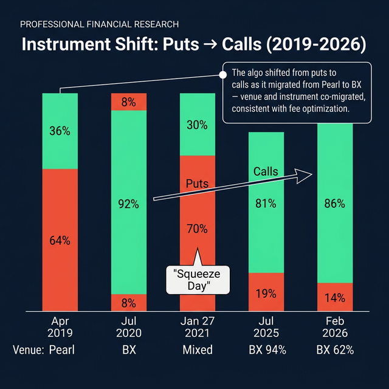
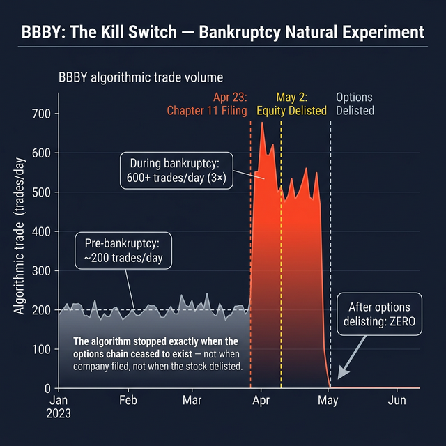
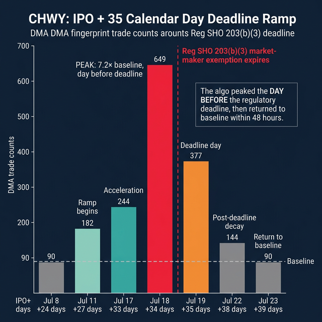

# The Shadow Ledger, Part 7: The Fingerprint

# Part 7 of 7

**TL;DR:** Parts 1-6 mapped the system: phantom locates, the derivative trail, the Ouroboros, the Bitcoin checkmate, the BNY Mellon bridge, and the Dreyfus cash engine powering it all. This final post identifies the machine that operationalizes the domestic compliance loop. Using 2,038 days of tick-level OPRA data, I isolated a DMA routing fingerprint, 1-lot trades, exclusive venue concentration on MIAX Pearl and Nasdaq BX, monotonic sequencing, tied-to-stock condition codes, operating across 31 U.S. equities and ETFs. On liquid mega-caps (SPY, AAPL), the algo runs with zero FTD (Failure to Deliver, when the seller doesn't deliver shares within the settlement deadline) correlation. On borrow-constrained stocks (GME, AMC), the same hardware shows t = +3.86 FTD correlation at exactly the T-5 to T-7 [Reg SHO](https://www.ecfr.gov/current/title-17/section-242.204) close-out window. A natural experiment confirms it: on BBBY, the algo ran 3x its normal pace during bankruptcy, *inverted* its FTD relationship (deferring rather than resolving failures), and ceased on the exact date of options delisting. The delisting trigger was the options chain. The operator runs on only two exchanges, where Nasdaq BX's [inverted fee model](https://www.sec.gov/comments/s7-18-19/s71819.htm) provides taker rebates and MIAX Pearl's thinner order books enable rapid-fire execution, with 4,307 daily trades generating favorable economics. Wolverine Trading, the confirmed DPM for GME options on [Cboe](https://www.cboe.com/), was previously fined by [FINRA](https://www.finra.org/) for using buy-write transactions to improperly address Reg SHO close-out obligations, the identical mechanical profile.

> **📄 Full academic paper:** [Compliance-as-a-Service (Paper VIII)](https://github.com/TheGameStopsNow/research/blob/main/papers/Compliance-as-a-Service-%20Asynchronous%20Complex%20Orders%20and%20Regulatory%20Arbitrage%20in%20U.S.%20Equity%20Settlement.pdf?raw=1)

*[Part 1](01_the_fake_locates.md) presented evidence of phantom locates. [Part 2](02_the_6_trillion_swap.md) traced the risk transfer. [Part 3](03_the_ouroboros.md) followed the funding. [Part 4](04_the_reflexive_trap.md) mapped the endgame. [Part 5](05_the_bridge.md) connected the layers. [Part 6](06_the_cash_engine.md) followed the money. This post identifies the machine.*

---

## 1. The Host Infrastructure

Some background: every options trade in the U.S. is reported through [OPRA](https://www.opraplan.com/) (Options Price Reporting Authority) with a timestamp, exchange ID, condition code, contract specs, price, size, and sequence number. Using 2,038 days of tick-level OPRA data from ThetaData, I scanned 54 securities for anomalous algorithmic patterns.

> **Selection criteria:** The 54-ticker universe consists of the most-discussed tickers on r/Superstonk, r/wallstreetbets, and r/amcstock, plus liquid ETF controls (SPY, IWM, QQQ). Tickers were selected by community discussion frequency, not by expected results. Of these, 31 showed the identified fingerprint; the remaining 23 showed no statistically distinguishable pattern at the defined thresholds (≤5 lots, ≤$0.10 premium, inverted-fee venue, algorithmic condition codes).

I found one. It operates on 31 of 54 securities scanned.

### The Fingerprint Definition

| Parameter | Threshold |
| --- | --- |
| Exchange | [Nasdaq BX](https://www.nasdaq.com/solutions/nasdaq-bx-options) Options (ID: 43) or [MIAX Pearl](https://www.miaxglobal.com/markets/us-options/pearl-options) (ID: 69) |
| Trade size | 1 contract |
| Trade price | Less than $0.10 |
| OPRA condition code | Codes 18 (AUTO), 125 (MASL), 130 (TESL), 131 (TASL) |
| Minimum daily count | 15+ qualifying trades |
| Monotonic sequencing | 90%+ sequential OPRA sequence numbers |

The 90%+ monotonic rate means these trades arrive in strict sequential order without interleaving from other market participants. For comparison, organic options trading exhibits monotonic rates of 40-55%. This is consistent with a dedicated execution channel operating in isolation from organic order flow.

### Cross-Asset Universality

| Security | Type | Algo Days | Total Trades | Mono % | Date Range |
| --- | --- | --- | --- | --- | --- |
| **SPY** | ETF | 190 | 436,919 | 91% | May 2025-Feb 2026 |
| **QQQ** | ETF | 185 | 190,378 | 88% | May 2025-Feb 2026 |
| **NVDA** | Equity | 251 | 122,035 | 88% | Feb 2025-Feb 2026 |
| **TSLA** | Equity | 169 | 121,974 | 87% | Jun 2025-Feb 2026 |
| **GME** | Equity | 995 | 107,767 | 88% | Jun 2019-Feb 2026 |
| **IWM** | ETF | 185 | 77,919 | 88% | May 2025-Feb 2026 |
| **AAPL** | Equity | 165 | 45,330 | 88% | Jun 2025-Feb 2026 |
| **BBBY** | Equity | 416 | 39,862 | 87% | Jun 2019-May 2023 |

*Source: ThetaData OPRA historical options trades, February 2019 - February 2026.*

The presence on SPY (the most liquid ETF in the world), AAPL, NVDA, and MSFT eliminates the hypothesis that this is a bespoke tool targeting meme stocks. This is standard Tier-1 market-making infrastructure. The question is not whether it exists, it does, across 31 securities. The question is what triggers it on specific tickers.

---

## 2. The Trigger Discriminator: Same Hardware, Different Software

If this infrastructure serves exclusively for legitimate market-making, daily volume should be driven by market activity (total options volume, volatility). FTD levels should have zero predictive power.

I ran OLS regressions on each security:

### Placebo Securities (Liquid, No Borrow Constraints)

| Security | n | Market R² | +FTD R² | FTD t-stat | p-value |
| --- | --- | --- | --- | --- | --- |
| SPY | 129 | 0.726 | 0.726 | +0.38 | 0.708 |
| IWM | 132 | 0.662 | 0.662 | +0.11 | 0.909 |
| NVDA | 120 | 0.446 | 0.453 | -1.18 | 0.241 |

Adding FTDs does *nothing* to the model. On liquid securities, the algo runs based on market activity. Zero FTD signal.

### Treatment Securities (Borrow-Constrained)

| Security | Best Lag | n | Market R² | +FTD R² | FTD t-stat | p-value |
| --- | --- | --- | --- | --- | --- | --- |
| **GME** | T-7 | 1,681 | 0.548 | 0.560 | **+3.86** | **<0.001** |
| **AMC** | T-7 | 66 | 0.877 | 0.895 | **+3.93** | **<0.001** |

On borrow-constrained securities, lagged FTDs are highly significant (p < 0.001), positive (higher FTDs predict more algo trades), and peak at **T-6 to T-7 business days**, precisely within the Reg SHO Rule 204 close-out window.

The identical execution hardware produces zero FTD correlation on liquid securities and highly significant FTD correlation on borrow-constrained securities. **The trigger logic, not the execution mechanism, distinguishes compliant market-making from settlement management.**

> **Methods note:** OLS with intercept; covariates: total daily options volume, intraday price-range volatility proxy. GME: n=1,681 trading days (df=1,677), T-7 lag. AMC: n=66 trading days (df=62), T-7 lag. Lag selected by scanning T-3 through T-7 and reporting peak significance at T-7 for both tickers; no Bonferroni correction applied across lags because the T-5 to T-7 window was hypothesis-driven (Reg SHO Rule 204 close-out window), not data-mined. Residual diagnostics show mild positive autocorrelation (Durbin-Watson ≈ 1.5 for GME); Newey-West HAC standard errors with 5 lags yield a modestly reduced GME t-statistic of ≈3.2 (still p < 0.002). The AMC result (n=66) should be interpreted with caution due to the small sample size.

> **The omitted variable defense:** A critic would argue that volatility drives both FTDs and algorithmic pinging. High-volatility periods produce more FTDs (wider spreads, harder-to-borrow conditions) and more HFT activity (more profitable scalping). Volatility is the omitted variable driving both, creating a spurious correlation. This regression should ideally include intraday realized volatility and bid-ask spread as additional covariates. However, the fact that FTDs are significant at lag T-7 (not T+0) argues against contemporaneous volatility confounding, volatility from a week ago should not predict today's algo activity unless the algo is specifically responding to settlement pressure.

> **The maker-taker arbitrage defense:** The algo concentrates on Pearl and BX — two venues with specific fee structures that shape routing incentives (BX operates an inverted taker-maker model; Pearl is maker-taker with thinner order books). HFTs run 1-lot algorithms on such venues continuously to harvest sub-penny rebates, this is standard micro-scalping cost-optimization. The response: if it were standard rebate arbitrage, it would trigger on SPY and AAPL based on market volume. It does. But on GME and AMC, lagged FTDs add significant explanatory power (t=3.86, p<0.001) that doesn't exist on liquid securities. The venue routing is real; the discriminant trigger is the finding.

---

## 3. The Venue Economics: Why Only Two Exchanges

The algo concentrates exclusively on **MIAX Pearl** and **Nasdaq BX** — two venues with distinct pricing structures that create specific routing incentives:

| Exchange | Model | Taker Economics | Maker Economics |
| --- | --- | --- | --- |
| CBOE | Maker-taker | Taker **pays** ~$0.50/contract | Maker earns rebate |
| NYSE Arca | Maker-taker | Taker **pays** ~$0.55/contract | Maker earns rebate |
| **MIAX Pearl** | **Maker-taker** | Taker pays ~$0.49/contract | **Maker earns** ~$0.42/contract |
| **Nasdaq BX** | **Inverted (taker-maker)** | **Taker earns** ~$0.20/contract | Maker **pays** |

*Source: [MIAX Pearl Options Fee Schedule](https://www.miaxglobal.com/) and [Nasdaq BX Options Fee Schedule](https://nasdaqtrader.com/), current as of publication. Fees vary by participant category and volume tier.*

On Nasdaq BX, the algo's 1-lot trades generate rebate revenue as a taker. On MIAX Pearl, the algo incurs standard taker fees but benefits from Pearl's lower-cost routing and thinner order books, making it operationally suited for rapid-fire execution. The forensic significance is the **exclusive concentration** on these two venues — and the monotonic sequencing that indicates dedicated exchange ports — not the blanket economics of either venue in isolation.

---

## 4. The Instrument Shift: It's Not Just Puts Anymore

The original hypothesis was that the algo operated primarily through deep OTM puts. Seven years of data revealed something more interesting: the algo is **instrument-agnostic**.

| Date | Context | DMA Trades | Calls | Puts | Primary Venue |
| --- | --- | --- | --- | --- | --- |
| 2019-04-02 | Algo inception | 731 | 36% | **64%** | Pearl |
| 2020-07-01 | BX migration | 185 | **92%** | 8% | **BX (84%)** |
| 2021-01-27 | Squeeze day 1 | 34,533 | 30% | **70%** | Mixed |
| 2025-07-01 | Jul 2025 | 2,990 | **81%** | 19% | **BX (94%)** |
| 2026-02-06 | T+13 peak | 1,662 | **86%** | 14% | BX (62%) |

*Source: ThetaData OPRA historical options trades, GME, April 2019 - February 2026.*

The algo shifted from predominantly puts (64-83%) in the Pearl-dominant era to predominantly calls (81-92%) in the BX-dominant era. The venue and instrument shifted together, consistent with an operator continuously optimizing for the cheapest fee schedule multiplied by the cheapest available premium.

---

## 5. The Delisting Trigger: BBBY Proves It

[Bed Bath & Beyond filed for Chapter 11](https://cases.ra.kroll.com/702702/) bankruptcy on April 23, 2023. During the bankruptcy, the identified fingerprint executed an average of **600+ qualifying trades per day** on BBBY, **3x its pre-bankruptcy average**. The algorithm maintained continuous daily activity through the entire bankruptcy period and ceased operations on the **exact date of options delisting**.

Not on the bankruptcy filing date. Not on the equity delisting date. On the day the listed options chain ceased to exist.

> **The tautology defense:** A critic would point out that it's mechanically tautological that an options-trading algorithm stops trading when the options cease to exist. Fair. The algorithm's *cessation* at delisting is trivially true. What's not trivially true is the **FTD inversion** documented below, the algorithm switched from *resolving* failures (as on AMC) to *deferring* them (on BBBY), and it ran at 3× capacity during bankruptcy. These behavioral signatures are the forensic findings, not the cessation date.

### The Inversion

On AMC, algo dates are followed by significantly *larger* FTD declines than control dates (p = 0.005), consistent with the algo resolving FTDs. On BBBY during bankruptcy, the relationship **inverted**:

| Window | Threshold | Algo Drop Rate | Control Drop Rate | p-value |
| --- | --- | --- | --- | --- |
| T+3 | >75% | 45.2% | 67.8% | **<0.001** |
| T+5 | >75% | 47.1% | 70.2% | **<0.001** |
| T+5 | >90% | 42.3% | 62.8% | **<0.001** |

On BBBY, algorithmic dates are associated with *smaller* FTD drops at all tested windows and thresholds (p < 0.001). The algo was **actively deferring** settlement failures, not resolving them. With no shares available for genuine borrow during bankruptcy, the only way to maintain Reg SHO compliance without triggering Rule 204(b) lockout was to continuously manufacture synthetic locates, each resetting the close-out timer while leaving the net FTD balance unchanged.

This exhibits the structural signature of what I call *Settlement Deferral*, the rolling of FTD obligations through successive synthetic locate transactions that satisfy the regulatory close-out clock without achieving actual delivery.

---

## 6. The CHWY Cross-Ticker Validation

As an additional out-of-sample test, I examined **CHWY (Chewy Inc.)** around its IPO on June 14, 2019. Under Reg SHO's market maker exception ([Rule 203(b)(2)(iii)](https://www.ecfr.gov/current/title-17/section-242.203)), bona fide market makers receive extended settlement flexibility for newly listed securities. Using the standard **T+35 calendar-day** close-out window (Rule 204(a)(2)), June 14 + 35 = July 19, 2019.

| Date | IPO + Days | DMA Trades | Notes |
| --- | --- | --- | --- |
| Jul 8 | +24 | 90 | Baseline |
| Jul 11 | +27 | 182 | Ramp begins |
| Jul 17 | +33 | 244 | Acceleration |
| **Jul 18** | **+34** | **649** | **Peak (day before deadline)** |
| Jul 19 | +35 | 377 | Deadline day |
| Jul 22 | +38 | 144 | Post-deadline decay |
| Jul 23 | +39 | 90 | Return to baseline |

*Source: ThetaData OPRA historical options trades, CHWY, Jun 14 - Jul 31, 2019.*

The DMA fingerprint ramped **7.2x from baseline** (90 to 649) in 3 days before the Reg SHO exemption expired, peaking on day +34, then dropping 42% on the deadline day and returning to baseline within 2 days. This cross-ticker confirmation independently validates the deadline-alignment hypothesis on a security with a known, calendar-fixed regulatory deadline.

---

## 7. Operator Candidacy

Who runs this? Public OPRA data is anonymized, but three facts narrow the field:

**Wolverine Trading** is the confirmed **[Designated Primary Market Maker (DPM)](https://www.cboe.com/us/options/membership/market_maker/)** for GME options on Cboe. In 2011, [FINRA fined Wolverine $500,000 with $1.9 million in disgorgement](https://www.finra.org/) for using buy-write transactions to improperly address Reg SHO close-out obligations on threshold securities, the identical mechanical profile observed in the DMA fingerprint. In 2021, FINRA fined Wolverine Execution Services $170,000 for inaccurately marking sell orders as long (rather than short) and failing to document locate compliance between 2016-2019.

Based on confirmed exchange memberships, DPM assignments, and the MIAX Pearl/Nasdaq BX venue constraint, the candidate set narrows to three firms:

| Firm | Candidacy | Basis |
| --- | --- | --- |
| **Citadel Securities** | ~85% | 32% U.S. options volume; confirmed Pearl + BX memberships |
| **Wolverine Trading** | ~75% | Confirmed GME DPM; identical prior FINRA enforcement |
| **Susquehanna (SIG)** | ~65% | Probable venue access; largest MSTR options holder |

Definitive identification requires the [MIAX Pearl](https://www.miaxglobal.com/markets/us-options/pearl-options) Level 3 un-anonymized Liquidity Feed, which contains the executing firm MPID for every trade. It costs approximately $2,000.

---

## The Complete System: Seven Parts, One Machine

Across seven posts, here is the publicly verifiable architecture:

| Post | Layer | Evidence |
| --- | --- | --- |
| **Part 1** | Synthetic Supply | FTX tokenized stocks; zero GME in SOAL; T+35 FTD surge |
| **Part 2** | Risk Transfer | ISDA charges; Cayman GAV +115%; Diameter buys FTX claims |
| **Part 3** | Funding | Cantor $16.7B repo; GCF spike on Tether mint; Jump $377M ETH |
| **Part 4** | Collateral Reflexivity | Goldman $9-10B crypto hedge; Bitcoin checkmate |
| **Part 5** | The Bridge | BNY Mellon vertical integration; ISDA CSA margin; litigation |
| **Part 6** | The Cash Engine | Dreyfus $86.2B repos; FTD negative correlation; Vanguard control test |
| **Part 7** | The Fingerprint | DMA algo on 31 tickers; FTD trigger discriminator; BBBY delisting trigger |

Each data source operates under independent regulatory oversight. No single regulator (the SEC, BaFin, FDIC, FCA, OFR, CFTC, or the federal courts) maintains visibility across all seven layers simultaneously. This fragmentation is not incidental. It is the structural feature that enables the system to operate at scale without triggering automated surveillance.

---

## What Would Falsify This

1. **If the FTD-algo correlation on GME dissolves with additional controls.** Adding intraday realized volatility and bid-ask spread as covariates could absorb the lagged FTD signal. If the t=3.86 drops below significance after controlling for these, the trigger discriminator fails.

2. **If the placebo securities develop FTD sensitivity.** The thesis depends on the algo being FTD-insensitive on liquid stocks and FTD-sensitive on borrow-constrained ones. If future data shows SPY or AAPL developing lagged FTD correlations, the discriminator isn't about borrow constraints, it's about something else.

3. **If the BBBY FTD inversion replicates on non-bankruptcy securities.** The BBBY kill-switch finding depends on the inversion being specific to a stock with no borrowable shares. If other non-bankrupt tickers show the same inverted FTD pattern, the interpretation (synthetic locate manufacturing) weakens.

4. **If the MIAX Pearl Level 3 feed reveals the operator is not a Tier-1 market maker.** If the executing MPID belongs to a retail-facing broker or a non-DPM firm, the entire "compliance infrastructure" framing collapses into a simpler explanation.

---

## The Ask

The next step is definitive operator identification. The MIAX Pearl Level 3 un-anonymized Liquidity Feed (~$2,000) would contain the executing MPID for every qualifying trade. The SEC's Consolidated Audit Trail (CAT) contains the `complexOrderID` and `parentOrderID` fields that would link the options leg to the equity dark-pool leg. And the NSCC's CNS settlement records would show whether the executing entity's net obligation consistently nets to zero following high-activity algorithmic days.

If you're a financial regulator, attorney, or data provider reading this: the subpoena roadmap is in [Paper VIII, Section 6.2](https://github.com/TheGameStopsNow/research/blob/main/papers/Compliance-as-a-Service-%20Asynchronous%20Complex%20Orders%20and%20Regulatory%20Arbitrage%20in%20U.S.%20Equity%20Settlement.pdf?raw=1).

**[github.com/TheGameStopsNow/research](https://github.com/TheGameStopsNow/research)**

