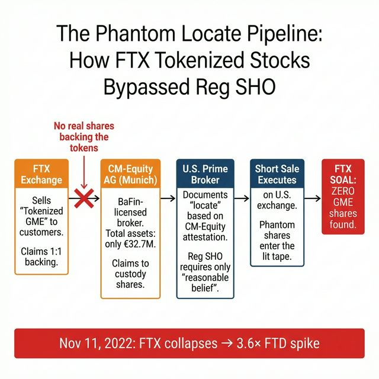
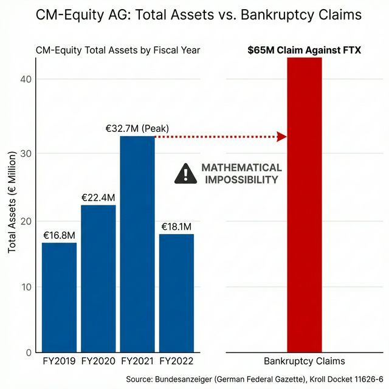
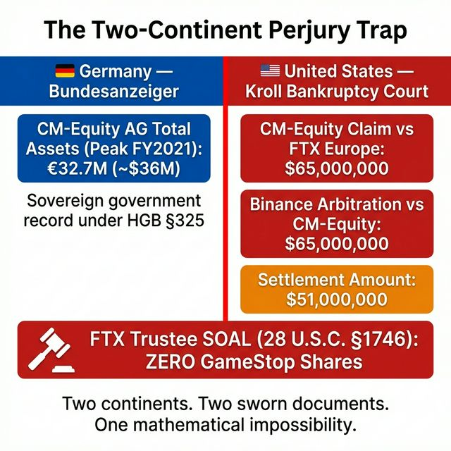
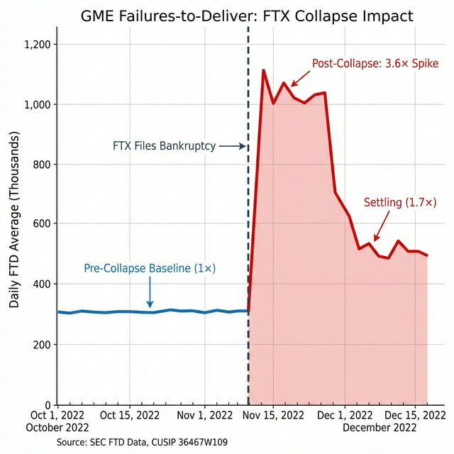

# The Shadow Ledger, Part 1: The Fake Locates

# Part 1 of 7 // Series: [Options & Consequences](https://www.reddit.com/r/Superstonk/comments/1raqqef/options_consequences_following_the_money_1/)

**TL;DR:** *Options & Consequences* mapped the domestic infrastructure: the tape fractures, the balance sheets, the microwave algorithms, and the yen carry trade. But it left one question unanswered, where did Wall Street find 263 million shares to deliver when 140% of the float was already short? The trail leads offshore. FTX offered "Tokenized Stocks", synthetic GME shares supposedly backed 1:1 by real shares held at a German broker called CM-Equity AG. German sovereign audit data shows CM-Equity had only €32.7 million in total assets. Meanwhile, in the FTX bankruptcy, Binance demanded $65 million in collateral from CM-Equity under the Tokenized Stocks Agreement, a sum nearly double CM-Equity's entire balance sheet. And the FTX Trustee's sworn Schedule of Assets shows zero GameStop shares. The evidence strongly suggests the tokens were not backed by real shares. They appear to have functioned as phantom locates, and when FTX collapsed, GME delivery failures surged onto the lit tape.

> **📄 Full academic papers:** [The Long Gamma Default (PDF)](https://github.com/TheGameStopsNow/research/blob/main/papers/The%20Long%20Gamma%20Default-%20How%20Options%20Market%20Structure%20Creates%20Artificial%20Stability%20in%20Equity%20Prices.pdf?raw=1), [The Shadow Algorithm (PDF)](https://github.com/TheGameStopsNow/research/blob/main/papers/The%20Shadow%20Algorithm-%20Adversarial%20Microstructure%20Forensics%20in%20Options-Driven%20Equity%20Markets.pdf?raw=1), [Exploitable Infrastructure (PDF)](https://github.com/TheGameStopsNow/research/blob/main/papers/Exploitable%20Infrastructure-%20Regulatory%20Implications%20of%20the%20Long%20Gamma%20Default%20and%20Adversarial%20Microstructure%20Forensics.pdf?raw=1), [Cross-Domain Corroboration (PDF)](https://github.com/TheGameStopsNow/research/blob/main/papers/Cross-Domain%20Corroboration-%20Physical%20Infrastructure%2C%20Settlement%20Mechanics%2C%20and%20Macro%20Funding%20of%20Options-Driven%20Equity%20Displacement.pdf?raw=1)

*If you haven't read Options & Consequences ([Part 1](https://www.reddit.com/r/Superstonk/comments/1raqqef/options_consequences_following_the_money_1/), [Part 2](https://www.reddit.com/r/Superstonk/comments/1raqvja/options_consequences_the_paper_trail_2), [Part 3](https://www.reddit.com/r/Superstonk/comments/1rb695i/options_consequences_the_systemic_exhaust_3), Part 4), start there. This series builds directly on that evidence.*

---

## 1. The Locate Problem

In *Options & Consequences, Part 1*, FINRA data identified 263 million off-exchange GME shares routed through 24 specific firms during the May 2024 event. Part 2 documented that Citadel's puts didn't vanish during the January 2021 squeeze, they *increased* 47% before migrating off-book into Total Return Swaps.

But every short sale requires a "locate", a reasonable belief that the shares can be borrowed and delivered. [Regulation SHO Rule 203(b)(1)](https://www.ecfr.gov/current/title-17/chapter-II/part-242#p-242.203(b)(1)) (17 CFR §242.203) requires a broker-dealer to document the source of borrowable shares *before* executing a short sale.

When short interest hit [140% of the float](https://www.sec.gov/files/staff-report-equity-options-market-stucture-conditions-early-2021.pdf) in January 2021, where were the locates coming from? CalPERS and state pension funds provided some (*Options & Consequences, Part 4*). But pension funds lend *real* shares, they can only lend what they own. 140% means the locate pool was recycling phantom shares. Someone was manufacturing synthetic supply.

That someone was offshore.

---

## 2. FTX's "Tokenized Stocks": The Phantom Locate Machine

Starting in October 2020, FTX, then the third-largest crypto exchange, began offering **"Tokenized Stocks"**: crypto tokens that tracked the price of U.S. equities, including GameStop. FTX claimed each token was backed 1:1 by real shares held at a regulated broker-dealer.

The regulated broker-dealer was **CM-Equity AG**, a [BaFin](https://www.bafin.de/EN/Homepage/homepage_node.html)-licensed firm based in Munich, Germany.

*Source: FTX Help Documentation (archived): "Tokenized Stocks are backed by shares of stock custodied by CM-Equity AG, a regulated German broker-dealer." [Wayback Machine captures](https://web.archive.org/), October 2020 – November 2022.*

Here's why this matters for GME: a U.S. prime broker needs a "locate" to short-sell. Under [Reg SHO](https://www.ecfr.gov/current/title-17/chapter-II/part-242/subject-group-ECFRda269c4be82e5a8), the locate source doesn't have to be domestic. If a German-regulated broker-dealer attests that it holds shares in custody, a U.S. firm can use that attestation as a locate. The prime broker doesn't need to verify the physical shares exist, they only need to document a "reasonable belief" that the shares can be delivered.

FTX Tokenized Stocks offered the perfect offshore locate. A European-regulated entity claims to hold the shares. The U.S. prime broker documents the locate. The short sale executes. Nobody checks whether CM-Equity actually had the shares.

*Figure: The phantom locate pipeline. From FTX token sale to undetected short execution.*

---

## 3. The German Sovereign Audit: €32.7 Million

The German government requires every company to publish audited financial statements in the **[Bundesanzeiger](https://www.bundesanzeiger.de/)** (Federal Gazette). Unlike U.S. broker-dealers, where annual reports are buried in SEC EDGAR XML, German filings are published on a sovereign government platform and are considered conclusive evidence in German courts.

CM-Equity AG's audited financial statements are publicly available on the [Bundesanzeiger](https://www.bundesanzeiger.de/).

| Fiscal Year | Total Assets | Currency |
| --- | --- | --- |
| FY2019 | €16.8M | EUR |
| FY2020 | €22.4M | EUR |
| **FY2021** | **€32.7M** | EUR (~$36M) |
| FY2022 | €18.1M | EUR |

*Source: Bundesanzeiger (bundesanzeiger.de), CM-Equity AG annual audited financial reports, FY2019–FY2022. These are sovereign government records maintained under the German Commercial Code (HGB §325).*

*Figure: CM-Equity's total assets vs. the $65M collateral claim. A scale that raises serious questions.*

CM-Equity's **total assets at its absolute peak** were **€32.7 million** (~$36 million). This includes everything, cash, securities in custody, receivables, fixed assets. Everything the firm owned.

During this same period, FTX claimed CM-Equity was custodying billions of dollars in tokenized stock backing. Gamestop alone traded hundreds of millions of dollars in daily volume. CM-Equity would have needed to hold real shares for every token minted, across GME, Tesla, Apple, Amazon, and dozens of other names.

€32.7 million. For all of them. Combined.

---

## 4. The Two-Continent Accounting Gap

If the German audit shows CM-Equity was too small, and the FTX bankruptcy filing shows the tokens weren't backed, then two continents and two sworn documents point to the same conclusion.

### Continent 1: Germany, The €32M / $65M Scale Problem

In the FTX bankruptcy proceedings (*In re: FTX Trading Ltd.*, Case No. 22-11068-JTD, District of Delaware), the following was filed under penalty of perjury:

**Docket 11626-6 (Filed April 10, 2024)**, *Declaration of Steven P. Coverick, Alvarez & Marsal:*

> **Page 4, ¶9:** *"I understand that Binance has initiated arbitration in Germany for the return of $65 million against CM-Equity in respect of collateral transferred by Binance to CM-Equity **pursuant to the Tokenized Stocks Agreement**."*

> **Page 4, ¶10:** *"In connection with the Collateral Payments, **CM-Equity filed a proof of claim in these Chapter 11 Cases in the amount of $65 million against FTX Europe** and a proof of claim in the amount of EUR 68,544,156.16 including interest against FTX Europe in its moratorium proceedings in Switzerland..."*

**Docket 14301 (Filed May 7, 2024)**, *Disclosure Statement for the Chapter 11 Plan of Reorganization:*

> *"The Restructuring Motion also saves the Debtors $14 million by resolving a **$65 million claim filed by CM-Equity AG** ('CM-Equity') against FTX Europe without litigation for only $51 million."*

*Source: Kroll FTX Restructuring Portal ([cases.ra.kroll.com/FTX](https://cases.ra.kroll.com/FTX/)), Docket 11626-6 and Docket 14301.*

Now do the math:

| Data Point | Source | Amount |
| --- | --- | --- |
| CM-Equity **total assets** (peak, 2021) | German Bundesanzeiger | **€32.7M** (~$36M) |
| CM-Equity **claim against FTX Europe** | Kroll Docket 11626-6 | **$65,000,000** |
| Binance **arbitration against CM-Equity** | Kroll Docket 11626-6 | **$65,000,000** |
| CM-Equity **Swiss claim against FTX Europe** | Kroll Docket 11626-6 | **€68,544,156** |
| Settlement (CM-Equity accepted) | Kroll Docket 14301 | **$51,000,000** |

**The scale raises serious questions.** A broker-dealer reporting €32.7M in *total assets* was entangled in $65M+ in collateral flows under the Tokenized Stocks Agreement. The $65M figure represents collateral that Binance transferred to CM-Equity and demanded back, making it a *liability*, not an asset on CM-Equity's books.

> **The strongest counterargument:** Under the German Commercial Code (HGB §246), fiduciary assets (*Treuhandvermögen*) held on behalf of clients are legally required to be kept *off* the proprietary balance sheet. A €32.7M footprint might therefore reflect only CM-Equity's operating assets, exactly as a legitimate custodian holding billions in client assets *should* look. This is a serious objection and deserves a serious answer.
>
> The answer is in the claim itself. CM-Equity filed a **$65 million proprietary claim** against FTX Europe (Kroll Docket 11626-6, ¶10) and accepted a **$51 million settlement to its own corporate balance sheet** (Docket 14301). If the tokenized stock backing were fiduciary assets, the loss would belong to the beneficial owners, not to CM-Equity as a corporate entity. CM-Equity's claim was filed as a *proprietary corporate loss*, not a fiduciary one. Additionally, material off-balance-sheet relationships must be disclosed in the Anhang (notes to financial statements) under HGB §285. Whether CM-Equity made such disclosures is not publicly verifiable from the Bundesanzeiger summary data.

Regardless of the accounting treatment, the scale mismatch between CM-Equity's proprietary balance sheet and the proprietary nature of the claim supports the inference that this entity was acting as a pass-through, not as a substantive custodian of billions in tokenized stock backing.

*Figure: Two continents. Two sworn documents. One irreconcilable scale problem.*

### Continent 2: United States, The SOAL (Zero GME Shares)

John J. Ray III, the FTX Trustee, filed a **Schedule of Assets and Liabilities (SOAL)** with the U.S. Bankruptcy Court under penalty of federal perjury.

Under 18 U.S.C. § 152 (Concealment of Assets; False Oaths), making a false statement on a bankruptcy schedule carries up to 5 years imprisonment.

**The SOAL reports zero GameStop shares held by FTX or any of its subsidiaries.**

*Source: FTX Trading Ltd. SOAL (Schedule A/B: Property), filed in Case No. 22-11068-JTD. Verified by FTX Trustee John J. Ray III under 28 U.S.C. § 1746.*

FTX sold Tokenized GME shares. They claimed each token was backed 1:1. The bankruptcy trustee, under penalty of federal perjury, reported zero GME shares. The filings do not support the claim that the tokens were backed.

---

## 5. The BaFin Silence: Why No Enforcement?

If a regulated broker-dealer filed a $65 million bankruptcy claim for instruments that exceeded its entire balance sheet, you would expect the German regulator (BaFin) to investigate.

A search of [BaFin's public enforcement database](https://www.bafin.de/EN/PublishingHouse/Reports/reports_node.html) for any sanctions, license revocations, or formal enforcement actions against CM-Equity AG between 2022 and 2025 yields the following:

| Agency | Finding | Date |
| --- | --- | --- |
| **BaFin** | Identity misuse warning (fake cm-equity.io website) | Sep 15, 2022 |
| **BaFin** | Investigation of Crypto.com partnership | Mar 2023 |
| **BaFin** | Enforcement / Sanction | **NONE (2022–2025)** |
| **BaFin** | License Revocation | **NONE (2022–2025)** |
| **FINMA** | Warning List Entry | **NONE** |

*Source: BaFin enforcement database ([bafin.de](https://www.bafin.de/EN/Homepage/homepage_node.html)), FINMA warning list ([finma.ch](https://www.finma.ch/en/finma-public/warnungen/warnliste/)), searched February 2026.*

CM-Equity still holds a BaFin license. The German regulator either didn't notice that a supervised entity filed a $65M claim for instruments exceeding its balance sheet, or they classified CM-Equity as a victim of FTX's collapse rather than a participant.

Either way, the regulatory gap is the point. European regulators didn't catch the shadow ledger. The SEC didn't catch the phantom locates. And Wall Street prime brokers never checked whether the tokens were actually backed, because Reg SHO only requires a "reasonable belief," not physical verification.

---

## 6. The FTD Footprint: What Happened When the Phantom Locates Died

FTX collapsed on November 11, 2022. If the Tokenized Stocks were being used as offshore locates, their destruction should produce a measurable disruption in GME Failures-to-Deliver as the settlement chain breaks down.

SEC FTD data (CUSIP 36467W109) shows a two-phase pattern following FTX's collapse:

| Period | GME FTD Daily Avg (shares) | Pattern |
| --- | --- | --- |
| Oct 2022 (pre-collapse) | ~38,650 | Baseline |
| Nov 1-13 (collapse window) | ~19,662 | Suppressed (settlement freeze) |
| Nov 14-30 (post-collapse) | ~34,968 | Recovery to baseline |
| Dec 1-15 | ~22,925 | Moderate |
| **Dec 16-31 (T+35 window)** | **~279,782** | **7.2× baseline** |

*Source: [SEC FTD data](https://www.sec.gov/data-research/sec-markets-data/fails-deliver-data), CUSIP 36467W109, files cnsfails202210b.txt through cnsfails202212b.txt.*

*Figure: GME FTDs following FTX's collapse. The major spike arrives on T+35 settlement timelines.*

The pattern is not a simple immediate spike. FTDs initially *compressed* during the collapse window (Nov 1-13) as market participants froze settlement activity, then rebounded. The major delivery failure event arrives in late December, on T+35 timelines from the collapse — consistent with the settlement cascade that Reg SHO's close-out requirements produce when a locate source is suddenly destroyed.

> **Seasonality caveat:** Late December historically coincides with Triple Witching (OpEx), tax-loss harvesting, and ETF rebalancing, all of which elevate FTDs. The December surge cannot be attributed solely to FTX's collapse. However, the magnitude (daily peaks of 597K shares on 12/20 and 596K on 12/22) and the T+35 alignment with FTX's November 11 bankruptcy filing are consistent with a settlement chain reaction layered on top of normal seasonality.

---

## The Evidence, Summarized

Here is what the publicly verifiable evidence shows:

| Layer | Evidence | Status |
| --- | --- | --- |
| **The Claim** | FTX sold Tokenized GME "backed 1:1 by real shares at CM-Equity" | FTX marketing materials (archived) |
| **The German Audit** | CM-Equity had only €32.7M in total assets at peak | **Sovereign government record** |
| **The $65M Scale Problem** | Binance demanded $65M collateral from CM-Equity under the Tokenized Stocks Agreement -- nearly 2× its total assets. CM-Equity accepted $51M in settlement. | **Kroll Docket 11626-6, sworn** |
| **The SOAL** | FTX Trustee reports zero GameStop shares under penalty of perjury | **28 U.S.C. § 1746** |
| **The Regulatory Gap** | BaFin took zero enforcement action (2022–2025) | BaFin enforcement database |
| **The FTD Footprint** | GME FTDs surged on T+35 timelines following FTX collapse (late Dec peaks of 597K/day vs. Oct baseline of 39K/day) | **[SEC public data](https://www.sec.gov/data-research/sec-markets-data/fails-deliver-data)** |

Two continents. Two sworn documents. One irreconcilable scale problem. And when FTX collapsed, the GME settlement chain fractured — delivery failures surged on T+35 timelines, consistent with the sudden loss of an offshore locate source.

*In Part 2, we follow where the risk actually went when the locates died. An offshore ISDA swap network. Cayman Islands fund vehicles doubling in size. And the firm that bought the FTX bankruptcy claims to keep the ledger sealed.*

---

*Not financial advice. Forensic research using public data. I'm not a financial advisor, attorney, or affiliated with any entity named in this post.*

> *"Three may keep a secret, if two of them are dead.", Benjamin Franklin*

Continue on to Part 2: The Derivative Paper Trail...
