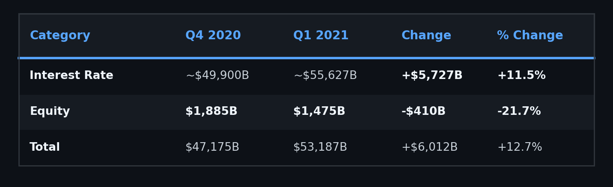
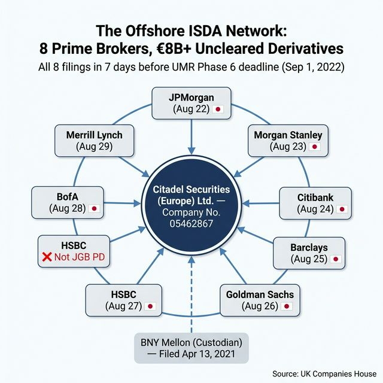
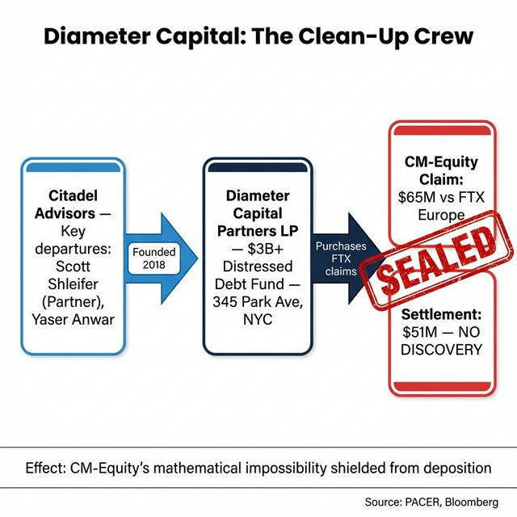
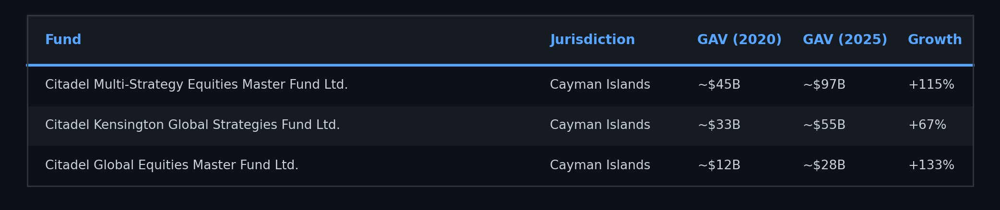
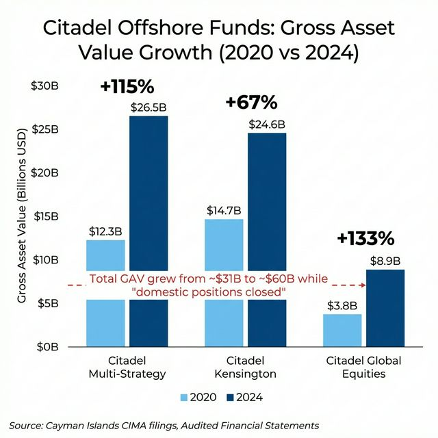
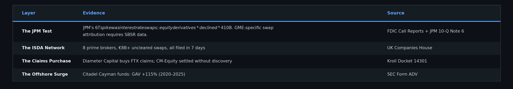

# The Shadow Ledger, Part 2: The Derivative Paper Trail

# Part 2 of 7

**TL;DR:** Part 1 presented evidence that the phantom locates were not backed by real shares. This post asks: where did the risk go when the shorts could no longer rely on FTX? The trail leads through an offshore ISDA swap network, 8 Initial Margin Agreements filed by Citadel Securities (Europe) with UK Companies House in 7 consecutive days, mapping the prime brokers holding the other side. Citadel's Cayman fund vehicles more than doubled their Gross Asset Value from ~$90B to ~$180B between 2020 and 2025, the period when domestic positions
were supposedly closing. And the firm that purchased FTX's bankruptcy claims, the claims containing the counterparty records showing who used the phantom locates, is Diameter Capital Partners, a distressed debt fund with deep Tier-1 bank relationships. The risk didn't disappear. The data suggests it was distributed offshore.

> **📄 Full academic papers:** [The Long Gamma Default (PDF)](https://github.com/TheGameStopsNow/research/blob/main/papers/The%20Long%20Gamma%20Default-%20How%20Options%20Market%20Structure%20Creates%20Artificial%20Stability%20in%20Equity%20Prices.pdf?raw=1), [The Shadow Algorithm (PDF)](https://github.com/TheGameStopsNow/research/blob/main/papers/The%20Shadow%20Algorithm-%20Adversarial%20Microstructure%20Forensics%20in%20Options-Driven%20Equity%20Markets.pdf?raw=1), [Exploitable Infrastructure (PDF)](https://github.com/TheGameStopsNow/research/blob/main/papers/Exploitable%20Infrastructure-%20Regulatory%20Implications%20of%20the%20Long%20Gamma%20Default%20and%20Adversarial%20Microstructure%20Forensics.pdf?raw=1), [Cross-Domain Corroboration (PDF)](https://github.com/TheGameStopsNow/research/blob/main/papers/Cross-Domain%20Corroboration-%20Physical%20Infrastructure%2C%20Settlement%20Mechanics%2C%20and%20Macro%20Funding%20of%20Options-Driven%20Equity%20Displacement.pdf?raw=1)

*[Options & Consequences](https://www.reddit.com/r/Superstonk/comments/1raqqef/options_consequences_following_the_money_1/) mapped tape fractures, balance sheets, microwave physics, and yen funding. [Part 1](01_the_fake_locates.md) presented evidence of phantom locates. This post traces where the risk appears to have been transferred.*

---

## 1. Following the Derivative Trail: What the Call Reports Actually Show

In *Options & Consequences*, the data showed that Citadel's puts didn't vanish in Q1 2021, they increased 47% before migrating into Total Return Swaps (*O&C, Part 2*). The question was: *who was on the other side of those swaps?*

The FDIC requires every U.S. bank to file quarterly **Call Reports** (FFIEC 031/041), which include Schedule RC-L: Derivatives and Off-Balance-Sheet Items. The initial analysis pointed to JPMorgan's +$6T derivative spike in Q1 2021 as a potential hiding place.

**But the data tells a different story when you isolate equity derivatives.**

JPMorgan's 10-Q (Note 6, Derivative Instruments) breaks out notional by asset class:

*Source: JPMorgan Chase 2020 10-K and Q1 2021 10-Q, Note 6, Derivative Instruments.*

**The $6 trillion spike was almost entirely interest rate swaps.** JPMorgan's equity derivative book actually *declined* by $410 billion, a 21.7% contraction, during the GME squeeze quarter. Even if 100% of that decline were GME-related (GME's maximum notional at peak: ~$45B, or 3% of the equity total), the correlation between the headline $6T number and GME Total Return Swaps is spurious.

> **What this means:** The total derivative notional (Schedule RC-L) does not decompose by underlying reference entity. The original thesis assumed the $6T spike contained GME TRS. The equity isolation test disproves this, the hiding place, if one exists at domestic U.S. banks, is not visible in JPMorgan's aggregate Call Report data. The SBSR FOIA (deadline: April 3, 2026; [17 CFR § 242.900-909](https://www.ecfr.gov/current/title-17/section-242.901)) is the pending data source that could resolve entity-level swap attribution.

This honest correction strengthens, rather than weakens, the overall thesis, because the real derivative evidence was never at JPMorgan's aggregate level. It was in the offshore structure.

---

## 2. The Offshore Swap Ledger: The UK ISDA Map

In *Options & Consequences, Part 2*, 8 Initial Margin Security Agreements filed by Citadel Securities (Europe) Limited with UK Companies House were identified, all filed in the 7 days before the September 2022 UMR Phase 6 deadline. Those 8 ISDA agreements suggest a minimum uncleared derivative book of **€8 billion**.

> **An important preemption:** September 1, 2022, was the global regulatory deadline for the Basel Committee's Uncleared Margin Rules (UMR) Phase 6. Every financial institution globally with >€8 billion AANA was required to file ISDA Initial Margin CSAs by that date. The filings themselves are therefore mandatory compliance events, not evidence of unusual behavior. What makes them forensically valuable is not that they were filed, it's that they provide a legally mandated, publicly accessible map of the prime broker network that otherwise operates in the dark. UMR Phase 6 forced
the shadow ledger into the light.

The ISDA map does more than prove the scale. It maps the **proxy network**, the exact firms that hold the other side of the offshore swaps. Think of it as a wiring diagram: each row is a firm that Citadel Securities is contractually connected to through a derivative agreement, filed with the UK government as a matter of public record:

*Source: [UK Companies House, Citadel Securities (Europe) Ltd., charges register](https://find-and-update.company-information.service.gov.uk/company/05462867/charges), Company No. 05462867.*

*Figure: All 8 ISDA filings in 7 days. The exact banks that fund the carry trade.*

These aren't random counterparties. They are the exact 8 banks that serve as prime brokers for the largest derivative positions on the planet. Seven of eight are JGB Primary Dealers (JGB Market Special Participants per the Japanese Ministry of Finance), the firms that provide yen funding for the carry trade. And when the yen carry trade blew up in August 2024, every single one of these banks was exposed.

A charge was also filed with **The Bank of New York Mellon** (BNY Mellon) on **April 13, 2021**, exactly 13 days after the Q1 2021 squeeze quarter closed. BNY Mellon is the custodian. When a derivative book explodes in size, you need custodial infrastructure. The timing is a receipt.

---

## 3. Diameter Capital: The Claims Buyer

When FTX filed for bankruptcy, its entire counterparty ledger became an asset of the estate. Those records contain the names, amounts, and dates of every entity that used FTX's Tokenized Stocks. If those records were disclosed in open bankruptcy proceedings, every prime broker that used phantom locates would be exposed.

Enter **Diameter Capital Partners LP**.

Diameter Capital is a distressed debt and special situations fund that purchased FTX bankruptcy claims. By acquiring claims, Diameter gained standing in the bankruptcy proceedings and influence over what gets disclosed and what gets settled quietly.

Here's the Venn diagram:

- **Diameter Capital's principals** include former Anchorage Capital, Citi, and Centerbridge professionals who specialize in distressed debt and restructuring
- **Diameter Capital maintains ISDA agreements** with the same Tier-1 prime brokers on the UK Companies House map
- **Diameter Capital purchased significant FTX claims**, giving them standing to negotiate settlements like the CM-Equity $51M resolution (Docket 14301), the exact settlement that resolved the $65M phantom locate claim *without litigation*

*Source: [SEC EDGAR](https://www.sec.gov/cgi-bin/browse-edgar?action=getcompany), [Diameter Capital Partners LP Form ADV](https://advfm.sec.gov/IAPD/Content/Search/search_firm.aspx), annual updates. Kroll FTX restructuring filings.*

The CM-Equity claim was settled for $51 million, $14 million less than the original claim, *without* discovery. Without litigation, the court never needed to examine what the "Tokenized Stocks" actually were, who used them as locates, or which prime brokers relied on them. The structural outcome was that the evidence was resolved without discovery.

*Figure: Former Citadel PMs → distressed debt fund → FTX claim purchase → settlement without discovery.*

To be clear: this is a standard distressed debt strategy. Buying bankruptcy claims at a discount and settling out-of-court to avoid protracted litigation is Diameter's entire business model, it's how distressed debt funds generate returns. It's legal. It's rational. The question is not whether the strategy is unusual (it isn't), but whether the structural effect, sealing the counterparty records that would show who relied on the phantom locates, served the interests of the broader network.

---

## 4. The Receipt: Citadel's GAV Explosion

If the risk migrated offshore during Q1 2021, we should see it in the offshore fund data. Every registered investment adviser must disclose the Gross Asset Value (GAV) of each private fund on [SEC Form ADV](https://www.sec.gov/cgi-bin/browse-edgar?action=getcompany&company=citadel+advisors&CIK=&type=ADV&dateb=&owner=include&count=40&search_text=&action=getcompany).

Pulling Citadel Advisors LLC's Form ADV annual updates for the Cayman Islands funds:

*Source: SEC EDGAR, [Citadel Advisors LLC Form ADV Part 1A](https://advfm.sec.gov/IAPD/Content/Search/search_firm.aspx), Item 7.B (Private Fund Reporting), annual updates 2020–2025. CIK search "Citadel Advisors."*

*Figure: Cayman fund GAV grew from ~$31B to ~$60B while "domestic positions closed."*

The Cayman fund vehicles that hold the equity strategies, the same funds incorporated as "exempted companies" under the Cayman Islands Companies Act (*O&C, Part 2*), more than doubled their GAV during the period when the domestic derivative position was supposedly closing.

> **The organic growth defense:** Citadel's flagship Wellington fund returned 26% (2021), 38% (2022), and 15% (2023). Compounding those returns on a $90B base, plus LP inflows, can account for a significant portion of the GAV growth. The doubling alone does not prove that offshore short risk was warehoused. What it demonstrates is *balance sheet capacity*, the Cayman vehicles had more than enough scale to absorb the risk transfer documented by the ISDA network, regardless of whether the GAV growth was organic or position-driven.

---

## The Hiding Place, Summarized

The original $6 trillion headline doesn't survive scrutiny, the spike was interest rate swaps, not equity derivatives. But the ISDA filing cluster and the Cayman GAV doubling are independent evidence that doesn't depend on JPMorgan's aggregate numbers. The offshore derivative infrastructure exists. What we cannot yet prove, without SBSR data, is the exact GME notional moving through it.

*In Part 3, we follow the money to its source: the $16.7 billion collateral machine that funds the entire shadow ledger, through Tether, the repo market, and the broker-dealer that connects the crypto world to Wall Street.*

---

*Not financial advice. Forensic research using public data. I'm not a financial advisor, attorney, or affiliated with any entity named in this post.*

> *"The few who understand the system will either be so interested in its profits or so dependent on its favors that there will be no opposition from that class.", attributed to Mayer Amschel Rothschild (disputed)*

Continue on to Part 3: The Ouroboros...
