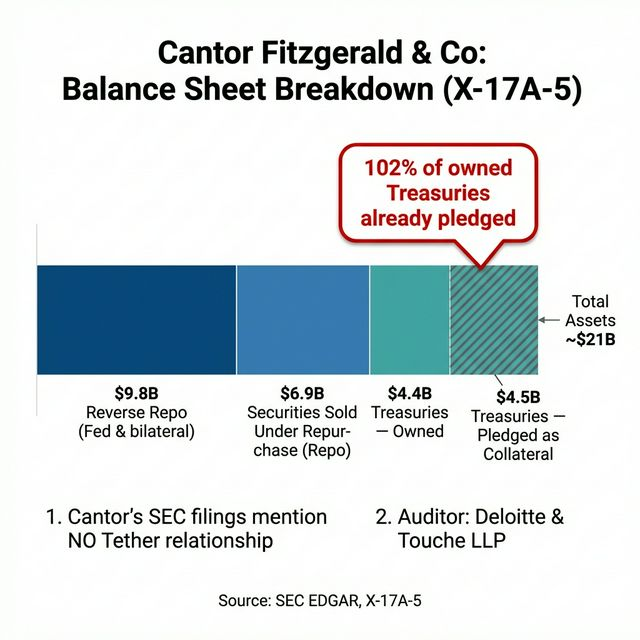
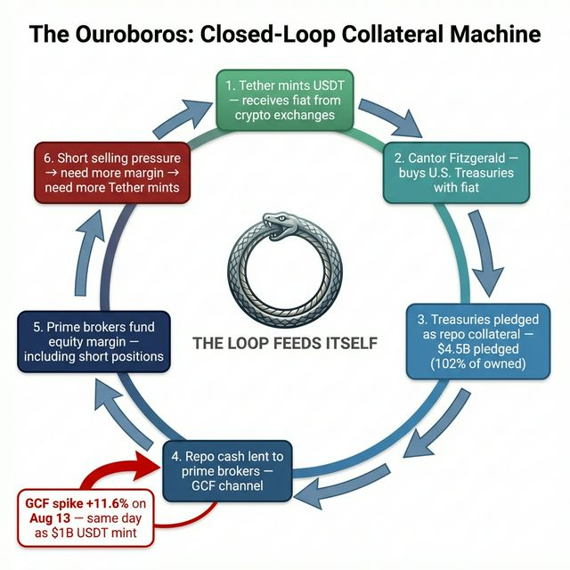
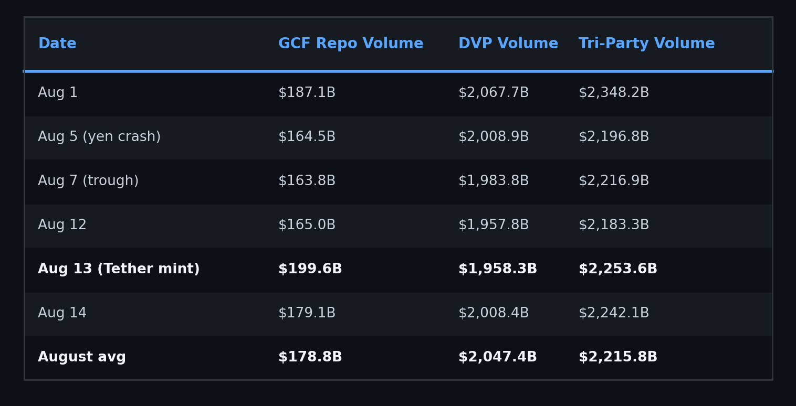
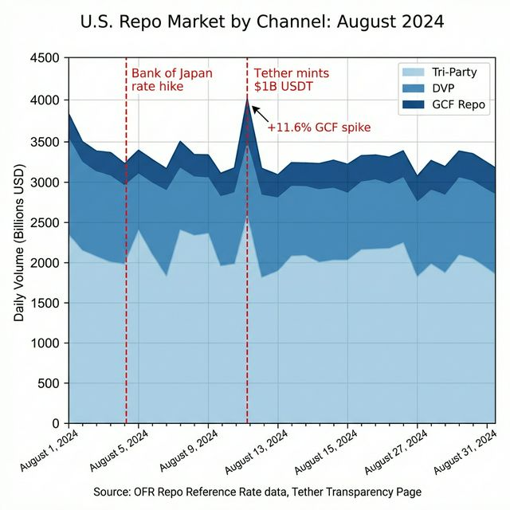
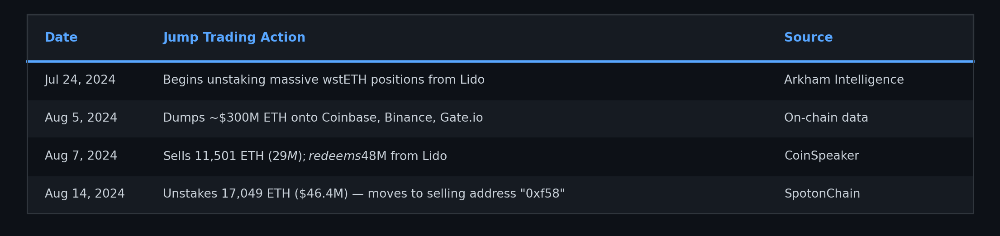
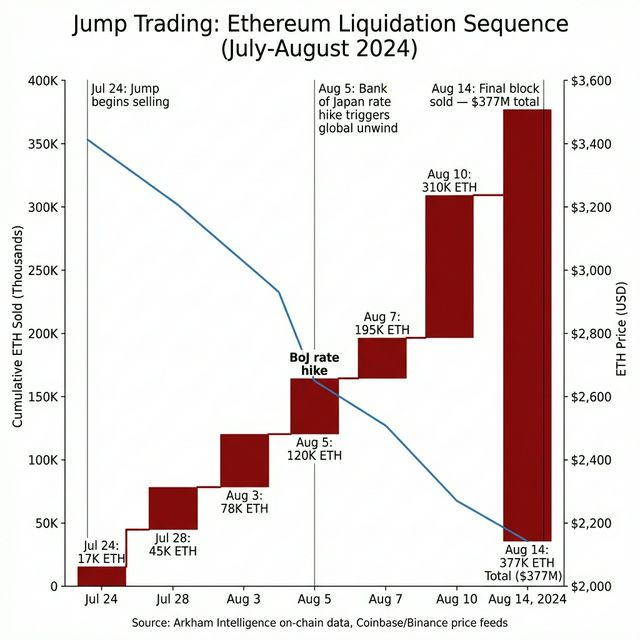
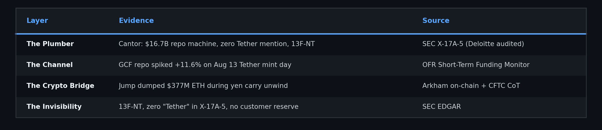

# The Shadow Ledger, Part 3: The Ouroboros

# Part 3 of 7

**TL;DR:** Parts 1 and 2 presented evidence of phantom locates and traced where the risk appears to have been transferred. This post asks how the system was funded for three years without the SEC detecting it. The answer appears to be a closed-loop collateral machine I'm calling The Ouroboros. Cantor Fitzgerald, the broker-dealer that custodies Tether's $100B+ reserves, runs a $16.7 billion repo machine that converts Treasuries into fiat cash for the prime broker network. Its X-17A-5 shows $6.9 billion in reverse repo, $4.4 billion in Treasuries owned with $4.5
billion simultaneously pledged as collateral, and zero mention of Tether anywhere. On August 13, 2024, the same day Tether minted $1 billion USDT, the GCF repo channel spiked to $199.6B (+11.6% vs. average) while all other repo channels declined. And Jump Trading, a Go West consortium partner, liquidated $377 million in Ethereum the same week the yen carry trade unwound. The fiat-to-crypto pipeline and the yen-funded short machine appear to share the same plumbing.

> **📄 Full academic papers:** [The Long Gamma Default (PDF)](https://github.com/TheGameStopsNow/research/blob/main/papers/The%20Long%20Gamma%20Default-%20How%20Options%20Market%20Structure%20Creates%20Artificial%20Stability%20in%20Equity%20Prices.pdf?raw=1), [The Shadow Algorithm (PDF)](https://github.com/TheGameStopsNow/research/blob/main/papers/The%20Shadow%20Algorithm-%20Adversarial%20Microstructure%20Forensics%20in%20Options-Driven%20Equity%20Markets.pdf?raw=1), [Exploitable Infrastructure (PDF)](https://github.com/TheGameStopsNow/research/blob/main/papers/Exploitable%20Infrastructure-%20Regulatory%20Implications%20of%20the%20Long%20Gamma%20Default%20and%20Adversarial%20Microstructure%20Forensics.pdf?raw=1), [Cross-Domain Corroboration (PDF)](https://github.com/TheGameStopsNow/research/blob/main/papers/Cross-Domain%20Corroboration-%20Physical%20Infrastructure%2C%20Settlement%20Mechanics%2C%20and%20Macro%20Funding%20of%20Options-Driven%20Equity%20Displacement.pdf?raw=1)

*[Part 1](01_the_fake_locates.md) presented evidence of phantom locates. [Part 2](02_the_6_trillion_swap.md) traced the risk transfer. This post follows the money to its source.*

---

## 1. Cantor Fitzgerald: The Invisible Bridge

In 2023, **Cantor Fitzgerald** became the primary custodian for **Tether's U.S. Treasury reserves**. Tether (USDT) is the largest stablecoin by market cap (~$184B as of early 2026), claiming each token is backed 1:1 by U.S. dollars and Treasury securities. Cantor's role is to manage this reserve portfolio.

Every filing for both Cantor entities is available on [SEC EDGAR](https://www.sec.gov/cgi-bin/browse-edgar?action=getcompany).

### What the 13F Shows: Nothing

**Cantor Fitzgerald & Co.** (CIK 0000017018), the broker-dealer entity that handles the actual custody, files **13F-NT** (Notice of Inability to File). This means they claim to hold less than $100 million in 13F-qualifying securities.

**Cantor Fitzgerald, L.P.** ([CIK 0001024896](https://www.sec.gov/cgi-bin/browse-edgar?action=getcompany&CIK=0001024896&type=&dateb=&owner=include&count=40)), the parent partnership, files 13F-HR. A review of all 10 quarterly filings from Q1 2024 through Q4 2025 shows: **zero Treasury ETF positions, zero Bitcoin ETF positions, zero MSTR positions.** Their 13F shows generic equity holdings in no way connected to their Treasury custody business.

*Source: SEC EDGAR Submissions API, CIK 0000017018 (13F-NT) and CIK 0001024896 (13F-HR), Q1 2024 – Q4 2025. Script: [`cantor_fitzgerald.py`](https://github.com/TheGameStopsNow/research/tree/main/code)*

The entity custodying $100B+ in Tether reserves claims to hold less than $100M in reportable securities. The Treasuries held for Tether don't appear on any 13F because they flow through the **repo market**, not the equity market.

### What the X-17A-5 Shows: The $16.7 Billion Machine

Every broker-dealer must file an annual [X-17A-5 (FOCUS Report)](https://www.sec.gov/cgi-bin/browse-edgar?action=getcompany&CIK=0001024896&type=X-17A-5&dateb=&owner=include&count=40) with the SEC. Cantor Fitzgerald & Co.'s most recent filing, the Statement of Financial Condition for December 31, 2024, audited by Deloitte & Touche LLP, reveals the following:

 with the SEC. Cantor Fitzgerald & Co.'s most recent filing, the Statement of Financial Condition for December 31, 2024, audited by Deloitte & Touche LLP, reveals the following:](figures/table_01_03_the_ouroboros.png)

*Source: SEC EDGAR, Cantor Fitzgerald & Co. X-17A-5, report date December 31, 2024, filed March 3, 2025, audited by Deloitte & Touche LLP.*

*Figure: Cantor's $16.7B repo machine. 102% of owned Treasuries already pledged.*

Four numbers tell the story:

1. **$6.9 billion in reverse repo + $9.8 billion in repo.** Cantor's gross collateralized financing book is **$16.7 billion**. This is the machinery for converting Treasury securities into fiat cash.

2. **$4.4 billion in Treasuries owned + $4.5 billion simultaneously pledged as collateral.** Nearly every Treasury Cantor owns is being recycled through the repo market. The same securities serve dual duty, backing a Tether attestation AND generating fiat liquidity through repo.

> **The matched-book defense:** A primary dealer pledging 100%+ of owned Treasuries in the repo market is the exact definition of a "matched-book" repo business. It is standard plumbing, this is how primary dealers operate. The anomaly is not the pledge ratio. It's the *source of fiat* flowing through the machine (crypto stablecoins converted to Treasury collateral), and the complete invisibility of that relationship in the filings.

3. **$11.9 million in Customer Reserve.** Only $11.9M is segregated under Rule 15c3-3. If Tether's reserves are flowing through Cantor, they are NOT classified as "customer" accounts. They are a principal business relationship.

4. **Zero mention of "Tether", "stablecoin", or "digital asset"** in the entire filing, including all notes, related party transactions, and subsequent events. The relationship is structurally invisible.

---

## 2. The Ouroboros: How the Loop Closes

The structure separates into two roles:

**The Plumber (Cantor Fitzgerald):**

1. Tether sends billions in fiat USD to Cantor
2. Cantor buys U.S. Treasuries to "back" Tether's reserves
3. Cantor immediately pledges those Treasuries as repo collateral ($9.8B repo)
4. The repo counterparties (clearing banks, FICC members) receive clean fiat cash
5. Cantor earns the spread between Tether's fiat and the repo rate
6. Cantor files 13F-NT because the Treasuries aren't "held", they're pledged

Cantor is pure plumbing. They take zero directional equity risk. They clip risk-free fees converting Treasury collateral into fiat for the prime broker network. That's why their 13F shows nothing, they're not trading. They're running a collateral transformation machine.

**The Gamblers (Goldman Sachs, Citadel, Jane Street, Susquehanna):**

The prime brokers and market makers borrow that fiat liquidity to fund their massive proxy hedges and equity derivative positions. Goldman alone holds **$9-10 billion** in crypto-adjacent 13F positions (more on this in Part 8).

This separation of church and state is exactly how the modern shadow banking system isolates risk. Cantor handles the fiat-to-crypto bridge. Goldman and Citadel handle the equity delta. The two never directly touch, but the same fiat liquidity flows from crypto mints to equity margin through the repo plumbing.

*Figure: The loop feeds itself. Tether mints → Treasuries → repo → prime broker margin → short pressure → more mints.*

---

## 3. The GCF Spike: Catching the Ouroboros Live

If Cantor's repo machine is the pipeline for Tether's liquidity, we should see it in the repo market data when Tether mints. Crucially, the mints themselves do not need to volumetrically match the short exposure 1:1; rather, the mints act as a catalyst, an exhaust valve that signals when the prime broker system requires acute fiat liquidity injections to manage VaR (Value at Risk, statistical measure of maximum expected loss) spikes.

On **August 13, 2024**, Tether minted **$1 billion USDT** on Ethereum. OFR (Office of Financial Research) repo market data for the full month of August 2024, broken down by channel:

*Source: OFR Short-Term Funding Monitor API ([data.financialresearch.gov](https://data.financialresearch.gov)), GCF, DVP, and Tri-Party repo series, August 2024.*

On August 13, the Tether mint day:

- **GCF repo: $199.6B** (+11.6% vs. month average, +21.8% vs. crisis trough)
- **DVP repo: $1,958.3B** (-4.3% vs. average, **DECLINING**)
- **Tri-Party: $2,253.6B** (+1.7% vs. average, flat)

**GCF surged while DVP declined and Tri-Party stayed flat.** The GCF (General Collateral Finance) channel is the FICC-cleared interdealer repo market where broker-dealers like Cantor pledge Treasury collateral. It spiked on exactly the day Tether deployed $1 billion, consistent with immediate Treasury collateral deployment through the GCF repo channel.

> **The N=1 caveat:** This is a single observation. The [GCF market](https://www.dtcc.com/clearing-services/ficc-gov/gcf-repo) processes ~$200B daily, and mid-month Treasury auction settlement regularly causes $20B+ swings. A $1B Tether mint cannot mechanically account for a $20B GCF spike without significant leverage or multiplier effects. A systematic test of all Tether mints >$500M over 3 years against GCF volume, controlling for Treasury settlement dates, is required for statistical confidence. I present this as a *consistent observation*, not a causal proof.

*Figure: GCF repo spiked +11.6% on the exact day [Tether minted $1B USDT](https://tether.to/en/transparency/).*

---

## 4. Jump Trading: The Crypto-to-Yen Bridge

The Ouroboros doesn't just connect crypto to TradFi through the repo market. It connects directly to the yen carry trade through the same trading firms.

**Jump Trading**, one of the three Go West microwave consortium partners (*Options & Consequences, Part 4*), dumped **$377 million in Ethereum** during the same week as the yen carry trade unwind.

*Sources: Arkham Intelligence on-chain tracking, August 2024. [CoinSpeaker (Aug 14, 2024)](https://www.coinspeaker.com/), [CryptoNews AU (Aug 5, 2024)](https://cryptonews.com.au/).*

*Figure: Jump's $377M ETH sell-off synchronized with the yen carry trade unwind.*

On the same week that [CFTC](https://www.cftc.gov/MarketReports/CommitmentsofTraders/index.htm) data shows leveraged funds unwinding 108,220 yen short contracts ($10.8B), Jump was liquidating $377M in ETH. Both positions were being closed simultaneously, yen shorts AND crypto holdings. The BoJ rate hike forced liquidation across ALL asset classes because the carry trade proceeds were partially deployed into crypto.

> **The macro de-risking defense:** August 5, 2024 was a historic global volatility shock ([VIX](https://www.cboe.com/tradable_products/vix/) hit 65). HFTs de-risk across all asset classes during macro shocks, liquidating crypto is standard VaR-limit management, not evidence of a specific mechanism. This is a fair objection. What makes Jump's case forensically interesting is not the liquidation itself (which was rational), but the *convergence* of three independent connections: the same firm co-funded the microwave infrastructure to Chicago (equities), is registered on the [JFSA High-Speed Trader registry](https://www.fsa.go.jp/en/) (yen carry), **and** liquidated crypto positions during the
unwind. The coincidence of all three in one entity is what elevates this from "standard de-risking" to "worth investigating."

And Jump isn't just a crypto firm. They co-funded the microwave infrastructure to Chicago. They're registered on the JFSA High-Speed Trader registry. They paid a [$123 million settlement to the SEC](https://www.sec.gov/) (via subsidiary Tai Mo Shan) for manipulating the TerraUSD stablecoin, where they earned $1.28 billion in profit. This is the same firm whose correlated trading produced the 17-sigma signal in *Options & Consequences, Part 3*.

The same entity connects to the microwave network (equities), the yen carry trade (funding), and the crypto liquidation pipeline (Tether/ETH). Three legs of the stool, one trading firm.

---

## The Funding, Summarized

Cantor Fitzgerald converts Tether's fiat into Treasuries, pledges those Treasuries into the GCF repo market, and generates clean fiat liquidity for the prime broker network. The repo cash funds the margin that sustains the equity derivative positions mapped in Part 2. When the yen carry trade blew up, the crypto assets liquidated simultaneously because the same funding pool backed both positions.

The Ouroboros is a snake eating its own tail: acute liquidity demands trigger Tether mints (the catalyst), which fund Treasury purchases, which are pledged for repo liquidity, which funds equity margin for the shorts. The mint is the exhaust signature of the machine under load. The loop closes and keeps running until someone breaks it.

*In Part 4, we show who is breaking it, and how.*

---

*Not financial advice. Forensic research using public data. I'm not a financial advisor, attorney, or affiliated with any entity named in this post.*

> *"Give me a lever long enough and a fulcrum on which to place it, and I shall move the world.", Archimedes*

Continue on to Part 4: The Checkmate...
