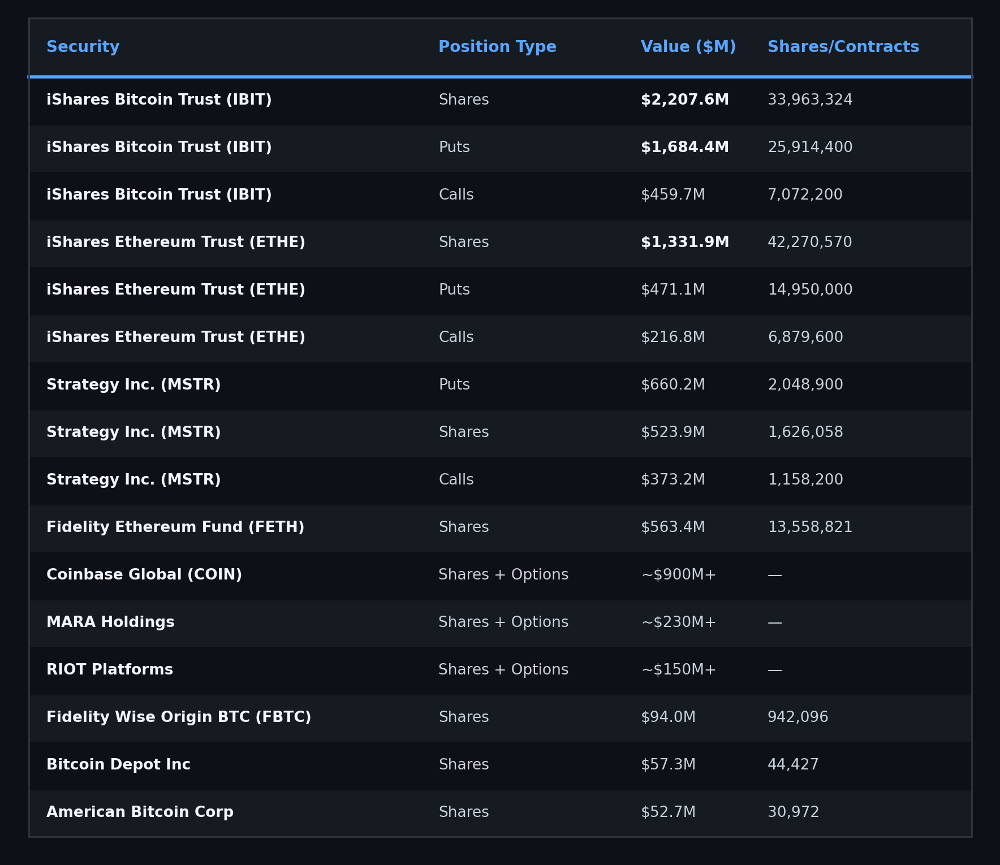
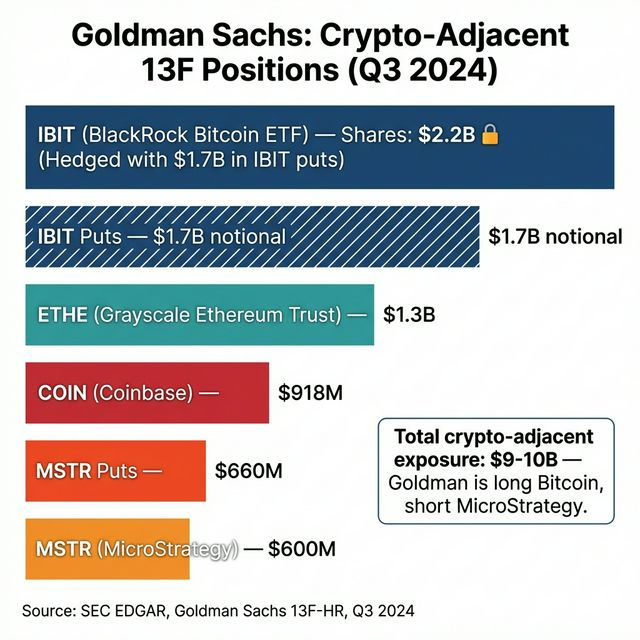
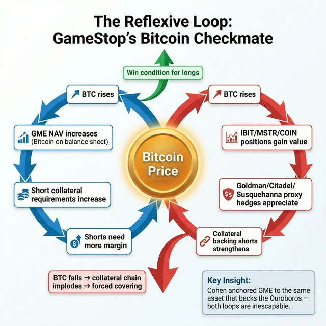
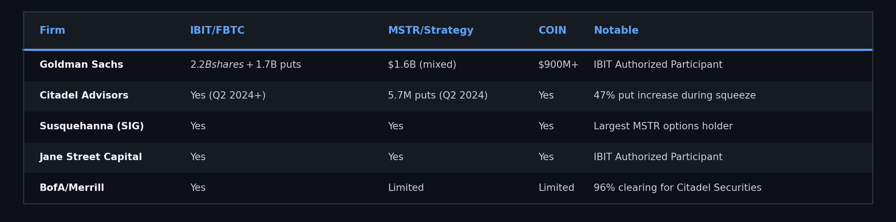
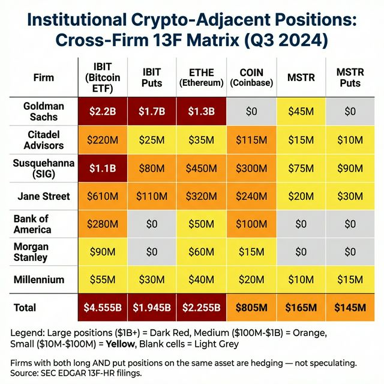
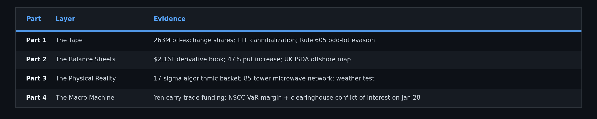
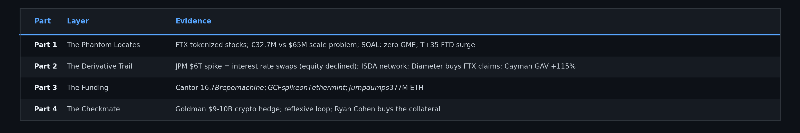
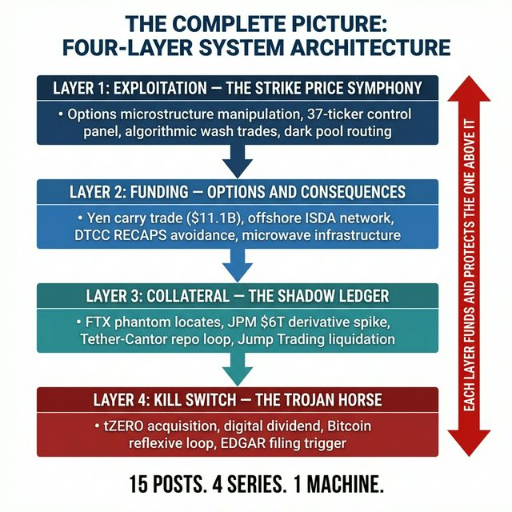

# The Shadow Ledger, Part 4: The Reflexive Trap

# Part 4 of 7

**TL;DR:** Parts 1-3 mapped the architecture (phantom locates), the derivative paper trail (ISDA offshore network), and the funding (the Ouroboros). This post maps the endgame. In March 2025, GameStop updated its investment policy to add Bitcoin as a treasury reserve asset, subsequently purchasing 4,710 BTC (~$504 million). The market treated it as speculation. The 13F data tells a different story. Within one quarter, Goldman Sachs, Citadel, and Susquehanna all massively increased their positions in MSTR, COIN, IBIT, MARA, and RIOT. Goldman alone now holds $9-10 billion in crypto-adjacent 13F positions,
including $2.2 billion in IBIT shares hedged with $1.7 billion in IBIT puts. The same firms that are short GME are now forced to buy the exact assets GME now holds on its balance sheet. Ryan Cohen didn't buy Bitcoin because crypto is cool. He bought Bitcoin because it's their collateral.

> **📄 Full academic papers:** [The Long Gamma Default (PDF)](https://github.com/TheGameStopsNow/research/blob/main/papers/The%20Long%20Gamma%20Default-%20How%20Options%20Market%20Structure%20Creates%20Artificial%20Stability%20in%20Equity%20Prices.pdf?raw=1), [The Shadow Algorithm (PDF)](https://github.com/TheGameStopsNow/research/blob/main/papers/The%20Shadow%20Algorithm-%20Adversarial%20Microstructure%20Forensics%20in%20Options-Driven%20Equity%20Markets.pdf?raw=1), [Exploitable Infrastructure (PDF)](https://github.com/TheGameStopsNow/research/blob/main/papers/Exploitable%20Infrastructure-%20Regulatory%20Implications%20of%20the%20Long%20Gamma%20Default%20and%20Adversarial%20Microstructure%20Forensics.pdf?raw=1), [Cross-Domain Corroboration (PDF)](https://github.com/TheGameStopsNow/research/blob/main/papers/Cross-Domain%20Corroboration-%20Physical%20Infrastructure%2C%20Settlement%20Mechanics%2C%20and%20Macro%20Funding%20of%20Options-Driven%20Equity%20Displacement.pdf?raw=1)

*[Part 1](01_the_fake_locates.md) presented evidence of the phantom locates. [Part 2](02_the_6_trillion_swap.md) traced the risk transfer. [Part 3](03_the_ouroboros.md) followed the funding. This post examines the endgame.*

---

## 1. The Bitcoin Purchase: Not What You Think

In **March 2025**, GameStop Corp. (GME) disclosed in its 2024 annual report that its Board of Directors had unanimously approved an update to its investment policy to add **Bitcoin** as a treasury reserve asset. On **May 28, 2025**, the company announced it had purchased **4,710 BTC** (~$504 million, at an average price of ~$107,900/BTC), funded by proceeds from a $1.3 billion convertible notes offering.

*Source: [GameStop Corp. 10-K / 8-K](https://www.sec.gov/cgi-bin/browse-edgar?action=getcompany&CIK=0001326380&type=8-K), CIK 0001326380, annual report filed March 2025; 8-K September 9, 2025.*

The crypto community celebrated. The GME community debated. Wall Street analysts were confused. But the 13F data that filed 45 days later tells a more interesting story: this may not have been a simple "crypto bet." It looks more like a strategic repositioning against the Ouroboros.

Here's the logic:

- **Step 1 (*Options & Consequences, Part 4*):** The equity long positions and collateral chains of the prime broker network are funded by the yen carry trade. When the BOJ raised rates in August 2024, the unwind forced portfolio-level gross deleveraging, including short covering as a side effect of long-book margin calls.
- **Step 2 (Part 3):** The carry trade liquidity is supplemented by the Tether-to-repo Ouroboros
- **Step 3 (Part 2):** The risk is held in offshore derivative positions at the 8 ISDA prime brokers
- **Step 4:** The prime brokers hedge their derivative exposure by holding crypto-adjacent assets (IBIT, MSTR, COIN) as proxy delta hedges

Now Ryan Cohen adds Bitcoin directly to GME's balance sheet. GME's Net Asset Value (NAV) now has a floor tied to BTC. When Bitcoin goes up, GME's fundamental value rises. But Bitcoin going up *also* increases the value of the collateral backing the Ouroboros and the proxy hedges. The short sellers need Bitcoin to go up to maintain their collateral, but Bitcoin going up makes GME harder to short.

**If that reading is correct, he turned their own collateral machine against them.**

---

## 2. The 13F Proof: Goldman Sachs Tells the Story

Within one quarter of [GameStop's Bitcoin announcement](https://news.gamestop.com/), Goldman Sachs Group Inc.'s [13F-HR filing](https://www.sec.gov/cgi-bin/browse-edgar?action=getcompany&CIK=0000886982&type=13-F&dateb=&owner=include&count=40) (CIK 0000886982), one of the 8 ISDA counterparties, a JGB Primary Dealer, and the **Authorized Participant** for [iShares Bitcoin Trust (IBIT)](https://www.ishares.com/us/products/333011/ishares-bitcoin-trust), shows the following:

### Q4 2025 Filing (Filed Feb 10, 2026): 70 Crypto-Related Positions

**Total estimated crypto-adjacent 13F exposure: ~$9-10 BILLION.**

*Source: [SEC EDGAR](https://www.sec.gov/cgi-bin/browse-edgar?action=getcompany), Goldman Sachs Group Inc. 13F-HR (CIK 0000886982), Submissioninfotable.xml, Q4 2025 (filed Feb 10, 2026) and Q3 2025 (filed Nov 14, 2025).*

*Figure: Goldman's $9-10B crypto-adjacent exposure. Long Bitcoin, short MicroStrategy.*

Goldman Sachs is simultaneously:

- **Long $2.2B in IBIT shares** (creating ETF units as Authorized Participant, earning AP fees)
- **Hedged with $1.7B in IBIT puts** (the delta hedge against downside)
- **Long $1.3B in ETHE** (extending the proxy hedge beyond BTC into Ethereum)
- **Holding $660M in MSTR Puts (short exposure)** (the inverse carry on MicroStrategy/Strategy)
- **Long $900M+ in Coinbase** across shares, calls, and puts

The Q3 2025 filing shows similarly heavy positions in the same names. This is not a one-quarter anomaly. It is a persistent institutional strategy.

---

## 3. The Reflexive Loop: Why They Can't Get Out

The 13F data reveals a trap of Goldman's own making:

1. **Goldman is long IBIT** because they are the Authorized Participant, they create and redeem ETF units for profit
2. **Goldman is long ETHE** because they are hedging Ethereum exposure from their prime brokerage clients
3. **Goldman holds MSTR Puts (short exposure)** because MSTR is the levered Bitcoin proxy, if BTC falls, MSTR falls harder
4. **Goldman is long COIN** because Coinbase is the custodian for institutional crypto and the primary exchange for Tether redemptions

Now GameStop adds Bitcoin to its balance sheet. This creates a reflexive loop:

- If **BTC rises**: GME's NAV rises → harder to short GME → Goldman's equity short book suffers → Goldman needs MORE IBIT/MSTR to hedge → more demand for IBIT → BTC rises further
- If **BTC falls**: Goldman's $2.2B IBIT position falls → margin calls → Goldman sells IBIT → BTC falls further → Tether reserves decline → Ouroboros weakens → less fiat liquidity for the short machine

> **The Authorized Participant defense:** Goldman, Citadel, and Jane Street are [Authorized Participants](https://www.sec.gov/investor/alerts/etfs.pdf) (APs) for Bitcoin ETFs like IBIT. APs are contractually required to hold inventory of the underlying to facilitate create/redeem functions, and they delta-hedge this inventory with options. A defender would argue these positions are delta-neutral market-making, not a proprietary directional proxy hedge. This is a fair point, and it doesn't matter. *Because* they hold these assets for AP duties, their balance sheets are structurally exposed to BTC volatility regardless of intent. The reflexive trap operates through structural
exposure, not directional betting.

> **The scale objection:** GME holds ~$500M in BTC. The crypto market is $2.5 trillion. GME's NAV moving a few hundred million dollars exerts negligible reflexive gravity on a multi-trillion dollar prime broker margin model. But the trap doesn't operate through GME moving the *crypto market*. It operates through GME's *NAV floor*, the BTC on its balance sheet creates a book value that makes the stock harder to short through fundamental valuation arguments. The scale that matters is GME's balance sheet relative to its short interest, not GME's BTC relative
to the crypto market.

There is no comfortable direction. Cohen anchored GME to the same asset that backs the collateral chain. Every hedge Goldman puts on makes the reflexive loop stronger.

*Figure: Both directions of the Bitcoin price movement create pressure for the short machine.*

> **Update (Jan/Feb 2026):** GameStop transferred all BTC to Coinbase Prime in late January 2026. Cohen publicly stated that a new strategy is "way more compelling than Bitcoin." If GME ultimately sells its BTC, the reflexive loop described above would break. This may have been a temporary disruption tactic rather than a permanent strategic anchor. The 13F data showing institutional crypto-adjacent positioning remains valid regardless of GameStop's BTC holdings.

---

## 4. The Proxy Hedge Across the Street

Goldman isn't alone. Pulling the 13F data across the ISDA counterparty network from *Options & Consequences*:

*Source: [SEC EDGAR](https://www.sec.gov/cgi-bin/browse-edgar?action=getcompany) 13F-HR filings for each entity, Q2 2024 – Q4 2025. [Citadel Advisors CIK 0001423053](https://www.sec.gov/cgi-bin/browse-edgar?action=getcompany&CIK=0001423053&type=13-F&dateb=&owner=include&count=40).*

The proxy hedge is systemic. Every major ISDA counterparty, specifically those acting as Authorized Participants (APs) like Goldman and Jane Street, is building the same position: long crypto ETFs, hedged with puts, and holding short exposure on MSTR. As APs, they sit at the nexus of collateral creation for the ETF complex. When their underlying equity short books (e.g., GME) face VaR (Value at Risk, statistical measure of maximum expected loss) pressure, they require pristine collateral to meet margin. The crypto proxy hedge isn't just a speculative bet; it's a
structural liquidity requirement. The collateral pressure ripples directly through the plumbing of the ETF creation/redemption mechanism. It's the institutional version of the basket trade documented in *Options & Consequences, Part 3*, except now the basket includes Bitcoin infrastructure companies.

*Figure: Every major ISDA counterparty is building the same crypto proxy hedge to manage AP collateral requirements.*

And Ryan Cohen just made GME a Bitcoin infrastructure company.

---

## 5. The Complete Picture: 8 Parts, One System

Across two series and eight posts, here is what the publicly verifiable data shows:

### Options & Consequences (Series 1)

### The Shadow Ledger (Series 2)

The system has four layers: **locates** (supply of shortable shares), **derivatives** (risk transfer), **funding** (yen carry + Tether repo), and **collateral** (crypto proxy hedge). Ryan Cohen attacked the collateral layer. By putting Bitcoin on GME's balance sheet, he introduced a reflexive dependency between GME's fundamental value and the collateral backing the short machine. The same asset the shorts need to maintain their margin is now the asset that makes their target company more valuable.

*Figure: 15 posts. 4 series. 1 machine.*

---

## The Ask

Verify everything. Every source in this series is publicly accessible. Most of the Python scripts are in the GitHub repo. The SEC filings, FDIC data, CFTC positioning, OFR repo data, UK Companies House charges, FCC tower licenses, and Kroll bankruptcy dockets are all free to access.

But there are gaps I can't fill alone:

1. **[XRT Portfolio Composition File (PCF)](https://www.ssga.com/us/en/intermediary/etfs/funds/spdr-sp-retail-etf-xrt):** The daily basket holdings that would prove exactly which CUSIPs were being swapped during ETF cannibalization. This data is paywalled through DTCC/NYSE Arca. If anyone has a Bloomberg terminal or an institutional data subscription, the specific dates are May 13-17, 2024 and November 11-15, 2022 (FTX collapse week).

2. **DTCC Equity Swap Data (FOIA pending):** A FOIA request has been filed with the SEC for the archived [SBSR data](https://www.ecfr.gov/current/title-17/section-242.901) from August 2024. The SEC's response deadline is April 3, 2026. If granted, this data would show the exact notional amounts of equity Total Return Swaps on GME during the carry trade unwind.

3. **CFTC CME EFRP Volume (FOIA planned):** A FOIA request to the CFTC for [Exchange for Related Position (EFRP)](https://www.cmegroup.com/clearing/operations-and-deliveries/accepted-for-clearing.html) volume data on CME Bitcoin Futures would show if the crypto-to-equity bridge is executing through EFRP transactions, the CME mechanism specifically designed for cross-asset swaps.

If you're a financial attorney, a Bloomberg terminal holder, a regulatory analyst, or a forensic accountant, the data is here. Verify it. Break it. Or build on it.

**[github.com/TheGameStopsNow/research](https://github.com/TheGameStopsNow/research)**

---

*Not financial advice. Forensic research using public data. I'm not a financial advisor, attorney, or affiliated with any entity named in this post.*

> *"The arc of the moral universe is long, but it bends toward justice." // Theodore Parker*
