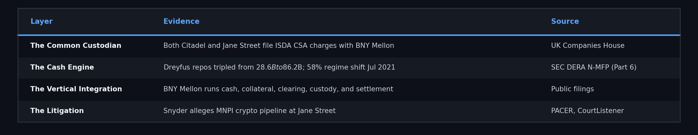

# The Shadow Ledger, Part 5: The Bridge

# Part 5 of 7

**TL;DR:** Parts 1-4 mapped four layers: phantom locates, the derivative trail, the Ouroboros funding loop, and the Bitcoin checkmate. But the layers were presented as independent systems. This post connects them. Jane Street Financial Products filed an ISDA Credit Support Annex (CSA) charge with BNY Mellon in April 2022, meaning both Citadel and Jane Street manage their London derivative books through the same custodian, under the same margin framework. BNY Mellon simultaneously generates the cash (Dreyfus MMF, $86.2B in [triparty repo](https://www.newyorkfed.org/data-and-statistics/data-visualization/tri-party-repo)s), manages the collateral, clears the trades (Pershing), and custodies
the positions ([$52.1T in AUC/A as of Dec 2024](https://www.bny.com/)). A federal lawsuit filed in 2026, *Snyder v. Jane Street*, alleges a covert information pipeline between Jane Street executives and a Terraform Labs insider that enabled an $85 million liquidation 10 minutes before the $40 billion Terra/LUNA collapse. A six-stage capital flow model connects equity settlement pressure to crypto liquidation through BNY Mellon's margin infrastructure.

> **📄 Full academic paper:** [The Shadow Ledger: Offshore Synthetic Supply (Paper VII)](https://github.com/TheGameStopsNow/research/blob/main/papers/The%20Shadow%20Ledger-%20Offshore%20Synthetic%20Supply%2C%20Derivative%20Risk%20Transfer%2C%20and%20Collateral%20Reflexivity%20in%20the%20GameStop%20Ecosystem.pdf?raw=1)

*[Part 1](01_the_fake_locates.md) presented evidence of phantom locates. [Part 2](02_the_6_trillion_swap.md) traced the risk transfer. [Part 3](03_the_ouroboros.md) followed the funding. [Part 4](04_the_reflexive_trap.md) mapped the endgame. This post connects the layers. [Part 6](06_the_cash_engine.md) maps the cash that makes it all possible.*

---

## 1. The Common Custodian

In Part 2, the Citadel Securities ISDA charges at [UK Companies House](https://find-and-update.company-information.service.gov.uk/company/08476218/charges) were detailed, 8 Initial Margin Agreements filed in 7 consecutive days, mapping the prime brokers holding the other side. But Citadel is not the only Tier-1 market maker filing through the same infrastructure.

**Jane Street Financial Products** (Company No. [09314714](https://find-and-update.company-information.service.gov.uk/company/09314714/charges)) also filed charges with BNY Mellon. **Charge 0014**, filed **April 6, 2022**, is specifically described as an **ISDA Credit Support Annex (CSA)** charge, a variation margin agreement.

This is not custodial infrastructure. It is *active margin management*. Under an [ISDA CSA](https://www.isda.org/tag/credit-support-annex/), the counterparty (BNY Mellon) holds collateral and makes margin calls when the derivative book moves against the firm. April 2022 was the beginning of the Federal Reserve's aggressive rate hiking cycle.

Two independent Tier-1 market makers, Citadel Securities and Jane Street, are managing their London derivative books through the same custodian using the same ISDA CSA framework, under the same macro stress conditions. And the custodian is not a passive vault. One institution, BNY Mellon, simultaneously fills every role in the chain from cash generation to settlement:

This vertical integration creates a structural blind spot: no external regulator has visibility into the aggregate cash flow from money market investor to settlement failure suppression, because every link in the chain is operated by the same institution.

*Source: UK Companies House, Jane Street Financial Products, Company No. 09314714, charges register.*

---

## 2. The Six-Stage Capital Flow Model

Combining the BNY Mellon ISDA CSA data, the Dreyfus cash engine (detailed in [Part 6](06_the_cash_engine.md)), the DMA options tape forensics from Papers V and VIII, and the litigation record, a six-stage integrated model emerges:

> **The "AWS Fallacy" defense:** BNY Mellon custodies $50 trillion in assets. Finding Citadel and Jane Street at BNY Mellon is like finding two tech startups using Amazon Web Services, it proves shared infrastructure, not coordination. This objection misses the point. The forensic significance is not *shared custody*. It's **vertical integration**. No other institution simultaneously generates the cash (Dreyfus MMF), manages the collateral (triparty agent), clears the trades (Pershing), **and** operates the settlement layer (DTCC Global Collateral Platform). BNY Mellon is an infrastructure operator, not a controlling actor; but no other firm occupies *every layer of the stack simultaneously*. AWS doesn't also run the electricity grid, the ISP, and the DNS
servers. BNY Mellon does the financial equivalent of all of the above.

1. **Stage 0: Cash Generation (MMF).** BNY Mellon's Dreyfus fund deploys $80-86 billion in triparty repos to prime broker banks, providing the foundational liquidity layer that finances everything downstream (see [Part 6](06_the_cash_engine.md) for the full breakdown, including the July 2021 regime shift and Vanguard control test).

2. **Stage 1: Settlement Pressure ([Equities](https://www.dtcc.com/clearing-services/equities-clearing-services)).** The firm operates as a Primary Lead Market Maker for borrow-constrained retail stocks, generating persistent FTDs that cycle through the 15-node regulatory waterfall documented in [Failure Waterfall Part 1](https://x.com/TheGameStopsNow/status/2026497785923551408).

3. **Stage 2: Margin Stress (TradFi).** The NSCC (National Securities Clearing Corporation, central counterparty for equity settlement) assesses [VaR](https://www.dtcc.com/clearing-services/equities-clearing-services/risk-management) (Value at Risk, statistical measure of maximum expected loss) margin against gross [FTDs](https://www.sec.gov/data-research/sec-markets-data/fails-deliver-data). Simultaneously, rate changes trigger ISDA CSA variation margin calls on the firm's London derivatives book (BNY Mellon Charge 0014). The firm is capital-constrained.

4. **Stage 3: Synthetic Relief (Options).** The DMA algo ([Part 7](07_the_fingerprint.md)) generates thousands of 1-lot near-ATM 0DTE option trades on inverted-fee exchanges (MIAX Pearl, Nasdaq BX), "renting delta" for the duration of the NSCC's 4:15 PM margin snapshot.

5. **Stage 4: Crypto Liquidation.** When synthetic relief is insufficient under macro stress (April 2022 rate hikes), the firm's crypto desk liquidates digital assets to raise pristine fiat USD.

6. **Stage 5: The Bridge.** Fiat USD from crypto liquidation routes to the custodian (BNY Mellon) to collateralize the ISDA derivatives book, relieving the margin pressure that originated on the equity desk.

---

## 3. A Federal Lawsuit, One Architecture

A lawsuit filed in early 2026 illuminates the bridge from the crypto side. It has not been adjudicated. Its forensic significance lies in identifying a *capital flow pathway* between crypto entities and the equity market-making desks.

**Snyder v. Jane Street Group, LLC et al.** (Case No. [1:26-cv-01504](https://www.courtlistener.com/docket/69770757/snyder-v-jane-street-group-llc/), S.D.N.Y., filed Feb 23, 2026). The FTX/Terraform bankruptcy Trustee filed an 83-page complaint alleging that Jane Street executives maintained a covert information pipeline with a former Terraform Labs intern, enabling Jane Street to liquidate approximately **$85 million in UST** approximately 10 minutes before Terraform publicly withdrew $150 million from the Curve 3pool, the event that triggered the **$40 billion Terra/LUNA collapse**.

Named defendants include Robert Granieri (co-founder) and Michael Huang (executive). A corrected complaint is due approximately March 2, 2026. If the allegations survive summary judgment, they would establish that at least one Tier-1 market maker maintained material non-public information channels with crypto protocol insiders during the period of the cross-market capital flows documented in this series.

---

## The Bridge, Summarized

The bridge connects the equity settlement desk (Stages 1-2) to the crypto liquidation pipeline (Stages 4-5) through a single custodian (BNY Mellon) using a standardized margin framework (ISDA CSA). When the equity desk needs cash, the crypto desk liquidates. When the crypto desk needs compliance, the options algo generates synthetic close-outs. The layers are not independent systems. They are one machine with six moving parts.

*In [Part 6](06_the_cash_engine.md), we follow the cash to its source. In [Part 7](07_the_fingerprint.md), we identify the fingerprint of the machine.*

---

*Not financial advice. Forensic research using public data. I'm not a financial advisor, attorney, or affiliated with any entity named in this post.*

> *"Follow the money." // William Goldman, All the President's Men (1976 film)*

Continue on to Part 6: The Cash Engine...
