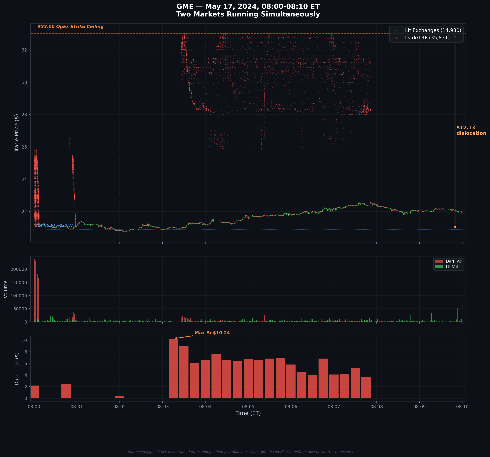

# Options & Consequences, Part 1: Following the Money

**TL;DR:** Something broke in the GME settlement system a full week before Roaring Kitty tweeted in May 2024. I followed it. Using free, publicly available data, I traced 263 million off-exchange shares to 24 specific firms, watched an ETF get cannibalized by specific Authorized Participants to cover delivery failures, built a model that predicted the dark pool settlement price three days in advance within 2.9%, showed via OCC clearing data that these were almost certainly proprietary firm trades, and caught two markets running simultaneously. The algorithm explicitly shredded the dark prints into odd lots to exploit a dying SEC regulatory loophole, while 99.6% of the trades were stripped of the compliance flags that would have connected them to the options chain. Everything here is independently verifiable. Links and scripts at the bottom.

*Figure: Ticker key for all charts in this series.*

> **📄 Full academic paper:** [The Long Gamma Default (PDF)](../papers/The%20Long%20Gamma%20Default-%20How%20Options%20Market%20Structure%20Creates%20Artificial%20Stability%20in%20Equity%20Prices.pdf)

## Before We Start: A Correction

In my *Power Tracks* series from months ago, I published a "decode layer" that I claimed was extracting algorithmic instructions from pre-market trade data. I now know that interpretation was wrong. The pipeline was a mathematical artifact of my own construction.

I'm telling you this first because if I'm going to ask you to trust the next 15,000 words of forensic evidence across this four-part series, you deserve to know I've been wrong before and I'll tell you when I am. Full documentation of the falsification is in the [public repo](*(link to your github)*).

That investigation forced me into market microstructure data I'd never touched. What I found in those public records is what this series is about.

---

## 1. Something Broke Before Anyone Noticed

The official story: retail traders saw Roaring Kitty come back, piled into GME, and the volatility rattled the system. The SEC's own settlement data says otherwise.

FTDs (Failures-to-Deliver) are what happen when someone sells stock but doesn't hand over the shares on time. The SEC publishes them daily.

| Date | GME FTDs | Multiplier vs Baseline | Event |
| --- | --- | --- | --- |
| May 3 | 941 | 1× | Baseline |
| **May 6** | **186,627** | **198×** | **No public catalyst** |
| **May 7** | **433,054** | **460×** | **No public catalyst** |
| **May 8** | **525,493** | **558×** | **No public catalyst** |
| May 13 | 152,482 | 162× | First trading day after Roaring Kitty tweets |

*Source: [SEC FTD data](https://www.sec.gov/data/foiadocsfailsdatahtm), file `cnsfails202405b.txt`, CUSIP `36467W109`. Script: [`ftd_may2024.py`](../code/analysis/ftd_may2024.py) → Results: [`round11_v4b_may2024_ftd.json`](../results/round11_v4b_may2024_ftd.json)*

GME FTDs went from 941 shares to 525,493, a **558× increase**, between May 3 and May 8. Roaring Kitty did not post his first tweet until May 12. The settlement system broke **seven trading days** before any public catalyst.

*Figure: GME Failures-to-Deliver surged 558× before any public catalyst — the settlement system broke first.*

A large derivative position hit margin limits and produced settlement failures as the prime broker began liquidating. Roaring Kitty likely observed the disruption in the options and FTD data and tweeted *in response to it*.

---

## 2. Who Handled 263 Million Shares?

When you buy a stock through your brokerage app, it usually gets filled by an "internalizer"—a firm that matches your order off-exchange in the "Non-ATS" channel. During the event week, ~263 million GME shares moved through this channel. Using [FINRA's Non-ATS OTC Transparency API](https://otctransparency.finra.org/otctransparency/OtcIssueData), I traced all 263 million shares to 24 specific firms.

*Figure: The top 8 internalizers who handled 263M off-exchange GME shares during the event week.*

| Rank | Firm | Event Volume | Surge Multiple |
| --- | --- | --- | --- |
| 1 | Virtu Americas LLC | 81.3M | **42.1×** |
| 2 | Citadel Securities LLC | 56.2M | 22.8× |
| 3 | G1 Execution Services | 44.2M | **47.2×** |
| 4 | Jane Street Capital | 38.7M | **44.4×** |
| 8 | UBS Securities LLC | 3.6M | **∞ (from zero)** |

*Source: [FINRA Non-ATS OTC Transparency](https://otctransparency.finra.org/otctransparency/OtcIssueData) (OAuth2 authenticated API, dataset `OTC_W_SMBL_FIRM`). Script: [`rule606_sweep.py`](../code/analysis/rule606_sweep.py)*

**The top 4 firms control 83.7% of all off-exchange GME flow.** UBS went from literally zero Non-ATS shares to 3.6 million in a single week, while simultaneously operating the #1 dark pool venue for GME (8.9M shares, per [FINRA ATS Transparency](https://otctransparency.finra.org/otctransparency/OtcIssueData)).

---

## 3. Naming the ETF Cannibals

To supply 263 million shares, these firms cracked open an ETF. On May 15, FTDs for the 🧺 Retail ETF collapsed **99.2%**. On that exact same day, GME FTDs hit 1.14 million. Someone redeemed 🧺 shares to harvest GME components and settle delivery obligations.

Who broke the ETF? Every ETF must file [SEC Form N-CEN](https://www.sec.gov/cgi-bin/browse-edgar?action=getcompany&CIK=0000646671&type=N-CEN) annually, ranking their Authorized Participants (APs) by the exact dollar value of creations and redemptions. Pulling the [N-CEN for 🧺](https://www.sec.gov/cgi-bin/browse-edgar?action=getcompany&CIK=0000646671&type=N-CEN) (FY ending June 30, 2024) reveals the specific entities breaking the basket:

| Rank | Authorized Participant | Redemption Value (Destroying ETF) | Creation Value |
| --- | --- | --- | --- |
| 1 | **Jane Street Capital, LLC** | **$196,675,161** | $80,302,990 |
| 2 | J.P. Morgan Securities LLC | $51,940,014 | $339,047,806 |
| 3 | **Merrill Lynch Professional Clearing (BofA)** | $46,063,251 | $170,682,932 |

*Source: SEC Form N-CEN, SPDR S&P Retail ETF (🧺), CIK 0000646671, FY ending June 30, 2024, filed on [SEC EDGAR](https://www.sec.gov/cgi-bin/browse-edgar?action=getcompany&CIK=0000646671&type=N-CEN). Script: [`etf_cannibalization.py`](../code/analysis/etf_cannibalization.py)*

Jane Street led all APs in redemptions, destroying $196 million worth of 🧺. Amazingly, **Citadel Securities and Virtu had $0 in direct AP activity** for the entire year. Despite being the #1 and #2 GME internalizers (handling 137M shares), they didn't touch the ETF directly. They routed the liability through clearing partners like BofA and Jane Street.

*Figure: 🧺 ETF redemption volumes by Authorized Participant. Jane Street led all APs in basket destruction.*

---

## 4. Predicting the Price & Unmasking the Whale

If off-exchange settlement is linked to an options derivative position, the settlement price should be **mathematically predictable** from the options chain via put-call parity: `Synthetic Price = Strike + Call Premium − Put Premium`.

I scanned the three event days (May 13–15, 2024) and identified **6,526 paired conversions**.

- **Median synthetic price:** **$35.00**
- **Actual dark pool settlement ceiling (May 17):** $34.01
- **Prediction error:** **2.9%**

The options chain predicted the dark pool ceiling three days early.

*Source: Options data from [ThetaData](https://www.thetadata.net/) (tick-level options trades). Script: [`putcall_parity_predictor.py`](../code/analysis/putcall_parity_predictor.py) → Summary: [`putcall_parity_predictor_SUMMARY.md`](../filings/putcall_parity_predictor_SUMMARY.md)*

*Figure: Put-call parity predicted the dark pool settlement price within 2.9% — three days in advance.*

**The OCC Origin Code Test:**
Skeptics argue these massive options trades are just "retail whales." The clearing data tells a different story. The [Options Clearing Corporation (OCC)](https://www.theocc.com/market-data/volume/default.jsp) clears every contract and tags it with an Origin Code: C (Customer), F (Firm/Proprietary), or M (Market Maker).

On June 7, 2024, a massive 10,000-lot conversion executed at the $40 strike. I queried the OCC volume data for that exact day.

- Total Customer (C) volume: 53.0%
- Total Market Maker (M) volume: 46.1%
- **Total Firm (F) volume: 0.84%**

The 10,000-lot conversion equals 20,000 contract sides. On June 7, there were exactly 40,492 Firm (F) sides traded in GME. That single conversion represented **49.39% of ALL proprietary Firm activity** in GME options that day. The math makes a retail origin extremely unlikely.

*Source: [OCC Volume Query](https://www.theocc.com/market-data/volume/default.jsp), GME, June 7 2024, filtered by Origin Code.*

**The Invisible Hedging Layer (Cboe FLEX Options):**
How do institutions lock in highly specific derivative boundaries—like exactly $33.0000—without warping the standard options chain and setting off retail alerts? They use **[Cboe FLEX Options](https://www.cboe.com/tradable_products/flex_options/)**. FLEX options allow custom strikes (up to 4 decimal places) and non-standard expiration dates. Crucially, while they are fully OCC-cleared, **they do not broadcast to the standard real-time OPRA feed**. They are the dark pools of the options market.

---

## 5. Catching It Live — Tape Fractures & Rule 605 Evasion

On May 17, Options Expiration Friday, I pulled all 50,811 individual trades from the pre-market session. What I found was two markets running simultaneously.

*Source: Trade data from [Polygon.io](https://polygon.io/) (tick-level equity trades, SIP conditions, timestamps). Notebook: [`10_forensic_replication.ipynb`](../notebooks/10_forensic_replication.ipynb)*

**Phase I — Accumulation & Rule 605 Evasion (08:00):** A massive smart order router fragments a large buy into exactly 75 concurrent odd lots across 5 exchanges within a $0.05 price range. 75% carry Condition Code 37—a marker for trades under 100 shares.

Why 75 fragmented sub-100-share prints? Because under the legacy [SEC Rule 605](https://www.ecfr.gov/current/title-17/chapter-II/part-242/subject-group-ECFRb43b4592c3e9b76/section-242.605) (17 CFR §242.605) in effect during May 2024, **Odd Lots (< 100 shares) were explicitly exempt from execution quality reporting.** By shredding the order into 75 odd lots, the tape fracture was legally scrubbed from the executing firms' monthly Rule 605 execution quality reports. (The SEC [closed this loophole on June 14, 2024](https://www.sec.gov/rules/2024/03/34-99679.pdf). The algorithm systematically exploited the final days of the exemption window).

**Phase II — Settlement (08:03–08:07):** At exactly 08:03:20, the TRF (dark pool tape) begins printing at $33.00—a hard ceiling that persists for 5 continuous minutes:

| Market | Price Range | What You See |
| --- | --- | --- |
| **Lit exchanges** | **$20.87–$20.99** | Normal pre-market trading |
| **FINRA TRF (dark)** | **$31.20–$33.00** | Off-tape settlement at the derivative strike |

*Source: [Polygon.io](https://polygon.io/) tick data, pre-market session May 17, 2024. Notebook: [`10_forensic_replication.ipynb`](../notebooks/10_forensic_replication.ipynb)*

*Figure: The Tape Fracture — a $12.13 spread persisted for 4.5 minutes between the lit market and the FINRA TRF settlement tape.*

A **$12.13 spread** persisting for 4.5 minutes. Standard arbitrage would close this gap in microseconds. Its persistence is consistent with pre-negotiated derivative settlements printed through the dark tape.

### 99.6% Flag Evasion and The CAT Linkage Exploit

[FINRA Rule 6380A](https://www.finra.org/rules-guidance/rulebooks/finra-rules/6380A) requires Qualified Contingent Trades to carry a `HandlingInstructions='OPT'` flag to link the stock trade to the options trade. Across the 08:00–08:10 ET settlement burst, 🍎 compliance was 56.0%. **GME Compliance rate: 0.4%.**

Out of 699 off-market GME trades, 696 had the compliance flags deliberately stripped out, triggering a [Consolidated Audit Trail (CAT)](https://www.catnmsplan.com/) Linkage Error. The CAT system allows a **"T+3 Repair Window,"** meaning they can execute the arbitrage, blind the tape intraday, and append the flag days later.

In October 2024, [FINRA fined Citadel Securities $1 million](https://www.finra.org/media-center/newsreleases/2024/finra-fines-citadel-securities-llc-1m-cat-reporting-violations) for inaccurately reporting 42.2 billion order events to the CAT—a penalty of **$0.0000236 per violation**. When a single pre-market settlement burst moves $108 million, a microscopic per-error fine is just a toll road.

*Source: [FINRA AWC #2023079417101](https://www.finra.org/media-center/newsreleases/2024/finra-fines-citadel-securities-llc-1m-cat-reporting-violations), October 2024.*

*Figure: Broker execution routing — odd-lot fragmentation across 5 exchanges during the 08:00 ET settlement burst.*

*In Part 2, I follow the paper trail—the SEC filings these entities submitted under penalty of perjury—and what those documents reveal about the offshore architecture holding this entire system together.*

---

*Not financial advice. Forensic research using public data. I'm not a financial advisor, attorney, or affiliated with any entity named in this post.*

*"Sunlight is said to be the best of disinfectants." — Louis Brandeis*
