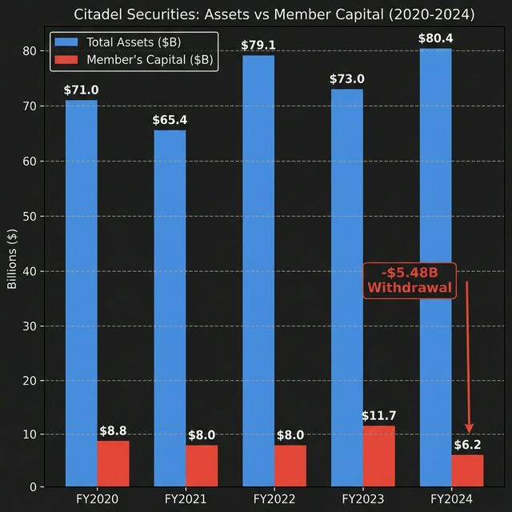

# Options & Consequences, Part 2: The Paper Trail

**TL;DR:** Part 1 followed the trade data. This post opens the filing cabinets. Every broker-dealer files annual reports with the SEC under penalty of perjury. I read them. What I found: a $5.48 billion capital withdrawal from the firm running $2.16 trillion in derivatives, a 47% *increase* in put exposure during the 2021 squeeze before it vanished off-book, $108 million in Fails to Receive (FTR) parked on the balance sheet, a $4.9 billion receipt for undelivered customer shares, a newly mapped offshore ISDA network revealing an €8 billion uncleared derivative book secured by 8 global prime brokers, and a point-by-point mapping of how it all aligns with SEC Rule 10b-5.

*Figure: Ticker key for all charts in this series.*

> **📄 Full academic paper:** [The Shadow Algorithm (PDF)](https://github.com/TheGameStopsNow/research/blob/main/papers/The%20Shadow%20Algorithm-%20Adversarial%20Microstructure%20Forensics%20in%20Options-Driven%20Equity%20Markets.pdf?raw=1)

*If you haven't read [Part 1: Following the Money](*(Part 1 link goes here)*), start there.*

---

## 1. The $80.4 Billion Entity & The 13F Migration

In Part 1, Citadel Securities LLC appeared as the #2 internalizer, handling 56.2 million GME shares at a 22.8× surge. Their annual [X-17A-5 audited financial statements](https://www.sec.gov/cgi-bin/browse-edgar?action=getcompany&CIK=0001146184&type=X-17A-5) show the macro structure.

In FY2024, Citadel Securities printed a record **$9.7 billion** in net trading revenue. Simultaneously, member's capital dropped from $11.69B to $6.22B -- a massive **$5.48 billion withdrawal** (−46.8%). Record profits. Record capital extraction.

*Source: [Citadel Securities LLC X-17A-5](https://www.sec.gov/cgi-bin/browse-edgar?action=getcompany&CIK=0001146184&type=X-17A-5), CIK 0001146184, FY2024 annual audited report. Script: [`balance_sheet_analysis.py`](../code/entity/balance_sheet_analysis.py) → Results: [`citadel_multiyear_final.json`](../results/citadel_multiyear_final.json)*

*Figure: Citadel Securities balance sheet trend. Net trading revenue hit $9.7B while member's capital dropped 46.8%.*

Against that $6.22B in capital, they hold **$2.16 Trillion** in total derivative notional. That is **347× leverage**.

*Source: Same X-17A-5 filings, Schedule I (derivative notional). Per [SEC Rule 17a-5](https://www.ecfr.gov/current/title-17/chapter-II/part-240/subject-group-ECFR34d0aa1574b0b28/section-240.17a-5) (17 CFR §240.17a-5), broker-dealers must file annual audited financials including derivative positions.*

**The 13F Migration:**
Conventional wisdom says shorts closed in January 2021. I ran XML diffs on [Citadel Advisors'](https://www.sec.gov/cgi-bin/browse-edgar?action=getcompany&CIK=0001423053&type=13F) amended 13F-HR filings:

| Quarter | Calls | Puts | Status |
| --- | --- | --- | --- |
| Q4 2020 | 1,714,100 | 2,224,500 | Pre-squeeze baseline |
| **Q1 2021** | 2,278,000 | **3,271,400** | **PUTS INCREASE 47%** |
| Q2 2021 | 2,148,500 | 2,779,800 | Slow decline (-15%) |
| Q3 2021 | 2,127,100 | 1,804,600 | Slow decline (-35%) |
| Q1 2024 | 708,100 | 461,200 | −86% from peak |
| **Q2 2024** | 3,511,800 | **5,733,500** | **Puts reappear (+1,143%)** |

*Source: [Citadel Advisors LLC 13F-HR](https://www.sec.gov/cgi-bin/browse-edgar?action=getcompany&CIK=0001423053&type=13F), CIK 0001423053, amended quarterly filings Q4 2020 – Q2 2024. Script: [`13f_position_query.py`](../code/entity/13f_position_query.py) → Results: [`si_map_2021_13f.json`](../results/si_map_2021_13f.json). Note: 13F data reports shares of underlying exposure, not number of contracts.*

The puts didn't vanish during the squeeze. Citadel **increased their put exposure by 47%** *during* Q1 2021. They leaned into the short. Over the next two years, the exposure bled off the 13F, mathematically requiring a restructure into bespoke OTC Total Return Swaps (which explicitly evade [13F reporting requirements](https://www.ecfr.gov/current/title-17/chapter-II/part-249/section-249.325) per 17 CFR §249.325). By Q2 2024, swap maturity forced the exposure back onto the visible options ledger.

Here's why the swap migration worked: **[Regulation SBSR](https://www.ecfr.gov/current/title-17/chapter-II/part-242/subject-group-ECFRf4dab8b17a1e8de) — the rule requiring security-based swap transaction reporting — didn't go into effect until November 8, 2021.** Real-time public dissemination started even later (February 14, 2022). During the entire January 2021 squeeze, Total Return Swaps on GME were not reportable to any data repository. The SEC literally could not see them. The puts moved to swaps, and the swaps moved to a regulatory black hole that wouldn't close for another ten months.

*Source: [SEC Release No. 34-93784](https://www.sec.gov/) (Regulation SBSR compliance date, November 8, 2021). First registered SDR (DTCC DDR) approved May 7, 2021. Real-time public dissemination under [Part 43](https://www.ecfr.gov/current/title-17/chapter-II/part-242) began February 14, 2022.*

**The Phantom Vote (Point72):** How do we know funds held GME synthetically rather than physically? Look at [SEC Form N-PX](https://www.sec.gov/cgi-bin/browse-edgar?type=N-PX&dateb=&action=getcompany&company=point72&CIK=&filenum=&State=0&SIC=&myowner=include&action=getcompany) (the proxy voting record). In 2021, Point72 injected $750M into Melvin Capital. Yet, pulling Point72's August 2024 N-PX filing reveals exactly **zero GME shares voted or on loan**. Because Total Return Swaps carry economic exposure but no voting rights, the absence of any voting record is consistent with synthetic economic exposure rather than physical share ownership.

---

## 2. The Parking Lot: 15c3-3 Reserve & Fails to Receive

Everyone hunts for Fails to Deliver (FTDs). But accounting requires double-entry: for every FTD, there is a counterparty holding a **Fail to Receive (FTR)**. If the buyer is a friendly prime broker, they don't issue a [Reg SHO](https://www.ecfr.gov/current/title-17/chapter-II/part-242/subject-group-ECFR43c076a1f3e258f) buy-in notice. The fail just sits indefinitely as an asset on the balance sheet.

Looking at **Citadel Securities LLC's** [X-17A-5](https://www.sec.gov/cgi-bin/browse-edgar?action=getcompany&CIK=0001146184&type=X-17A-5), the line item for "Securities failed to receive" grew from **$61 million** in FY2022 to **$108 million** in FY2023 (+77%).

*Source: [Citadel Securities LLC X-17A-5](https://www.sec.gov/cgi-bin/browse-edgar?action=getcompany&CIK=0001146184&type=X-17A-5), Statement of Financial Condition, FY2022 & FY2023. Script: [`x17a5_disclosure_parser.py`](../code/entity/x17a5_disclosure_parser.py)*

What happens to the cash retail paid for those undelivered shares?

Under [SEC Rule 15c3-3](https://www.ecfr.gov/current/title-17/chapter-II/part-240/subject-group-ECFR34d0aa1574b0b28/section-240.15c3-3) (the Customer Protection Rule, 17 CFR §240.15c3-3), if a broker fails to deliver shares, the customer's cash must be locked in a **"Special Reserve Bank Account"**. Looking at the clearing arm of the primary retail broker involved, **[Robinhood Securities LLC](https://robinhood.com/us/en/about/legal/)** ([X-17A-5, CIK 0001783879](https://www.sec.gov/cgi-bin/browse-edgar?action=getcompany&CIK=0001783879&type=X-17A-5)), the "Cash Segregated for the Exclusive Benefit of Customers" sat at **$4,914,660,000** ($4.91 billion) at the end of FY2020. By FY2021, it was still $3.992 billion. The Reserve Formula schedule is the literal, SEC-audited receipt of billions in cash paid by retail for shares that were warehoused as IOUs.

*Source: [Robinhood Securities LLC X-17A-5](https://www.sec.gov/cgi-bin/browse-edgar?action=getcompany&CIK=0001783879&type=X-17A-5), CIK 0001783879, Schedule 15c3-3, FY2020 & FY2021.*

---

## 3. The Shadow Ledger & The Offshore Scale (UK ISDA Map)

[Palafox Trading LLC](https://www.citadelsecurities.com/disclosures/) is a Citadel-affiliated clearing entity. In a single year, its visible assets collapsed **99.7%** (from $29.7B to $93M), while **$78.2 billion in unsettled forward repos** migrated to the off-balance-sheet footnotes.

*Source: [Palafox Trading LLC X-17A-5](https://www.citadelsecurities.com/disclosures/), FY2022 & FY2023 annual reports. Script: [`x17a5_disclosure_parser.py`](../code/entity/x17a5_disclosure_parser.py)*

But U.S. reporting rules stop at the border. To find the actual derivative counterparty network, you have to look offshore. The UK requires private entities to file publicly accessible financial charges via [Companies House](https://www.gov.uk/government/organisations/companies-house). Extracting the registered charges for **Citadel Securities (Europe) Limited** ([Company No. 05462867](https://find-and-update.company-information.service.gov.uk/company/05462867/charges)) maps their exact offshore swap ledger.

On September 1, 2022, [Uncleared Margin Rules (UMR) Phase 6](https://www.bis.org/bcbs/publ/d475.htm) went into effect, requiring any entity with an Average Aggregate Notional Amount over €8 billion in uncleared derivatives to post Initial Margin.

In the 7 days immediately preceding that deadline (August 22–29, 2022), Citadel Securities Europe filed an unprecedented **8 separate Initial Margin Security Agreements** with global prime brokers (JPMorgan, Morgan Stanley, Citibank, Barclays, Goldman Sachs, HSBC, BofA, Merrill Lynch).

*Source: [UK Companies House  --  Citadel Securities (Europe) Limited, charges register](https://find-and-update.company-information.service.gov.uk/company/05462867/charges), Company No. 05462867. All 8 charges filed between August 22–29, 2022.*

These registered charges are a statutory disclosure establishing that Citadel Securities' London entity holds an **uncleared OTC derivative book exceeding €8 billion**, securitized against every major prime broker on the planet. Even more telling: a charge was filed with **The Bank of New York Mellon** (custodian) on **[April 13, 2021](https://find-and-update.company-information.service.gov.uk/company/05462867/charges)** -- exactly 13 days after the Q1 2021 squeeze quarter closed.

---

## 4. The 3-Way Structural Conflict

When you place a trade on Robinhood, your order doesn't go to the stock exchange. It gets routed to a "wholesaler"  --  a firm that fills the order internally, off-exchange. **Payment for Order Flow (PFOF)** is the fee that wholesaler pays Robinhood for the right to see and fill your order before it reaches the public market.

Citadel Securities pays **$352.5 million per year** in PFOF to Robinhood alone (per [Robinhood's Rule 606 disclosure](https://robinhood.com/us/en/about/legal/)). That means Citadel sees the majority of Robinhood's retail order flow in real time  --  they know what retail is buying and selling *before* it appears on any public tape.

But here's the structural oddity: during the May 2024 event, **Virtu** internalized 81.3M GME shares while **Citadel** only internalized 56.2M. Citadel is paying hundreds of millions for order flow intelligence, yet a different firm is absorbing the actual share delivery. Citadel gets real-time visibility into where retail is positioned; Virtu, G1 Execution Services, and Jane Street absorb the physical burden  --  and the settlement risk  --  of actually delivering those shares.

*Source: PFOF disclosures required under [SEC Rule 606](https://www.ecfr.gov/current/title-17/chapter-II/part-242/subject-group-ECFRb43b4592c3e9b76/section-242.606) (17 CFR §242.606). [Robinhood Rule 606 reports](https://robinhood.com/us/en/about/legal/). Script: [`pfof_crossref.py`](../code/analysis/pfof_crossref.py)*

*Figure: Broker order routing to Citadel  --  Robinhood routes 36.3% and pays $352.5M in PFOF, while Interactive Brokers routes 0% via direct market access.*

But Citadel doesn't act alone. **Bank of America** occupies an unresolvable 3-way structural conflict in this exact ecosystem:

1. **The Prime Broker:** BofA serves as clearing broker for **~96% of Citadel Securities' net derivative assets** (per [Citadel Securities X-17A-5](https://www.sec.gov/cgi-bin/browse-edgar?action=getcompany&CIK=0001146184&type=X-17A-5), Note disclosures).
2. **The ETF Creator:** BofA ranked #3 in creations for the 🧺 ETF ($170M), functioning as the pipeline that supplies the ETF redemption process (per [🧺 N-CEN filing](https://www.sec.gov/cgi-bin/browse-edgar?action=getcompany&CIK=0000646671&type=N-CEN)).
3. **The Dark Pool Operator:** BofA operates the **[Instinct X](https://otctransparency.finra.org/otctransparency/AtsIssueData)** dark pool, offering proprietary execution logic that allows derivative settlements to print outside the NBBO.

---

## 5. Broken Blue Sheets & The Miami Move

When the SEC investigates manipulation, they issue "Blue Sheet" requests for customer trade data ([SEC Rule 17a-25](https://www.ecfr.gov/current/title-17/chapter-II/part-240/subject-group-ECFR34d0aa1574b0b28/section-240.17a-25), 17 CFR §240.17a-25). [Robinhood Securities LLC](https://www.sec.gov/cgi-bin/browse-edgar?action=getcompany&CIK=0001783879&type=X-17A-5)'s FY2024 X-17A-5 explicitly states they were cited for **"failures to submit complete and accurate electronic blue sheet data... from at least October 2018 through April 2024"**.

**5.5 years of broken Blue Sheets.** The SEC investigated the biggest retail trading event in modern history using corrupted forensic data from the one broker that mattered most.

Between FY2022 and FY2024, Citadel Securities relocated its headquarters from Chicago to Miami, Florida. Federal oversight is unchanged, but the advantages are state-level: Zero state income tax ([Florida Constitution, Article VII, §5](http://www.leg.state.fl.us/statutes/index.cfm?submenu=3#A7)), Tenancy by the Entirety ([*Beal Bank v. Almand*, 780 So. 2d 45 (Fla. 2001)](https://scholar.google.com/scholar_case?case=14157291689249228581)), and an **unlimited homestead exemption** ([Florida Constitution, Article X, §4](http://www.leg.state.fl.us/statutes/index.cfm?submenu=3#A10S04)). These are legal, rational actions. They are also exactly what you do to shield $5.48 billion in personal capital extracted from the firm before a derivative book unwinds.

And the shielding doesn't stop at the state line. The master fund for global equity strategies -- including short-selling -- is **Citadel Equity Fund Ltd.**, incorporated as an **exempted company under the Cayman Islands Companies Act** (June 2017) and registered with the [Cayman Islands Monetary Authority](https://www.cima.ky/). Directors are listed at **Bermuda addresses**. Additional Cayman vehicles include Citadel Global Fixed Income Fund Ltd., Citadel Energy Investments Ltd. (June 2020), and Surveyor Capital Ltd. -- each operating outside US bankruptcy jurisdiction.

Three layers of asset protection: **personal capital extraction** ($5.48B withdrawn during a record revenue year) → **Florida real estate** (unlimited homestead exemption) → **Cayman fund vehicles** (beyond the reach of US creditors). All legal. All completed before the derivatives book would need to unwind.

*Source: [SEC EDGAR Form D filings](https://www.sec.gov/cgi-bin/browse-edgar?action=getcompany&company=citadel+equity+fund&CIK=&type=D&dateb=&owner=include&count=40&search_text=&action=getcompany), Citadel Equity Fund Ltd. (CIK search). [Cayman Islands Companies Act](https://www.cima.ky/) — "exempted company" designation.*

---

## 6. How the Evidence Maps to Securities Law

This is a factual mapping of the evidence I've gathered (so far)to the statutory elements of **[SEC Rule 10b-5](https://www.ecfr.gov/current/title-17/chapter-II/part-240/subject-group-ECFR7f0b47e40f652b5/section-240.10b-5)** (17 CFR §240.10b-5, Employment of Manipulative and Deceptive Devices).

*Figure: Evidence-to-statute mapping  --  each element of SEC Rule 10b-5 matched to independently verifiable data sources.*

| Element | Evidence |
| --- | --- |
| **Material Omission** | 99.6% of off-NBBO TRF trades were missing `HandlingInstructions='OPT'` flags, triggering CAT Linkage Errors to blind surveillance. Utilizing the dying [Rule 605](https://www.ecfr.gov/current/title-17/chapter-II/part-242/subject-group-ECFRb43b4592c3e9b76/section-242.605) odd-lot loophole to explicitly hide execution statistics. |
| **Scienter (intent)** | Selectivity: GME flag evasion = 99.6% vs. 🍎 = 56.0%. Flags work on other tickers; they are selectively stripped on GME. Exploiting the expiring odd-lot loophole suggests algorithmic intent. |
| **[Regulation SHO](https://www.ecfr.gov/current/title-17/chapter-II/part-242/subject-group-ECFR43c076a1f3e258f)** | ETF cannibalization to satisfy delivery obligations while dumping illiquid Zombie CUSIPs into FTDs. |
| **[Rule 15c3-3](https://www.ecfr.gov/current/title-17/chapter-II/part-240/subject-group-ECFR34d0aa1574b0b28/section-240.15c3-3)** | Robinhood locking $4.915B of retail cash in the Special Reserve as a literal receipt for undelivered shares. |

*Source: Detailed element-by-element analysis in [Paper III: Exploitable Infrastructure](https://github.com/TheGameStopsNow/research/blob/main/papers/03_policy_regulatory_implications.md) (coming soon), §2.*

Everything above uses public data. But specific queries to [FINRA's CAT (Consolidated Audit Trail)](https://www.catnmsplan.com/) would make the case far more actionable. FINRA must subpoena Error Code Logs for the May 14-17 window to identify MPIDs with massive spikes in delayed `OPT` flag post-hoc additions within the "T+3 Repair Window."

I have also submitted a FOIA request to the SEC demanding the **anonymized public dissemination slice** of the DTCC's Security-Based Swap data ([Reg SBSR](https://www.ecfr.gov/current/title-17/chapter-II/part-242/subject-group-ECFRf4dab8b17a1e8de), 17 CFR §242.900-909). The SEC's response deadline is right around the corner. More on this in Part 3.

*In Part 3, we leave the SEC databases behind and look at the systems Wall Street cannot control: Federal Bankruptcy Courts, the FCC Microwave Tower registry, and 17-Sigma algorithmic physics.*

---

*Not financial advice. Forensic research using public data. I'm not a financial advisor, attorney, or affiliated with any entity named in this post.*

> *"In God we trust. All others must bring data."  --  W. Edwards Deming*
